## 2023年
### 3月
> 2023-03-07 17:16:26


『子虚栈· Chat2future』


访问地址：[https://chat.si-on.top/](https://chat.si-on.top/)


说明：自搭建的ChatGPT实例(gpt-3.5-turbo)，无需注册，没有限制，直接使用，连续对话并保存会话历史（需要cookie）
​备注：由于不可抗的阻力，此页面随时关闭。


> 评论(4)


*  [ 王亮](https://user.qzone.qq.com/1532289659)：ai吗
*  [田辰浩 ](https://user.qzone.qq.com/1654849685)：chatgpt看样子对中华文化不够理解呀
*  [田辰浩 ](https://user.qzone.qq.com/1654849685)：拼接加白话且无平仄之分
	* [秉蕳](https://user.qzone.qq.com/2322748973)：[@田辰浩 ](https://user.qzone.qq.com/1654849685)嗯，它就是个超级文本生成器，这诗就最后一句写的有点味道
*  [马帅](https://user.qzone.qq.com/2504264404)：牛啊


---
> 2023-03-05 00:18:54


Meta- ​戎雪


山色空彻雪，楼台失颜色。


踽踽行者远，不见来时着。


​


​blog.si-on.top/2023/Snow&amp;Shot/


> 评论(0)


---
### 2月
> 2023-02-23 11:41:06


[https://blog.si-on.top/2023/text&amp;amp;img&amp;amp;AI/](https://blog.si-on.top/2023/text&AI)


> 评论(0)


---
### 1月
> 2023-01-21 21:26:57


啾~～~嘣


> 评论(0)


---
> 2023-01-06 07:02:55


Mission complete!


blog.si-on.top/2023/subject3

> 评论(0)


---
> 2023-01-03 16:10:30


Meta～冇月出


月出斜阳草树，寂寂空空，渺渺若尘。


碌碌匆匆行人，千头万绪怎得闲？


【壬寅年冬月、腊月】 月亮方位角规律


初三 南偏极[^tip]


初九 东西平


十八 北偏极


廿五 东西平


正如太阳的方位角夏天偏北，冬天偏南是由于黄赤交角的原因，由于黄白交角的运动，变化周期约为173 天六个月左右，每个月方位角都有变化，比如今年四月份与十月份刚好在初一【东西平】这两个月之间就相差了六个月。另外极与偏的间隔是月亮绕地球周期的一半（废话）。[^1]


[^tip]:自拟名词，用来表示白道相对于赤道的方位角的极限状态。【南/北偏极】：白道最偏向南/北（东南/北升，西南/北落）；【东西平】: 白道正好穿过东西（东升，西落）。


[^1] :内容来自壬子月丁未日: sands016

> 评论(0)


---
> 2023-01-03 12:02:34


Meta～ 感谢wheremylife.cn，​不觉间完成了【连续40天联网瞥一眼kindle大挑战】


PS：​RSS小手册：blog.si-on.top/2022/rss


> 评论(0)


---
## 2022年
### 12月
> 2022-12-26 00:21:43


blog.si-on.top/2022/2022summary

> 评论(0)


---
> 2022-12-22 09:42:21


己酉·冬至·九九消寒图


祐战昭胜美 洋洋洒洒


​(亦或是:复战昭胜美 洋洋洒洒)


> 评论(1)


*  [A304罗全平](https://user.qzone.qq.com/1637658902)：你必然是 祐站昭胜美


---
> 2022-12-21 20:30:03


[https://blog.si-on.top/2022/sands016](https://blog.si-on.top/2022/sands016)


> 评论(0)


---
> 2022-12-21 20:22:43


(真能同步吗？)


> 评论(1)


*  [秉蕳](https://user.qzone.qq.com/2322748973)：妙极了


---
### 10月
> 2022-10-10 01:13:23


Meta - 岁度短句（19-21）


夜皎，钟鸣，撰辔，东行。


载驰，零露，临渊，瞻顾。


风吟，且舞，扑尘，复路。


流波，纷扬，偃仰，涤荡。


阙月，曷期？宵征，允臧。


> 评论(0)


---
> 2022-10-10 00:55:45


阙月，曷期？宵征，允臧。

> 评论(0)


---
### 9月
> 2022-09-17 22:03:08


Nyos- 白露未晞


> 评论(0)


---
> 2022-09-10 23:52:14


Nyos- 月，阙也。


完则向阙，缺极向全。总之，活着就是去死。


> 评论(1)


*  [秉蕳](https://user.qzone.qq.com/2322748973)：Moonlight shadow Shots
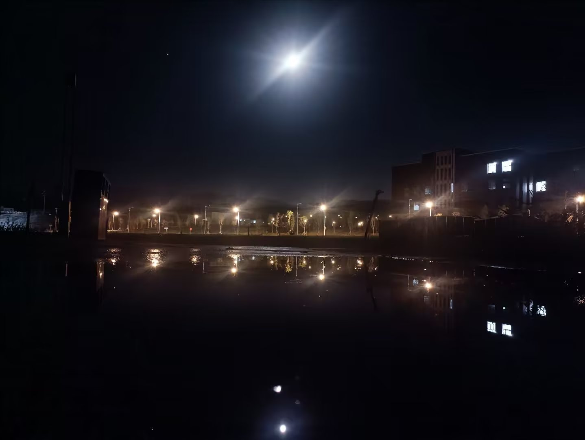
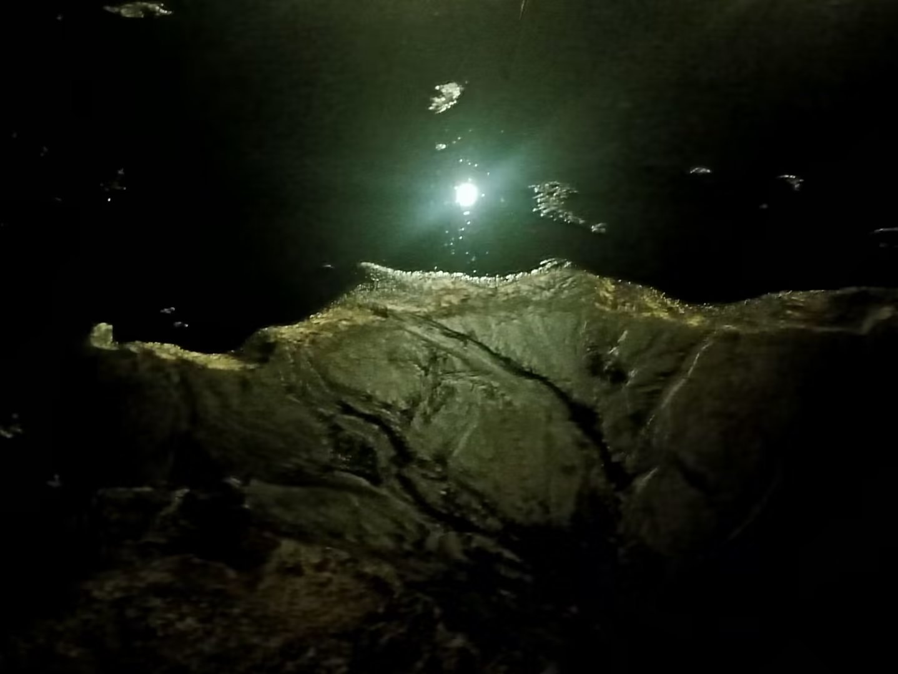
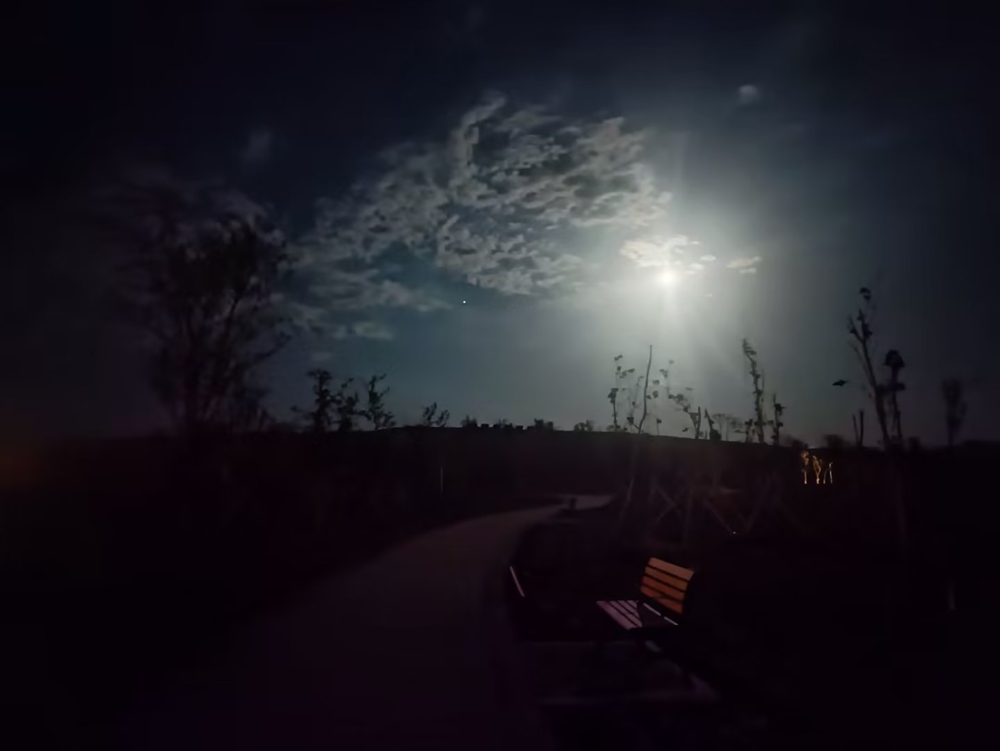


---
> 2022-09-08 19:21:44


42.5°- 抓住彩虹


『根据彩虹的观测视角规律可以推测: 在回归线以内的地区，夏至那天中午十二点之前如果下了一场雨，那么就可以看到平行于地面的彩虹，但最好还是爬到高处去看，因为地面遮挡物太多。 --你的彩虹观测指南』


> 评论(0)


---
> 2022-09-07 20:36:06


Nyos - 山月


> 评论(0)


---
> 2022-09-06 19:31:56


Meta - 橡皮人


与物相刃相靡，其行尽如驰而莫之能止，不亦悲乎！终身役役而不见其成功， 苶然疲役而不知其所归，可不哀邪！

> 评论(0)


---
### 8月
> 2022-08-25 10:06:14


博客一周年


室铭：blog.si-on.top/site


> 评论(0)


---
> 2022-08-19 09:40:15


观云- 钩卷云


『没有灰色部分的卷云，其形状通常像逗号，最后会以钩子或簇绒的形式停在顶部，其上部不是突起的形式。』


> 评论(0)


---
> 2022-08-18 09:59:21


Meta- 『又断章』


你在路旁看风景，


看风景的人在那边看你。


明月装点了你的镜头，


你装饰了别人的梦。


『Fragments Again』


Standing by the road, you enjoy the sight;


Sight-seers gaze at you with the same delight.


Your lens is adorned by bright moonbeams,


But you adorn another sight-seer’s dreams.


> 评论(0)


---
> 2022-08-17 08:51:17


观云- 堡状云


『在其上部的至少一部分中呈现出以炮塔或塔（锯齿状）形式存在的积云状突起的云，其中一些比它们的宽度高，并且通过共同的基部连接并且似乎以线性排列。当从侧面看到云时，堡状云的特征尤其明显。


适用于卷云、卷积云、高积云 和 层积云。』


观云- 碎云


『不规则碎片形式的云，外观明显不规则。


仅适用于层云 和 积云。』


> 评论(1)


*  [秉蕳](https://user.qzone.qq.com/2322748973)：堡状云的变化
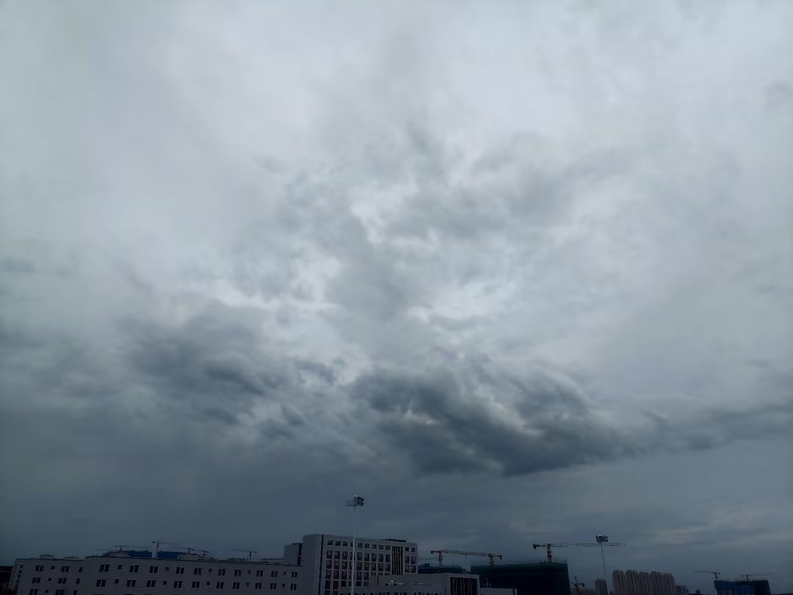
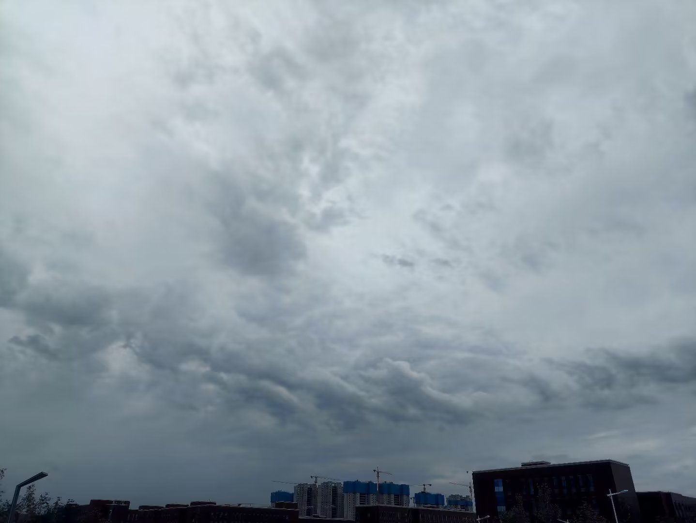
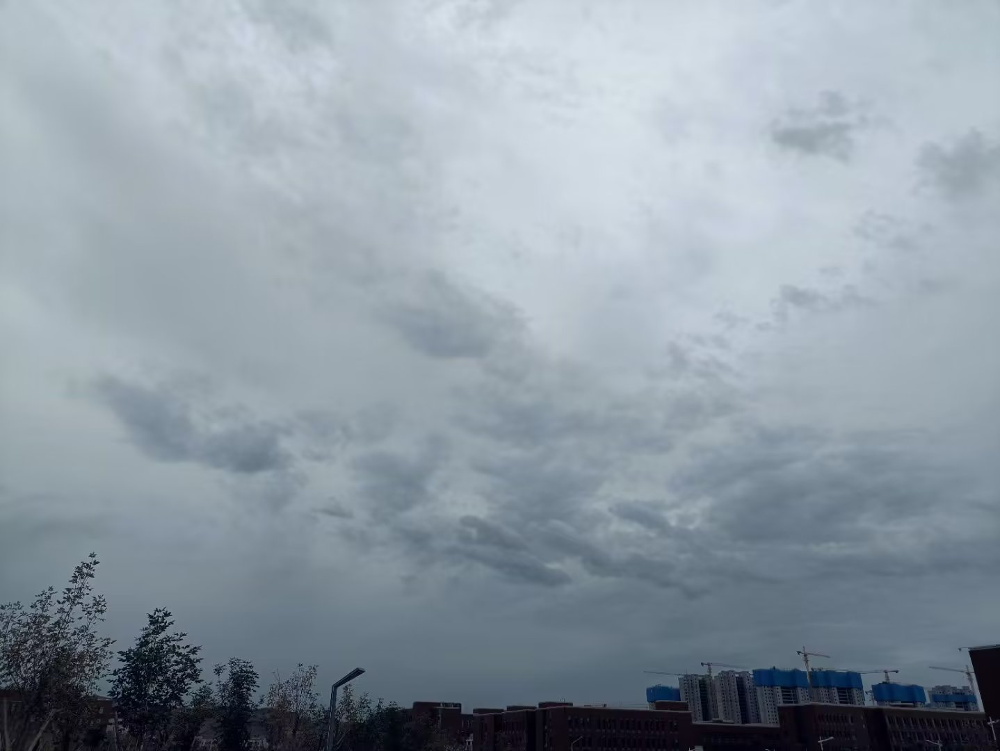


---
> 2022-08-15 10:00:37


Meta- Kitsch(刻奇)


『𠈌所欲，施于己。』

> 评论(0)


---
> 2022-08-07 23:56:31


Nyos-「Moonlight Shadow」


[#立秋#](http://rc.qzone.qq.com/qzonesoso/?search=%E7%AB%8B%E7%A7%8B)


> 评论(1)


*  [杜建民](https://user.qzone.qq.com/1724794886)：比我拍的好看多了
	* [秉蕳](https://user.qzone.qq.com/2322748973)：[@杜建民](https://user.qzone.qq.com/1724794886)滤镜走起


---
> 2022-08-04 21:50:17


Nyos- 晚


> 评论(1)


*  [智方](https://user.qzone.qq.com/1256618352)：黄土戈壁吗
	* [秉蕳](https://user.qzone.qq.com/2322748973)：[@智方](https://user.qzone.qq.com/1256618352)如果戈壁跟土堆差不多，那大概算是了。日落那会儿，光照到路边土块上，感觉很好看就照了。
	* [智方](https://user.qzone.qq.com/1256618352)：[@秉蕳](https://user.qzone.qq.com/2322748973)哈哈哈哈哈，看着好像啊


---
### 7月
### 7-3
 ## Day I 
*Music [terraria Day themes ]*

第一上午没有白费！😁 装上windows 11了。 哈哈哈哈哈

白天热，晚上虫


> 2022-07-31 22:34:31


夜皎，钟鸣，撰辔，东行。

> 评论(0)


---
> 2022-07-27 00:17:30


Meta- 扰动？拐角？


若非浮沫，便是涟漪，


若非涟漪，便是桥起。


> 评论(0)


---
> 2022-07-24 23:09:02


嗯，一个，新计划。

> 评论(0)


---
> 2022-07-24 23:07:08


[#Rejoice the Moment#](http://rc.qzone.qq.com/qzonesoso/?search=Rejoice%20the%20Moment)


『天净沙·轻行』


残辉瘦木小径，流风虫奏独行，远路连灯绰影，灭却荧屏，空了耳目心轻。

> 评论(0)


---
> 2022-07-21 21:48:57


Nyos-「七月」


> 评论(4)


*  [智方](https://user.qzone.qq.com/1256618352)：好有感觉呀
*  [杜建民](https://user.qzone.qq.com/1724794886)：拍的这么好？
*  [ 王亮](https://user.qzone.qq.com/1532289659)：太棒了
*  [秉蕳](https://user.qzone.qq.com/2322748973)：表象而已，照了一个月，这是仔细挑出来比较好的几张，也有很多的烂照的


---
### 6月
> 2022-06-22 22:56:50


Nyos - 『六月，一天里会有多达十几样植物萌芽。没人能注意到所有的这些现象，但也没人能对它们视而不见。--奥尔多·利奥波德』


//视而见，这大概就是摄影的意义吧。


> 评论(1)


*  [赵金国](https://user.qzone.qq.com/2210608631)：生如夏花之绚烂，死如秋叶之静美，还在乎拥有什么。


---
> 2022-06-20 14:49:18


Nyos- Halo





> 评论(2)


*  [秉蕳](https://user.qzone.qq.com/2322748973)：美景独赏
*  [秉蕳](https://user.qzone.qq.com/2322748973)：

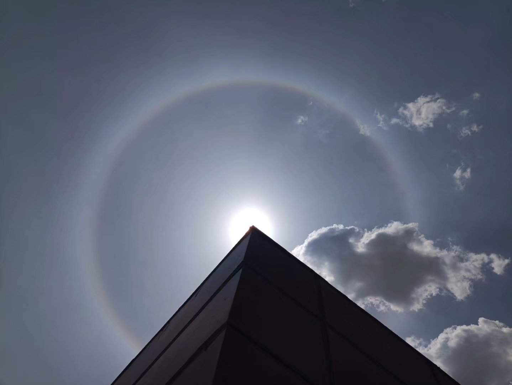
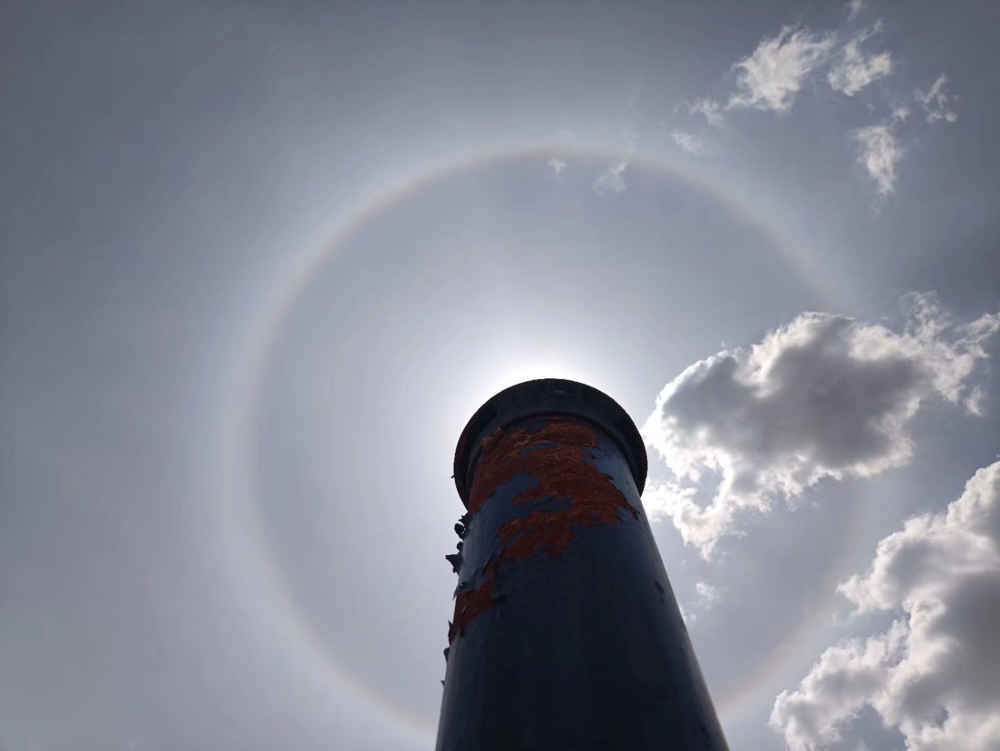


---
> 2022-06-16 23:08:15


Meta -「乘兴而肝，兴尽而鸽。」


@咸鱼，谁让你的主页太好看了，实在忍不住便「拿来」了。


原作: Tooru.ink


鄙站: si-on.top


> 评论(0)


---
> 2022-06-14 21:59:00


[#Pixel #](http://rc.qzone.qq.com/qzonesoso/?search=Pixel%20)Poems


Meta - &quot;To reach, the unreachable stars!&quot;


在EZFM里老是听到沈町读这段话，可算是找到全文了，果然还是中文有气势。


> 评论(0)


---
> 2022-06-14 21:19:30


改变，不容震撼的错。(To right the un rightable wrong.)

> 评论(0)


---
> 2022-06-14 19:48:43


#空军万岁


别涨啊！再狗点！


> 评论(0)


---
> 2022-06-12 22:29:15


Nyos- 余晖


> 评论(0)


---
> 2022-06-11 22:22:00


Nyos- 


> 评论(0)


---
> 2022-06-11 13:45:08


[#Journal #](http://rc.qzone.qq.com/qzonesoso/?search=Journal%20)SionCloud


[网页链接](https://sionedrive.vercel.app/Journal/6-12/)


提醒: 阅后即焚

> 评论(0)


---
> 2022-06-09 12:27:51


Happy #WorldOceansDay! Last year cartographers declared there are 5 oceans instead of 4 !!! I wonder if I'm the last one to know


@Southern Ocean


> 评论(0)


---
> 2022-06-08 09:14:03


Nyos - Sundowner


摄影，恶疾也。常发作于日出、日落前后，症状极为显著。远掷设备，可消解之。


> 评论(0)


---
> 2022-06-07 00:20:27


@长工诉水


 芝兰新茁，望诸事顺遂。

> 评论(0)


---
> 2022-06-06 23:27:45


Meta - 用latex玩出花来


\[


\int\textit{生产关系 } d{\textit{ 生产力}}=\textit{经济基础}


\]


\begin{center}


\textit{ 其中，生产力}=\emoji{man-pouting-medium-skin-tone}+\emoji{wrench}+\emoji{locomotive}=\emoji{man-mechanic-medium-skin-tone}+\emoji{locomotive}


\end{center}


> 评论(1)


*  [秉蕳](https://user.qzone.qq.com/2322748973)：原句(haoxiang):经济基础是由生产力决定的生产关系的总和


---
> 2022-06-05 22:17:12


Nyos: 霞～隐没


> 评论(1)


*  [赵金国](https://user.qzone.qq.com/2210608631)：第一张是自己拍的嘛？
	* [秉蕳](https://user.qzone.qq.com/2322748973)：[@赵金国](https://user.qzone.qq.com/2210608631)嗯，起初有四张，挑了这一张比较顺眼的
	* [赵金国](https://user.qzone.qq.com/2210608631)：[@秉蕳](https://user.qzone.qq.com/2322748973)这个拍照水平有点高啊


---
> 2022-06-02 22:40:17


飞光飞光，劝尔一杯酒。


吾不识青天高，黄地厚。


唯见月寒日暖，来煎人寿。


> 评论(0)


---
> 2022-06-02 01:15:14


Meta- &quot;Happiness is an imaginary condition, formerly often attributed by the living to the dead, now usually attributed by adults to children, and by children to adults. --Thomas Szasz&quot;


 幸福是想象中的东西。从前，生者认为死幸福；现在则是大人认为孩子幸福，而孩子则认为大人幸福。 --托马斯·萨斯


From my perspective, Happiness is not the destination but the trip to reach there, So just following your fuckin dream and don't forget to relish the moment.

> 评论(1)


*  [田华蕊](https://user.qzone.qq.com/1632571804)：早
	* [秉蕳](https://user.qzone.qq.com/2322748973)：[@田华蕊](https://user.qzone.qq.com/1632571804)晚


---
### 5月
> 2022-05-30 18:37:04


Nyos - May


> 评论(1)


*  [ 王亮](https://user.qzone.qq.com/1532289659)：这风格说不上来的感觉


---
> 2022-05-29 21:14:39


Meta- 热风贴


> 评论(0)


---
> 2022-05-11 19:13:07


LUNA 崩盘ing


Terra(LUNA)


现价 $2.3


24h涨跌 -92.10121%


24h成交量 $10,374,149,898


历史最高 $119.1800


流通量 575,270,567


总量 1,051,349,804


24H搜索热度 第1名


> 评论(2)


*  [秉蕳](https://user.qzone.qq.com/2322748973)：坐等0.000001抄底
*  [秉蕳](https://user.qzone.qq.com/2322748973)：这玩意儿设置了还是不能自动删除吗？


---
> 2022-05-08 19:20:02


《紫晶-积分要義》: v0.1.28-2


- 增加封面，错字修正，排版优化


- 主体内容完成，增加了更多示例，删除了不必要的引用


- 增加版权声明


在线预览: [网页链接](https://www.si-on.top/2022/05/08/11f68e95755d/)|下载地址: [网页链接](https://my.opendesktop.org/s/aCB2b4YfDon2KGy)


PS: v0.1.28-2: 0.1非正式版，第28次修改，经XeTeX过2次编译生成


> 评论(0)


---
> 2022-05-05 23:18:05


《Amethyst-积分要義》


 Preview 1 : Tabular method“此乃妖法也！”


> 评论(1)


*  [ 王亮](https://user.qzone.qq.com/1532289659)：真复杂
	* [秉蕳](https://user.qzone.qq.com/2322748973)：[@ 王亮](https://user.qzone.qq.com/1532289659)就推广式复杂点，表格法一般也就展开两到三次，要是还做不出来的话，直接放弃这个方法


---
> 2022-05-04 14:49:20


闹市之人语，瀑下之鱼鸣。

> 评论(0)


---
### 4月
> 2022-04-19 20:53:43


《Welcome》 - inspired by Minor.


> 评论(0)


---
> 2022-04-18 15:09:06


> 评论(0)


---
> 2022-04-10 00:04:38


关于一群藏羚羊，一只华南虎与一只鸽子的故事


> 评论(0)


---
> 2022-04-07 14:03:56


Nyos - 霄·神往


&quot;天空因喜而动。&quot;


> 评论(0)


---
### 3月
> 2022-03-28 09:20:05


Meta～□□□


> 评论(0)


---
> 2022-03-24 12:59:01


【水龙吟】（又双叒叕韵章质夫杨花词）


杳杳落落纷纷，迎面是，点点琼坠。


飘飘玉尘，微微银絮，舒懒心思。


小径折步，庭前鸿爪，半山花闭。


望断川千里，空了痕迹，又却被、烟笼起。


岂有幽人玄鉴，免不了，浮华点缀。


雨雪初霁，散漫行人，慵慵碎碎。


随意春芳，了无寻处，冷了池水。


不过东风微凉，细雨飞花，凝把无名泪。

> 评论(0)


---
> 2022-03-17 13:46:35


#PixelArt


Meta- Gril &amp; Heart Balloon


> 评论(0)


---
### 2月
> 2022-02-24 15:57:19


还是开始了


> 评论(1)


*  [ 王亮](https://user.qzone.qq.com/1532289659)：

	* [秉蕳](https://user.qzone.qq.com/2322748973)：[@ 王亮](https://user.qzone.qq.com/1532289659) 不会吧，这英语也不太难理解吧。大概情节就是说tg群（以像素画讨论为主）里有个乌克兰老哥平时不说话，今天突然在俄乌战场发了条消息，“rocket s flying over my head”说的跟遗言一样。我才开始还以为开玩笑，后来才确定是真的开火了。
	* [ 王亮](https://user.qzone.qq.com/1532289659)：[@秉蕳](https://user.qzone.qq.com/2322748973)哈哈哈 这个新闻上看到了 我英语太差劲儿了


---
> 2022-02-22 22:24:47


Meta- 贰的狂欢


> 评论(0)


---
### 1月
> 2022-01-14 07:22:47


Nyos-俯仰


> 评论(1)


*  [¤赵上坤](https://user.qzone.qq.com/2238088583)：照片处理的不错


---
> 2022-01-08 01:05:07


流波，纷扬，偃仰，涤荡。

> 评论(0)


---
> 2022-01-03 00:57:23


Nyos - Sol


> 评论(0)


---
## 2021年
### 12月
> 2021-12-31 13:19:52


Nyos- Luna


> 评论(0)


---
> 2021-12-31 00:13:27


[Hexo_theme #](http://rc.qzone.qq.com/qzonesoso/?search=Hexo_theme%20)Paper [#bloger's daily #](http://rc.qzone.qq.com/qzonesoso/?search=bloger's%20daily%20)github


Serif, better font for better blog! Before 2022, an liiiiiiittle mirror blog[^1] site is ready.


Long live the open Souce!


[1]: 网页链接


> 评论(1)


*  [田华蕊](https://user.qzone.qq.com/1632571804)：什么东西吖
	* [秉蕳](https://user.qzone.qq.com/2322748973)：[@田华蕊](https://user.qzone.qq.com/1632571804) 新建了个博客 aornus.github.io，感觉那个博客主题特别好看，使用衬线字体，看起来就像报纸一样。


---
> 2021-12-25 11:28:59


问楛勿告，告楛勿问，说楛勿听，争气勿与辩。

> 评论(0)


---
> 2021-12-16 18:25:47


Meta-


因为对过敏过敏，所以过敏了。


> 评论(0)


---
### 10月
> 2021-10-31 21:54:26


[#Happy Halloween#](http://rc.qzone.qq.com/qzonesoso/?search=Happy%20Halloween%5Bem%5De137%5B%2Fem%5D)


Meta-&quot;To be or not to be, you're still going to die.&quot;


> 评论(1)


*  [赵上坤](https://user.qzone.qq.com/1541782368)：，，，，，，


---
> 2021-10-21 22:42:04


Nyos-碎梦


> 评论(0)


---
> 2021-10-20 19:12:29


Nyos-20


> 评论(0)


---
> 2021-10-04 22:47:43


Kiwiʞ 3.0


> 评论(1)


*  [秉蕳](https://user.qzone.qq.com/2322748973)：怎么越看感觉越丑
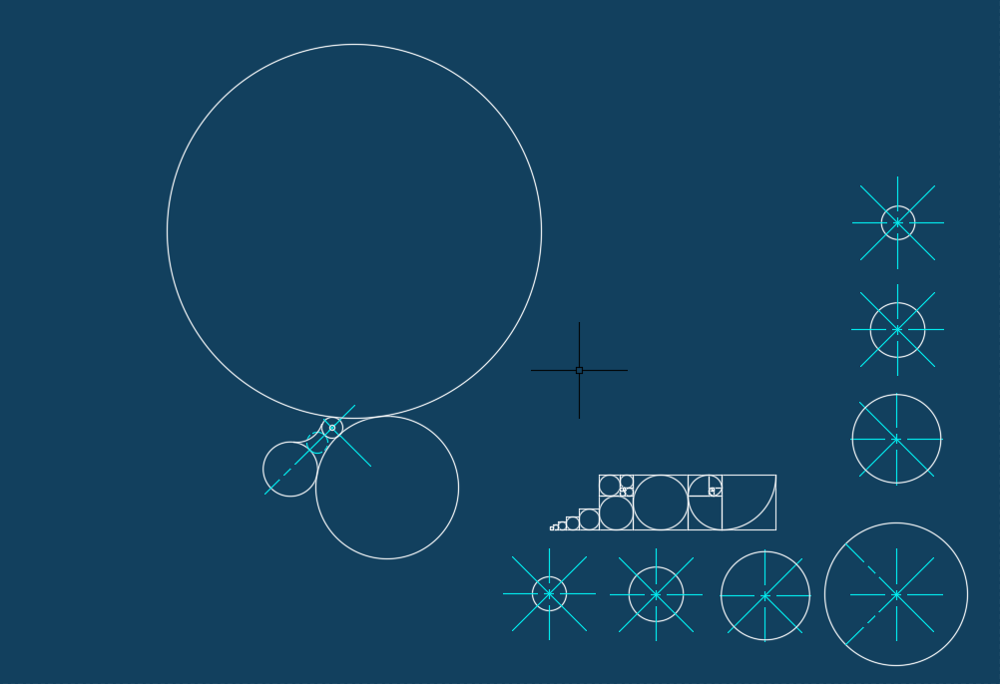


---
> 2021-10-04 20:20:00


Nyos- Gold time


> 评论(0)


---
### 9月
#### 9-26

# 月野·开源万岁≧▽≦

>没有困难就没有收获。  -*Sun隼*
>
>所有技术的最终目的都是为了简化生活，所以不要走错路了。	-隼

#### 记录开源带给生活的改变  

  先从LaTeX谈起，那是一个月黑风高的晚上，在网上闲逛的我偶然发现了一本LaTeX教程，于是把它存进数学的Docs里，当时想，乌啦～朕的宝库又添了一件吃灰的宝呢😏。

但事情远没有那么简单。

开学后，在一个百无聊赖的下午，一个人钻到社团的教室里，读起了这本教程，好生繁琐，不过很酷😎，好了我要往live-Linux里装一个试试。
复制！粘贴！回车！！艹！上键！home！sudo！回车！！
等了好一会，怎么还没结束，往上翻，不得了了，5个多G，总共才剩下不到两个G，要\....要宕机了！
**Ctrl + C！**，好险，唉，又清了半个小时的垃圾。

还是同一间教室里，又学习了树莓派，Blender（一瓶子不满，半瓶子晃荡）。

到辅修学概率论时，在manjaro里上网课，无聊的时候又顺便装了latex，发现了latexstudio,然后又开始了第二次学习，这次掌握了基本的用法，还会了在开头声明编译命令，汉字字体，emoji😁。

又这样过了许久，一次上课前，居然有人问我怎么在latex里引用，这个我当时没仔细看但知道很简单，于是答应了，回去后学习了两种引用方法，做了解释图片发了过去。


```python
a=range(10)
for i in a:
print(i)
```

#### 种子区： 

* 利用Python抓取新闻，整理后，用latex导入，利用制作好的模板生成每日新闻或者什么的pdf文件，✌🏻✌🏻✌🏻✌🏻✌🏻


> 2021-09-13 22:50:11


最近搞了个新博客，欢迎大家来串门啊。


  [网页链接](https://aornus.gitee.io/)


这是我的第2个博客，起初是在阿里云，搭建了一Wordpress博客(轻量级服务器)，写了一段时间，无非就是照片贴上去，写点杂七杂八的诗，然后就是跟各种需求、插件、错误作斗争，去年十月还被土耳其黑客入侵，最后服务器到期，也没有续费(感觉当初就是个玩笑)。后来linux玩多了，发现github之类的代码托管平台也可以建站，虽然是一个展示型的静态博客，但是免费！然后便与git、ssh……不断斗争，当然因为各种原因，总是不完美(访问速度太慢，TeX的渲染，排版)，其实最主要的还是肚子里没什么墨水。


 这一次等了好几个月，终于在码云pages服务恢复之日，临时用手机搭建了一个小站，后来又各种修改，最终成了现在这个样子，希望能坚持下去。´_&gt;`


 PS:这个网站是真正零成本，不嫌麻烦的话一个安卓7以上的手机就能做出来，另外，只要gitee不倒闭，或者受政策影响，它是永远不会垮的！开源万岁


> 评论(2)


*  [金宁波理工电气](https://user.qzone.qq.com/2627105124)：厉害
*  [李厚坤](https://user.qzone.qq.com/1347868434)：


---
> 2021-09-09 19:12:31


家に帰れ


> 评论(1)


*  [¤赵上坤](https://user.qzone.qq.com/2238088583)：真好看啊


---
> 2021-09-08 20:34:13


&quot;二八月，看云彩。&quot;


> 评论(0)


---
> 2021-09-07 19:09:29


> 评论(1)


*  [←殷徳义→](https://user.qzone.qq.com/1808643830)：我也看到了
	* [秉蕳](https://user.qzone.qq.com/2322748973)：[@←殷徳义→](https://user.qzone.qq.com/1808643830)欢迎回家


---
> 2021-09-03 11:59:53


重复乃王道


> 评论(0)


---
### 8月
原来我一直以来的错误就是,不敢面对现实
计算结果就是如此,为何要去怀疑!!!!😫
终于终于，我弄完了，开始画草图了😎😎

Nextcloud 的webdav与caldav文件地址：

[1]: https://my.opendesktop.org/remote.php/dav/principals/users/aornus/	"caldav"

https://my.opendesktop.org/remote.php/dav/calendars/aornus/personal/


> 2021-08-27 09:25:22


凤仙


> 评论(0)


---
> 2021-08-21 06:27:49


牵牛


> 评论(0)


---
> 2021-08-19 09:45:55


To the Mars


> 评论(0)


---
### 7月
> 2021-07-26 22:12:10


Meta - 暑晏


云残月影乱，山暗鸟孤眠。


暑晏纷尘露，临风听夜蝉。

> 评论(0)


---
> 2021-07-25 09:58:19


nyos - 线形·诱导


> 评论(0)


---
> 2021-07-14 18:04:19


Nyos - 五月


> 评论(0)


---
> 2021-07-06 00:39:35


Meta- Discovery Summer


``Echo of the Shell&quot;


``Hello Win11 :)&quot;


仲夏- ∠※


> 评论(1)


*  [¤赵上坤](https://user.qzone.qq.com/2238088583)：w11?
	* [秉蕳](https://user.qzone.qq.com/2322748973)：[@¤赵上坤](https://user.qzone.qq.com/2238088583)对啊，就Windows11，你不会还不知道吧？
	* [¤赵上坤](https://user.qzone.qq.com/2238088583)：[@秉蕳](https://user.qzone.qq.com/2322748973)我怎么会不知道？
	* [¤赵上坤](https://user.qzone.qq.com/2238088583)：[@秉蕳](https://user.qzone.qq.com/2322748973)听说并不能提高生产力,我还是打算用w10
	* [秉蕳](https://user.qzone.qq.com/2322748973)：[@¤赵上坤](https://user.qzone.qq.com/2238088583)这个系统你感觉怎么样呢？听说还有一个WSA(Windows Subsystem for Android)可以运行安卓应用，但现在还没有整出来，要是真实现了，再加上前几年的WSL，这要搞''垄断''啊
	* [¤赵上坤](https://user.qzone.qq.com/2238088583)：[@秉蕳](https://user.qzone.qq.com/2322748973)现在的感觉花里胡哨，我等再过几年系统完善了看看吧


---
### 6月
> 2021-06-21 09:18:28


夏至 • 奇妙な


> 评论(0)


---
> 2021-06-15 23:02:59


Meta- Two step from the heaven.


&quot;学而不用，斯可耻也；


 用而不乐，斯可悲也。&quot;


> 评论(2)


*  [张浩杰](https://user.qzone.qq.com/2209848638)：跪求源码
	* [秉蕳](https://user.qzone.qq.com/2322748973)：[@张浩杰](https://user.qzone.qq.com/2209848638)这现在是个垃圾的半成品，等完全弄完了就传github上，你随便fork
	* [张浩杰](https://user.qzone.qq.com/2209848638)：[@秉蕳](https://user.qzone.qq.com/2322748973)Ok
*  [材料19-1刘光义](https://user.qzone.qq.com/1478966431)：不学而不用，斯为自在也
	* [秉蕳](https://user.qzone.qq.com/2322748973)：[@材料19-1刘光义](https://user.qzone.qq.com/1478966431)学不可以已。


---
> 2021-06-13 07:15:06


Nyos- 汤谷·赤峦


> 评论(1)


*  [☸马红喆](https://user.qzone.qq.com/2042775041)：好有感觉


---
### 5月
> 2021-05-24 22:00:22


Bluebird-2.7..281


‘‘所有的显现与隐没，都涌现于自我。


一切的限制，都从内心开始。’’


Blacklist: Chaos inside.


> 评论(0)


---
> 2021-05-21 08:02:44


培养喜悦🍃😑

> 评论(0)


---
> 2021-05-10 21:39:55


Bluebird-2.718


“I took the turn and turned to, Begin a new beginning, Still looking for the answer. --Enya《Anywhere Is》”


⊗black list  (7days)


[Linux &amp; all open source softwares,


especially blender, LaTex, R projects...]

> 评论(0)


---
> 2021-05-04 00:12:21


美塔-


&quot;归去其难，何不新之？--BlueBird_2.71&quot;


> 评论(0)


---
> 2021-05-01 23:52:15


Meta- Rainy Mood.




> 评论(0)


---
### 4月
> 2021-04-28 09:56:18


美塔- &quot;跌地不起，与死狗何异？-BlueBird 2.7&quot;

> 评论(0)


---
> 2021-04-27 00:24:23


[#LaTeX &amp; Emoji#](http://rc.qzone.qq.com/qzonesoso/?search=LaTeX%20%26amp%3B%20Emoji)


Meta- &quot;Hakuna, Matata. &quot;


(θ＝180º)


> 评论(0)


---
> 2021-04-24 19:24:51


(Meta)美塔－


＂一片飞雪，绛入炉火，


 继而升腾，无拘无束。－BlueBird2ε＂

> 评论(0)


---
> 2021-04-19 23:13:02


Meta - Words of the day

 “自由是珍贵的，自由是相对的，自由不是必须的。”

 “好奇但不在意。”

> 评论(0)


---
> 2021-04-16 09:50:29


黑洞照片2.0（2019-4~2021-3）


> 评论(0)


---
> 2021-04-14 19:55:04


Nyos- 光&amp;影


> 评论(0)


---
> 2021-04-05 02:07:32


Nyos - Discover Mothly


> 评论(0)


---
> 2021-04-05 02:02:17


Nyos- P&amp;C (P)Review!


> 评论(0)


---
### 3月
> 2021-03-29 07:41:52


The quieter you are, the more you can see.

> 评论(0)


---
> 2021-03-26 10:30:21


＃linux ＃鸟哥 ＃教育部官方指定教材


 竟然把名字都直接＂拿来＂，怪不得此书唠里唠叨，硬盘分区竟然还是MBR的。@Vbird


> 评论(0)


---
> 2021-03-21 08:27:41


Nyos- 此地无花,可知矣.（你这暴虐的风）


> 评论(0)


---
> 2021-03-18 21:23:26


Nyos(mod) - Handclap


> 评论(0)


---
> 2021-03-14 15:14:25


@π 3.1415926535...


派节怎能不听pi


Here’s a song for you… What Pi Sounds Like (Remaster) by Michael John Blake


[https://open.spotify.com/track/7acQjS9LxmYxJ08zCoXm5D?si=UUf8GfjoQIuvF9fds5BWoA](https://open.spotify.com/track/7acQjS9LxmYxJ08zCoXm5D?si=UUf8GfjoQIuvF9fds5BWoA)

> 评论(1)


*  [秉蕳](https://user.qzone.qq.com/2322748973)：可惜，错过了0314-1509，成了0314-0314，明年一定要再早五分钟


---
> 2021-03-13 12:45:04


开源万岁！

> 评论(0)


---
> 2021-03-02 09:00:26


#Pixel Art @The Pixel Gang


《Howl's Moving Castle》


 ----By Heriumu


> 评论(0)


---
### 2月
> 2021-02-27 14:09:19


#Pixel Art @The Pixel Gang


《Flight of the Billionaires》


 --By RandomHumanity


> 评论(1)


*  [赵上坤](https://user.qzone.qq.com/1541782368)：？？？
	* [秉蕳](https://user.qzone.qq.com/2322748973)：[@赵上坤](https://user.qzone.qq.com/1541782368)一幅像素画，很好看吧


---
> 2021-02-24 20:59:13


终于登录了,又一个全新的自由的十四天! @Spotify(声田)


＃失去了方知可贵 #生活不可一日无乐!


> 评论(0)


---
> 2021-02-23 10:28:19


Nyos - 风吟,且舞.


&quot;Just like a gleam of dust, Dancing wildly with the wind.&quot;


[#Kite #](http://rc.qzone.qq.com/qzonesoso/?search=Kite%20)wind [#bluesky #](http://rc.qzone.qq.com/qzonesoso/?search=bluesky%20)memory #野子


> 评论(0)


---
> 2021-02-23 02:38:23


风吟，且舞，扑尘，复路

> 评论(0)


---
> 2021-02-22 09:00:16


Nyos - Writing on the rock. @石牛冲


> 评论(1)


*  [赵上坤](https://user.qzone.qq.com/1541782368)：冲冲冲，给y冲
	* [秉蕳](https://user.qzone.qq.com/2322748973)：[@赵上坤](https://user.qzone.qq.com/1541782368)此冲非彼冲，其意为山坡之平地。吾所居之地，石牛冲也，百十年前，此地大抵甚是平坦，且山坡有石牛流传于世，然经五八年（？）水库改造，炸坡取石，修筑坝基，举村迁移，轰轰烈烈。然寄人篱下，琐事纷纷，粮田甚乏，毫无底气可言。期年之后，无可忍耐，村人遂慷慨而归，毁坝垦田，筑桥修道，水库无功而毁。然石牛了无踪迹，止坡顶乱石依稀可辨。
	* [姜开心](https://user.qzone.qq.com/3082115909)：[@秉蕳](https://user.qzone.qq.com/2322748973)文化人都这样说话的吗？给我们这些文盲留点余地好不好，一句都没看懂
	* [秉蕳](https://user.qzone.qq.com/2322748973)：[@姜开心](https://user.qzone.qq.com/3082115909)没有的事，只不过那两天看文言文看多了，想模仿模仿而已


---
> 2021-02-19 19:19:44


Nyos -南雁


> 评论(0)


---
> 2021-02-15 18:24:44


Nyos- 嘿，春天！


> 评论(0)


---
### 1月
> 2021-01-26 15:39:49


Winter Sweet


> 评论(0)


---
> 2021-01-20 21:53:50


换块电池,再战四年.


> 评论(1)


*  [王敬坤](https://user.qzone.qq.com/473784101)：这是你哪台逆天设备
	* [秉蕳](https://user.qzone.qq.com/2322748973)：[@王敬坤](https://user.qzone.qq.com/473784101)16年买的红米3🙃


---
## 2020年
### 12月
> 2020-12-31 18:03:36


B&amp;W


> 评论(0)


---
> 2020-12-30 15:16:03


Hey Days


> 评论(1)


*  [ 王亮](https://user.qzone.qq.com/1532289659)：你不会上楼顶了吧


---
> 2020-12-26 12:52:02


吾所者不失，失者不我以。


> 评论(0)


---
> 2020-12-25 12:06:07


心有其理，非理之所能知。～无名火🐣

> 评论(0)


---
> 2020-12-25 00:00:12


Merry Christmas! Terrariaers!


> 评论(0)


---
> 2020-12-18 07:43:05


#Quote


Meta- &quot;Sometimes, I can hear my bones straining under the weight of all the lives I'm not living.&quot; -Jonathan Safran Foer

> 评论(0)


---
> 2020-12-11 07:30:29


Meta-『AA72』：要相信光。@长弓诉水


> 评论(0)


---
> 2020-12-06 17:52:51


一切的限制都源于内心

> 评论(0)


---
> 2020-12-04 19:51:50


Nyos-凛然


> 评论(0)


---
### 11月
> 2020-11-22 21:21:03


Nyos- &quot;I'm the bird made of birds. &quot;


> 评论(0)


---
> 2020-11-22 00:57:08


Nyos - 光匿


> 评论(0)


---
> 2020-11-19 08:30:07


Meta- &quot;This is the way. &quot; -The Mandalorian


> 评论(0)


---
> 2020-11-14 14:31:59


Slowly

> 评论(0)


---
> 2020-11-13 00:27:14


Meta-五筆


 它没有那么神奇，也没有那么复杂，跟全拼，双拼一样是个工具罢了。


 就如同查字典，用拼音查不出来，就用部首查，最后的目的达到就够了。


 既是没有高速打字的要求，尝尝滋味便心满意足了。


 下文：某某对拼音无情的嘲讽


 《施ytb 氏qa 食wyv 狮qtjh 史kq》


石dgtg 室pgc 诗yff 士fghg 施ytb 氏qa ,


嗜kftj 狮qtjh,誓rryf 食wyv 十fgh 狮qtjh.


施ytb 氏qa 时jf 时jf 适tdp 市ymhj 视pym 狮qtjh.


十fgh 时jf ,适tdq 十fgh 狮qtjh 适tdq 市ymhj.


适tdq 时jf ,适tdq 施ytb 氏qa 适tdq 市ymhj.


施ytb 氏qa 视pym 是j 十fgh 狮qtjh,


恃nff 矢tdu 势rvyl,


使wgkq 十fgh 狮qtjh 逝rrpk 世anv.


氏qa 拾rwgk 是j 十fgh 狮qtjh 尸nngt,


适tdq 石dgtg 室pgc .


石dgtg 室pgc 湿ijog,


氏qa 使wgkg 侍wffy 拭raag 石dgtg 室pgc.


石dgtg 室pgc 拭raag,


施ytb 氏qa 始vck 试yaag 食wyve 十fgh 狮qtjh 尸nngt.


食wyve 时jf ,始vck 识ykw 是j 十fgh 狮qtjh 尸nngt.


实pu 十fgh 石dgtg 狮qtjh 尸nngt.


试yaa 释toc 是j 事gk.

> 评论(0)


---
> 2020-11-04 02:38:40


Nyos&gt;_ 简单，你好。


＃Arch_linux


> 评论(1)


*  [¤赵上坤](https://user.qzone.qq.com/2238088583)：你在刷机？
	* [秉蕳](https://user.qzone.qq.com/2322748973)：[@¤赵上坤](https://user.qzone.qq.com/2238088583)非也，非也


---
### 10月
> 2020-10-31 23:42:38


Meta－《怀想》 叶舟


那时候 月亮还朴素 像一块


古老的银子 不吭不响 静待黄昏


那时候的野兽 还有牙齿 微小的


暴力 只用于守住疆土 丰衣足食


那时候 天空麇集了凤凰和鲲鹏


让书生们泪流不止 写光了世上的纸


那时候的大地 只长一种香草


名曰君子 有的人入史 有的凋零


那时候 铁马秋风 河西一带的


炊烟饱满 仿如一匹广阔的丝绸


那时候的汉家宫阙 少年刘彻


白衣胜雪 刚刚打开了一卷羊皮地图


那时候 黄河安澜 却也白发三千


一匹伺伏的鲸鱼 用脊梁拱起了祁连


那时候还有关公与秦琼 亦有忠义


和然诺 事了拂衣去 一般不露痕迹


那时候 没有磨石 刀子一直闪光


拳头上可站人 胳膊上能跑马


那时候的路不长 足够走完一生


谁摸见了地平线 谁就在春天称王


//时序循环，十五十五！Hapi 19st.


> 评论(0)


---
> 2020-10-31 00:01:12


Meta-Белеет парус одинокий


В тумане моря голубом!...


Что ищет он в стране далекой?


Что кинул он в краю родном?...


Играют волны - ветер свищет,


И мачта гнется и скрыпит...


Увы, - он счастия не ищет


И не от счастия бежит!


Под ним струя светлей лазури,


Над ним луч солнца золотой...


А он, мятежный, просит бури,


Как будто в бурях есть покой!


> 评论(2)


*  [陈杰](https://user.qzone.qq.com/981625766)：老哥 你都学上俄语了
	* [秉蕳](https://user.qzone.qq.com/2322748973)：[@陈杰](https://user.qzone.qq.com/981625766)哪有？我眼里也是一堆乱码。
	* [陈杰](https://user.qzone.qq.com/981625766)：[@秉蕳](https://user.qzone.qq.com/2322748973) 好强
	* [秉蕳](https://user.qzone.qq.com/2322748973)：[@陈杰](https://user.qzone.qq.com/981625766)你日语学的怎样？
	* [陈杰](https://user.qzone.qq.com/981625766)：[@秉蕳](https://user.qzone.qq.com/2322748973) 没怎么学 惭愧惭愧
*  [←殷徳义→](https://user.qzone.qq.com/1808643830)：日语，俄语，好遥远


---
> 2020-10-25 23:54:01


Meta-重九·卜


月苍，空寂，时眇，岁冥。


爰居？爰处？卮酒，无人。

> 评论(0)


---
> 2020-10-16 21:08:02


载驰'零露'临渊'瞻顾

> 评论(0)


---
> 2020-10-11 12:12:35


＃简兮 ＃如无必须，勿增实体｜载驰'零露'临渊'瞻顾

> 评论(0)


---
> 2020-10-09 00:04:13


Nyos－夏•凹山•日入「I want to rest. I want to breathe quietly again.」





> 评论(1)


*  [陈杰](https://user.qzone.qq.com/981625766)：来首bgm就有感觉了
	* [秉蕳](https://user.qzone.qq.com/2322748973)：[@陈杰](https://user.qzone.qq.com/981625766)没时间啊
	* [陈杰](https://user.qzone.qq.com/981625766)：[@秉蕳](https://user.qzone.qq.com/2322748973) 哈哈哈哈


---
> 2020-10-06 23:50:36


Nyos- 


> 评论(1)


*  [陈杰](https://user.qzone.qq.com/981625766)：水仙
	* [秉蕳](https://user.qzone.qq.com/2322748973)：[@陈杰](https://user.qzone.qq.com/981625766)是哩


---
> 2020-10-02 23:44:52


Meta- &quot;当你的话语在世间回荡,那便是幸福的时刻.&quot; －André Gide


> 评论(0)


---
### 9月
> 2020-09-29 09:39:40


[#quote #](http://rc.qzone.qq.com/qzonesoso/?search=quote%20)Happy Confucius Day #Confucius Says


-War does not determine who is right, war determine who is left.


-Man with one chopstick go hungry.


> 评论(0)


---
> 2020-09-28 09:52:43


Nyos-木叶


> 评论(0)


---
> 2020-09-20 16:15:12


The Cube Lost Magic


> 评论(1)


*  [王鑫昌](https://user.qzone.qq.com/1743629037)：you can join the ACM
	* [秉蕳](https://user.qzone.qq.com/2322748973)：[@王鑫昌](https://user.qzone.qq.com/1743629037)人家可是专业的，我就一爱好者，玩玩而已，不然闲着太无聊。


---
> 2020-09-16 18:20:10


Meta- Time is flowing, day and night.


> 评论(0)


---
> 2020-09-14 11:03:47


Meta-&quot;The mind, once stretched by a new idea, never returns to its original dimensions&quot; --Ralph Waldo Emerson


&quot;等待,真是妙不可言.&quot;


> 评论(2)


*  [齐羿帆](https://user.qzone.qq.com/3036367685)：图我收下了
*  [赵上坤](https://user.qzone.qq.com/1541782368)：妙啊
	* [秉蕳](https://user.qzone.qq.com/2322748973)：[@赵上坤](https://user.qzone.qq.com/1541782368)妙极了！


---
> 2020-09-13 19:06:44


Nyos－某日


> 评论(0)


---
> 2020-09-08 19:33:27


Meta－＂Oh Ubuntu, you're my favorite Linux based Operating System.＂ －Sheldon Lee Cooper


> 评论(2)


*  [ 王亮](https://user.qzone.qq.com/1532289659)：程序？
*  [秉蕳](https://user.qzone.qq.com/2322748973)：是linux系统
	* [ 王亮](https://user.qzone.qq.com/1532289659)：[@秉蕳](https://user.qzone.qq.com/2322748973)不懂
	* [秉蕳](https://user.qzone.qq.com/2322748973)：[@ 王亮](https://user.qzone.qq.com/1532289659)windows是个系统，linux也是个系统，不过linux里有各种各样的发行版，ubuntu就是其中一个比较好用的发行版。
	* [秉蕳](https://user.qzone.qq.com/2322748973)：[@ 王亮](https://user.qzone.qq.com/1532289659)要不到学校给你也装个双系统，让你见识见识 免费 开源 简单 轻巧 活跃 充满黑客气息....的linux
	* [陈杰](https://user.qzone.qq.com/981625766)：[@秉蕳](https://user.qzone.qq.com/2322748973) 虽然不懂 但是感觉很
	* [ 王亮](https://user.qzone.qq.com/1532289659)：[@秉蕳](https://user.qzone.qq.com/2322748973)可以可以 期待啊


---
> 2020-09-04 06:51:04


Nyos-辋川


> 评论(1)


*  [☸马红喆](https://user.qzone.qq.com/2042775041)：好有感觉。


---
### 8月
> 2020-08-26 00:00:21


Meta－牵牛


滔滔河汉水，迤迤鹊梁渡。


遑遑劳心损，切切神黯然。


长夜泣红烛，千言何处诉？


星流耿且灿，既见惨笑颜。


执手月明中，与子逝不还！


> 评论(0)


---
> 2020-08-23 22:28:40


Meta－Amazing! Unbelievable! 居然自带ladder，Tumblr上简直就是复刻！


可惜我大天朝的却一个都不支持。


期待有一天，没有偏见与争执，一切都变得自由


> 评论(0)


---
> 2020-08-22 22:31:39


载驰'零露'临渊'瞻顾

> 评论(0)


---
> 2020-08-19 19:12:54


Nyos- 刹那


> 评论(0)


---
> 2020-08-18 21:25:08


Meta- Three-body


愿想很美好：Mac+Linux+Windows三系统


现实***：&amp;%£#^\±¿


> 评论(1)


*  [ 王亮](https://user.qzone.qq.com/1532289659)：高级


---
> 2020-08-11 22:02:38


Meta- Word+Wordpress=Easy Blog


PS:计算机真是神奇，每次都有新发现。


真后悔当时取这个名字，好傻，好难听。


Nexus: Three-body


> 评论(0)


---
> 2020-08-11 07:33:55


Nyos-抽闲


> 评论(0)


---
> 2020-08-08 22:41:56


Nyos-千树怜


田稻，沟南，坝下，窑上，无爷，林杨，鬼柳，胡叶，随泗水北流。


不见！不见！却见。却见！


> 评论(1)


*  [秉蕳](https://user.qzone.qq.com/2322748973)：秋天了，是该换换样了。


---
> 2020-08-05 20:29:20


Meta-天尽头


未来之未来乃过去之过去。

> 评论(0)


---
> 2020-08-02 23:19:04


庄子:Never Major In Mechanical Engineering!


 一丈人方将为圃畦，凿隧而入井，抱瓮而出灌，滑滑然用力甚多而见功寡。子贡曰：“有械于此，一日浸百畦，用力甚寡而见功多，夫子不欲乎？”


 为圃者仰而视之曰：“奈何？”


 曰：“凿木为机，后重前轻，挈水若抽，数如泆汤，一日浸百畦，其名为槔。［妙哉机巧，力少而功多，何不志愿于机械而后攻之］?”为圃者忿然作色而笑曰：“吾闻之吾师，有机械者必有机事，有机事者必有机心。机心存于胸中则纯白不备。纯白不备，则神生不定；神生不定者，道之所不载也。吾非不知［而不志于此业］，羞而不为也。（嗟夫世间风波之民何其多也，May the force be with you!）”

> 评论(0)


---
### 7月
> 2020-07-24 23:10:18


Nyos-柒离


 绿尾大蚕蛾，洋剌子成虫


> 评论(1)


*  [ 王亮](https://user.qzone.qq.com/1532289659)：我去 漂亮


---
> 2020-07-23 19:17:03


Nyos-陆离


> 评论(1)


*  [←殷徳义→](https://user.qzone.qq.com/1808643830)：？
	* [秉蕳](https://user.qzone.qq.com/2322748973)：[@←殷徳义→](https://user.qzone.qq.com/1808643830)人工化学灯光，一只可怜的知了


---
> 2020-07-21 17:22:40


数学-万王之王


Matlab:不要误会，不是针对你，我是说 在坐的各位 ---都是乐色!


> 评论(1)


*  [张文浩](https://user.qzone.qq.com/2309215298)：看不懂.
	* [秉蕳](https://user.qzone.qq.com/2322748973)：[@张文浩](https://user.qzone.qq.com/2309215298)就是说这个数学专业软件(matlab)的大小是其它一般软件的十多倍，有七十多个G，那张图就是软件内存的大小排列。没想到那东西恁大，头一回安装时电脑都死机了。
	* [秉蕳](https://user.qzone.qq.com/2322748973)：[@张文浩](https://user.qzone.qq.com/2309215298)家里发大水了，就一晚上，昨天河上都没啥水，雨下一夜，就暴涨了
	* [张文浩](https://user.qzone.qq.com/2309215298)：[@秉蕳](https://user.qzone.qq.com/2322748973) 听说了.


---
> 2020-07-19 22:10:06


天始放晴，万里(头顶)无云，星繁点点，时机已到! 欢欣雀跃，遂登高望彗，却不料四方霾伏重重，西北方北斗依稀可辨，再下大熊前爪则瞪目难见，终无功而返。#见鬼的肉眼可见


> 评论(1)


*  [秉蕳](https://user.qzone.qq.com/2322748973)：多希望你能长这个样子
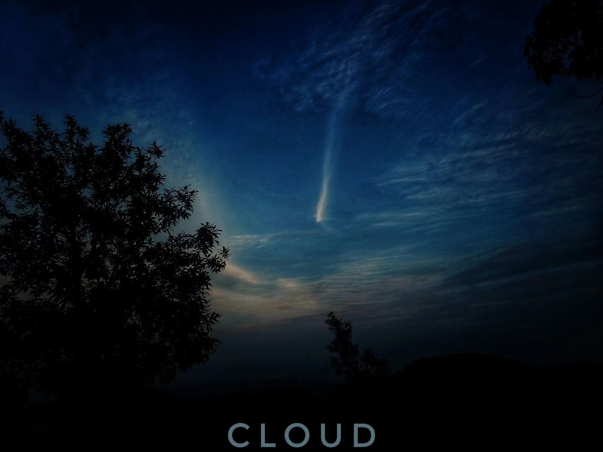


---
> 2020-07-15 09:09:15


Nyos-孤梦一辉


> 评论(0)


---
### 6月
> 2020-06-23 16:00:06


Nyos-青い果実


> 评论(2)


*  [陈杰](https://user.qzone.qq.com/981625766)：蜗牛那张 巨好看
*  [马崇岩河科大土木](https://user.qzone.qq.com/1553614481)：x1 好看啊


---
> 2020-06-04 08:45:22


> 评论(0)


---
> 2020-06-02 10:06:53


雾渐


> 评论(0)


---
### 5月
> 2020-05-31 09:53:57


Pretty Cool When Totally Dead.


> 评论(2)


*  [ 王亮](https://user.qzone.qq.com/1532289659)：我去 你咋拍我了
*  [ 王亮](https://user.qzone.qq.com/1532289659)：我想把他抓起来


---
> 2020-05-29 19:14:15


Add Blue


> 评论(0)


---
> 2020-05-29 18:33:07


夜皎'钟鸣'撰辔'东行

> 评论(0)


---
> 2020-05-24 18:27:00


动～角旋［1/120 ω≈21.3(rad/s)］


> 评论(0)


---
> 2020-05-23 06:39:23


角～架构


> 评论(2)


*  [智方](https://user.qzone.qq.com/1256618352)：头铁，人家都说不让靠近了
	* [秉蕳](https://user.qzone.qq.com/2322748973)：[@智方](https://user.qzone.qq.com/1256618352)既没雷雨，也无覆冰，接近没事的，就是个风速塔而已。
	* [智方](https://user.qzone.qq.com/1256618352)：[@秉蕳](https://user.qzone.qq.com/2322748973)
*  [秉蕳](https://user.qzone.qq.com/2322748973)：
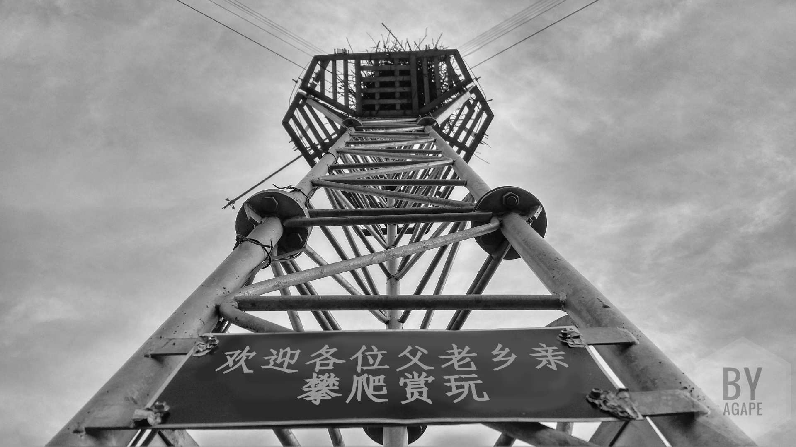


---
> 2020-05-22 16:44:16


Upload •afterlife


> 评论(0)


---
> 2020-05-21 09:43:48


黄蜻[Color Splash]


> 评论(2)


*  [ 王亮](https://user.qzone.qq.com/1532289659)：近啊
	* [秉蕳](https://user.qzone.qq.com/2322748973)：[@ 王亮](https://user.qzone.qq.com/1532289659)像捕食者一样靠近
	* [ 王亮](https://user.qzone.qq.com/1532289659)：[@秉蕳](https://user.qzone.qq.com/2322748973) 哈哈 厉害了
*  [秉蕳](https://user.qzone.qq.com/2322748973)：
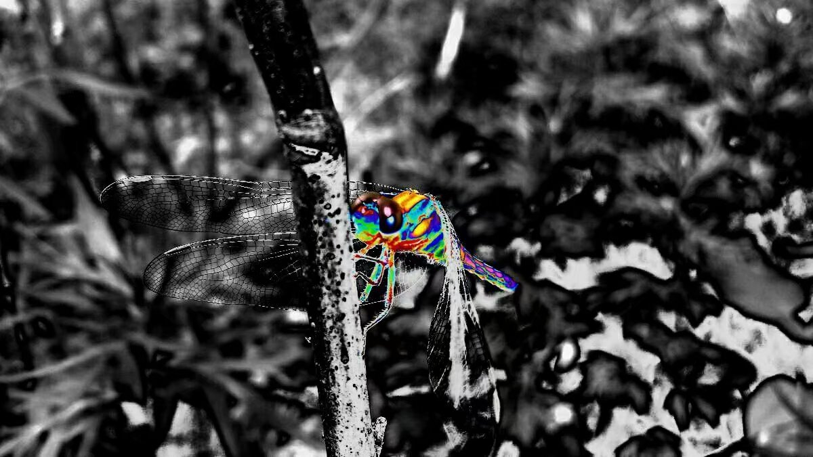


---
> 2020-05-20 16:57:08


满～小憩


> 评论(0)


---
> 2020-05-19 06:59:50


汤谷～曦漏


> 评论(0)


---
> 2020-05-17 21:03:48


如增实体，休言放弃！

> 评论(0)


---
> 2020-05-11 20:40:24


蒙汜～霞没


> 评论(0)


---
> 2020-05-09 21:21:06


Leidenfrost Phenomenon





> 评论(0)


---
> 2020-05-07 11:35:55


The Path to the Nest of Spiders


> 评论(1)


*  [ 王亮](https://user.qzone.qq.com/1532289659)：不错不错


---
> 2020-05-07 11:20:21


The Path to the Nest of Spiders


> 评论(0)


---
### 4月
> 2020-04-20 21:33:37


与命运书


 意散，远路即乱，云为不卷，蔑死我梦；寡我闲情，迭我杂恋，奸绝我思，溃我容川。殄灭我乐城，散离我兄弟；扰乱我期月之守，倾覆我半生执念。


 我赤心未忘君之旧勋，而惧明星之陨，是以有路合之师，犹愿续弩末向云天。命公弗听，而即Internet谋我，天诱其衷，程式溃崩，命公是以不克逞志于我。


 笺记我之自出，又欲阙翦我文室，倾覆我忆力，帅我惰怠蟊贼，以来荡摇我心界，我是以有Focus之役。命犹不悛，荡我平河，伐我静川，俘我霄雀，翦我星月，我是以有Ockham之战。


 以我日日新，又日之新，克彼靡不有初，鲜克有终。天哉！休言，我定败汝！


◎春三廿八，整日无节奏，苦思未有结果，几欲崩溃，遂定新计划 愚者 ，兼怀挣扎之过往：拯救薄冰者- Explorer1&amp;2- 绝夭阏者- 克终者- Down·Era

> 评论(1)


*  [ 王亮](https://user.qzone.qq.com/1532289659)：必杀之


---
> 2020-04-20 21:30:52


如非必须，勿增实体。

> 评论(0)


---
> 2020-04-18 13:15:23


Irises


> 评论(0)


---
> 2020-04-15 08:20:26


[#The pixel art #](http://rc.qzone.qq.com/qzonesoso/?search=The%20pixel%20art%20)


 快乐，是点状的!


@长弓诉水 来自无拘无束的FC时代的美，将要在我手中重现。


> 评论(1)


*  [←杨涛→](https://user.qzone.qq.com/2323688074)：x3 可以哈


---
> 2020-04-11 20:24:38


黑洞照片一周年，来自室女座M87星云的光。


(M78星云的ウルトラマン表示:这才是我们的光之国!)


 北京时间2019年4月10日晚9时许，包括中国在内，全球多地天文学家同步公布了黑洞“真容”。该黑洞位于室女座一个巨椭圆星系M87的中心，距离地球5500万光年，质量约为太阳的65亿倍。它的核心区域存在一个阴影，周围环绕一个新月状光环。爱因斯坦广义相对论被证明在极端条件下仍然成立。M87被归类为有超重质量黑洞的星系，有着异常大量的球状星团成员。





> 评论(0)


---
> 2020-04-11 12:35:37


本小兔可要冲了！


> 评论(2)


*  [杨润锋](https://user.qzone.qq.com/2725474060)：油炸，可香
	* [秉蕳](https://user.qzone.qq.com/2322748973)：[@杨润锋](https://user.qzone.qq.com/2725474060) 再送俩蝙蝠，一块吃着吧您嘞。
*  [左燕燕河科职会计](https://user.qzone.qq.com/2503755277)：自己养的？   送来玩玩
	* [秉蕳](https://user.qzone.qq.com/2322748973)：[@左燕燕河科职会计](https://user.qzone.qq.com/2503755277)行啊，就是不知道小兔子们愿不愿意
	* [左燕燕河科职会计](https://user.qzone.qq.com/2503755277)：[@秉蕳](https://user.qzone.qq.com/2322748973)它们太愿意了


---
> 2020-04-10 22:31:54


这群老家伙们可真是行，这么大年纪还在学HTML（网页开发）。


> 评论(0)


---
> 2020-04-06 22:11:37


Kill the COVID-19，文明不灭，人类必胜，因为我期待那万万人涌入深空的曙光时代啊!


科普:阿西莫夫，美国科幻小说家，作品集结成'基地三部曲'，描绘了恢弘的银河帝国人类文明史，提出经典的机器人三定律:


一、机器人不得伤害人类，或因不作为而使人类受到伤害。


 二、除非违背第一法则，机器人必须服从人类的命令。


 三、在不违背第一及第二法则的情况下，机器人必须保护自己。(还有更厉害的第零法则，神秘的Robot 丹尼尔，与自然融为一体的盖娅星系……我好像回到了高中，夜里熄灯后拿着Nokia E-72，看着《基地后传》，听着行星组曲的时光)


 -记在阿西莫夫逝世28周年


> 评论(0)


---
> 2020-04-05 20:49:33


> 评论(0)


---
> 2020-04-04 21:19:14


风沙卷了，先行者远了！

> 评论(0)


---
> 2020-04-04 19:24:17


我骑着一匹拐腿的瞎马，向着黑夜里加鞭 －

> 评论(0)


---
### 3月
> 2020-03-29 19:08:09


积云之下


> 评论(1)


*  [应律](https://user.qzone.qq.com/2627762736)：花
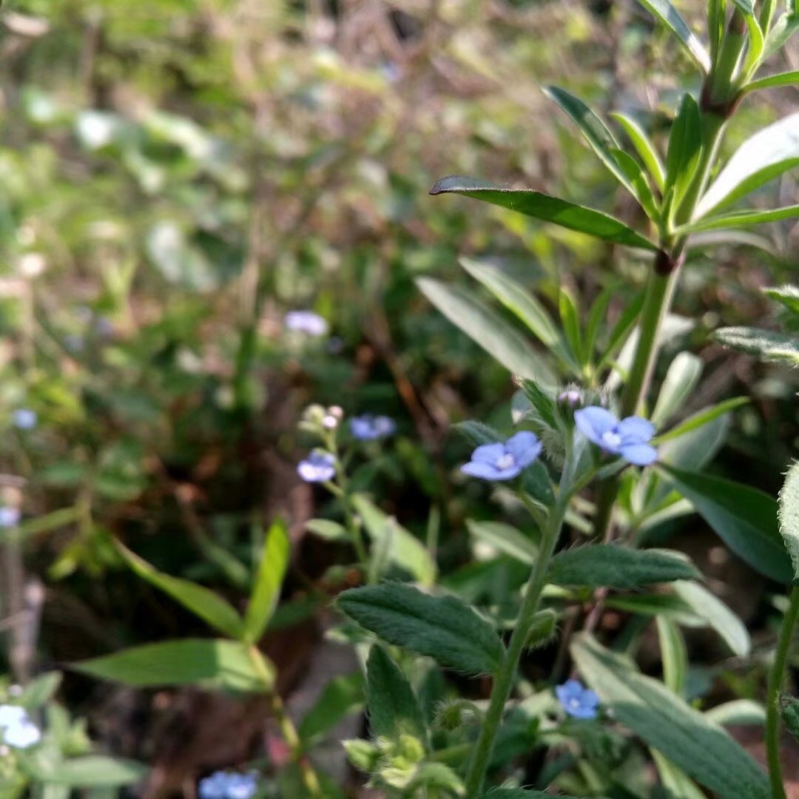
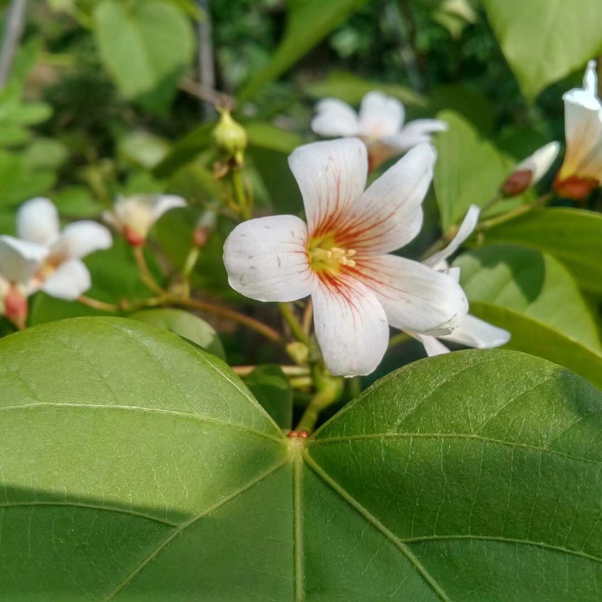
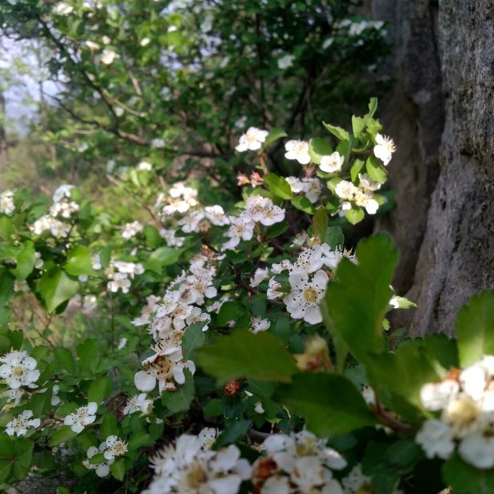


---
> 2020-03-27 23:53:40


要死，要死，Two Steps From Hell.


> 评论(0)


---
> 2020-03-24 22:53:21


The unknow-future, the unknow-mind. Maybe now is the best time.


> 评论(0)


---
> 2020-03-24 22:14:18


> 评论(0)


---
> 2020-03-20 16:05:36


：WordPress傻瓜式建站


> 评论(0)


---
> 2020-03-19 20:24:47


既然通往梦想🌈的路不止一条，那就再加两道杠吧! 🔩/🎓/🎶/💻/📸/🔭/……

> 评论(0)


---
> 2020-03-15 18:35:24


解锁成就： 排箫DIY


模仿自：[网页链接](https://www.icourse163.org/learn/CCNU-1002600009?tid=1450337474#/learn/announce)


> 评论(0)


---
> 2020-03-14 18:28:46


I see the Golden sky and flowers, but where is the butterfly?


> 评论(3)


*  [马崇岩河科大土木](https://user.qzone.qq.com/1553614481)：

*  [ 王亮](https://user.qzone.qq.com/1532289659)：坐的高啊
*  [陈杰](https://user.qzone.qq.com/981625766)：x1 还有摄影师跟随哟
	* [秉蕳](https://user.qzone.qq.com/2322748973)：[@陈杰](https://user.qzone.qq.com/981625766)妹妹帮忙照的
	* [陈杰](https://user.qzone.qq.com/981625766)：[@秉蕳](https://user.qzone.qq.com/2322748973) 可以 帅


---
> 2020-03-11 23:10:59


庚子之春，二月既望，一人徘徊于楼顶之上。风卷舞声，闲云展舒。拂屏弄玩，看天下之事论尺寸之间。少焉，月出于东山之上，徘徊于角亢之间。遂拭镜而望，月未大明，星尚繁多。指点群星，然无可言说其名，心有不甘，遂借神机之程式，俯仰以辨。


> 评论(3)


*  [马崇岩河科大土木](https://user.qzone.qq.com/1553614481)：
*  [智方](https://user.qzone.qq.com/1256618352)：嚯，可以的
*  [秉蕳](https://user.qzone.qq.com/2322748973)：Oh no，昨天（二月十八）应该是-既既望日。根据所能查得的比较精确的数据，这几天日落与月升的时间之差分别是:十五:1时32分；十六:0时11分；十七:0时50分；十八:2时1分。所以二月十六是望日（太阳落下时月亮升起为望日），十七是既望日，十八只能是既既望日了。
	* [智方](https://user.qzone.qq.com/1256618352)：[@秉蕳](https://user.qzone.qq.com/2322748973)噗


---
> 2020-03-11 00:16:43


今天，快乐的一天(Today, a happy day)


 摸索了多久，终于迎来这个时刻，deepin-window双系统诞生了，再也不用使那蹩脚的liberCAD了(你坑地我好苦啊)，再也不用什么虚拟机VMware。虚拟机！我怀疑就是你！把电脑整坏的，害电脑先是死到启动界面十多天，没办法，又网购了个启动盘，等到那可怜的U盘终于穿过疫区，十来天又过去了。


好不容易见到了图形界面，又阴差阳错的安了个deepin，虽说是个不错的系统，原就准备舍弃windows了，但这些几十兆的中英混合没法激活的CAD软件(专业必须)，又浪费了我多少夜晚。今天(哦，0点了)，我受够这蹩脚的deepin了，下了狠心，格式化了所有硬盘，又踩了不少坑，终于终于把两个系统先后装上去，收工了。


 电脑、手机只是个工具，工具是靠人的，人若太依靠工具，那便成了工具的奴隶。

> 评论(1)


*  [叶青](https://user.qzone.qq.com/2796959043)：重装系统就好了


---
> 2020-03-05 18:51:39


5oiR5Yiw5bqV5Zyo5a+75om+5LuA5LmI77yf


> 评论(2)


*  [陈杰](https://user.qzone.qq.com/981625766)：什么暗语
*  [智方](https://user.qzone.qq.com/1256618352)：没看懂


---
### 2月
> 2020-02-27 10:02:29


世界！加油！|岂曰无衣？与子同袍。修我戈矛，与子同仇。

> 评论(0)


---
> 2020-02-24 15:47:10


迈开脚步，天空开始流动。


> 评论(1)


*  [ 王亮](https://user.qzone.qq.com/1532289659)：似曾相识


---
> 2020-02-15 19:31:56


Bule-blue Sky


> 评论(0)


---
> 2020-02-08 20:49:06


( ง °皿°)ง⁼³₌₃(NCP)]}

> 评论(1)


*  [秉蕳](https://user.qzone.qq.com/2322748973)：啦啦


---
> 2020-02-07 22:22:11


2019-nCoVs，你们可以让一颗星辰陨落，但群星将更加闪耀！


[02-07 汝等小妖，焉得猖狂！天降雷火，烧尔等为灰烬，以祭我英雄，祭我百姓。]


> 评论(0)


---
> 2020-02-07 21:19:41


2019-nCoVs，你们可以让一颗星辰陨落，但群星将更加闪耀！


[02-07 汝等小妖，焉得猖狂！天降雷火，烧尔等为灰烬，以祭我英雄，祭我百姓。]

> 评论(0)


---
> 2020-02-06 22:22:31


2019-nCoVs，你们的远方仅存于人们的回忆之中，止步吧！


[02-06 祝你们爱上瑞德西韦。]


……………………&lt;(￣︶￣)&gt;……………………………


 PS:&quot;2月6日，人们关注已久的抗病毒药物瑞德西韦（remdesivir）在完成临床试验的注册审批后已运抵抗疫一线，正式被用于武汉金银潭等一线医院首批2019-nCoV新型冠状病毒肺炎患者治疗。&quot;


 瑞德西韦百科→[网页链接](https://m.chemsrc.com/mip/cas/1809249-37-3_1491289.html)


> 评论(0)


---
> 2020-02-06 21:02:12


2019-nCoVs，你们的远方仅存于人们的回忆之中，止步吧！


[02-06 祝你们爱上瑞德西韦。]


PS:&quot;2月6日，人们关注已久的抗病毒药物瑞德西韦（remdesivir）在完成临床试验的注册审批后已运抵抗疫一线，正式被用于武汉金银潭等一线医院首批2019-nCoV新型冠状病毒肺炎患者治疗。&quot;


 瑞德西韦百科→[网页链接](https://m.chemsrc.com/mip/cas/1809249-37-3_1491289.html)


> 评论(0)


---
> 2020-02-06 08:28:47


2020(庚子)~第一场雪


> 评论(2)


*  [李婉音](https://user.qzone.qq.com/2309115217)：俺这也有？
*  [秉蕳](https://user.qzone.qq.com/2322748973)：应该有吧，就差这么远儿
	* [李婉音](https://user.qzone.qq.com/2309115217)：[@秉蕳](https://user.qzone.qq.com/2322748973)哈哈，你起的真早


---
> 2020-02-05 22:22:04


2019-nCoVs，汝等单链RNA，见鬼去吧！


[02-05 咒你们 :


 If (mutation) // mutation:变异


 over;


 else quickly over.


]

> 评论(1)


*  [田华蕊](https://user.qzone.qq.com/1632571804)：你这啥东西


---
> 2020-02-04 22:22:14


2019-nCoVs，汝等单链RNA，见鬼去吧！〔02-04 咒你们的聚合酶都死(失活)！〕

> 评论(0)


---
> 2020-02-03 22:22:05


2019-nCov，你这一低等单链RNA，见鬼去吧！(02:03 咒你们翻译都译反！)

> 评论(0)


---
### 1月
> 2020-01-31 18:18:53


有的玩儿了


_____安卓上的Linux模拟器－(termux)


> 评论(6)


*  [ 王亮](https://user.qzone.qq.com/1532289659)：什么鬼
*  [秉蕳](https://user.qzone.qq.com/2322748973)：Linux是一类计算机系统(ps:安卓系统就是Linux内核的)，这就是在一个名叫“termux”的软件里输入一些指令。(都是百度来的)
	* [ 王亮](https://user.qzone.qq.com/1532289659)：[@秉蕳](https://user.qzone.qq.com/2322748973) 可以可以 
*  [左向国](https://user.qzone.qq.com/2992912766)：大哥，你这手机哪里买的
*  [秉蕳](https://user.qzone.qq.com/2322748973)：网购的 徘徊于淘汰边缘的 BlackBerry Priv
*  [陈杰](https://user.qzone.qq.com/981625766)：凳子有些年头了
*  [秉蕳](https://user.qzone.qq.com/2322748973)：那可是我老奶留下的
	* [左向国](https://user.qzone.qq.com/2992912766)：[@秉蕳](https://user.qzone.qq.com/2322748973)感觉比我安卓机都牛逼
	* [秉蕳](https://user.qzone.qq.com/2322748973)：[@左向国](https://user.qzone.qq.com/2992912766)这实际上就是一个带键盘的低配安卓机。
	* [左向国](https://user.qzone.qq.com/2992912766)：[@秉蕳](https://user.qzone.qq.com/2322748973)，，，，
	* [左向国](https://user.qzone.qq.com/2992912766)：[@秉蕳](https://user.qzone.qq.com/2322748973)这都行


---
> 2020-01-29 07:59:14


太阳照常升起


> 评论(0)


---
> 2020-01-24 14:07:28


三十儿，捏鼻儿。


> 评论(2)


*  [田华蕊](https://user.qzone.qq.com/1632571804)：新年快乐啊
*  [←杨涛→](https://user.qzone.qq.com/2323688074)：新年快乐


---
> 2020-01-13 21:17:30


云霄傲~时年


逐日三千里，流年不复还。


电波半秒分，友亲即如面。


纵如面，息信传；


片言语，义情连。


逝者终不返，会者亦非先。


非前非先，时变时迁。


人各有志，叹此枉然。

> 评论(2)


*  [ 王亮](https://user.qzone.qq.com/1532289659)：你作的？
*  [秉蕳](https://user.qzone.qq.com/2322748973)：无格律的杂诗而已。昨夜，于火车之上，见星月最是灿烂，未曾见猎户座如此之清也，但方位似乱，下弦月升，亮面在东，车向东南，我处左窗。故：月居窗中，车是南行，月没窗右，车是东行，月移于左，车是右转，月行于右，车是左转。 对否？
	* [ 王亮](https://user.qzone.qq.com/1532289659)：[@秉蕳](https://user.qzone.qq.com/2322748973) 是也


---
> 2020-01-12 00:02:29


Another mysterious world.


> 评论(1)


*  [ 王亮](https://user.qzone.qq.com/1532289659)：what？
	* [秉蕳](https://user.qzone.qq.com/2322748973)：[@ 王亮](https://user.qzone.qq.com/1532289659)c语言入门.
	* [ 王亮](https://user.qzone.qq.com/1532289659)：[@秉蕳](https://user.qzone.qq.com/2322748973) 


---
> 2020-01-10 01:06:20


All starlight emerged from the dark night.

> 评论(0)


---
> 2020-01-06 19:13:35


Moon


 If you are


 A love compassionate


 You will walk with us this year


 We face a glacial distance, who are here


 Huddle


 At you feet.


> 评论(0)


---
