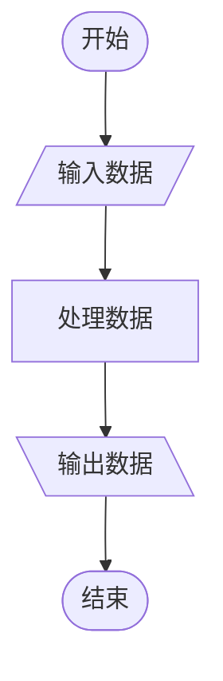

> 当你迫切想要做成一件事时，往往适得其反；当你抱有太多希望时，失望也随之而来。

今天开始再次开始学习C语言💻，说实话之前学的东西，好像...都给忘了🐷，这次以文章的形式来学，应该效果会好一点。

# 你好，世界！

开始学习一个新东西的感觉就像走进一条经常看见却未曾走过的小路，似曾相识，却又充满未知。现在，让我写下今年八月的第一个惊天地泣鬼神的c程序吧🐉！
```c hey world
#include<stdio.h>
int main()
{
    printf("Hey world!");
		return 0;			
}
```
gcc编译成功了😁，不过这格式是真的丑。

废话不多说，C程序的一般形式长这个样子：
```c 
预处理命令序列;
/* Macro Constant: define PI(大写) 3.1415926 */
/* const float pi 3.4159 */
// 宏常量在定义时没有数据类型，const在定义时会先检查。
// 嘿，这就像latex中引用的宏包，那么这些定义也可以放到一个自己的.c文件里吧
void main()
{		
    定义语句
    执行语句
}
```
# 标识符与关键字

## 标识符(identifier)

用来标识函数名、变量名、数组名、文件名等的有效字符序列(就是它的名字了)，名字不能乱起，首先要让人能看懂，而且不能太长，也不能太随便。在C语言里，标识符的命名规则为：
1. 不能以数字开头，只能由字母、下划线、数字组成。(汉字是不支持的)
2. 关键字不能作为标识符。
3. 名字最好不超过8个字符(太长了后面就会被无效)

## 关键字(保留字)

C语言有32个保留字:
auto、break、case、char、const、continue、default、do、double、else、enum、extern、float、for、goto、if、int、long、register...

# 变量与常量

## 变量的定义与特点

定义语句：**[ 类型关键字  变量名1,变量名2, ... 变量名n ]**(int a)，变量用唯一的一个**十六进制无符号整数**来储存。变量有四个基本属性：*变量名；变量值；变量地址；变量类型(决定分配的内存大小)* 

## 常量(数据类型)

内存占比:

| 数据类型 | 名称 | 占用字节数(n) | 表示范围 | 运算方式 |
|  :--:  | :--:  |  :--:  |  :--:  |  :--:  |
| int | 基本整型 | 4 | $-2^{31},2^{31}-1$ | + - * / % |
| short | 短整型 | 2 | $-2^{15},2^{15}-1$ | + - * / % |
| long | 长整型 | 4 | $-2^{31},2^{31}-1$ | + - * / % |
| unsigned short/long/int | 无符号整型 | 2/4/4 | $0,2^{8n}-1$ | + - * / % |
| float | 单精度实型(6) | 4 | $1.175\cdot 10^{-38},3.403\cdot 10^{38}$ | + - * / |
| double | 双精度实型(15) | 8 | $2.3\cdot 10^{-308},1.7\cdot 10^{308}$ | + - * / |
| long double | 长双精度实型(19) | 10(系统相关) | $3.4\cdot 10^{-4932}, 1.1\cdot 10^{4932}$ | + - * / |
| char | 字符型 | 1 | $[1-2^7,2^7-1]\ or\  [0,2^8-1] $ | + - |

* [ sizeof(类型/变量/表达式;int/a/a+b) ]** ~~函数~~运算符:计算变量占用内存大小，

```c 数据类型
    char 	cChar 	= "the pi";	/*定义各种类型变量，用数组应该更简洁*/
    short 	iShort 	= 0314; 	/*八进制*/
    int		iInt 	= 0x1A; 	/*十六进制*/
    long 	iLong 	= 314L;
    float 	fFloat	= 3.1415;
    double 	f2Double= 314159e-5;
    printf("%d\n",sizeof(float));
```

**变量的储存形式**：整型数：先高后低；	实型数：小数(整数+小数)/科学计数法(指数+小数)。注意，同样字节大小的数据，浮点数比定点数可以表示更大的范围，而字符型数据的储存形式为其ASCII码值(只能做加减法)。

###  整数类型的极限值 

有时候需要查看，当前系统不同整数类型的最大值和最小值，C 语言的头文件 `limits.h` 提供了相应的常量，比如 SCHAR_MIN 代表 signed char 类型的最小值 - 128，SCHAR_MAX 代表 signed char 类型的最大值 127。

* SCHAR_MIN，SCHAR_MAX：signed char 的最小值和最大值。
* SHRT_MIN，SHRT_MAX：short 的最小值和最大值。
* INT_MIN，INT_MAX：int 的最小值和最大值。
* LONG_MIN，LONG_MAX：long 的最小值和最大值。
* LLONG_MIN，LLONG_MAX：long long 的最小值和最大值。
* UCHAR_MAX：unsigned char 的最大值。
* USHRT_MAX：unsigned short 的最大值。
* UINT_MAX：unsigned int 的最大值。
* ULONG_MAX：unsigned long 的最大值。
* ULLONG_MAX：unsigned long long 的最大值。


*编译器为变量分配内存的方式


*决定了变量的生存期(Lifetime)

。在静态存储区中分配内存的变量


*生存期是整个程序,全程占据内存

。在动态存储区中分配内存的变量

一生存期是定义它的语句块

## 运算符

操作数(Operand)是可以进行运算的对象，基本算数运算符：**加减乘除余 +-*/%**，运算符也是有优先级的。对于赋值，自增自减等一目运算符一般是从右往左执行的，而对于二目运算符，遵循先乘除后加减，从左至右的顺序。在C语言中，操作数决定了返回值的数据类型，如果想要强制改变返回值的类型，可以在操作数加一个所需的强制类型转换运算符[ (float) int ]。自增自减运算符的前后缀有所区别,使用时应当注意,前缀往往先执行。

```c
42 	 / 5 = 8;	//返回整数
42.0 / 5 = 8.4;	//返回浮点数
++a;  a += 1;	//a=a+1,自加运算符
--b;  b -= 1;	//b=b-1,自减运算符
m = ++n;		//n=n+1 -> m=n
m = n++;		//m=n	-> n=n+1
```

* 不同数据类型运算的结果是**取值范围较大**的那种。
* 类型提示规则：*short -> int -> u(nsinged)int -> long -> ulong -> float -> double -> longdouble*
* 一元运算符的效率更高

### 运算符补充：

- 算术运算符:
  +：正值运算符（一元运算符）
  -：负值运算符（一元运算符）
  +：加法运算符（二元运算符）
  -：减法运算符（二元运算符）
  *：乘法运算符
  /：除法运算符
  %：余值运算符
  ++：自增运算符
  –：自减运算符
- 关系运算符
  \> 大于运算符
  < 小于运算符
  \>= 大于等于运算符
  <= 小于等于运算符
  == 相等运算符
  != 不相等运算符
- 逻辑运算符
  !：否运算符
  &&：与运算符
  ||：或运算符
- 位运算符 (一般不用)
  取反运算符～
  与运算符 &
  或运算符 |
  异或运算符 ^
  左移运算符 <<
  右移运算符 >>
- 赋值运算符
  = 及其扩展
- 条件运算符
  ？：
- 逗号运算符，
  执行顺序
- 指针运算符 * &
- 成员运算符
- 下标运算符

# 输入与输出(I/O)

C语言可以从那里得到所需的数据呢？当然是手中的键盘和电脑里的文件了，输出的地方自然就是眼前的屏幕和文件了。

## printf详解

作为初学者最先接触到的函数，把字符打印输出到屏幕上，虽然没有什么技巧，但却是是最直观的激励。这个函数也没什么复杂，主要包含格式控制字符串：

| 控制字符串 | 数据类型 |
| :--------: | :------: |
|     %d     |   int    |
|     %u      | uint |
|     %ld     | long int |
| %hd | short int |
|     %f     | float/double |
|     %e     | float/double 指数形式 |
|     %6f     | 右至左精度为6(默认)，补空格 |
| %-8f | 左至右精度为8，补空格 |
| %.6f | 精度为3的float |
| %% | 输出"%" |

## sacnf函数

格式控制字符串与`printf`大概一致，但不能指定数据的精度~~`7.2%f`~~，要指定数据储存位置`&`，当需要输入多个数据时用`Tab,回车,空格`来分隔输入，指定位宽后则无须分隔输入。其返回值是成功读入的数据项数。

```c
int a,b,c,d;
scanf("%d%d", &a, &b);	//输入a,b的值，“&”为取地址运算符,
scanf("%3d%2d".&c,&d);	//指定位宽后无须分隔输入，"*"跳过一个输入项
printf("a=%d,b=%d\n",a,b);
printf("c=%d,d=%d\n",c,d);
```

## 字符

`“42”`表示一个字符，`42`表示一个数字，转义字符(无法从键盘输入)，字符以对应的ASCII码值来储存，可以对其进行算数运算，根据这个特点可以实现**大小写转换：`a-A=32`**。

```c
cbeta = getchar();		//接受字符
//char calpha='aornus'; //定义字符
char calpha='X'
putchar(calpha);		//输出字符，不是字符串！
```

* `getchar()`是以`行缓冲方式`输入数据的，即用户在用该函数从键盘输入字符时，程序并未直接读取用户输入，而是在用户按回车键以后将输入字符先放入到输入**缓冲**队列中，然后再从缓冲队列中逐个读取字符。

```c
int		a;
char	b;
printf("请输入一个数字：");
scanf("%d",&a);		//实际输入："42+回车"
printf("该数字为：%c\n",a);

getchar();	//取走"回车"
printf("请输入一个字符：");
scanf("%c",&b);	//"%c"前加一个空格也可以scanf(" %c",&b);
printf("该字符为%d\n",b);
```

```shell
请输入一个数字：42
该数字为：42
请输入一个字符：X
该字符为：X
```

## 数值溢出

任何类型都只能用有限的位数来存储数据，表示数的范围是有限的,向变量赋的值超出了其类型的表示的数的范围就会发生`数据溢出`。

* 上溢出：运算结果大于能表示的最大数。
* 下溢出：运算结果小于能表示的最大数。

### 解决方法

1. 用取值范围更大的类型,有助于防止数值溢出(但可能会导致存储空间的浪费)

2. 了解处理问题的规模,选取恰当的数据类型

3. 同种类型在不同的平台其占字节数不尽相同

### 自动类型转换

* 数值精度损失
  * 丢失小数部分
  * 数值溢出或损失精度
  * 当整数长度大于7，赋值给浮点数时。
  * 二进制小数与十进制小数不一一对应。
* 有效数字
  * `float:6位`
  * `double:16位`

# 数据结构

* 逻辑非>算数运算符>关系运算符>逻辑与>逻辑或

关系运算符的优先级：$[{\color{magenta}<\ >\ \le \ \ge (\to)}]>[{\color{teal}=\  \ne(\to)}]$，关系表达式：真(true=1)，假(false=0)。

逻辑运算符：

|     运算符     | 符号 |
| :------------: | :--: |
|  与(AND)$\to$  |  &&  |
| 或(O  R)$\to$  | \|\| |
| 非(NOT)$\gets$ |  !   |

```c 闰年
year%4==0 && year%100!=0 || year%400==0 
```

# 算法

> 算法+数据结构=程序

* 有穷性：在合理时间内完成
* 确定性：无歧义，能有效执行
* 允许没有输入，或有多个输入
* 必须有一个或多个输出

## 表示方法

1. 自然方法
2. 伪代码
3. 流程图(Flowchart)
4. N-S图 

## 程序测试

* 白盒测试：完全了解程序的结构
* 黑盒测试：不了解程序的结构
* 回归测试：防止修改后产生新的bug

##  断言与防御

`assert` 提高程序执行效率，仅用于调试


## 顺序结构

1. 输入数据
2. 处理数据
3. 输出数据



   

## 选择结构

* 单分支(`if`)
  * 满足条件，执行，否则跳过。if语句
  
  
    ```mermaid
    %%{init: {'theme':'neutral'}}%%
    flowchart TB
    A([开始])-->B{条件P}
    B -->|真| D[语句A]
    D --> E[s]
    B -->|假| E[语句B]
    ```
  
* 双分支(`if-else`)
  * 满足条件，执行A，否则执行B。
  
    ```mermaid
    flowchart TB
    A([开始])-->B{条件P}
    B -->|真| D[语句A]
    B -->|假| E[语句B]
    ```
  
* 多分支(`else-if`)
  * 满足条件1，执行A；否则满足条件2，执行B；否则满足...
  
    ```mermaid
    flowchart TB
    A([开始])-->B{条件P?}
    B -->|真| C[语句A]
    B -->|假| D{条件q?}
    D -->|真| E[语句C]
    D -->|假| F[语句B]
    
    ```
  
    

```c 求最大值
//相等时
if a=b max="none";
//单分支if实现
if (a>b) max=a;
if (a<=b) max=b;
//双分支if-else实现
if (a>b) max=a;
    else max=b;
//条件表达式实现：若满足a>b，则max=a,否则max=b.
max = a>b ? a : b ;
```

## 分支控制(开关语句)

`switch`:

```c
switch (flloor)
{
case 1:
case 2:
case 3:	printf("floor3\n");
		berak;
case 4:	printf("floor4\n");
		berak;
default: print("fllor<3\n");
}
```

## 循环结构

1. 计数循环--`for语句`

     ```mermaid
     graph TB
     A([表达式1])-->B{循环次数n?}
     B-- 真 -->c[...]-->C[变量语句]
     C-->B
     B-- 假 ---->D[后面语句]
     ```

     ```c 求和
     int i,n,sum=0;
     	printf("请输入n:\n");
     	scanf("%d",&n);
     for {i=0;i<=n;i++}
     	{
             sum=sum+i;
         }
     	printf("Sum=1+...+&d= %d\n",n,sum);
     return 0;
     ```

     

2. 循环--`while(当型)`& `do-while(直到型)`语句，

     ```mermaid
     graph TB
     subgraph while
     A[/开始/]-->B{条件p?}
     B-- 真 -->c[...]-->C[变量语句]
     C-->B
     B-- 假 ---->D[后面语句]
     end
     
     subgraph do-while
     a[/开始/]-->h[do语句]-->b{条件p?}
     b-- 真 -->h
     b-- 假 ---->W[后面语句]
     end
     ```


### 循环选择的一般原则

* 循环次数已知：for
* 循环次数未知：while
* 循环体至少要执行一次：do-while

## 分治

分而治之，基本思想是：化难为易；化繁为简；化大为小；化未知为已知。把大问题分解成小问题，例如区分假币问题，就是把所有情况最终简化为两种基本基本问题：三枚称一次，两枚称一次，数量较大时就分成两堆或三堆，再细分之，就能得到最快的分法。**二分法**是经常使用的方法：把问题分解为均等的两半，再求解。应该注意的是：**合并**是分治中的关键。

## 迭代(辗转)

数学上的模型：1.迭代变量，2.迭代函数，3.迭代判据。根据解的情况又可分为精确迭代与近似迭代。直接迭代法解的情况如下
$$
\begin{cases}
\text{单方向收敛}&f'(x)\in(0,1)\\
\text{双方向收敛}&f'(x)\in(-1,0)\\
\text{发散}&f'(x)\in(-\infty,-1]\cup[1,\infty)\\
\end{cases}
$$
可见对于线性方程有很好的解，对于非线性方程我们采用**牛顿迭代法**，本质上就是把非线性转化成线性(看来人类对非线性方程的研究还不够成熟)，以直代曲。数学上的实质就是泰勒级数的前两项(这个泰勒级数不知道这两天遇到多少次了，在$\frac{0}{0}$型极限时，在数值分析上，机械控制...)
$$
f(x)=f(x_0)+f'(x_0)(x-x_1)+\frac{f"(x_0)}{2!}(x-x_1)^2+\cdots +\frac{f^{n}(x_0)}{n!}(x-x_1)^n
$$


# 嵌套与递归

> * 函数不能嵌套定义
> * 函数可以嵌套调用

## 递归执行的两个阶段

1. 递归阶段（堆入数据，压入数据）
2. 终止条件（条件）
3. 回归阶段（取出栈，取出数据，逆序的方式逐级返回）

```c 组合数计算
int main()
{
    int m, k;
    do{
        printf("请输入m与k，(m>=k>0)：");
        scanf("%d,%d", &m, &k);
    }
    /*确保m与k的正确输入*/
    while (m<k || m<0 || k<0);
    return 0;
}

/*组合数计算函数*/
long Comb(int m, int k)
{
    return Fact(m)/(Fact(k)*Fact(m-k));
}

/*阶乘计算函数*/
long Fact(int n)
{
    int i;
    long result = 1;
    for (i=2; i<=n; i++)
    {
        result *=i;
    }
    return result;
}
```

* 条件递归：
  * 字典：词汇的释义互相递归

  * 费波纳契数列

    ```c  Fibonacci
    long Fib(int n)
    {
        long f;
        if (n == 0)			f = 0;
        else if (n == 1)	f = 1;
        else	f = Fib(n-1) +Fib(n-2);
        return f;
    }
    ```

    
  
  * 用递归来计算阶乘（很聪明是不是:happy:）：
  
    ``` c 阶乘计算函数2(递归)
    long Fact(int n)
    {
        if (n < 0)
            return -1;
        else if (n==0 || n==1)
            return 1;
        else 
            return n * Fact(n-1);
    }
    ```

    
  
  * 汉诺塔问题
  
    ```c 
    if (n == 1)
    {
        Move(n, a, b);
        else
        {
            Hanoi(n-1, a, c, b);
            Move(n, a, b);
            Hanoi(n-1, c, b, a);
        }
    }
    ```
  
  ### 尾递归
  
  将递归调用的返回值直接返回给上一层递归。可以借用之前的结果，栈空间不会增加，看起来更加高效。
  
  
  
  # C语言的内存映像
  
  $$
  \text{[只读存储区(代码区|常量储存区)]}-\text{[静态存储区]}-\text{[动态存储区(堆↣… ↢栈)]}
  $$
  
  **静态存储区**：存放全局变量和静态变量。
  
  **堆栈**：堆栈溢出：存入数据过大。
  
  **栈**：先进后出，函数调用时常用
  
  > 虽然简洁直观，逻辑清楚，符合数学公式
  >
  > 函数调用开销大，占用大量堆栈空间，递归效率比较低，容易产生大量重复计算。
  
  ## 变量的作用域
  
  ### 局部变量
  
  作用域在语句块内，作用域较小的局部变量覆盖作用域较大的局部变量。
  
  ### 全局变量
  
  作用域从定义变量的位置开始，到程序结束，形参与实参不会相互干扰。
  
  优劣兼有，小心使用。建议用形参和返回值来进行数据交流。
  
  *这些概念在linux中无不体现。*
  
  ```c
  long Fib(int n);
  {
      count++;/*外面定义了计数变量count*/
      long f;
      if (n == 0)			f = 0;
      else if (n == 1)	f = 1;
      else	f = Fib(n-1) +Fib(n-2);
      return f;
  }
  ```
  
  > 只要同名的变量出现在不同的作用域内，就不会互相干扰
  >
  > 原因：映射的地址不同

## 变量的存储类型

编译器为变量分配内存的方式决定了变量的生存期(Lifetime)

* 在静态存储区中分配内存的变量：生存期是整个程序,全程占据内存。
* 在动态存储区中分配内存的变量：生存期是定义它的语句块。

声明存储类型：

* `auto`自动变量（自动申请，自动释放）
* `static` 静态变量 
* `extern`外部变量（未定义时默认，且把值初始化为0）
* `register`寄存器变量（）

## 多文件结构

把定义文件分开储存。。。

# 库函数

### 字符和字符串操作函数

C语言的标准库函数中定义字符操作函数的头文件包含在 ctype.h 中，下面举一个🌰

```c 
#include<stdio.h>
#include<ctype.h>
int main()
{   char s[50];
    int i,ncount=0,ccount=0;
    printf("请输入:\n");
    gets(s);
    for(i=0; s[i]!='\0'; i++)
    {	if(isdigit(s[i])) ncount++; 	/*计算数字字符个数*/
        if(isalpha(s[i]))
        {   s[i]=toupper(s[i]);			/*转换成大写字母*/
            ccount++;	}	}			/*计算字母个数*/
    printf("数字:%d,字母:%d\n",ncount,ccount);
    printf("转换成大写后为:");
    puts(s);,
    return 0;
}
```
