
本文曾遗人以谬误，在此向因阅读本文而对hexo恐惧的来访者，特别是Z君道歉。

如果想搭建hexo博客的初学者，请直接参考相关视频教程。

不要阅读文本！
不要阅读文本！
不要阅读文本！


本文目的：

1. 在windows平台上搭建hexo【*hei so*】静态博客。
2. 通过git在各大代码平台进行管理部署。


<!-- @import "[TOC]" {cmd="toc" depthFrom=1 depthTo=6 orderedList=false} -->
<!-- code_chunk_output -->

- [第一部分：安装](#第一部分安装)
  - [Git](#git)
    - [安装步骤](#安装步骤)
    - [git基本操作](#git基本操作1)
  - [Node.js](#nodejs)
    - [安装步骤](#安装步骤-1)
    - [基本操作](#基本操作)
  - [hexo安装](#hexo安装)
    - [安装hexo](#安装hexo)
    - [hexo博客维护基本命令](#hexo博客维护基本命令)
    - [配置](#配置)
    - [_config.yml](#_configyml)
    - [_config.[theme].yml](#_configthemeyml)
    - [主题](#主题)
      - [自定义全局字体](#自定义全局字体)
- [第二部分：部署](#第二部分部署)
  - [SSH连接](#ssh连接)
  - [同步·gitee](#同步gitee)
    - [建立仓库](#建立仓库)
    - [克隆到本地](#克隆到本地)
    - [推送到远端并部署](#推送到远端并部署)
  - [同步·github](#同步github)
    - [建立仓库](#建立仓库-1)
    - [克隆到本地](#克隆到本地-1)
    - [hexo一键部署](#hexo一键部署)
    - [githubpages部署](#githubpages部署)
    - [.nojekyll问题](#nojekyll问题)
  - [快速恢复部署](#快速恢复部署)

<!-- /code_chunk_output -->


## 第一部分：安装

安装hexo框架需要两个软件：**[Node.js](https://github.91chi.fun/https://github.com/git-for-windows/git/releases/download/v2.35.1.windows.2/Git-2.35.1.2-64-bit.exe)** 与 **[Git](https://github.91chi.fun/https://github.com/git-for-windows/git/releases/download/v2.35.1.windows.2/Git-2.35.1.2-64-bit.exe)**，前者是hexo的依赖项，后者是为了在各个平台进行部署管理。

### Git

Git 是一个开源的分布式版本控制系统，用于敏捷高效地处理任何或小或大的项目。

Git 是 Linus Torvalds 为了帮助管理 Linux 内核开发而开发的一个开放源码的版本控制软件。

#### 安装步骤 

 <div id= "gitinstall" > 与平常的windows软件安装类似，不过其中有些细节要注意。 </div>

1. **阅读说明**，点击**Next**。


2. 选择**安装路径**，建议把一类软件装到一个路径下，这样便于管理，发现问题也很寻找。这里我装到了`F:\blog`目录下，


3. 选择安装**组件**(Components)。

   对于git软件而言，基本上都是在命令行里使用，不需要快捷方式，这里勾选了右键菜单、大文件支持、将`.git`文件与默认编辑器(后面会指定，这里只是建立了关系)，`.sh`与命令行关联运行，在命令行里添加一个git文档。


> 在类Unix系统(linux、macOS、unix)中命令行称之为**bash/sh/zsh**，而在Windows系统下称为cmd，或者Powershell(微软用`.NET`构建的跨平台开源组件)

4. 选择**开始菜单**文件夹

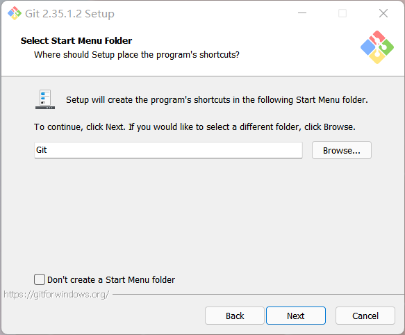

5. 选择Git的默认**编辑器**。

   linux用的比较多了，这里我选择了简单的Vim编辑器，大家可以根据自己喜好来选，这一步也是指定了文件关联，仍然要去自己安装你喜欢的编辑器。

   > 对于建hexo站写博客的用户而言，`.git`文件一般不需要怎么编辑，这一步忽略就OK。

.png)

6. 选择**默认分支**。

   默认的`master`分支就可以，不需要更改，后面配置pages时可以添加一个page的分支


> 分支是git软件的一大特色，说白了就跟windows出的家庭版、教育版、企业版一样，是**主线的派生**，详细请见git的分支介绍[文档](https://git-scm.com/book/zh/v2/Git-%E5%88%86%E6%94%AF-%E5%88%86%E6%94%AF%E7%AE%80%E4%BB%8B)。

7. 添加**环境变量**

   这一步很关键，所以配置很简单，直接**Next**。

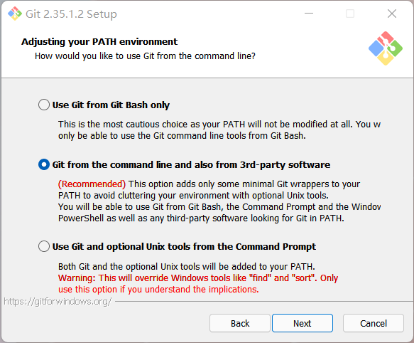

8. 选择**ssh** && 选择ssh库

   使用git内部自带的Openssh，还是用你自己的Openssh，如果你之前没有在设备上用过ssh，就选择默认的吧。


使用本地ssh库，没有的话就直接用ssh的库(开源万岁！)


9. git文件结束的方式（Windows风格与Unix风格）

   默认即可


10. git 命令行的默认打开的终端

    选第一个，~~因为第二个全都是在说`cmd`的坏话。~~

    

11. git 拉取[^3]的默认行为

    嗯~，二短一长选最长，就第一个了😎。

    这里是选择pull的默认行为，给了三个选项：1. 快速拉取到本地，否则决定是否合并。2.只拉取远端，覆盖本地。3. 拉去远端，有差异则不合并。


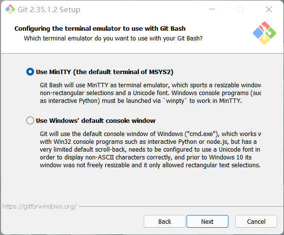

12. 选择证书(Credential)管理器

    选择默认的开源证书管理器即可

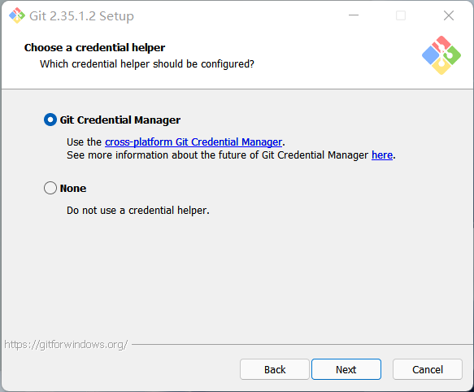

13. 额外选项

    文件缓冲，符号链接，都打勾即可。


14. 实验特性 && 点击**INSTALL**

    1. 用一个不用winpty的命令行去运行python。
    2. 取代老命的新命。

    建议：稳定与易用性起见，全不选。


#### git基本操作[^1]

1.  <div id= "gitact" > 创建新仓库 </div>

```shell
# 创建新文件夹，打开，然后执行
git init
# 以创建新的 git 仓库。  
```

2. 克隆远程仓库

```shell
git clone username@host:/path/to/repository
```

3. 工作流

你的本地仓库由 git 维护的三棵“树”组成。第一个是你的 `工作目录`，它持有实际文件；第二个是 `暂存区（Index）`，它像个缓存区域，临时保存你的改动；最后是 `HEAD`，它指向你最后一次提交的结果。


4. 添加、提交与推送

```shell
# 这是 git 基本工作流程的第一步：提出更改（把它们添加到暂存区），另外add . 是添加所有更改
git add <filename>
git add *
```

```shell
# 使用如下命令以实际提交改动：
git commit -m "代码提交信息"
```

经过上面两步，你的改动已经提交到了 HEAD，但是还没到你的远端仓库。执行如下命令以将这些改动提交到远端仓库：

```shell
git push origin master
```

5. 分支

一般的git默认分支都是master，当我们想要从master上创建一个新的分支时，可以这样做：

```shell
# 创建一个名为pages的分支，并切换到这个分支
git checkout -b pages
# 切换回主分支：
git checkout master
# 删除一个名为pages的分支
git branch -d pages
# 将分支推送到远端，不推送的话就只在本地可见
git push origin pages
```

6. 更新与合并

要更新你的本地仓库至最新改动，执行：

```shell
git pull
```

以在你的工作目录中 <u>*获取（fetch）*</u> 并 <u>*合并（merge）*</u> 远端的改动。
要合并其他分支到你的当前分支（例如把source分支合并到 master），执行：

```shell
git merge source
```

在这两种情况下，git 都会尝试去自动合并改动。遗憾的是，这可能并非每次都成功，并可能出现*<u>冲突（conflicts）</u>*。 这时候就需要你修改这些文件来手动合并这些*冲突（conflicts）*。改完之后，你需要执行如下命令以将它们标记为合并成功：

```shell
git add <filename>
```

在合并改动之前，你可以使用如下命令预览差异：

```shell
git diff <source_branch> <target_branch>
```

### Node.js 

> <div id= "nodejsinstall" > npm 是Node.js的默认包管理器，node.js安装后自带，就跟pip之于python，apt之于debian，pacman之于arch一样。  </div>

#### 安装步骤

1. 下载安装文件

   进入官网，选择长期支持的稳定版本，并下载安装。


可以省去这一步，下载地址：[点这里](https://nodejs.org/dist/v16.14.0/node-v16.14.0-x64.msi)

2. 开始安装 && 阅读并同意协议

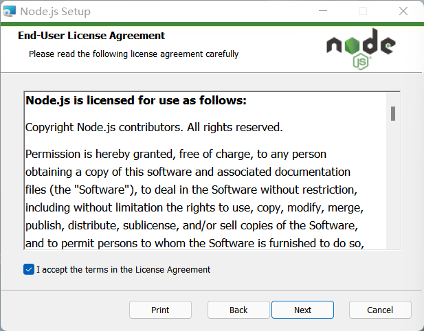

3. 选择安装路径

   这里我在`F:\blog\`下创建了一个npm文件夹。

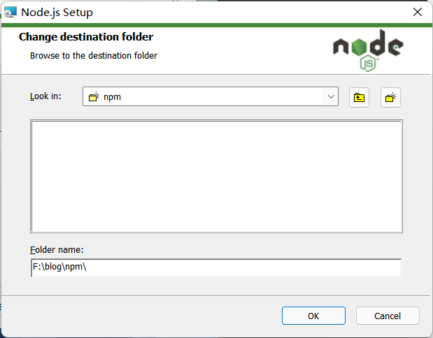

4. 自定义安装

默认即可，安装下来大概六十兆。

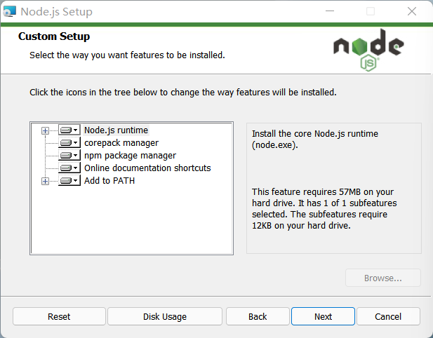

5. 安装必须的库，**千万别点**，会装上3G的库，而且下载速度贼慢。


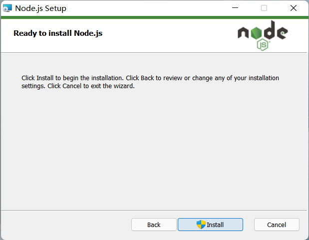

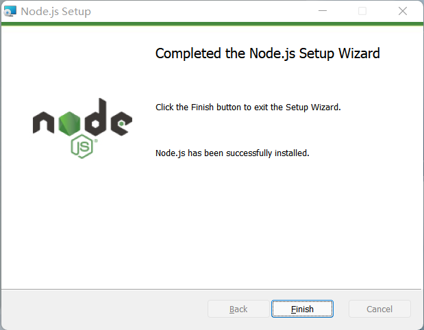

#### 基本操作

<div id= "nodejsact" > 在安装完成之后，我们先来熟悉一下nodejs的基本命令。  </div>

> 如果你在执行npm相关的命令时，出现提示npm命令找不到的情况，大概齐是环境变量没有设置好，这种情况会在重装Node.js到不同目录时出现。
>
> <u>解决方法：添加`..\npm\node_modules\npm\bin`到PATH变量。</u>

首先解决下连接问题

众所周知，国内访问各种开源库速度都不快，这里提供npm的解决方法：<u>更换淘宝源</u>，执行命令：

```bash
npm config set registry https://registry.npm.taobao.org
```

1. 查看版本

```shell
node -v  
npm -v
```

2. npm更新、清除缓存

```shell
npm install -g npm
# 删除所有模块
npm cache clean
```

3. npm安装、卸载、更新、搜索模块

```shell
# 安装 (加上`-g`后缀可以全局安装)
npm install <Module Name> 
# 更新
npm update  <Module Name>
# 卸载
npm uninstall  <Module Name>
# 搜索
npm search	<Module Name>
```

> 安装好一个包，会在该工程目录下生成 `package.json` 它用于定义包的属性，
>
> 而这个包就放在了工程目录下的 `node_modules` 目录下。

4. 查看所有全局安装的模块：

```shell
npm list -g
```

### hexo安装

> windows命令行基础，大佬略过
>
> 1. 进入指定目录：`cd 盘符:/dir/dir`
>
> ```bash
> #进入F盘blog目录
> cd F:\blog
> #进入上级目录
> cd .. 
> #进入初始目录
> cd （直接回车）
> ```
>
> 2. 创建文件夹：`md 文件夹名`
>
> ```bash
> #创建一个名为sion的文件夹
> md sion
> # 显示文件列表
> ls
> ```
>
> 3. 删除文件：`del 文件名`
> 4. 删除文件夹： `rd 文件夹`

#### 安装hexo

<div id= "hexoinstall" > 打开cmd，进入博客文件目录，创建博客目录： </div>

```bash
cd F:\blog && md sion && cd s
```

安装hexo包：

```bash
 npm install -g hexo-cli
```

在博客文件夹部署hexo：

```bash
npx hexo init
```

当你看到这句提示时，恭喜你，前期的工作完成了。

```bash
INFO  Cloning hexo-starter https://github.com/hexojs/hexo-starter.git
INFO  Install dependencies
INFO  Start blogging with Hexo!
```

下面可以通过执行下面这个命令来预览站点

```bash
npx hexo s -g
```

一切正常的话，点击[这里](http://localhost:4000/)应该就能看到你的第一个博客页面了🎉。

```
INFO  Validating config
INFO  Start processing
INFO  Hexo is running at http://localhost:4000/ . Press Ctrl+C to stop.
```


#### hexo博客维护基本命令

`hexo new post_title`=`hexo n post_title`：创建文章

> <div id= "hexoact" >hexo new “有空格 的 文章标题”  </div>
>
> hexo new 没空格的文章标题

`hexo deploy`=`hexo d`：将博客部署到托管网站

>  适用于github等平台，国内gitee部署需要手动更新

`hexo clean`=` hexo c` ：清除hexo生成的文件，亦即删除`public`文件夹。

> 有些时候这条命令并不能起作用，就会导致网上托管生成的页面与本地不一致，这时候手动删除pubic文件，再deploy即可。

`hexo generate`=`hexo g`：渲染生成网页文件。

`hexo server`=`hexo s`：开启本地服务器预览。

> 如果你有一台服务器，这就直接可以通过端口4000访问了。

1. 清除、生成并部署。

```
hexo c && hexo g && hexo d
```

1. 清除、生成并本地预览。

```
hexo c && hexo s -g 
```

#### 配置

> 注：下文内容系引用内容[^5]。**强烈建议去阅读hexo[官方文档](tps://hexo.io/zh-cn/docs/)！！！**

按照上面步骤，在你的博客目录下会生成如下文件：

```
.
├── _config.yml
├── package.json
├── scaffolds
├── source
|   ├── _drafts
|   └── _posts
└── themes
```

#### _config.yml

网站的配置信息，您可以在此配置大部分的参数，比如插件配置、部署配置、站点的基本信息。

| 参数                         | 描述                                                         |
| :--------------------------- | :----------------------------------------------------------- |
| `title`                      | 网站标题                                                     |
| `subtitle`                   | 网站副标题                                                   |
| `description`                | 网站描述                                                     |
| `keywords`                   | 网站的关键词。支持多个关键词。                               |
| `author`                     | 您的名字                                                     |
| `language`                   | 网站使用的语言。对于简体中文用户来说，使用不同的主题可能需要设置成不同的值，请参考你的主题的文档自行设置，常见的有 `zh-Hans`和 `zh-CN`。 |
| `timezone`                   | 网站时区。Hexo 默认使用您电脑的时区。请参考 [时区列表](https://en.wikipedia.org/wiki/List_of_tz_database_time_zones) 进行设置，如 `America/New_York`, `Japan`, 和 `UTC` 。一般的，对于中国大陆地区可以使用 `Asia/Shanghai`。 |
| `url`                        | 网址, 必须以 `http://` 或 `https://` 开头                    |
| `root`                       | 网站根目录                                                   |
| `permalink`                  | 文章的 [永久链接](https://hexo.io/zh-cn/docs/permalinks) 格式 |
| `permalink_defaults`         | 永久链接中各部分的默认值                                     |
| `pretty_urls`                | 改写 [`permalink`](https://hexo.io/zh-cn/docs/variables) 的值来美化 URL |
| `pretty_urls.trailing_index` | 是否在永久链接中保留尾部的 `index.html`，设置为 `false` 时去除 |
| `pretty_urls.trailing_html`  | 是否在永久链接中保留尾部的 `.html`, 设置为 `false` 时去除 (*对尾部的 `index.html`无效*) |

> 其中，`description`主要用于SEO，告诉搜索引擎一个关于您站点的简单描述，通常建议在其中包含您网站的关键词。`author`参数用于主题显示文章的作者。

#### _config.[theme].yml

独立的主题配置文件应放置于站点根目录下，支持 `yml` 或 `json` 格式。需要配置站点 `_config.yml` 文件中的 `theme` 以供 Hexo 寻找 `_config.[theme].yml` 文件。

> 我们强烈建议你将所有的主题配置集中在一处。如果你不得不在多处配置你的主题，那么这些信息对你将会非常有用：Hexo 在合并主题配置时，Hexo 配置文件中的 `theme_config` 的优先级最高，其次是 `_config.[theme].yml` 文件，最后是位于主题目录下的 `_config.yml` 文件。

#### 主题

无需多讲，本人感觉好看的两个主题：[Next](http://theme-next.iissnan.com/), [Butterfly🦋](https://butterfly.js.org/posts/21cfbf15/)

这里主要提几点本人在使用时的一点经验

##### 自定义全局字体

在主题的`theme\[your themes]\source\css`目录下新建一个.css文件，并按照下列css规范填写字体的定义：

```css
@font-face {
  font-family: 'XiaWuWenKai';
  src: local('Source Han Serif CN'), local('Source Han Serif SC'),
    url('../../../../images/aornus.github.io@1.2/css/fonts/Noto_Serif_SC/NotoSerifSC-Black.otf') format('opentype');
    url('../../../../images/aornus.github.io@1.2/css/fonts/Noto_Serif_SC/NotoSerifSC-Black.woff2') format('woff2');
    url('../../../../images/aornus.github.io@1.2/css/fonts/Noto_Serif_SC/NotoSerifSC-Black.woff') format('woff');
  font-weight: 700;
  font-style: normal;
  font-display: swap;
}

body{
  font-family: 'SiYuanSong', serif;
}
```

再将这个css文件引入主题的配置文件：

```
  - <link href="/css/custom.css" type="text/css" rel="stylesheet"/>
```

这样以后就可以直接调用了

```
  font-family: SiYuanSong
```

不过这样字体文件大的时候加载会有些慢，还是建议使用谷歌字体api。

## 第二部分：部署

这一步是静态博客的精髓，利用各大代码托管平台的pages服务，来免费部署博客，所以说，现在建站基本上就是零成本。

### SSH连接

<div id= "ssh" > 使用https虽然简单，但每次都要输密码，使用ssh可以免除git每次push时输密码的烦恼，而且更为安全。这里以gitee，github为例 </div>

0. 先配置好git

```shell
git config --global user.name "aornus"
git config --global user.email 6666666@qq.com
git config --list
```

1. 公私钥生成

这里生成了标识为`windows@laptop`（随便写也行，写你的邮箱也行）名为windows的密钥，其中后缀为pub的是公钥的内容，这一步的目的就是把公钥放到远端，然后用私钥连接。

```shell
cd ~/.ssh
ssh-keygen -t rsa -b 4200 -C "windows@laptop" -f windows
cat windows.pub
```

```shell
# passphrase是口令，直接回车就是置空。
C:\Users\agape\.ssh> ssh-keygen -t rsa -b 4200 -C "windows@laptop" -f windows
Generating public/private rsa key pair.
Enter passphrase (empty for no passphrase):
Enter same passphrase again:
Your identification has been saved in windows.
Your public key has been saved in windows.pub.
The key fingerprint is:
SHA256:Y0sC15T8Z0kPs9IP7cQQ94r8HeMhgSAcPEhUqc7HvBg windows@laptop
The key's randomart image is:
+---[RSA 4200]----+
|    oo==+o  ...  |
|     . B+ . *. . |
|    . o o. + @  .|
|     +    o.B.*. |
|    o + S  +o*.+ |
|     E B o   .=.+|
|      + o     ...|
|     . .         |
|                 |
+----[SHA256]-----+
```

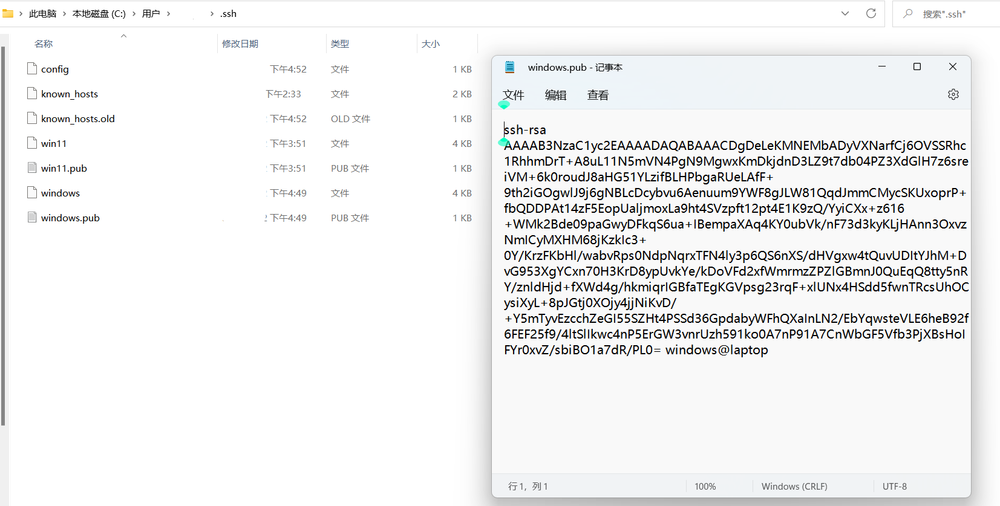

2. 连接代码托管平台

   1. 在头像下面点击设置，进入设置界面，再点击ssh公钥

      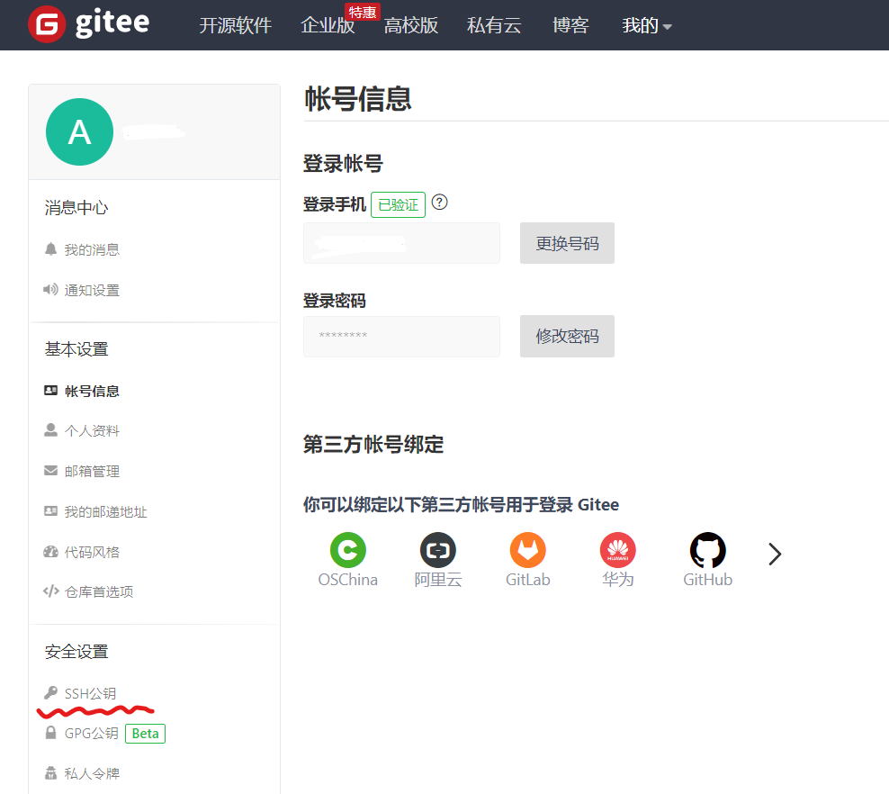
      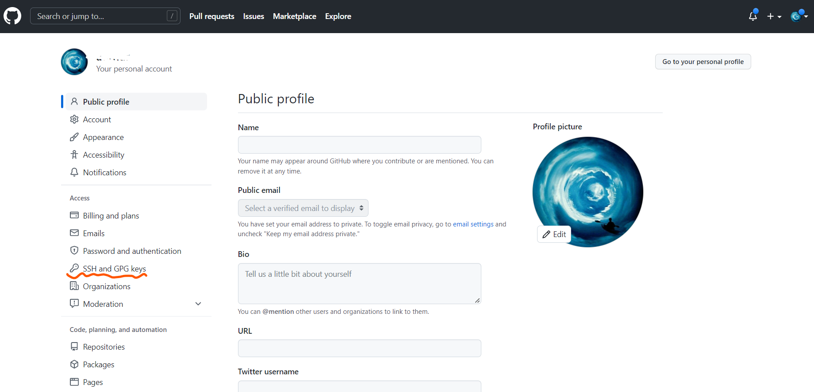
      
   2. 添加ssh公钥，随便起个名字，再把公钥的内容复制进去。

      

      

   3. 使用私钥连接平台


```
# 连接gitee
ssh -i ~/.ssh/windows -T git@gitee.com
```

```shell
C:\Users\agape\.ssh> ssh -i ~/.ssh/windows -T git@gitee.com
Warning: Permanently added the ECDSA host key for IP address '2**.*4.**.**3' to the list of known hosts.
Hi aornus! You've successfully authenticated, but GITEE.COM does not provide shell access.
```

```
# 连接 github
ssh -i ~/.ssh/windows -T git@github.com
```

```shell
C:\Users\agape\.ssh> ssh -i ~/.ssh/windows -T git@github.com
Warning: Permanently added the ECDSA host key for IP address '2**.*4.**.**3' to the list of known hosts.
Hi aornus! You've successfully authenticated, but GitHub does not provide shell access.
```

4. ssh连接成功后，在.ssh 下创建`config`，内容如下：

```xml
Host github.com
HostName github.com
User aornus(填你的github用户名)
IdentityFile ~/.ssh/windows
IdentitiesOnly yes

Host gitee.com
HostName gitee.com
User aornus(填你的gite用户名)
IdentityFile ~/.ssh/windows
IdentitiesOnly yes
```

### 同步·gitee

<div id= "gitee" >gitee国内速度很快，但内容会被审核，更新不方便 </div>

#### 建立仓库

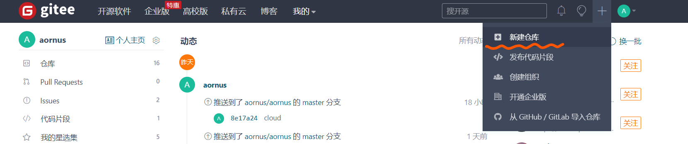

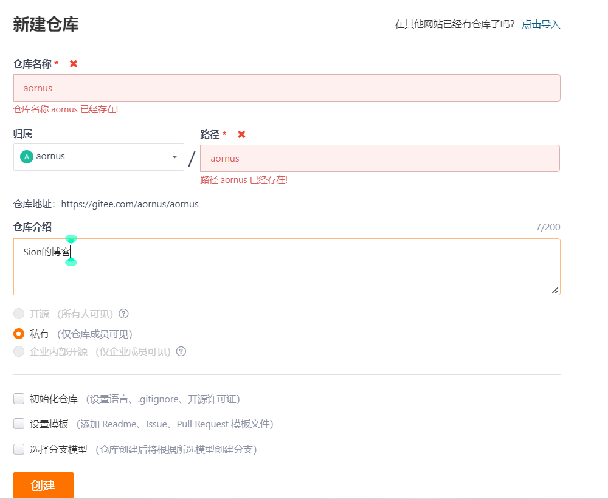

>  建站的话这里要填写你的用户名字，我已经有了一个了，所以会提示错误，因为gitee现在不支持自定义域名，填别的不能部署。

#### 克隆到本地

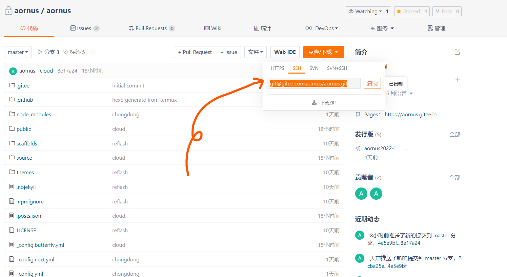

```
git clone git@gitee.com:aornus/aornus.git
```

然后把刚才的hexo博客文件，全部复制到这个目录下。以后就在这个目录里进行修改，编辑了。推荐用VScode作为编辑器，直接可以打开终端。

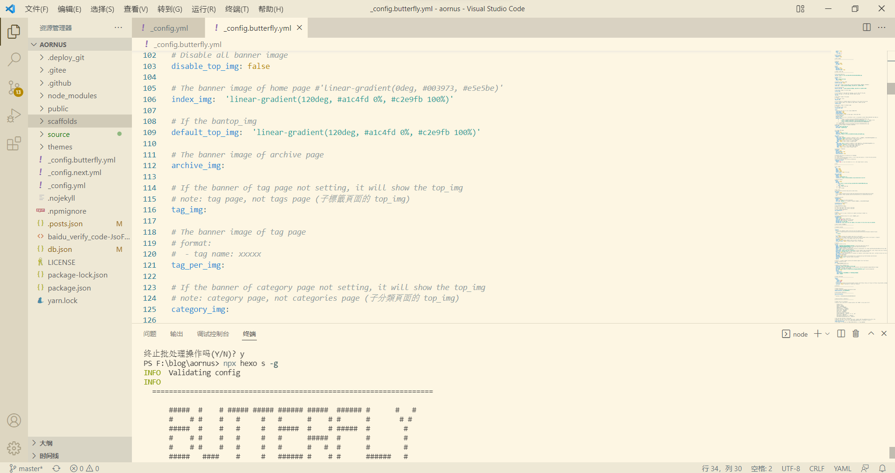

#### 推送到远端并部署

在你已经写作、修改完成所有文件后，就可以准备发布了

```shell
git add . ; git commit -m "hello" ; git push
```

推送到仓库里面后，开启paes服务

> 要实名认证，审核一般一个星期左右，文章内容会被审查，

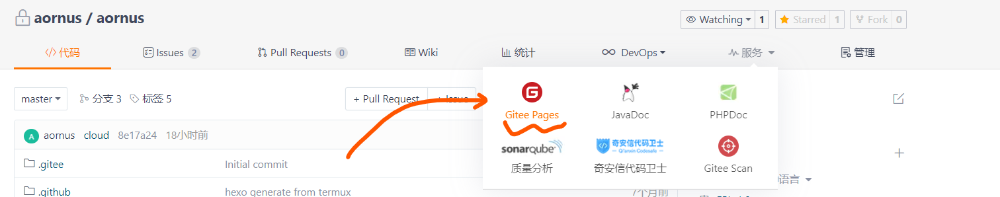

开启之后，每次修改完要到网页上进行手动更新（gitee自动部署的方法自行谷歌，利用github action的方法比较可行）

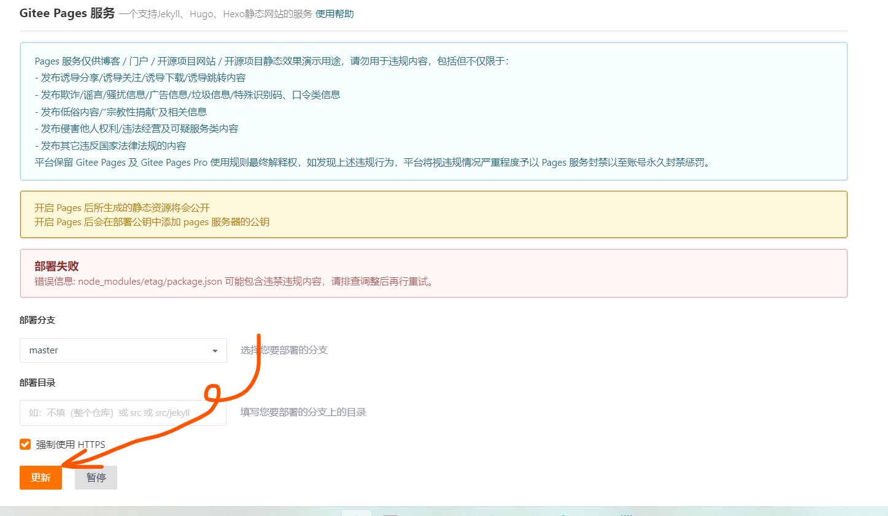

### 同步·github

<div id= "github" >github国内速度比较慢，但内容会不会被审核，更新方便。 </div>

#### 建立仓库

仓库名要写成用户名.github.io

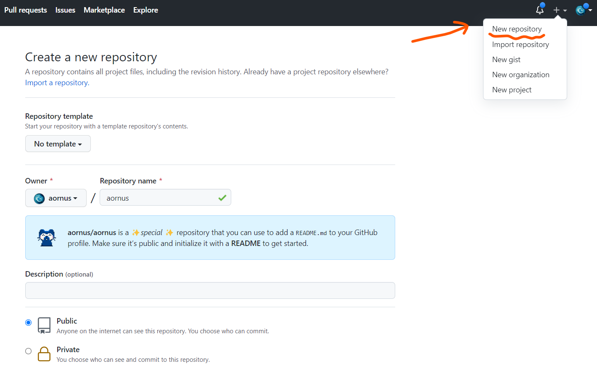

#### 克隆到本地

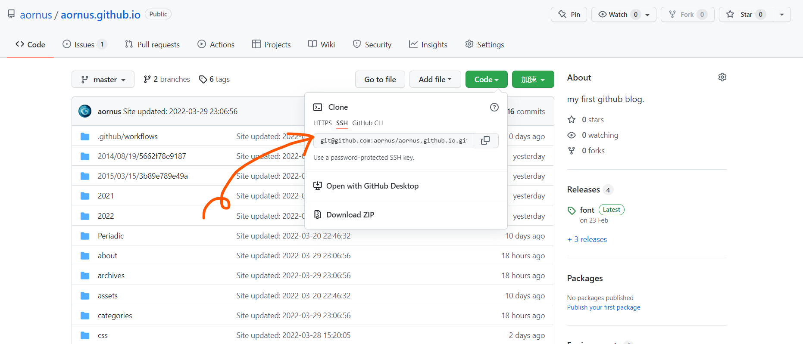

然后把刚才的hexo博客文件，全部复制到这个目录下

```shell
git add . ; git commit -m "hello" ; git push
```

然后再新建一个pages分支（用master分支放源文件，pages分支部署）

```
# 创建一个名为pages的分支，并切换到这个分支
git checkout -b pages
# 将分支推送到远端，里面的文件是master的复制
git push origin pages
# 切换回主分支：
git checkout master
```

#### hexo一键部署

1. 安装 [hexo-deployer-git](https://github.com/hexojs/hexo-deployer-git)。

```
$ npm install hexo-deployer-git --save
```

1. 修改配置。

```
deploy:
  type: git
  repo: https://github.io/aornus/aornus.github.io
  branch: pages
  message: from hexo deploy(随便写)
```

| 参数      | 描述                                                         | 默认                                                         |
| :-------- | :----------------------------------------------------------- | :----------------------------------------------------------- |
| `repo`    | 库（Repository）地址                                         |                                                              |
| `branch`  | 分支名称                                                     | `gh-pages` (GitHub) `coding-pages` (Coding.net) `master` (others) |
| `message` | 自定义提交信息                                               | `Site updated: {{ now('YYYY-MM-DD HH:mm:ss') }}`)            |
| `token`   | Optional token value to authenticate with the repo. Prefix with `$` to read token from environment variable |                                                              |

生成站点文件并推送至远程库：

```shell
hexo clean && hexo deploy
```

#### githubpages部署

上面步骤作为完后，再仓库设置中将默认分支设置为`_config.yml`配置中的分支名称。稍等片刻，然后站点就会显示在您的Github Pages中。

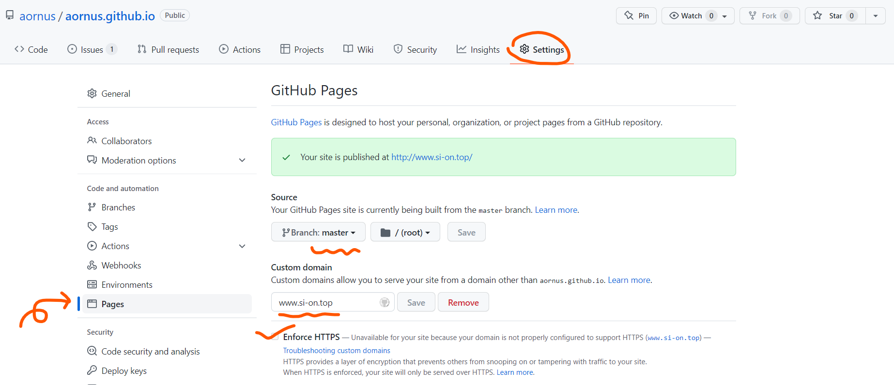

> 因为我之前不会弄双分支，所有这里是用的master分支，另外github可以自定义域名，这个域名是我买的。
>
> 如果你按部就班的做，这里应该这样填：部署到`pages`分支，域名是：用户名.`github.io`。

#### .nojekyll问题

可能你不会遇到这个问题，但我在后来换到windows上后，恢复时死活不能部署。看了action的记录才发现：这个问题是因为github的pages服务默认是选用jekyll作为框架的，用jekyll肯定不能编译hexo博客了，**官方提供了一种方法来解决：在博客目录里添加一个`.nojekyll`文件。**

先在source下创建这个空文件(没有内容)，然后在`_config.yml`里的`Include / Exclude file(s)`选项下添加这个文件：

```css
# Include / Exclude file(s)
# include:/exclude: options only apply to the 'source/' folder
include:
  - .nojekyll
exclude:
ignore:

```

然后再在deploy的设置里添加一个识别隐蔽文件的选项： `ignore_hidden: false`

```
deploy:
  type: git
  repo: https://github.com/aornus/aornus.github.io.git
  branch: master
  ignore_hidden: false
```

最后hexo三连，就可以愉快的部署了😊。

### 快速恢复部署

如果你转移了设备，或者不小心删除了文件。恢复部署似乎很麻烦，这篇文章[🌪️](https://si-on.top/2021/12/19/269f4f784bc3/)将主要的命令与步骤总结，可以大大节省你的时间。

[^1]:[Git-简明教程](https://github.com/rogerdudler/git-guide/issues)
[^5]:[hexo官方建站指南](https://hexo.io/zh-cn/docs/setup)
