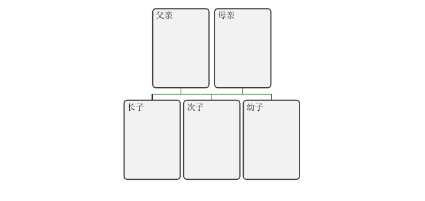
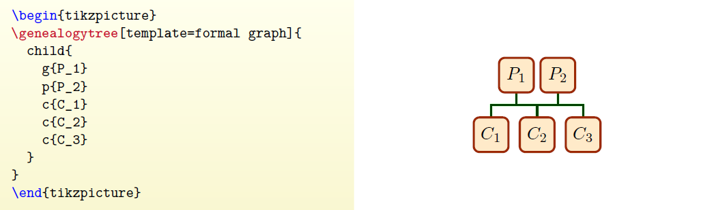
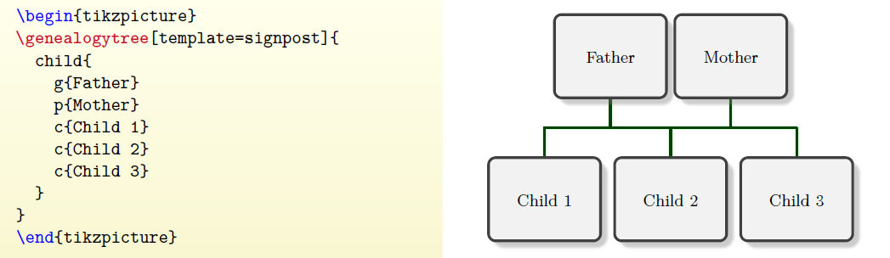
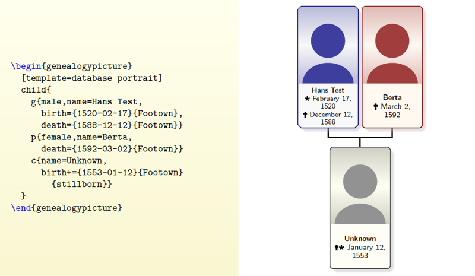
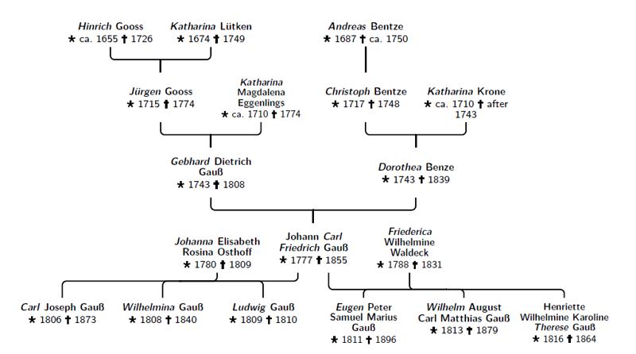
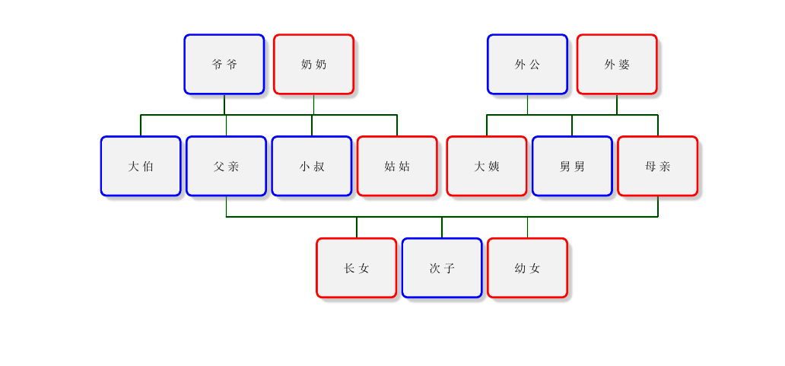
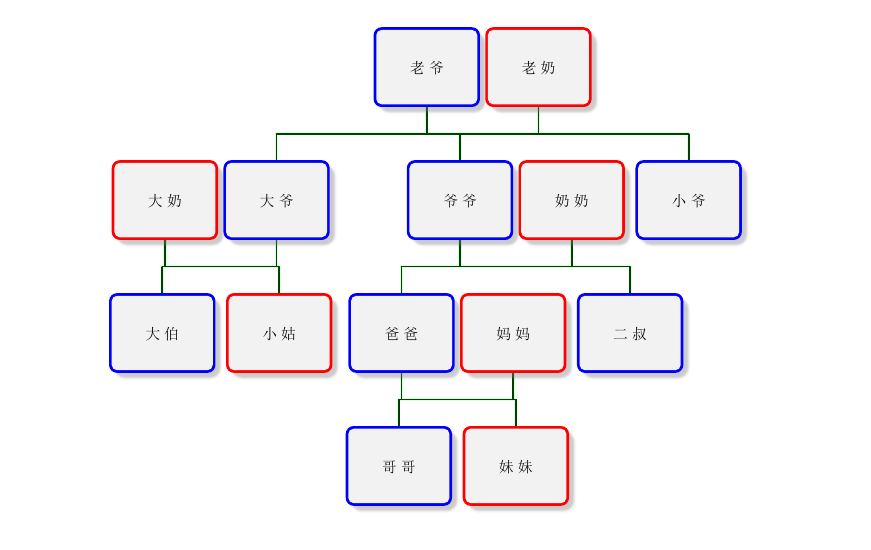
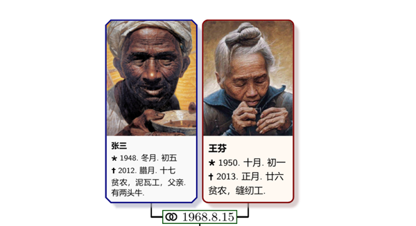
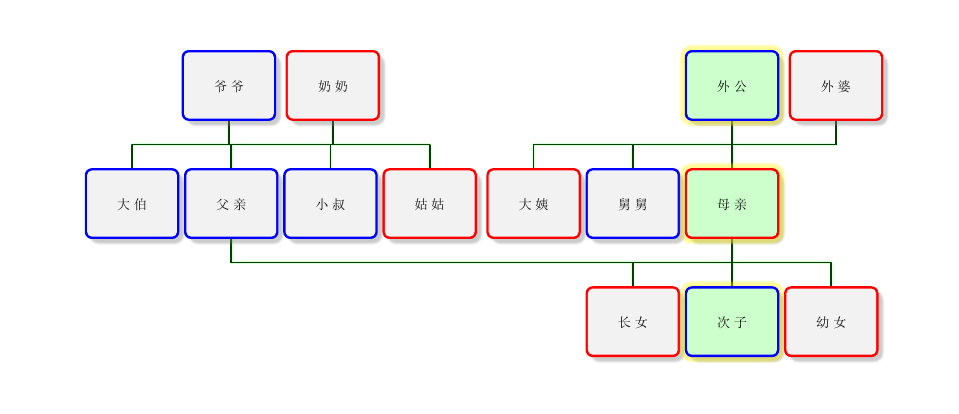
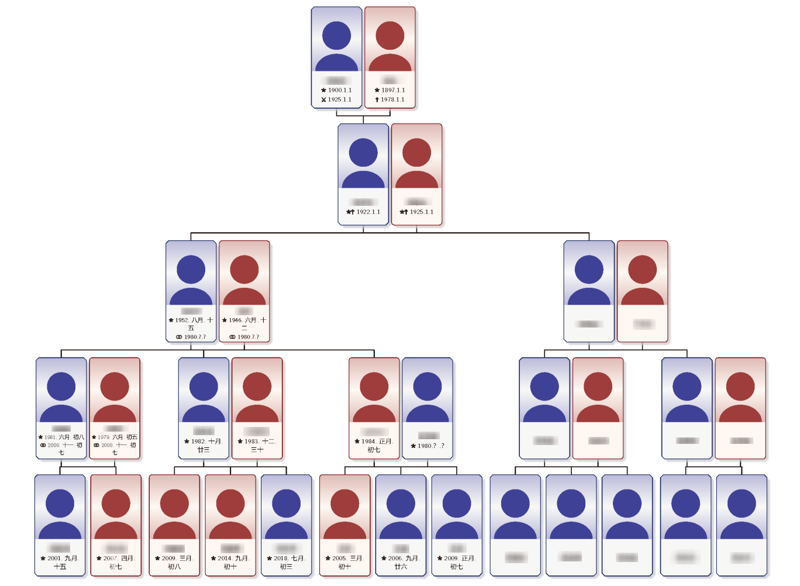

由德国教授Dr.Dr.Thomas F. Sturm 历时九年开发，还在持续更新的宏包–**genealogytree[^1]** ，简单快速，是绘制家谱图的不二之选。

# 准备

* $\LaTeX$编译环境
* 一张家谱的草稿(至少应该收集了名字、性别、生卒年等)

为什么要用这个宏包？

在$\LaTeX$使用现有的工具创建一个子母图很简单(比如利用数学树宏包)，但对医药科学、社会科学的研究者而言，用这样的工具去绘制一个家谱图却并不那么容易，原因很简单：一般的工具只给子图提供了一个母节点！

按照逆推的逻辑，一个谱系可以从一个孤立的(individual)的人开始，一步步向上展现其祖辈，但即使是最小的家庭也必然包含**父亲、母亲**和几个**孩子**，所以只用一个节点是不可能完整的表达出谱系关系的，这正是一般的工具所不能完成的，而**genealogytree**恰恰提供了这种(denoted)谱系图像的简单绘制命令，所以我们使用这个宏包来优化这个过程。

## 定义

对于家谱图而言，其基本结构为结点与线的有规律的结合，并且没有环状结构环，我们不妨借用图论里的定义[^2]：把一个家谱图称之为**根树**，把入度为零的节点称为**树根**（即辈分最大的成员），出度为零的节点称为**树叶**（即辈分最小的成员），其余点称为**内点**。

不过这样的叫法有些不雅，我还是自己起名字吧。

家谱图称为**谱树**，每个成员称为**节点**，树根称为**源节点**，内点统称为**节点**，树叶称为**叶节点**。把由一个源节点和若干个叶节点组成的谱树称为**最小谱树**，谱树之间的关系用**母谱树、子谱树**来表示，节点之间的关系用**子节点**，**母节点**，**平节点**来表示。

在谱系图中，以家庭为单位分析起来更为方便，一个家庭往往包含了父母及孩子，而其又必定是由父亲或母亲作为该家庭(相当于一个最小谱树)的源节点，因而我们可以将这样的一个最小谱树的源节点称做–**G(Genealogy)节点** 。

# 最小示例

> **genealogytree**宏包载入了`tcolorbox`[^3]中的样式及其额外的库、和`tikz`的箭头、样式库。

通过上面定义我们可以很自然的分析出来：一个完整的家谱图由若干个最小谱树连接而成。

宏包作者也是这样想的，但略有不同，下面是一个最小示例，请注意其中的g节点。

```tex
\documentclass{ctexart}
\usepackage[all]{genealogytree}
\begin{document}
	\section{最简示例}
		\begin{tikzpicture}
		\genealogytree{
			parent{
                g{长子}
                c{次子}
                c{幼子}
                p{父亲}
                p{母亲}
			}
		 }
		\end{tikzpicture}
\end{document}
```



仔细观察一下这个最小示例可以发现，这个**家庭**中，**父亲、母亲**用“p”(parent)来代表，两个**孩子**用“c”(child)来表示，余下一个用“g”来表示，这个“g”显然不是源节点，但这与我们的定义并不相悖，因为这个谱树是一个最小谱树，其结构为**向上**追溯，那么倒过来看，这个g节点仍旧可以看作源节点，父母可以看作叶节点。当需要往下追溯时，我就需要用g节点来指定父亲或者母亲。

# 样式与标签

在该宏包最为令我惊喜的就是内建了很多标签与样式，通过这些样式的不同组合，很快就可以画一个看起来很NB家谱图。

## 样式

针对谱图的样式，提供了一系列模板来简化流程，当然也可以自由的定义。

通过使用`/gtr/temple`来调用预设的样式，使用`template= formal`来定义，比如通过选“template=signpost”，可以把谱系图展现的比较紧凑。具体样例如下：

1. formal graph 简图

   

2. signpost 

   

3. database portrait 人像数据型

   

4. database traditional 传统数据型

   

## 标签

针对每个谱图中的节点，提供了一系列标签，通过这些标签，可以很轻松的把一个成员的信息描述清楚。比如指定性别，男性用“**male**”，女性用“**female**”指定之后，在某些样式里就会有颜色的区分等等。

下面我举一个稍稍复杂的例子，使用了signpost样式和一些标签：

```tex
\begin{tikzpicture}
\genealogytree[template=signpost]{
	parent{
			g[female]{长女}
			c[male]{次子}
			c[female]{幼女}
		parent{		%父亲的家庭
            c[male]{大伯}
            g[male]{父亲}	
            g[male]{小叔}
            c[female]{姑姑}
            p[male]{爷爷}
            p[female]{奶奶}
				}
		parent{		%母亲的家庭
            c[female]{大姨}
            c[male]{舅舅}
            g[female]{母亲}	
            p[male]{外公}
            p[female]{外婆}
				}
		}
	}
\end{tikzpicture}
```



在此例中，每个家庭里按照年龄大小进行排序的，父亲、母亲都用了各自的“parent”环境，都用了“g”节点进行连接，性别也都指定明确，写起来是不是很简单呢。

parent环境是指定了**节点的母节点**，是一种自下而上的结构，最下面一级是源节点及其平级的平节点，辈分从小到大排列。

Child环境是指定了**节点的子节点**，是一种自上而下的结构，最下面一级是叶节点，辈分从大到小排列。

有想法的同学可能已经注意到了：**parent环境是可以嵌套的**。

那么岂不是可以多嵌套几个，追溯到太太太太…爷爷了，没错，确实可以这样做。事物往往具有对称性，在这里**child**也是个环境，也可以进行**嵌套**，所以，可以准备给自己的孙子、重孙们起名字了，比如：

```tex
\begin{tikzpicture}
	\genealogytree[template=signpost]{
		child{
			g[male]{老爷}
			p[female]{老奶}
			child[id=大爷家]{
				p[female]{大奶}
				g[male]{大爷}
				c[male]{大伯}
				c[female]{小姑}
			}
			child[id=爷爷]{
				g[male]{爷爷}
				p[female]{奶奶}
				child[id=我家]{
					g[male]{爸爸}
					p[female]{妈妈}
					c[male]{哥哥}
					c[female]{妹妹}
				}
				c[male]{二叔}
			}
			c[male]{小爷}
		}
	}
\end{tikzpicture}
```



啊呀！不好！跑题了，回到标签上来。

其实也没啥好介绍的，直接来例子吧：

```tex
\gtrset{date format=yyyy.m.d}
%这个日期格式比较适合中国农历
\begin{genealogypicture}[
	processing=database,
	template=database portrait,
	database format=medium no marriage,
	list separators hang,place text={\newline}{},
box={fit basedim=9pt,boxsep=2pt,segmentation style=solid,
	halign=left,before upper=\parskip1pt,\gtrDBsex },
	label database options={place text={(}{)}},
	label options={fill=white,
	node font=\footnotesize,
	inner sep=0.5mm,draw=green!30!black},
	]
	child[id=SmitBowd1742,family database={marriage={1968-8-15}{南阳}}]{
	g[id=张三]{
		male,
		name = {张三},
		shortname={三儿},
		image={fuqin.jpg},
		birth = {1948-冬月-初五}{南阳},
		death = {2012-腊月-十七}{南阳},
		profession={贫农，泥瓦工，父亲},
		comment = {有两头牛},
		age = 63,
		relation = ancestor,
		}
	p[id=老奶]{
		female,
		name = {王芬},
		shortname={芬子},
		image={muqin.jpg},
		birth = {1950-十月-初一}{南阳},
		death = {2013-正月-廿六}{南阳},
		profession={贫农，缝纫工},
		relation = ancestor,
	}
}
\end{genealogypicture}
```




## 内部样式

在绘制好上面的谱图后，如果我们想要改变某个节点的位置，比如想要强调（emphasize）某个人，让他置于中间位置，可以使用`/gtr/pivot`，这个选项会将修饰的节点在**母节点**或**平节点**中居中，如果一系列连续的结点都添加了这个选项，那么就会呈现高亮的线性排布，与此同时，周围的节点都会自动腾出位置。对默认的效果不满意的话，可以通过`/gtr/box`来自定义(来自tcolorbox的定义)，比如，我们要生成一个蓝色发光(glow)背景，可以这样写：

```tex
g[pivot,box={colback=blue!20,no shadow,fuzzy halo},female]{三毛}
```

这样一个一个写标签显然太麻烦，我们可以通过定义`\gtrset`来简化这个步骤：

```tex
\gtrset{gaoliang/.style={pivot,box={colback=blue!20,no shadow,fuzzy halo}}}
```

这样以后就可以用`gaoliang`这个标签来更快速的定义了，可以很快的表现出来清晰的谱系关系：

```tex
\begin{tikzpicture}
	\gtrset{gaoliang/.style={pivot,box={colback=green!20,fuzzy halo}}}
	\genealogytree[template=signpost]{
		parent{
			g[female]{长女}
			c[gaoliang,male]{次子}
			c[female]{幼女}
			parent{		%父亲的家庭
				c[male]{大伯}
				g[male]{父亲}	
				c[male]{小叔}
				c[female]{姑姑}
				p[male]{爷爷}
				p[female]{奶奶}
			}
			parent{		%母亲的家庭
				c[female]{大姨}
				c[male]{舅舅}
				g[gaoliang,female]{母亲}	
				p[gaoliang,male]{外公}
				p[female]{外婆}
			}
		}
	}
\end{tikzpicture}
```



### 我的家谱

过年时候心血来潮，搜集了家里的信息，绘制成了这样一幅家谱，说实话，画图很简单，就是信息收集的时候不好意思去要，照相的话更是有些手足无措，明年过年回去再慢慢添加吧。



[^1]:宏包的地址：https://www.ctan.org/pkg/genealogytree
[^2]:在图论中，用来描述事物或对象之间联系或相互作用状态的一个概念，称为“图”， 不含圈的图称为无圈图，树是连通的无圈图。
[^3]:[Thomas F. Sturm. The tcolorbox package. Manual for version 4.51. June 14, 2021.](https://mirror.ctan.org/macros/latex/contrib/tcolorbox/tcolorbox.pdf.)

