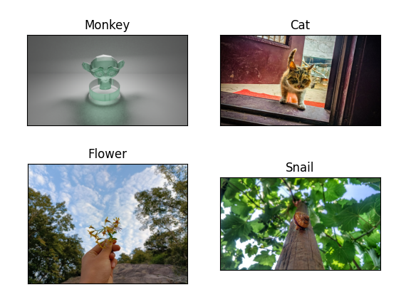
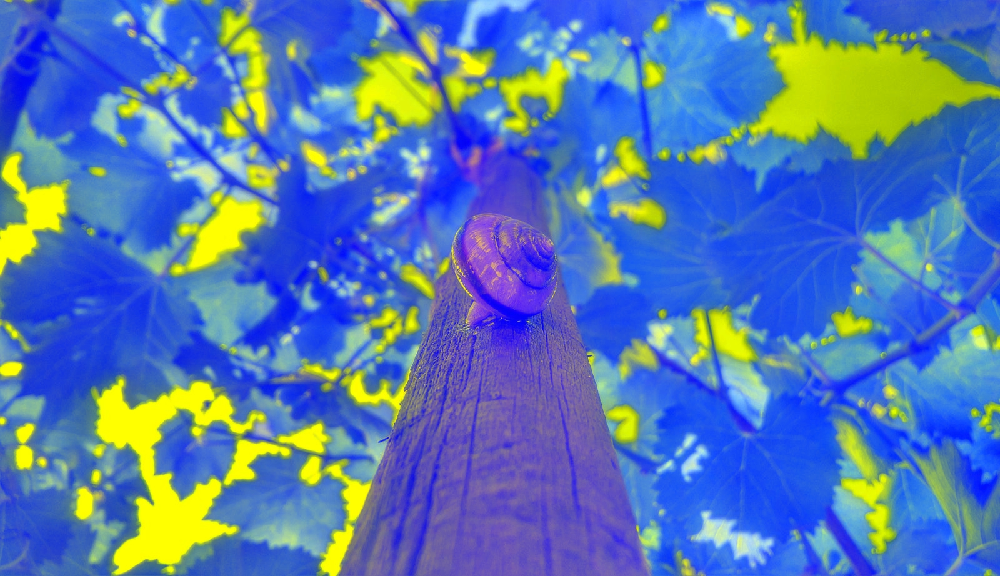
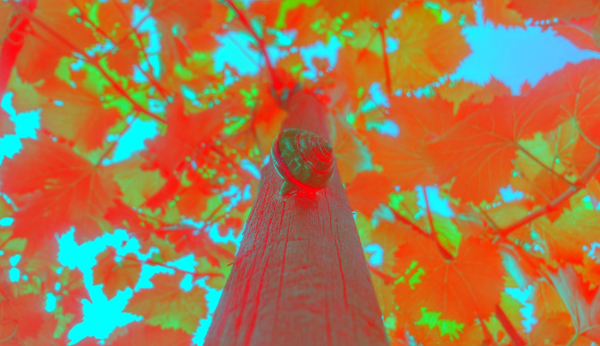
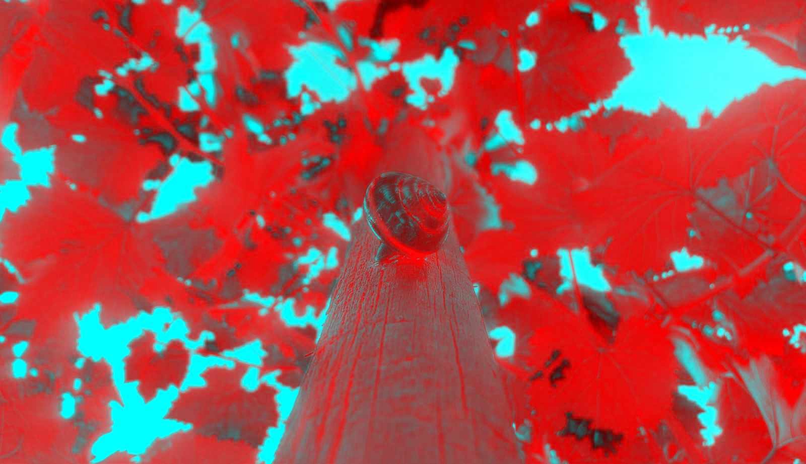
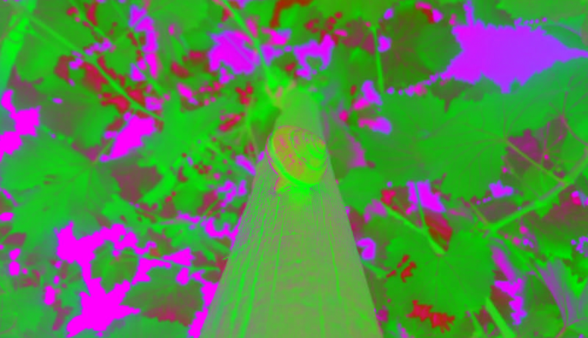
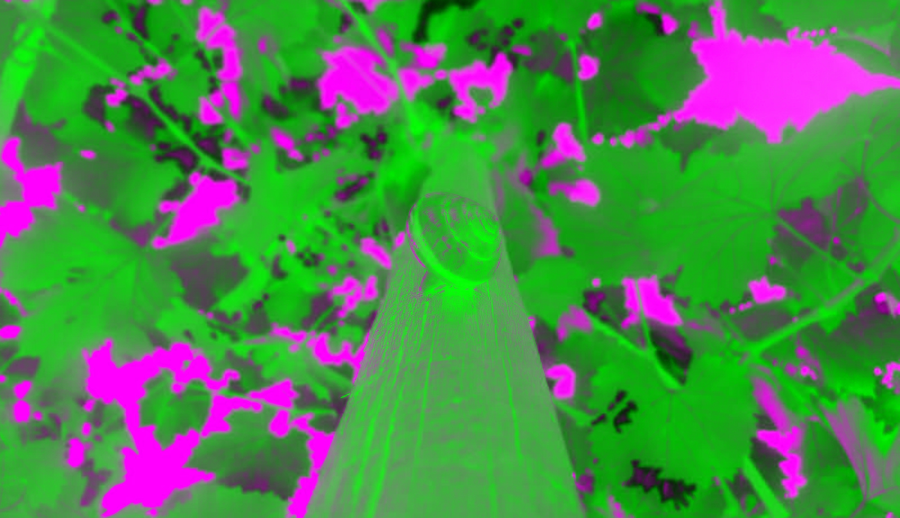
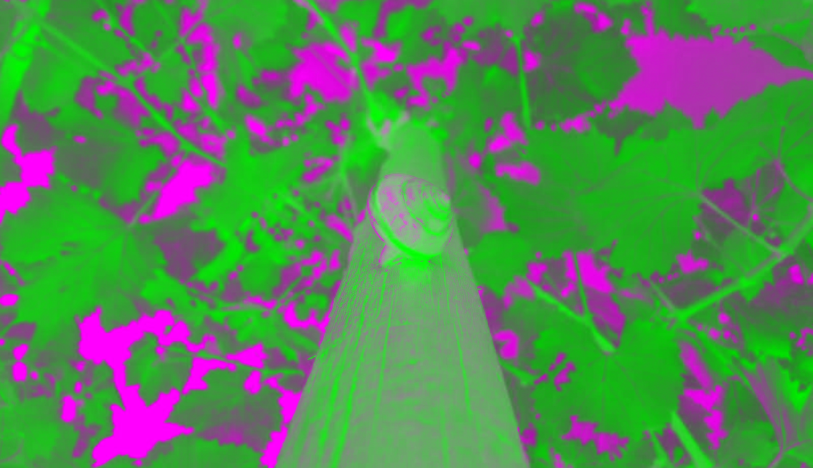

> 本文为紫晶计划-铁石计划-笔尖学术分支,目的是通过python实现盲水印,以达到维护版权,加密图片 ~~乃至提高国家安全~~的美好愿景.

用python+opencv进行图像处理,单纯做滤镜也挺有意思的，看来编程也并没有那么阳春白雪。
## 基本操作
python基本操作:没有,基本上都能直接看懂,可以直接模仿.
### 三大基本库
安装:有空补上---
```bash
sudo apt-get install python3 python3-pip
```
文件开始要引用库,这样写:
```python
# -*- coding:utf-8 -*-
#--2022-4-12_第一个python程序_bySion

import cv2
import numpy as np
import matplotlib.pyplot as plt
```
#### 一些基本操作:
1. 使用opencv=matplt来并排显示图片:
```python
#-----显示图片
import cv2
import numpy as np
import matplotlib.pyplot as plt
img1 = cv2.imread("1.png")
img1 = cv2.cvtColor(img1,cv2.COLOR_BGR2RGB)

img2 = cv2.imread("cat.jpeg")
img2 = cv2.cvtColor(img2,cv2.COLOR_BGR2RGB)

img3 = cv2.imread("flower.jpg")
img3 = cv2.cvtColor(img3,cv2.COLOR_BGR2RGB)

img4 = cv2.imread("snail.jpeg")
img4 = cv2.cvtColor(img4,cv2.COLOR_BGR2RGB)

titles = ['Monkey','Cat','Flower','Snail']


images = [img1,img2,img3,img4]
for i in range(4):
    plt.subplot(2,2,i+1),plt.imshow(images[i],'gray')
    plt.title(titles[i])
    plt.xticks([]),plt.yticks([])
plt.show()
```


2. 输出图像信息
```python
import cv2
import numpy as np

img = cv2.imread("snail.jpeg")
print("形状:", img.shape)
print("总像素数:", img.size)
print("数据类型:", img.dtype)
```
```bash
# 输出结果
形状: (922, 1600, 3)
总像素数: 4425600
数据类型: uint8
```

## 色彩空间
>待补充: 色彩空间的基本知识,来源,分类,例证,以及一些科学解释
### 图像加减运算
这一部分就是调整图像的亮度,使用opencv的`cv2.add, cv2.subtract,cv2.bitwise`(加法,减法,反色)函数,具体操作如下:
```python
import cv2
import numpy as np

adj = 101   # 调整系数(0,256) PS: 255是全白,小心别被亮瞎了*_*
img = cv2.imread("snail.jpeg")
i = np.ones(img.shape, dtype="uint8") * adj
plus = cv2.add(img, i)  # 加亮
sub = cv2.subtract(img, i)  # 减暗
bitwise = cv2.bitwise_not(img)  # 反色
cv2.imshow("original", img)
cv2.imshow("+", plus)
cv2.imshow("-", sub)
cv2.imshow("bit", bitwise)

# 控制窗口关闭的函数,按任意键摧毁所有窗口
# 如果为写成数字的话,则代表毫秒数,0代表除非键入字符,否则不关闭
# 比如cv2.waitkey(4200)代表窗口持续4.2秒后关闭
cv2.waitKey(0)
cv2.destroyAllWindows()
```
### 图像色彩分离
上文说过,彩色图像可以按照颜色分为三个通道:R,G,B,借助`cv2.split`,可以把图像的各个色彩通道分离出来,在通过`merge`可以把通道合并
> 好玩的地方来了,我们可以把反色后的图像与原图的RGB通道进行混合,得到意想不到的效果

```python
import cv2
import numpy as np

# 读取snail图像,并反色处理
img = cv2.imread("snail.jpeg")
bitwise = cv2.bitwise_not(img)

# 将原图与反色后的图像进行颜色分离
r1,g1,b1=cv2.split(bitwise)
r2,g2,b2=cv2.split(img)

# 合并颜色通道
m= cv2.merge([r1,g1,b1])
cv2.imshow("Merge",m)
cv2.waitKey(0)
cv2.destroyAllWindows()
```
实验表明在可以重复的情况下,一共可以组合出来 $6^3$ 种,但是我发现又很多不是太亮了就是太暗了,这里我找到了,几种还算不错的组合:主要是原图的两个通道加上反色图的一个通道
> 就感觉蓝色的那几个好看点,绿色的就跟春天的粉豆花一样

















## 图像变换
### (DFT)傅立叶变换
傅里叶变换主要是将时间域上的信号转变为频率域上的信号，用来进
行图像除噪、图像增强等处理,傅立叶变换的本质是: **把任何连续周期信号表示成（或者无限逼近）一系列正弦信号的叠加。**
> 随着域的不同，对同一个事物的了
解角度也随之改变，因此在时域中某些不好处理的地方，在频域就可以较为简单
的处理。同时，可以从频域里发现一些原先不易察觉的特征。

#### 理论基础
连续性函数在计算机中不好分析,我们把它转换成离散的就好分析了,盲水印其中一大算法主要进行的就是**离散傅立叶变换**
##### 一维离散
$$
f(u)=\frac{1}{n} \sum_{x=0}^{N-1}f(x) e^{\frac{-j2\pi u x}{N}}
$$
##### 二维离散
##### 三维离散
#### 代码实现
##### OpenCV 实现傅里叶变换
输入的图像需要先转成32位浮点数


### (DCT)离散余弦变换
### (DWT)离散小波变换