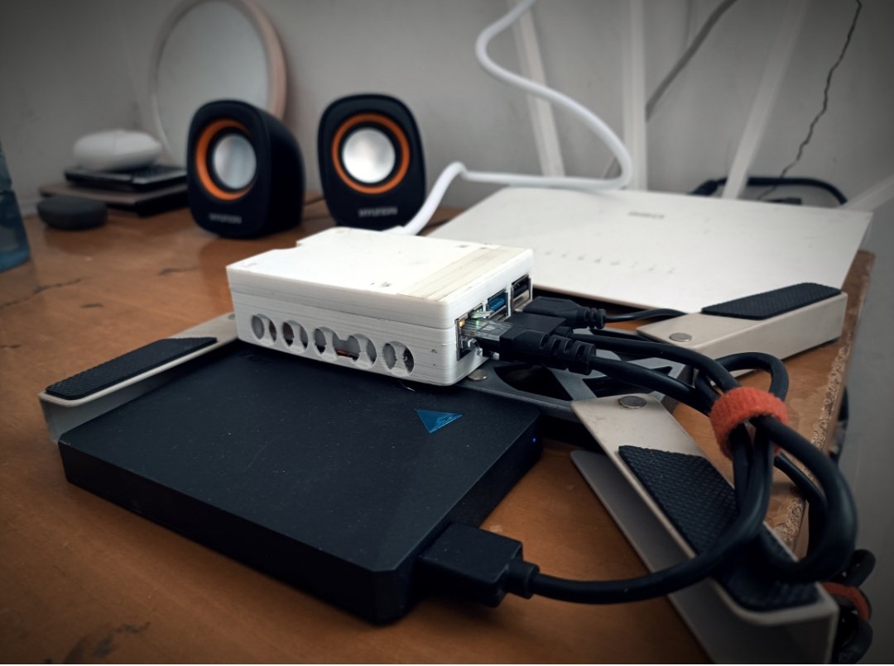

> <center>金就砺则利</center>
> <p align="right">——荀子</p>


<!-- @import "[TOC]" {cmd="toc" depthFrom=1 depthTo=6 orderedList=false} -->

<!-- code_chunk_output -->

- [文章痕迹](#-文章痕迹)
- [楔子](#-楔子)
- [安装与连接](#-安装与连接)
  - [官方镜像](#-官方镜像)
  - [第三方NAS系统](#-第三方nas系统)
  - [ssh连接](#-ssh连接)
- [换源](#-换源)
- [软件部署](#-软件部署)
  - [\*宝塔后台](#-宝塔后台)
  - [arozOS自编译](#-arozos自编译)
  - [\*OpenMediaVault安装](#-openmediavault安装)
- [内网穿透](#-内网穿透)
- [成果](#-成果)

<!-- /code_chunk_output -->



## 文章痕迹

<!-- timeline 2023-01-29-->
1. 安装原版系统，解决了连接问题
2. 安装OMV（失败）
<!-- endtimeline -->
<!-- timeline 2023-01-31-->
1. 安装了arozOS系统
2. 实现了内网穿透
3. 文章主体完成
<!-- endtimeline -->
<!-- timeline 2023-02-01-->
1. 润色文章
<!-- endtimeline -->


-----
## 楔子
春节期间拾掇了过去一年中各个设备上的照片，并转移到了家里专门备份的300G硬盘上，期间居然在十年前的一个1G内存卡发现了小时候的一部分照片，十分欣慰，原本以为永远找不到了。在整理完之后，又纠结了许久，终于下了狠心，**断舍离，脱离对物品的执着**！对把手机、相机都格式化了，新的起点，忘记过去吧！
又过了几天，想去回味回味，但觉着硬盘弄来弄去太麻烦，一旁正在认真吃灰的树莓派4B突然蹿入眼帘，emm，就决定是你了！
物品准备：
* 树莓派4B（32G的SD卡一张）
* \*一块冗余的硬盘
* \*散热风扇
* 连接线若干（网线、电源线、USB线+合理的排线）
## 安装与连接
### 官方镜像
最好的还是官方的，下载树莓派专用镜像烧录软件：

 https://downloads.raspberrypi.org/imager/imager_latest.exe

里面的系统是比较全的，完全不需要在网上找镜像，软件里包含的镜像主要有：

* Raspberry Pi (32/64)
* Ubuntu
* Manjaro
* RISC OS Pi
* 3d打印专用
* 媒体播放专用
* 家庭助手
* 其他特殊用途
* 自定义镜像
	
笔者觉得选择64位最简版本的`Raspberry Pi OS Lite (64-bit)`进行烧录就挺好，又快又不会有太多软件上的问题。
### 第三方NAS系统
ArozOS系统应该是除了OMV之外最好的，由于我安装OMV时失败了，故选择了这个系统，优点是非常简便，树莓派的安装镜像地址在仓库的读我文档里：

[tobychui/arozos: General purposed Web Desktop Operating Platform / OS for Raspberry Pis, Now written in Go! (github.com)](https://github.com/tobychui/arozos)


### ssh连接
烧录完成后，在SD卡boot分区新建文件为userconfig.txt，内容为:
```shell
pi:$6$Q7yQqYO94B9fI9jn$trNI8/yvcZ8WYleaYKN5qlrzQ3AhZXLZtcNkYJlSH16xGloh2ZiM4KeAay8GSBoQ09LZI/wMOxM3qeou7uZXq.
```
通过路由器管理面板找到树莓派的ip(笔者这里是直接网线连接的)，然后用电脑借助ssh连接，scp传递文件。
```shell
ssh pi@192.168.101.??
密码:raspberry
```
## 换源
一切正常的话，会进入到树莓派的终端，现在就可以自由操作了，第一步先解决网络情况:
1. 树莓派更换清华源(直接参考清华源的说明文档即可)

		[raspbian | 镜像站使用帮助 | 清华大学开源软件镜像站 | Tsinghua Open Source Mirror](https://mirrors.tuna.tsinghua.edu.cn/help/raspbian/)


2. 新增github临时hosts(救急用)

	[Github hosts地址](https://raw.hellogithub.com/hosts)


3. 更改DNS解析配置`/etc/resolv.conf`中的`nameserver`为`8.8.8.8`或其他大厂的DNS,不然之后内网穿透会报错。
3. VPN(特殊情形)
	1. 下载gephARMv7,并上传至树莓派(ssh附带的scp命令可以实现)
	2. 更改文件访问权限 `chmod u+x geph4-client-linux-armv7`
	3. 运行该程序 `./geph4-client-linux-armv7 connect --username xxx --password xxx --socks5-listen 0.0.0.0:9909` 
	4. 更改节点：先获取节点地址 `./geph4-client-linux-armv7 sync --password xxx --username xxx`  然后在结果中寻找节点地址，节点地址的形式：[xx-xx-xx.exits.geph.io](http://xx-xx-xx.exits.geph.io/)，头一个xx是国家代码。结束目前的迷雾通进程，用如下的命令重新运行一次：`./geph4-client-linux-armv7 connect --password xxx --username xxx --socks5-listen 0.0.0.0:9909 --exit-server "节点地址"`  
## 软件部署
### \*宝塔后台
一个简易又复杂的后台，集成了很多操作，点击鼠标即可完成快速安装各种项目。官方的跨平台自适应安装脚本如下：

```shell
sudo curl -sSO http://download.bt.cn/install/install_panel.sh && sudo bash install_panel.sh
```
### arozOS自编译
```shell
curl -L https://raw.githubusercontent.com/tobychui/arozos/master/installer/install_for_pi.sh | bash
```
由于自编译时需要安装Go框架，但网络问题无法解决(谷歌连接太慢)，遂放弃自编译，选择镜像进行烧录(见§第三方NAS系统)。

在SD卡刷镜像安装成功后，升级问题又难以解决，现在的固件时1.120，最新的beta时2.10，更新是OTA模式的，需要借用作者开发的一个名为[aroz-online/launcher: The ArozOS launcher for over the air (OTA) updates (github.com)](https://github.com/aroz-online/launcher)的工具，但我`chmod 775`后出现`Segmentation fault`错误，可能是用户组的问题，无妨无妨，1.120够用了。
### \*OpenMediaVault安装
openmediavault 是一个基于 Debian 的完整网络附加存储 （NAS） 解决方案。
-   适用于 x86-64 和 ARM 平台
-   具有完整的 Web 管理界面
-   启用后可以通过 SSH 进行控制
-   可以使用各种不同的协议访问文件存储，例如 作为 FTP、SMB/CIFS 或 NFS，对于用户和组，也可通过访问权限管理进行控制
OpenMediaVault主要用于家庭环境或小型家庭办公室，但不限于这些场景。这是一个简单易用的开箱即用的(out-of-the-box)解决方案，每个人都可以安装和管理，无需网络和存储系统的专家级知识。该系统建立在模块化设计之上，安装基本系统后可以通过插件轻松扩展。其他第三方 插件可通过[OMV-Extras存储库](http://omv-extras.org/)获得。

参考官方安装方法:[在 Debian 上的安装 — openmediavault 6.x.y 文档](https://docs.openmediavault.org/en/latest/installation/on_debian.html)与清华源帮助:[OpenMediaVault | 镜像站使用帮助 | 清华大学开源软件镜像站 | Tsinghua Open Source Mirror](https://mirrors.tuna.tsinghua.edu.cn/help/openmediavault/)
手动安装 openmediavault 密钥环：
```bash
apt-get install --yes gnupg
wget -O "/etc/apt/trusted.gpg.d/openmediavault-archive-keyring.asc" https://packages.openmediavault.org/public/archive.key
apt-key add "/etc/apt/trusted.gpg.d/openmediavault-archive-keyring.asc"
```
添加包存储库：
```bash
cat <<EOF > /etc/apt/sources.list.d/openmediavault.list
deb https://mirrors.tuna.tsinghua.edu.cn/OpenMediaVault/public shaitan main
deb https://mirrors.tuna.tsinghua.edu.cn/OpenMediaVault/packages shaitan main
## Uncomment the following line to add software from the proposed repository.
# deb https://mirrors.tuna.tsinghua.edu.cn/OpenMediaVault/public shaitan-proposed main
# deb https://mirrors.tuna.tsinghua.edu.cn/OpenMediaVault/packages shaitan-proposed main
## This software is not part of OpenMediaVault, but is offered by third-party
## developers as a service to OpenMediaVault users.
# deb https://mirrors.tuna.tsinghua.edu.cn/OpenMediaVault/public shaitan partner
# deb https://mirrors.tuna.tsinghua.edu.cn/OpenMediaVault/packages shaitan partner
EOF
```
安装 openmediavault 软件包：
```bash
export LANG=C.UTF-8
export DEBIAN_FRONTEND=noninteractive
export APT_LISTCHANGES_FRONTEND=none
apt-get update
apt-get --yes --auto-remove --show-upgraded \
    --allow-downgrades --allow-change-held-packages \
    --no-install-recommends \
    --option DPkg::Options::="--force-confdef" \
    --option DPkg::Options::="--force-confold" \
    install openmediavault-keyring openmediavault
    
omv-confdbadm populate
```
正常的话，到这一步就结束了。但谁让我命途多舛，偏偏又遇到了一个问题，而且搜了好久都找不到解决办法，遂放弃OMV，如有人能解决，我感激不尽。
 ```bash
> Errors were encountered while processing:
 proftpd-core
 proftpd-mod-vroot
 openmediavault
 proftpd-mod-crypto
 proftpd-mod-wrap
 proftpd-basic
 ```
## 内网穿透
通过Cloudflare的`cloudflared`工具实现内网穿透。具体步骤如下：
1. 打开域名管理页下的access，提示转移到`Zerotrust`,在`Zerotrust`的`Access-Tunnels`下新建`tunnel` (隧道)。
2. 填写隧道名称，选择操作系统(树莓派4B2023年系统，选择`Debian-arm64-bit`)，生成安装代码(代码由三部分组成：下载、安装、自动配置，最主要的是最后一部分)。
3. 由于网络问题，可以用其他方式下载`cloudflared-linux-amd64.deb`然后上传并安装，最后执行服务安装指令。
这样以后，就可以在小小的树莓派上安装各种服务，大玩特玩了，跟VPS一样的体验！
## 成果
1. 低成本NAS
2. 小小的、低速的、无成本的、数据由自己掌握的云端服务器


