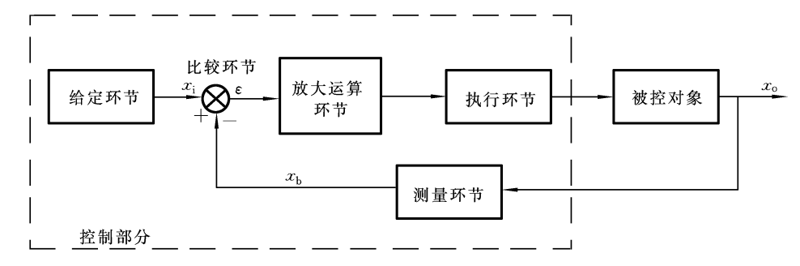

# 绪论

控制的定义：**施加某种操作于对象,使其产生所期望的行为**。核心是控制对象、控制目标、控制手段，亦即系统、输出、输入。

自动控制：**由控制装置自动完成,无需人的参与**，主要通过反馈来调节偏差，过程如下:

> ​	检测偏差$\Rightarrow$实施控制$\Rightarrow$ 消除偏差

控制论实质上是研究**广义系统的动力学问题。**研究的是机械工程广义系统在一定的外界条件(即输入或激励、干扰)作用下,从系统的一定的初始状态出发,所经历的由其内部的固有特性(即由系统的结构与参数所决定的特性)所决定的整个动态历程。

**研究任务**：

1. 系统分析问题:已知系统和输入,求**输出**(或响应),并通过响应来研究系统本身的问题。
2. 最优控制问题:已知系统和理想输出,求最优**输入**,使实际输出满足要求。
3. 最优设计问题:已知输入,设计**系统**,使输出满足要求。

**反馈**：系统的输出不断地、直接或间接地、全部或部分地返回,并作用于系统。

典型<u>闭环反馈控制系统</u>的的系统框图：

控制系统的基本要求

* 稳定性 | **稳定性是控制系统正常工作的首要条件。**

  系统动态过程的振荡倾向及其恢复平衡状态的能力。

* 精确性

  在调整过程结束后输出量与输入量之间的偏差程度。

* 快速性

  输出量和输入量产生偏差时，系统消除这种偏差的快慢程度。快速性表征系统的动态性能。

# 系统的数学模型

传递函数定义：**零初始条件下,线性定常系统输出的拉氏变换与输入的拉氏变换之比。**
$$
\begin{aligned}
G(s) 
&=\frac{X_o(s)}{X_i(s)}=\frac{b_{0}\left(s-z_{1}\right)\left(s-z_{2}\right) \cdots\left(s-z_{m}\right)}{a_{0}\left(s-p_{1}\right)\left(s-p_{2}\right) \cdots\left(s-p_{n}\right)}
\end{aligned}
$$

> 传递函数的分母反映系统本身与外界无关的固有特性, 传递函数的分子反映系统与外界的联系;

零点：使分子为零的点，影响瞬态响应曲线的形状,不影响稳定性。

极点：使分母为零的点， 微分方程的特征根，决定系统瞬态响应的收敛性,决定稳定性。

# 时域分析

时间响应：**系统的响应(输出)在时域上的表现形式。系统在外界(输入或扰动)的作用下,从一定的初始状态出发,所经历的由其固有特性所决定的动态历程。**

时间响应的组成：**零状态响应与零输入响应**。

# 频域分析

频率响应:**系统对谐波输入的稳态响应。**

频率特性的组成：幅频特性与相频特性。

# 系统的稳定性

稳定条件：线性定常系统是否稳定,完全取决于**系统的特征根**。

**相位裕度**$γ$：在$ω=ω_c$时,$G_K(jω)$的相频特性$φ(ωc)$距-180°线的相位差。

 **幅值裕度**$K_g$： 在$ω=ω_g$时,开环幅频特性$│G_K(jω_g)│$的倒数。

# 应试区域

## 题型：

1. 选择 15

2. 简答 3～4 基本概念，亦即本文目的所在。

3. 计算（下划线的是从作业中出，99%的可能性）

   1. <u>根据机械系统建立数学模型，并求出传递函数...</u>
   2. <u>根据电路系统建立数学模型，并求出传递函数...</u>
   3. <u>传递函数方框图的简化，并求出传递函数</u>
   4. <u>Nyquist图绘制</u>
   5. <u>Bode图绘制</u>
   6. 系统的稳定性判据

4. 综合理解题（自拟）：结合所学内容谈谈对控制工程以及其研究方法的理解。

   控制工程就是研究系统，输入，输出关系的。
   
   研究的一般步骤为：首先根据系统及元件各变量之间所遵循的物理规律列写出相应的微分方程与传递函数，建立模型。然后进行时域分析或者频域分析，分析出两种情形下的性能指标。最后根据分析结果，与系统的稳定条件，利用Routh判据，Bode稳定判据，Nyquist稳定判据，来判断系统的稳定性，最后进行校正。
