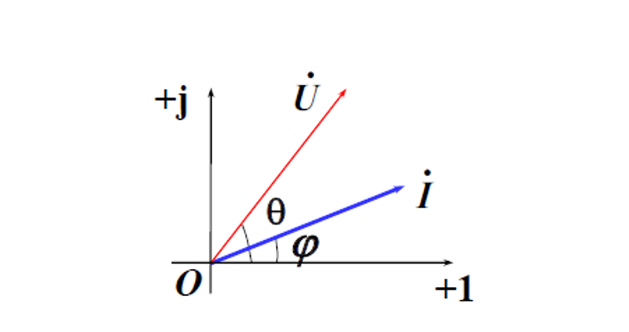
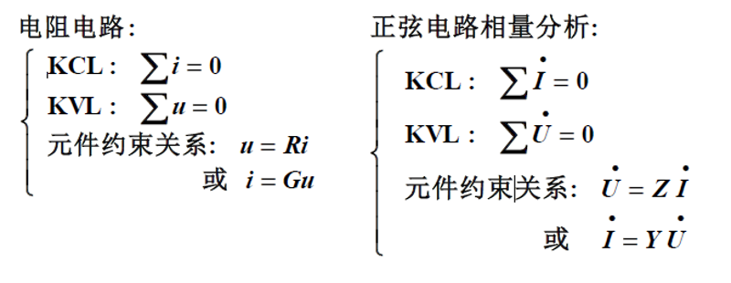
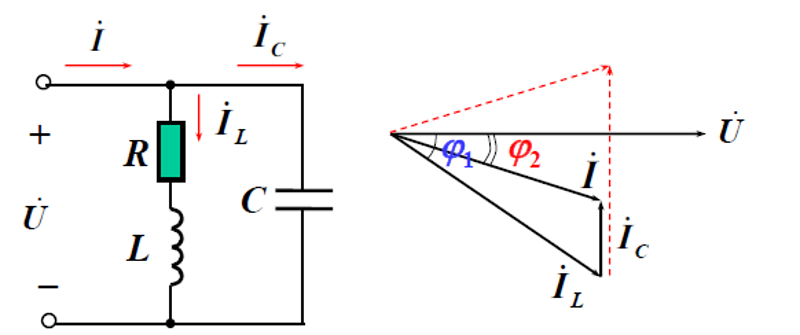

# 相量法

## 复数

| 形式 | 表达式 |
| :------------: | :---------------------------------: |
| 代数形式       | $F=a+jb$                            |
| 三角形式       | $F=\lvert F\rvert (\cos\theta + j \sin \theta )$ |
| 指数形式       | $F=\lvert F\rvert e^{j\theta }$   |
| 极坐标形式     | $F=\lvert F\rvert \angle \theta $ |

> 其中$|F|=\sqrt{a^2+b^2}\quad θ=arctan\frac{b}{a}$, **欧拉公式**：
> $$
> e^{i\theta}=\cos\theta + i \sin\theta=1\angle\theta
> $$

### 复数的运算：

**原则：加减法用代数式，乘除法用指数或者极坐标式。**

1. 相等

2. 加减(向量加减) $A_1±A_2=(a_1±a_2)+j (b_1±b_2)$

3. 乘除(用指数形式来记忆)  
   $$
   \begin{aligned}
   F_1\cdot F_2 &=|F_1|\cdot|F_1|\cdot e^{j(\theta_1+\theta_2)}=|F_1\cdot F_2|\angle \theta_1+\theta_2 \\
   \frac{F_1}{ F_2} &=\frac{|F_1|}{|F_2|}\angle \theta_1-\theta_2 \\
   \end{aligned}
   $$

4. 旋转（即模为1的乘除法）

   例子：
   $$
   \begin{aligned}
   & \qquad  220 \angle 35^{\circ}+\frac{(17+j 9)(4+j 6)}{20+j 5} \\
   &=180.2+j 126.2+\frac{19.24 \angle 27.9^{\circ} \times 7.211 \angle 56.3^{\circ}}{20.62 \angle 14.04^{\circ}} \\
   &=180.2+j 126.2+6.728 \angle 70.16^{\circ} \\
   &=180.2+\mathrm{j} 126.2+2.28+\mathrm{j} 6.33 \\
   &=182.48+\mathrm{j} 132.53 \\
   &=225.5 \angle 36^{\circ}
   \end{aligned}
   $$
 ## 正弦量

   在选定的参考方向下,电路中随时间按正弦规律变化的电压、电流等,称为正弦量。
$$
i(t)=I_m\cos(\omega t +\varphi)
$$
   要点：振幅（最大值），角**频率**(相角变化的速度)，初相位。

   **相位差**：$\varphi_{12}=\varphi_{i_1}-\varphi_{u_2}$ 各种叫法：

   |            情况            |                      叫法                      |
   | :------------------------: | :--------------------------------------------: |
   |      $\varphi_{12}<0$      |    u提前i $\varphi$角,  i滞后u $\varphi$角     |
   |      $\varphi_{12}=0$      |                      同相                      |
   |      $\varphi_{12}>0$      |    u滞后i $\varphi$角,  i提前u $\varphi$角     |
   | $\varphi_{12}=180^{\circ}$ |                      反相                      |
   |    $\varphi_{12}=π /2$     | 正交(称u提前i $\pi /2$角,或i滞后u $\pi /2$角 ) |

   ### 有效值

   定义：瞬时值的平方在一个周期内积分的平均值再取平方根
$$
   \begin{aligned}
   I&=\sqrt{\frac{1}{T} \int_{0}^{T} i^{2}(t) d t}\\
   U&=\sqrt{\frac{1}{T} \int_{0}^{T} u^{2}(t) d t}
   \end{aligned}
$$
   对于非正弦情况，因为如果一个函数是周期性的,且满足狄里赫利条件,那么它可以展开成一个收敛级数,即傅里叶级数。电工技术中所遇到的周期函数f(t)一般都能满足这个条件,因而可以分解为下列的傅里叶级数。根据傅立叶级数变换
$$
   f(t)=A_{0}+\sum_{k=1}^{\infty}\left(A_{k} \cos k w t+B_{k} \sin k w t\right)
$$
   一个非正弦周期电流i可以分解为傅里叶级数:
$$
   i=I_{0}+\sum_{k=1}^{\infty} I_{m k} \sin \left(k \omega t+\varphi_{k}\right)
$$
   进而：
$$
   \begin{array}{l}I=\sqrt{\frac{1}{T} \int_{0}^{T}\left[I_{0}+\sum_{k=1}^{\infty} I_{m k} \sin \left(k \omega t+\varphi_{k}\right)\right]^{2} d t} \\\frac{1}{T} \int_{0}^{T} I_{0}^{2} d t=I_{0}^{2} \\\frac{1}{T} \int_{0}^{T} I_{m k}^{2} \sin ^{2}\left(k \omega t+\varphi_{k}\right) d t=\left(\begin{array}{c}I_{m k} \\\sqrt{2}\end{array}\right)^{2}=I_{k}^{2} \\\frac{1}{T} \int_{0}^{T} 2 I_{0} I_{m k} \sin \left(k \omega t+\varphi_{k}\right) d t=0 \\\frac{1}{T} \int_{0}^{T} 2 I_{m k} \sin \left(k \omega t+\varphi_{k}\right) I_{m q} \sin \left(q \omega t+\varphi_{q}\right) d t=0\end{array}
$$
   最终得到非正弦周期电流i的有效值（电压同理）：
$$
   \color{red} I=\sqrt{I_0^2+I_2^2+I_3^2+\cdots I_m^2+\cdots}
$$

### 向量表示

由于复数部分没有物理意义，所以可以用复数来表示正弦量。
$$
i(t)=I_m\cos(\omega t +\varphi) ⇔ A(t)=\sqrt{2} I e^{j(\omega t +\varphi)}
$$
   因此可以用向量来表示正弦量如下
$$
\begin{array}{l}i(t)=\sqrt{2} I \operatorname{Cos}(\omega t+\varphi) \rightarrow \dot{I}=I \angle \varphi \\u(t)=\sqrt{2} U \operatorname{Cos}(\omega t+\theta) \rightarrow \dot{U}=U \angle \theta\end{array}
$$

> 
>
> 已知
> $$
> i=141.4 \operatorname{Cos}\left(314 t+30^{\circ}\right) \mathrm{A}\\ u=311.1 \operatorname{Cos}\left(314 t-60^{\circ}\right) \mathrm{V}
> $$
>
> 试用相量表示 $i, u$
> $$
> {i}=100 \angle 30^{\circ} \mathrm{A} \quad \dot{U}=220 \angle-60^{\circ} \mathrm{V}
> $$

同频率正弦量直接向量相加。

### *三种基本电路元件伏安关系的相量形式

# 阻抗与导纳

## (伏)阻抗定义

正弦激励下无源线性电路电压与电流的比值，代表限制电流的能力。
$$
Z \stackrel{\text { def }}{=} \frac{\dot{U}}{\dot{I}}=\frac{U \angle \varphi_{u}}{I \angle \varphi_{i}}=\frac{U}{I} \angle \varphi_{u}-\varphi_{i}=|Z| \angle \varphi_{Z}=R+jX
$$

   其中$|Z|=\frac{U}{I}$ 称之为**阻抗模**，$\varphi_Z=\varphi_u-\varphi_i$称之为**阻抗角**,X称之为**电抗**。向量形式$ZRX$显而易见，再定义：
$$
\left\{\begin{array}{l}
R=\operatorname{Re}[Z]=|Z| \cos \varphi_{Z}\quad\text{电阻} \\
X=\operatorname{Im}[Z]=|Z| \sin \varphi_{Z}\quad\text{电抗}
\end{array}\right.
$$
如果假设所在电路只有一个组件，则可以得到电阻、电容、电感的阻抗表达式如下

|  原件   | (伏)阻抗$Z_R$  |
| :-----: | :------------: |
| R(电阻) |       R        |
| L(感抗) |  $j \omega L$  |
| C(容抗) | $1/j \omega C$ |

由上面的表达式可以得到：电阻阻抗不变；感抗与$\omega$成正比，无穷大时开路；容抗与$\omega$成反比，趋于零时其值最大（阻直流），无穷时其值趋于零(短路)。

> 由于电抗的存在，使电流、电压的相位不同，存在相位差。而电阻则不影响电路的相位，从下面的分析可见一二。

### RLC串联电路的阻抗：

容易计算得到电抗值为：$X=X_{L}-X_{C}=\omega L-\frac{1}{\omega C}$，因此，当电容电感取值不一样时，电压电流的相位关系有所不同：
$$
\left\{\begin{array}{l}
X>0, \omega L>\frac{1}{\omega C}, \varphi_{z}>0,\ \text{Z呈感性，电压超前电流} \\
X<0, \omega L<\frac{1}{\omega C}, \varphi_{z}<0,\ \text{Z呈容性，电压滞后电流} \\
X=0, \omega L=\frac{1}{\omega C}, \varphi_{Z}=0,\ \text{Z呈电阻性，谐振，电压、电流同相}
\end{array}\right.
$$
经过上面的分析，可以看出阻抗的表达式由电阻分量与电抗分量组成：
$$
\color{red}Z(j \omega)=R(\omega)+j X(\omega)
$$

## *导纳的定义：

简而言之。导纳就是阻抗的倒数，导纳模，导纳角的定义不再赘述，
$$
Y \stackrel{\text { def }}{=} \frac{\dot{I}}{\dot{U}}=\frac{I \angle \varphi_{i}}{U \angle \varphi_{u}}=\frac{I}{U} \angle \varphi_{i}-\varphi_{u}=|Y| \angle \varphi_{y}=G+jB
$$

### RLC并联电路的导纳：

差不多，真的很像！简直一模一样！不写了，考试又不考，以后又不大用得上，知识，请原谅我的无情吧。

> 阻抗串联，求和方法与电阻一样。
>
> 导纳并联，各支路导纳直接加和。

# 正弦稳态电路的分析

电阻电路与正弦稳态电路相量法分析是极其相似的：

方法知道了，但总归还是多刷题：

# 正弦稳态电路的功率

## 有功（平均）功率

由上面i u 的表达式可以定义瞬时功率P：
$$
\begin{aligned}
p=u i &=\sqrt{2} U \cos \left(\omega t+\varphi_{u}\right) \cdot \sqrt{2} I \cos \left(\omega t+\varphi_{i}\right) \\
&=2 U I \cos \left(\omega t+\varphi_{u}\right) \cos \left(\omega t+\varphi_{i}\right) \\
&=U I \cos \left(\varphi_{u}-\varphi_{i}\right)+U I \cos \left(2 \omega t+\varphi_{u}+\varphi_{i}\right) \\
&=U I \cos \varphi+U I \cos \left(2 \omega t+\varphi_{u}+\varphi_{i}\right)
\end{aligned}
$$

画成图像如下：

* p>0, 电路吸收功率，p<0，电路发出功率。
* p以2$\omega$角频率变化。

但瞬时功率不断变化，没什么鸟用，我们可以用微积分思想来求其在一段时间内的平均功率，亦即在时间t内瞬时功率p的积分
$$
P=\frac{1}{T} \int_{0}^{T} p d t=\frac{1}{T} \int_{0}^{T} U I\left[\cos \varphi+\cos \left(2 \omega t+2 \varphi_{u}+\varphi_{i}\right)\right] d t 
$$
$$
\color{red}P=UI\cos\varphi\quad(W)
$$

称$\color{red}\lambda=\cos\varphi$ 为**功率因数**，$\varphi$为功率因数角，对无源网络，为其等效阻抗的阻抗角。当$\cos\varphi=1$为纯电阻电路，当$\cos\varphi=0$为纯电抗电路。

## 无功功率

$$
\color{red}Q=UI\sin \varphi\quad(var)
$$

Q>0，表示网络吸收无功功率；Q<0，表示网络发出无功功率。
Q 的大小反映网络与外电路交换功率的大小。是由储能元件L、C的性质决定的。

## 视在功率

$$
\color{red} S=UI\quad(VA)
$$

视在功率反映电气设备的容量。

> $$
> S^2=P^2+Q^2
> $$
>
> $$
> \varphi=\arctan(\frac{Q}{P})
> $$
>
> $\varphi$代表电流与电压的相位差

| 原件&电路 | $\varphi=\varphi_u-\varphi_i$ |
| :-------: | :---------------------------: |
|   电阻    |               0               |
|   电容    |            $\pi/2$            |
|   电感    |           $-\pi/2$            |
|  RLC串联  |          $\varphi_Z$          |
|  RLC并联  |          $\varphi_Z$          |

## 复功率

为了用向量来直接计算功率（*天空总是很蓝，人们总是很懒[^2]*）
$$
\begin{aligned}
\dot{U} &=U \angle \varphi_{u} \quad\dot{I}=I \angle \varphi_{i} \\
P &=U I \cos \left(\varphi_{u}-\varphi_{i}\right)=U I \operatorname{Re}\left[e^{\mathrm{j}\left(\varphi_{u}-\varphi_{i}\right)}\right] \\
&=\operatorname{Re}\left(U \mathrm{e}^{\mathrm{j} \varphi_{u}} \cdot I \mathrm{e}^{-\mathrm{j} \varphi_{i}}\right)\\
&=Re[\dot{U}\cdot \dot{I}^*]
\end{aligned}
$$

$$
\color{red} \bar{S}=\dot{U} \dot{I}^{*}
$$

$$
\begin{aligned}
\bar{S}&=U I \angle\left(\varphi_{u}-\varphi_{i}\right)=U I \angle \varphi=S \angle \varphi \\
&=U I \cos \varphi+\mathrm{j} U I \sin \varphi \\
&=P+\mathrm{j} Q
\end{aligned}
$$

* 复功率守恒定理：在正弦稳态下，任一电路的所有支路吸收的复功率之和为零。

## 提高功率因数

功率因数过低时，设备不能充分利用，电流到了额定值，但功率还有容量没用； 当输出相同的有功功率时，线路上电流大$I=P/(U\cos\varphi)$，线路压降损耗大。

**解决方法**：并联电容，提高功率因数(改进自身设备)。

功率因数提高后，线路上电流减少，就可以带更多的负载，充分利用设备的能力。

[^2]:不知道哪里听来的一句话
