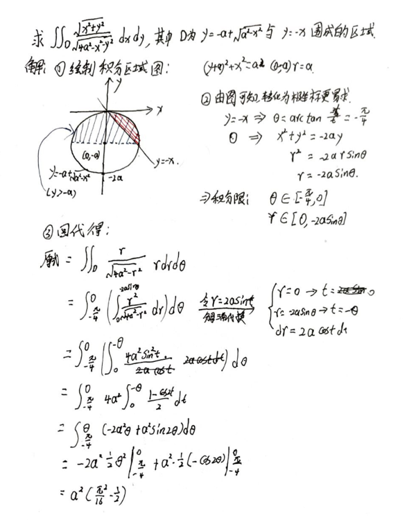
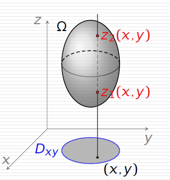
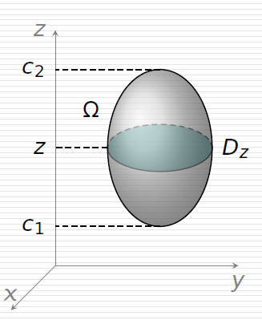
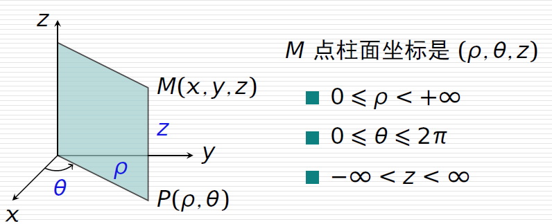

> 
学习就是学习，不该带着情绪。

> 
——Sion

## 楔子

>  本文从属于紫晶·铁石计划，取其精华，弃其糟粕。前面文字为草稿，最后的pdf为终稿。

“咄！秦时𨍏轹钻！”

极限、微分、积分是高等数学的基本功，地基夯实了，才能运斤成风。

## 前置

这一部分主要是阐述不定积分的基本定义。

### 基本定义

简单来说，积分就是导数的逆运算，已知导数，，来求其原函数。严格定义如下：

在区间I上，函数$f(x)$的带有<u>任意常数项</u>[^1]的原函数称为$f(x)$在I上的不定积分
$$
\int f(x)dx=F(x)+C
$$
为了更好地理解，再看一下微分的定义式：$dF(x)=F'(x)dx$,可以看出微分运算符就是对后面进行微分运算，微分变量是$dx$，而积分运算符就是对后面进行积分运算积分对象是$dx$，（读起来像是一通废话，但后面用到**分部积分法**时，就会有深刻体会了。）

> 是的，我已经不再讨厌分部积分法了，学习怎么能带情绪，能有歧视链呢？（实际上是表格法在做某些题的时候，列不到头，越写越难，就像个傻子一样，然后就对前者少了些蔑视。）

### 基本性质

1. 与导数的关系
   $$
   \{ \int f(x)dx\}'=f(x)\Longrightarrow d\int f(x)dx=f(x)dx
   $$
   这个性质在求极限时用的多。

2. 任意常数等同
   $$
   \int f(x)dx=F(x)+C
   $$

3. 加减可拆
   $$
   \int f(x)\pm g(x)dx=\int f(x) \pm \int g(x)dx
   $$

4. 常系数提出
   $$
   \int k f(x)dx= k\int f(x)dx\qquad k\ne0
   $$

### 计算法

这大概是高等数学里面最最杂乱的地方了，计算方法数不胜数，千奇百怪，意想不到。而且还有很多看着很简单，但却是<u>降维过来的东西</u>[^lnx]。这里就把课本上的基本方法整理一下吧。

#### 基本积分公式

$$
\begin{aligned}
\int x^a dx &= \frac{1}{a+1} x^{a+1}+C\\
\int \frac{1}{x}dx &=\ln |x| +C\Longrightarrow \int \frac{1}{x\ln a} dx =\log_a|x| +C\\
\int e^xdx &=e^x +C \Longrightarrow 
\int a^xdx =\frac{a^x}{\ln a} +C\\
\int \frac{1}{1+x^2}dx &=\arctan x +C \Longrightarrow \int -\frac{1}{1+x^2}dx =\text{arccot} x +C\\
\int \frac{1}{\sqrt{1-x^2}} dx &=\arcsin x +C\Longrightarrow \int -\frac{1}{\sqrt{1-x^2}} dx =\arccos x +C\\
\int \sin xdx &= -\cos x+C\\
\int \cos xdx &=\sin x +C\\
\int \sec^2 xdx &= \tan x+C\\
\int \csc^2xdx &= -\cot x+C\\
\int \sec x\cdot \tan x dx &=\sec x +C\\
\int \csc x\cdot \cot x dx &=-\csc x +C\\
\end{aligned}
$$
---

通过概括总结重积分的概念以及奇技淫巧，来更加有效的会学、会用重积分。
## 重积分概念

咳咳，同学们，现在开始上课，请把书翻到135面，今天我们开始讲新的一章：重积分，我们先假设有一个立方体，它的底是$xOy$平面上的闭区域$D$，高为h，那么它的体积就是… 😪💤💤💤💤

欸！欸！欸！怎么都睡了，好好好，现在我换一个方法讲

我们可以这样快速理解二重积分：（零重积分）求和=<u>距离</u>，（一重）定积分=<u>面积</u>，二重积分=<u>体积</u>，三重积分=<u>超体积</u>[^1]，四重积分=超超体积，…，n重积分=宇宙无敌超超超超…超体积

说白了还是微分的思想，是把一个大的不能直接求出来的东西分解成若干个（大多数时候是无限）小的可求的东西，然后再加起来，求和。这种思想看起来很~~笨~~朴素，但数学家们却偏偏从这里面推导了许多运算规律，结果就直接影响人类几个世纪。

> 不行，这样写，根本就是浪费时间啊。还是取其精华，弃其糟粕吧。

二重积分定义式：
$$
\iint_{D}f(x,y)dσ=\lim_{λ\to0}\sum_{i=1} ^{n} f(\xi_i,\eta_i)\Delta σ_i=\iint_{D}f(x,y)dxdy
$$
其中D为<u>积分区域</u>，$f(x,y)$为<u>被积表达式</u>，$dσ$为<u>面积元素</u>，$x,y$为<u>积分变量</u>。

三重积分定义式：
$$
\iiint_{\Omega} f(x, y, z) d v=\lim _{\lambda \rightarrow 0} \sum_{i=1}^{n} f\left(\xi_{i}, \eta_{i}, \zeta_{i}\right) \Delta v_{i}
$$
其中$dv$为<u>体积元素</u>。

## 二重积分性质

## 函数可加性

<u>能拆则拆</u>， 跟定积分一样，加和可以拆分开。
$$
\iint_{D}[a f(x, y)+b g(x, y)] d \sigma
= a \iint_{D} f(x, y) d \sigma+b \iint_{D} g(x, y) d \sigma
$$

## 区域可加性

设积分区域D 可以划分为$D_1$和$D_2$，则有:
$$
\iint_{D} f(x, y) d \sigma=\iint_{D_{1}} f(x, y) d \sigma+\iint_{D_{2}} f(x, y) d \sigma
$$

## 几何意义

高为一时（$f(x,y)≡1$），则二重积分代表的体积（V）与面积（A）在数值上<u>相等</u>
$$
\iint_D 1 d \sigma=A
$$

## 有界性

设在D 上$m\leqslant f(x,y) \leqslant M$，D 的面积为A，则有
$$
m A \leqslant \iint_{D} f(x, y) d \sigma \leqslant M A
$$

## 中值定理

如果ƒ (x, y) 在闭区域D 上连续，D 的面积为A，则在D 中至少存在一点(ξ, η)，使得
$$
\iint_{D} f(x, y) d \sigma=f(\xi, \eta) A
$$

## 奇偶对称性

积分区域D关于x轴对称时，若关于y是奇函数，则值为零，偶函数则倍之。

积分区域D关于y轴对称时，若关于x是奇函数，则值为零，偶函数则倍之。

## 轮换对称性

若把 $x$ 与 $y$ 对调后, 区域 $D$ 不变 (或区域 $D$ 关于 $y=x$ 对称), 则
$$
\iint_{D} f(x, y) \mathrm{d} \sigma=\iint_{D} f(y, x) \mathrm{d} \sigma,
$$

> 往往是把对称的两者<u>相加</u>来简化计算

## 二重积分计算法

> 
  重头戏来了,在考研数二数三中这道题<u>14分</u>，占比10%。 

### 直角坐标法

当两侧边界为垂直于坐标轴的直线时，可以使用此法。


<!-- tab x型区域 -->

两侧边界垂直于y轴，积分区域如下：
$$
D=\left\{(x, y) \mid a \leqslant x \leqslant b, \phi_{1}(x) \leqslant y \leqslant \phi_{2}(x)\right\}
$$

那么，就可以用下面公式进行计算：
$$
\iint_{D} f(x, y) d \sigma=\int_{a}^{b}{\color{blue} A(x)} d x=\int_{a}^{b}\left[{\color{blue}\int_{\phi_{1}(x)}^{\phi_{2}(x)} f(x, y) d y}\right] d x
$$
<!-- endtab -->

<!-- tab y型区域 -->

两侧边界垂直于x轴，积分区域如下：
$$
D=\left\{(x, y) \mid a \leqslant y \leqslant b, \phi_{1}(y) \leqslant x \leqslant \phi_{2}(y)\right\}
$$
此处脑补：y型.jpg

那么，就可以用下面公式进行计算：
$$
\iint_{D} f(x, y) d \sigma=\int_{c}^{d}{\color{blue} B(y)} d y=\int_{c}^{d}\left[{\color{blue}\int_{\phi_{1}(y)}^{\phi_{2}(y)} f(x, y) d x}\right] d y
$$
<!-- endtab -->

<!-- tab 矩形区域 -->

当东西南北都为两对垂直于坐标轴的直线时，积分区域可以表示为
$$
D=\{(x, y) \mid a \leqslant x \leqslant b, c \leqslant y \leqslant d\}
$$
当被积函数为常数k时，直接$k(b-a)(d-c)$就行了，

当被积函数<u>可分离变量</u>时，即$f(x,y)=g(x)h(y)$，则可以：
$$
\iint_{D} f(x, y) d \sigma=\left(\int_{a}^{b} g(x) d x\right)\left(\int_{c}^{d} h(y) d y\right)
$$
<!-- endtab -->



### 极坐标法

> 熟练掌握极坐标，拉开差距。

#### 回顾

1. 直角坐标与极坐标的关系

| $(\rho,\theta)\to (x,y)$ |    $(x,y)\to(\rho,\theta)$     |
| :----------------------: | :----------------------------: |
|   $x=\rho \cos \theta$   |        $\rho^2=x^2+y^2$        |
|   $y=\rho \sin \theta$   | $\theta =\arctan(\frac{y}{x})$ |

2. 常见极坐标方程

* 圆：

  (1)圆心在极点, 半径为 $r$ 的圆: $\rho=r$
  (2) 圆心为 $M(a, 0)$, 半径为 $a$ 的圆: $\rho=2 a \cos \theta$
  (3) 圆心为 $M\left(a, \frac{\pi}{2}\right)$, 半径为 $a$ 的圆: $\rho=2 a \sin \theta$

* 直线

  (1)直线过极点, 直线的倾斜角为 $\alpha: \theta=\alpha(\rho \in \mathbf{R})$
  (2)直线过点 $M(a, 0)$, 且垂直于极轴: $\rho \cos \theta=a$
  (3)直线过点 $M\left(a, \frac{\pi}{2}\right)$, 且平行于极轴: $\rho \sin \theta=a$

* 圆锥曲线

  (1)椭圆：$\frac{1}{\rho^{2}}=\frac{\cos ^{2} \theta}{a^{2}} + \frac{\sin ^{2} \theta}{b^{2}}$

  (2)双曲线：$\frac{1}{\rho^{2}}=\frac{\cos ^{2} \theta}{a^{2}} - \frac{\sin ^{2} \theta}{b^{2}}$

  (3)<u>统一形式</u>：$\rho=\frac{e p}{1-e \cos \theta}$

### 应用

值得注意的是，当积分区域为圆盘或圆盘一部分时，即$\color{purple}D=\left\{(\rho, \theta) \mid \alpha \leq \theta \leq \beta, \phi_{1}(\theta) \leq \rho \leq \phi_{2}(\theta)\right\}$，用极坐标更为简便：
$$
\iint_{D} f(x, y) d \sigma=\iint_{D} f(\rho \cos \theta, \rho \sin \theta) \rho d \rho d \theta
$$

具体步骤就是：**先找到$\theta$的范围，再求$\rho$的函数**

### 奇技淫巧

## 三重积分计算法

### 切薯条法（先一后二）

先沿一个方向进行积分，再进行二重积分，可以类比二重积分中的直角坐标法，

当积分区域可以表示为：$\color{purple}\Omega=\left\{(x, y, z) \mid(x, y) \in D_{x y}\right. \left.z_{1}(x, y) \leqslant z \leqslant z_{2}(x, y)\right\}$，

可以用下式计算三重积分：
$$
\iiint_{\Omega} f(x, y, z) d v=\iint_{D_{x y}}\left[\int_{z_{1}(x, y)}^{z_{2}(x, y)} f(x, y, z) d z\right] d x d y
$$

### 切薯片法(先二后一)

跟前面的方法反过来，当积分区域可以表示为：$\color{purple} \Omega=\{(x, y, z)  c_1 \leqslant z \leqslant c_2, \ (x, y) \in D_{z} \}$，

可以这样计算三重积分：
$$
\iiint_{\Omega} f(x, y, z) d v=\int_{C_{1}}^{c_{2}}\left[\iint_{D_{z}} f(x, y, z) d x d y\right] d z
$$

### 极坐标法

无需多言，就多了个z罢了

$$
\iiint_{\Omega} f(x, y, z) d v=\iiint_{\Omega} f(\rho \cos \theta, \rho \sin \theta, z) \rho d \rho d \theta d z
$$



### 有原函数但无法直接求导的常见函数：

当遇到这种情况时，就用技巧吧，**三角变换**，**交换积分次序**，**极坐标法**…
$$
\int \frac{\sin x}{x} d x\  \int \frac{\cos x}{x} d x \ \int \frac{\tan x}{x} d x\ \int \frac{e^{x}}{x} d x
$$

$$
\int \sin x^{2} d x\  \int \cos x^{2} d x\  \int \tan x^{2} d x\ \int\frac{dx}{lnx}
$$

$$
\int e^{a x^{2}+b x+c} d x\quad\left(e^{x^{2}} d x ; \int e^{-x^{2}} d x\right)
$$



## 积分要义

<iframe src="https://mozilla.github.io/pdf.js/web/viewer.html?file=https://blog.si-on.top/pdf/积分要义.pdf" frameborder="0" width="100%" height="100%"></iframe>

[^1]:把第三个变量换做密度的话，亦可类比成物理学上的质量。
