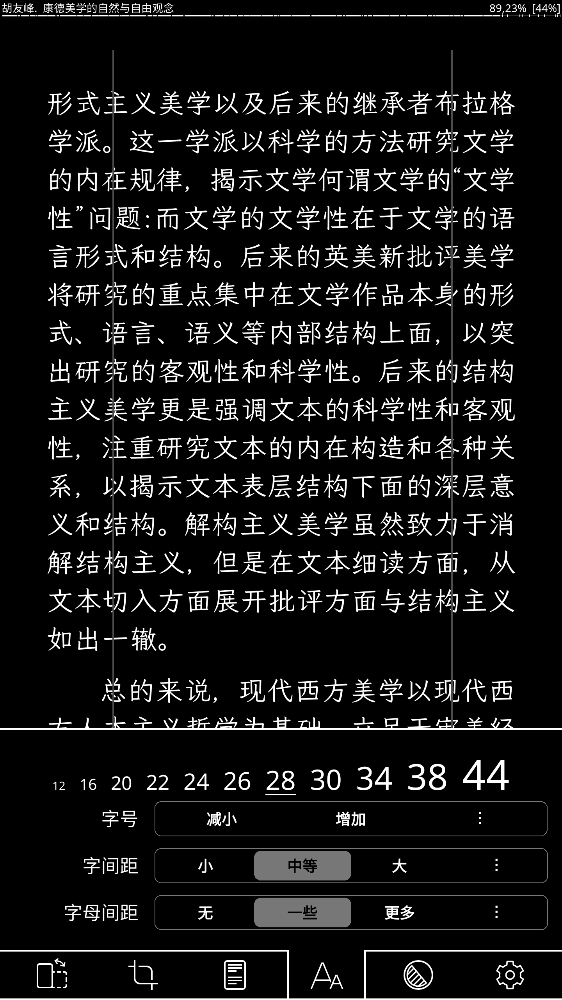

[000](/2022/4e9a9ed6)



本文所讨论的电子书不包括PDF格式


## 楔子

上周由于电脑DNS出了故障，试了好多办法，均无法修复，最后无奈使用了*绝·重装之术💥*。安装上新的系统（Windows 11 22H2）之后，Windows上阅读器的选择又令人头疼。对我而言：付费的必不可能🐶，但仅有的几个免费的，要么操作鬼畜，要么界面太难看。这并不是说我的要求太高，而是因为我之前已经接触过了的一些非常好用的阅读器。

初二以来接触互联网到现在大四，我也用过不少设备，体验过不少系统，下面我按时间顺序，对这些系统及上面的阅读器进行排列：

* ~~Nokia E72  (塞班·S60 V3 FP2)~~
  1. **iBook阅读星**
  2. 百阅
* DELL Inspiron 5570 （视窗·Win10、Win10 LSTC、Win11 21H2 、**Win11 22H2**）
  1. [**Clean Reader（干净阅读）**](https://github.com/Clean-Reader)
  2. [**Freda**](https://www.microsoft.com/store/productId/9WZDNCRFJ43B) 
  3. [Neat Reader](https://www.neat-reader.cn/)
  4. **[koodo Reader](https://koodo.960960.xyz/)**
  5. [Calibre](https://calibre-ebook.com/)
  6. [Kindle PC](https://www.amazon.cn/gp/digital/fiona/kcp-landing-page)
* DELL Inspiron 5570 （Linux·Debian系/Ubuntu/Deepin15/**Deepin23**、Arch系/**Manjaro**/Garuda）
  1. [**Foliate**](https://johnfactotum.github.io/foliate/)
  2. [KOReader](http://koreader.rocks/)
  3. [Calibre](https://calibre-ebook.com/)
* BlackBerry Priv （**安卓·6**）
* Redmi Note 10 Pro（安卓·11/MIUI12 ~ **12/MIUI13**）
  1. [**Moon+ Reader（静读天下）**](http://www.moondownload.com/chinese.html)
  2. [Book Reader](https://f-droid.org/zh_Hans/packages/com.github.axet.bookreader/)
  3. [Librera Reader](https://f-droid.org/zh_Hans/packages/com.foobnix.pro.pdf.reader/)
  4. [KOReader](http://koreader.rocks/)
  5. [掌阅 iReader](http://www.zhangyue.com/products/iReader)
* Kindle Paper White 5（Kindle 5.13.2 ~ **5.15.1**）
  * Kindle原生
  * [KOReader](http://koreader.rocks/)


各个阅读器的特性都不太一样，感兴趣的可以去自行点击链接搜索它们的特性，在此不做赘述，但他们都有一个共同点—**不完美**。比如Calibre虽然支持全平台（除了安卓）、全格式，但他的阅读器实在太难看了只适用于整理书籍；又如 Foliate、Koreader虽然美观但是仅仅支持Linux平台；Windows平台上的稍微好用点的就要付费（如Neat Reader），免费的操作又太奇怪（koodo Reader两边的侧栏跳来窜去，烦死人）；还有的有奇怪的bug（**Freda** 复制中文，文字之间都有一个空格🤦）。他们支持的格式也大同小异，在此不多做评价。在我看来，一个好的阅读器，其界面与操作方式是重中之重，其次是功能。若不分平台，非让让我给阅读器做一个排名的话，那应该是下面这个样子
$$
Foliate >\text{Kindle原生阅读器} > \text{静读天下} >KOReader > \text{iBook阅读星}
$$
我之所以把Foliate 放在第一位，是有很多原因的。 首先，它支持的格式非常多，基本上可以见到的电子书格式都支持，界面优美，操作人性化。其次，它有一个非常吸引人的功能：笔记的导出与备份，单单这一个功能就足以秒杀所有阅读器。关于它的一些详细特性可以参考[官网](https://johnfactotum.github.io/foliate/)或者Linux中国的这篇[文章](https://linux.cn/article-12462-1.html)。但是由于它并不支持Windows平台，所以很多人对它并不了解。我也查看了这软件GitHub仓库里面的Issue，开发者并没有打算支持Windows平台，好像是因为这软件的一个核心架构工具不支持Windows，如果想要做的话，需要对整个软件重新编程十分麻烦。但群众的力量是伟大的，在评论区发现有人用另外一种方式安装了Foliate，并且可以在Windows上完美运行。这就是本文要讲的—**Windows上安装Foliate**

## 安装

### 原理

通过安装Linux子系统，借助WSL2的特性，可以非常方便地打开软件，存放书籍。

### 安装WSL子系统

> 先决条件：必须运行 Windows 10 版本 2004 及更高版本（内部版本 19041 及更高版本）或 Windows 11。

1. 打开“控制面板-程序与功能”，点击左边的“启用或关闭Windows功能”

   ```bash 也可以通过打开cmd，使用下面这个命令打开
   appwiz.cpl
   ```

2. 对下面两项打勾

   * Hyper-V
   * 适用于Linux的Windows子系统

3. 点击确定，等待系统安装，然后重启。 

4. 安装WSL Ubuntu（默认应该就是WSL2。如果只是为了阅读，那不用纠结用什么linux系统，我测试了好几个，最后还是发现还是Ubuntu支持度最高，运行最流畅）在管理员 PowerShell 或 Windows 命令提示符中输入此命令。WSL的其他命令可以查看[这篇文章](https://learn.microsoft.com/zh-cn/windows/wsl/basic-commands#install-a-specific-linux-distribution)。

   ```powershell PowerShell
   wsl --install
   ```

5. 重启计算机来安装运行适用于 Linux 的 Windows 子系统 (WSL) 所需的全部内容

### 子系统初始化

正常的话，你会在开始菜单看到一个Ubuntu的logo，点击它进入Ubuntu终端。根据提示设置用户名与密码。初始化之后，再更新一下系统`sudo apt update &&sudo apt upgrade`。

> 这个子系统默认是安装在C盘，初始化之后用“设置”里的“应用-安装的应用-Ubuntu”的应用转移功能，可以空间转移到别的盘。

### 本土化与字体

然后修改 `/etc/locale.gen` 文件来设定系统中可以使用的 locale为中文（取消对应项前的注释符号「`#`」即可）：

``` bash 可以用vim编辑，“/text”直接跳到text所在位置，“i”输入模式，":wq"退出
sudo vim /etc/locale.gen
```

```bash 保留这两项
en_US.UTF-8 UTF-8
zh_CN.UTF-8 UTF-8
```

再修改配置文件 `/etc/default/locale`，将原始内容注释掉或删掉

```bash
sudo vim /etc/default/locale
```

```bash 替换为如下内容：
LANG="zh_CN.UTF-8"
LANGUAGE="zh_CN:zh"
LC_NUMERIC="zh_CN"
LC_TIME="zh_CN"
LC_MONETARY="zh_CN"
LC_PAPER="zh_CN"
LC_NAME="zh_CN"
LC_ADDRESS="zh_CN"
LC_TELEPHONE="zh_CN"
LC_MEASUREMENT="zh_CN"
LC_IDENTIFICATION="zh_CN"
LC_ALL="zh_CN.UTF-8"
```

然后执行 `locale-gen` 命令，便可以在系统中使用这些 locale，然后最好重启一次终端。

```bash 这一步是应用上面的设置
sudo locale-gen
    Generating locales (this might take a while)...
      en_SG.UTF-8... done
      zh_CN.UTF-8... done
    Generation complete.
```

可以通过 `locale` 命令来查看当前使用的 locale：亦可通过 `locale -a` 命令来查看目前可以使用的 locale。

```bash
sion@sion:~$ locale
    LANG=zh_CN.UTF-8
    LANGUAGE=
    LC_CTYPE="zh_CN.UTF-8"
    LC_NUMERIC="zh_CN.UTF-8"
    LC_TIME="zh_CN.UTF-8"
    LC_COLLATE="zh_CN.UTF-8"
    LC_MONETARY="zh_CN.UTF-8"
    LC_MESSAGES="zh_CN.UTF-8"
    LC_PAPER="zh_CN.UTF-8"
    LC_NAME="zh_CN.UTF-8"
    LC_ADDRESS="zh_CN.UTF-8"
    LC_TELEPHONE="zh_CN.UTF-8"
    LC_MEASUREMENT="zh_CN.UTF-8"
    LC_IDENTIFICATION="zh_CN.UTF-8"
    LC_ALL=
```

除了设置好 locale，还需要安装中文字体。

```bash 安装文泉驿微米黑
sudo apt-get install ttf-wqy-microhei 
```

也可以自己把字体复制到`/usr/share/fonts`下然后执行下面命令进行安装

> WSL2的文件目录非常简单：`\\wsl.localhost`是WSL的目录，安装的子系统就在下面，就跟磁盘里的文件一样，直接操作即可。关于Ubuntu系统字体的安装，可以参考[这篇文章](https://www.jianshu.com/p/e7f12b8c8602)，讲的非常详细👍。

```bash 安装字体
sudo apt-get install ttf-mscorefonts-installer fontconfig
sudo mkfontscale && mkfontdir && fc-cache -fv
```

### 安装Foliate

> 在配置好了前面这些东西之后，理论上是可以安任何Linux软件，并且可直接以gui的形式运行。

1. 更新系统

   ```bash
   sudo apt update &&sudo apt upgrade
   ```

2. 通过PPA安装Foliate

   ```bash
   sudo add-apt-repository ppa:apandada1/foliate
   sudo apt update
   sudo apt install foliate
   ```

3. 直接在开始菜单打开Folaite

## 测试与展示


#### 其他推荐
KOreader 是另外一个同样优秀的阅读器，其操作习惯与Kindle一样，有各种各样的复杂功能。实际上搭配在安卓上也很不错的，比如我这个过气的黑莓Priv上:

它的界面也挺好看的

