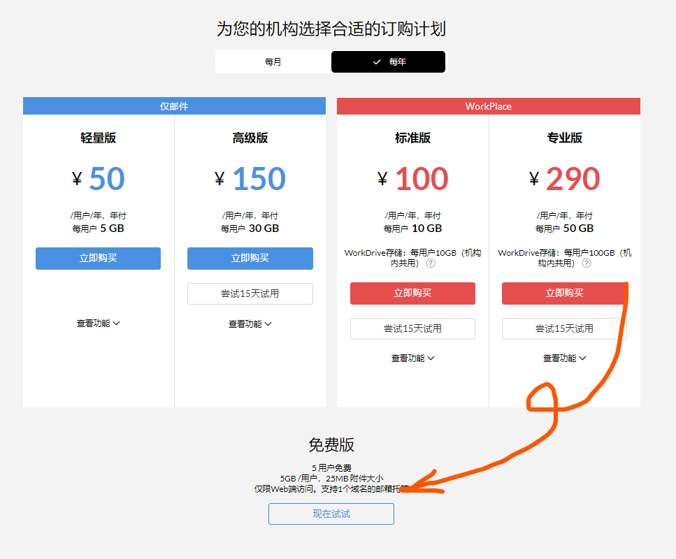
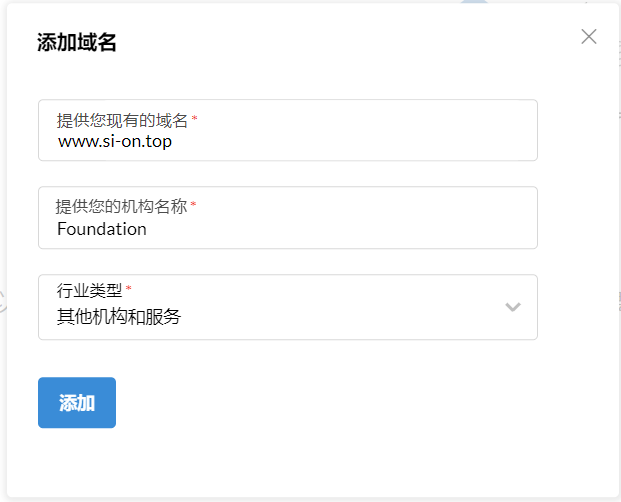
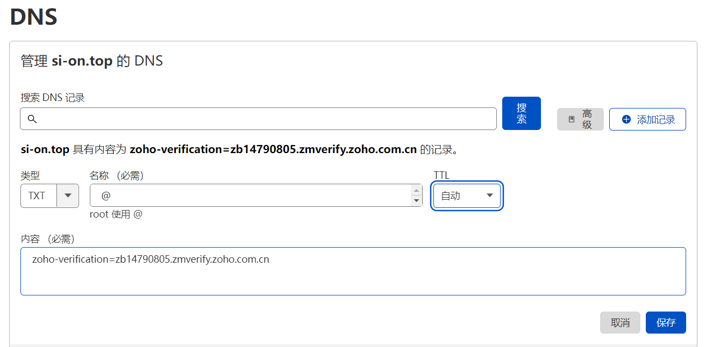

# waline评论邮箱回复

# 楔子

用了这么久Waline，发现这个项目越来越好了，起初配置时邮箱提醒没有配置好，近来想再次尝试下。原本想申请一个域名邮箱来专门当做回复机器人，后经过一番搜罗，感觉Zoho提供的免费服务可以满足要求，但是它却不支持SMTP，只好申请了一个163邮箱来做。

# （不适用）Holo域名邮箱

> Holo什么都好，但SMTP服务居然要付费，太狗了！（再次鄙视我自己😒）

> 免费版的特性：
>
> - 5 个自定义用户,每用户5GB储存，邮件的附件不能超过25MB。
> - 仅Web端访问。
> - 支持1个域名的邮箱托管。

## 账户注册

1. [注册链接（无推广）](https://mail.zoho.com.cn/signup)

2. 选择免费版

   

3. 添加域名

   1. 
   2. 

4. DNS验证

   1. 
   2. 

5. 创建账户

   

6. 结束放弃

   

# Waline 邮箱回复-通用配置（以网易邮箱为例）

## 服务提供商端

1. 申请邮箱
2. 开启SMTP服务（一般是用手机发短信来验证开通）
3. 得到SMTP授权密码

> 这一步之后，你应该获得：
>
> 1. 邮箱地址：`mail4sion@163.com`
>
> 2. SMTP授权密码：`42424242424`

## 个性化选项

主要是邮箱回复内容的配置

1. 网站名称：`Foundation`
2. 网站地址：`https://si-on.top`
3. 博主邮箱：（就是不提醒站长自己的评论） `agapehydor2@gmail.com`

## waline变量设置

经过以上选择之后，我们可以得到以下变量列表，将其依次填入waline的环境变量里。

> 填写了服务提供商，就不必要再填写SMTP地址了。

| 环境变量名称   | 值                      | 备注                                                         |
| -------------- | ----------------------- | ------------------------------------------------------------ |
| `SMTP_SERVICE` | 163                     | SMTP 邮件发送服务提供商                                      |
| `SMTP_HOST`    | —                       | SMTP 服务器地址，一般可以在邮箱的设置中找到。                |
| `SMTP_PORT`    | —                       | SMTP 服务器端口，一般可以在邮箱的设置中找到。                |
| `SMTP_USER`    | `mail4sion@163.com`     | SMTP 邮件发送服务的用户名，一般为登录邮箱。                  |
| `SMTP_PASS`    | `42424242424`           | SMTP 邮件发送服务的密码，一般为邮箱登录密码，部分邮箱(例如 163)是单独的 SMTP 密码。 |
| `AUTHOR_EMAIL` | `agapehydor2@gmail.com` | 博主邮箱                                                     |
| `SITE_NAME`    | `Foundation`            | 博客名称                                                     |
| `SITE_URL`     | `https://si-on.top`     | 博客地址                                                     |

> 以下是选填的环境变量:
>
> - `SENDER_NAME`: 自定义发送邮件的发件人
> - `SENDER_EMAIL`: 自定义发送邮件的发件地址
> - `MAIL_SUBJECT`: 自定义评论回复邮件标题
> - `MAIL_TEMPLATE`: 自定义评论回复邮件内容
> - `MAIL_SUBJECT_ADMIN`: 自定义新评论通知邮件标题
> - `MAIL_TEMPLATE_ADMIN`: 自定义新评论通知邮件内容

环境变量添加之后，重新部署

# 结果展示

1. 用户**Moreread**以`2322748973@qq.com`为邮箱地址发表评论
2. 受到**Sion**的回复
3. **Moreread**收到提醒

> 