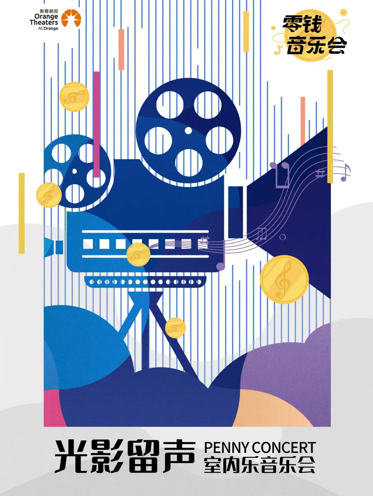

> 
有些东西，经历了就足矣改变一切！

> 
——秉蕳






<!-- @import "[TOC]" {cmd="toc" depthFrom=1 depthTo=6 orderedList=false} -->
<!-- code_chunk_output -->

<!-- /code_chunk_output -->


-----

## 楔子
从未有无来由的风，从未有无来由的情绪，也从未有无来由的文章。每一个念头、行动都是之前的无数念头的累计，这篇文章也一样。俺在八月初写了一篇文章叫做《管弦乐揽胜》，在那文章里，咱家里草草地介绍了交响乐的各种类型，乐器等。我自知那文章很粗泛，充溢着热情而力不足的“爱好者”文风，而且一些话都没有仔细斟酌，说不定还会给人带来误解，我对此深表歉意。

即便如此轻飘、恶劣、干瘪，这个管弦乐的“种子”还是被种下去了。半个月后，它破土而出。八月中旬的一天下午，我又双叒叕学累了，便闲转到隔壁的南阳大剧院，偶然间瞥了眼门口的广告栏，发现这小地方居然还有各地乐团来巡演，很是吃惊。在当天就有一个民族管弦乐的音乐会，然而一听见笙，我心里就不得劲，直接放弃。往后看，九月一号的山西交响乐团的室内弦乐，演奏的是电影配乐，这还不错，再一看票价，才39块，跟电影票差不多，价格也合适，便选择这个音乐会作为人生的第一次音乐会。
## 赏析

### 乐队介绍
山西交响室内乐团隶属于山西省交响乐团。

山西省交响乐团组建于1952年，是我国建团较早的乐团之一，2015年12月15日乐团改制成为了独立建制的职业交响乐团，是山西省唯一一支编制完整的职业交响乐团。乐团凝具了一批造诣深厚的艺术家，承担着我省历年来新年音乐会，重大节日、重要庆典的演出任务，推动着山西音乐文化的繁荣与发展。

山西交响室内乐团成立于2018年，致力于探索雅致格调与大众审美的完美结合。成员均由山西省交响乐的各位首席演奏家组成，演出形式多样化，在原有的弦乐五重奏中加入了打击乐及木管，大大丰富了室内乐的演出形式，演出曲目从传统西洋古典音乐到中国经典音乐曲目再到现代派作曲家新作品流行爵士等风格，在继承传统的基础上，努力开创多元化新局面。

乐团成立至今举办多场音乐会，每年担负山西省文化厅惠民演出，高雅艺术进校园,“双百工程”等演出二十余场。曾连续七天在龙城剧院举办专场音乐会，并于2021年在云南省大剧院音乐厅三天演出九场音乐会，创下保利剧院古典音乐单日演出场次最高纪录，场场满座，获得观众的一致好评。专业音乐厅演出之余乐团还致力于古典音乐的普及与推广，多次在省市图书馆等学术报告厅做专题讲座，用生动的形式介绍了室内乐和交响乐两种音乐载体。无论怎样的尝试，乐团所呈现的艺术主张无不让观众感到别样的精彩，为山西省的艺术传承工作贡献了我们的力量。

### 曲目赏析

主旋律多由第一小提琴演奏，并能够整体展示整首乐曲的情绪和色彩。第二小提琴有时需要配合第一小提琴进行二重奏演奏，有时需要与中提琴配合演奏和声对主旋律进行丰富。中提琴在弦乐四重奏中是一个最为灵活的声部，不仅可以演奏主旋律，同时也可以进行伴奏。大提琴因为厚重低沉的音色，所以多进行中低音声部的演奏，并能够在演奏过程中调控整首乐曲的节奏和速度。

室内乐：左侧两个小提琴🎻，中间低音提琴，右侧中音提琴，最右侧大提琴，前面单簧管。

最后还添加了三首，棒极了！(第三首乐手很牵强，应该是真送的，送的前两首很自然，可能是事先安排好的推广手段)

## 气质

任何东西，第一次经历总是最有感触的。

今晚是我第一次观赏音乐会，也是第一次看见货真价实的提琴，令我感触最深的不是提琴的激昂而深刻的旋律，也不是观众的激动，而是乐手的气质，那种优雅的气质。
### 我的音乐极简史

跟大多数理工科的00后一样，我所受的音乐教育是很匮乏的，然而我存下了很多老师种下的种子，并一直期待某一天可以发芽。对于音乐的理解到昨晚为止都停留在旋律，感性方面，纯粹是感兴趣，纯粹是想去了解。

从小学开始，四年级以前的小学音乐课也就跟着哼两首歌。五年级下册后转学到城里一个私立学校，这个学校是在租用了艺术学校的一层楼。虽说是学的文化课，但在那环境里，也或多或少有了更多艺术的接触。首先是班主任毕老师(名字我居然忘了)会弹琴，他不仅既教数学，又负责音乐课，我起初的音乐品味受他影响很大，比如红色的军歌(咱当兵的人、军中绿花)、八九十年代的经典老歌(阳光总在风雨后、水手、男儿当自强...)。小学最后的一年半的时间里还上过几回舞蹈课，印象最深的是在一次课上，一个男老师用萨克斯🎷吹斗牛曲伴奏，另一个女老师跳舞💃🏻，这一个画面至今记忆尤深。

初中的话，就初一音乐课上学了点简谱的乐理，会画那个酷酷的高音音符🎼。

高中没有音乐课，自己听歌，野蛮发展音乐趣味。到高三时思维开始延展，觉得这世上没有什么是人不能学的，也没有什么是人学不会的。又碰巧听到别人说“年轻时候想学的东西如果不学，将来用到的时候是会非常后悔的”。便想着学个乐器玩玩，于是买了根价格亲民又没那么张扬的笛子吹(断断续续玩了两三年，仍处于初学者阶段，手指也没有练成肌肉记忆)，这以后才发现原来我爷爷原来是会吹笛子的(年轻当兵在部队里学的，退伍后回家务农也没机会展示，所以二十年来我从来不知道他还有这一手)，这一点让我非常高兴，我家原来是有懂音乐的。

大学没有太多进展，大一参加了次合唱，对钢琴、人声的理解加深了点，大三系统地自学了两次乐理，玩了玩Sonic-pi，仅此而已。

