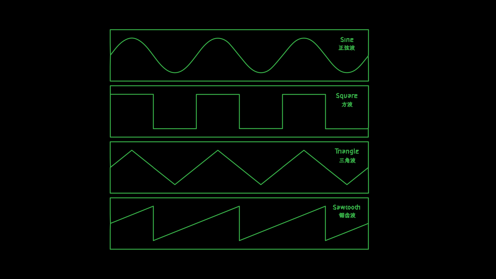
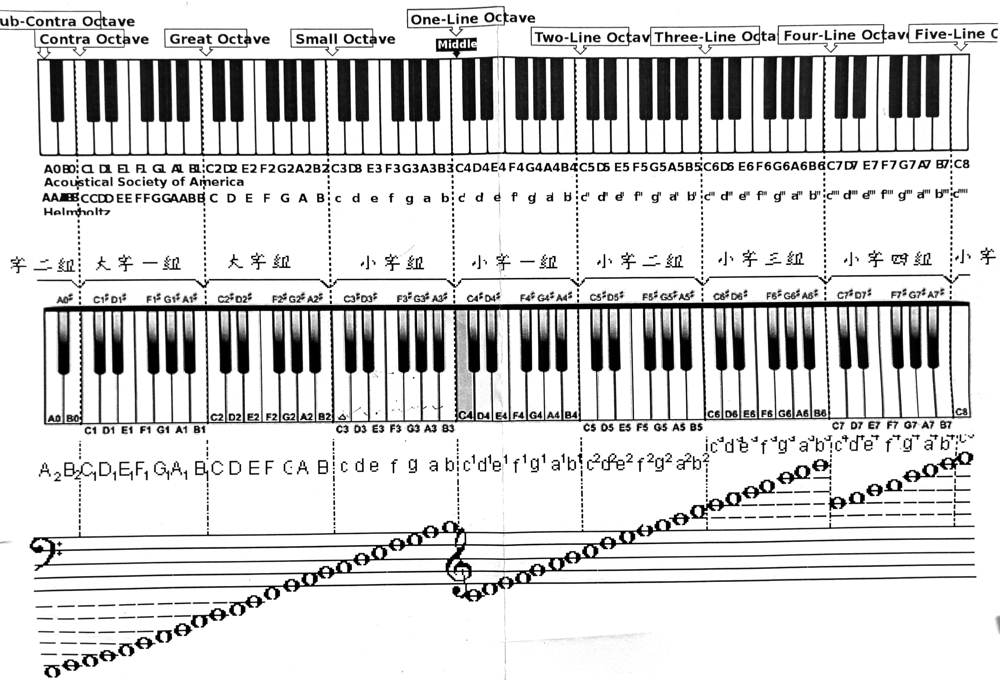
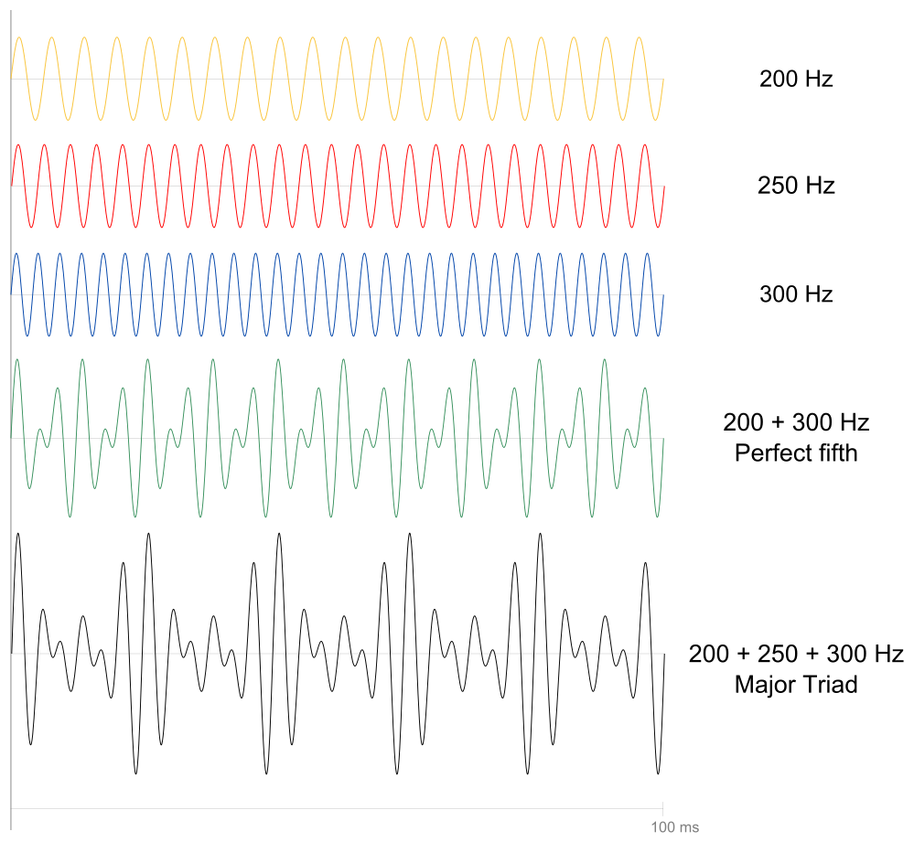

> <center>任何事，不去了解它，就别想掌握它。</center>
> <p align="right">——歌德</p>



<!-- timeline 2021-12-19 -->
介绍了基本和弦的组成（中英），为了更好的使用sonic pi。
<!-- endtimeline -->
<!-- timeline 2023-8-11 -->
在访客[@八咫烏](https://www.vergilisme.com/)的建议下，准备写一篇关于<u>芯片/8bit/像素</u>音乐的文章
<!-- endtimeline -->
<!-- timeline 2023-8-15 -->
* 安装好了Sonic-pi，复习了软件的使用
* 熟悉了`aplayer`调用本地音频，`abc.js`的使用
* 明确了文章内容：介绍乐理、芯片(8Bit)音乐；~~创作一首自己的歌曲~~。
<!-- endtimeline -->
<!-- timeline 2023-8-19 📨文章发布 -->
* 通过Sonic-pi 合成了《小星星》
* 添加ABC记谱法的笔记
* 用unifont字体与《雪人兄弟》制作了封面
<!-- endtimeline -->


我一直以为上次那个《电子阅读新语》是博客里时间跨度最久的文章了(三个月)，然而现在这篇跨越604天的文章把记录又刷新了。




<!-- @import "[TOC]" {cmd="toc" depthFrom=1 depthTo=6 orderedList=false} -->
<!-- code_chunk_output -->

- [像素音乐](#像素音乐)
  - [像素音乐的组成](#像素音乐的组成)
    - [脉冲波](#脉冲波)
    - [三角波](#三角波)
    - [锯齿波](#锯齿波)
    - [方波](#方波)
    - [正弦波](#正弦波)
  - [混音](#混音)
  - [推荐音乐](#推荐音乐)
- [ABC记谱法](#abc记谱法)
  - [表头](#表头)
  - [音符](#音符)
  - [音符的不同时值](#音符的不同时值)
  - [旋律](#旋律)
  - [其他装饰符号](#其他装饰符号)
    - [连音](#连音)
    - [同时发声](#同时发声)
    - [反复记号](#反复记号)
    - [装饰音](#装饰音)
    - [表情符号](#表情符号)
    - [注释](#注释)
- [和弦 Chord](#和弦-chord)
  - [三和弦 Triad](#三和弦-triad)
    - [原位三和弦](#原位三和弦)
    - [大三和弦 Major triads](#大三和弦-major-triads)
    - [小三和弦 *Minor* triads](#小三和弦-minor-triads)
    - [增三和弦 *Augmented* triads](#增三和弦-augmented-triads)
    - [减三和弦 *Diminished* triads](#减三和弦-diminished-triads)
  - [转位和弦](#转位和弦)
  - [七和弦](#七和弦)
    - [大小七和弦](#大小七和弦)
    - [小小七和弦](#小小七和弦)
    - [半减七和弦（也称减小七和弦）](#半减七和弦也称减小七和弦)
    - [减减七和弦](#减减七和弦)
    - [转位七和弦](#转位七和弦)
    - [五六和弦](#五六和弦)
    - [三四和弦](#三四和弦)
    - [二和弦](#二和弦)

<!-- /code_chunk_output -->


-----


## 像素音乐
说起**像素音乐**，我相信大家多少都了解一二。因为读到这篇文章的人只要年龄是在十五六到四五十之间，肯定都多少见过、甚至玩过那种电子游戏机，比如什么小霸王、红白机、PSP等等。

咱家大概在小学五六年级时候(2012左右)玩过许久的游戏机。那时候互联网、智能手机的风暴还没有席卷到偏僻的农村，我们放学后的娱乐方式就是看奥特曼碟、玩插卡游戏机(FC)、打卡、捉鱼、收集烟盒之类，而游戏机又是其中最最高科技的玩意儿，最是吊人胃口。一年夏天，我从表哥家借来一个游戏机，从那以后，我们一群人：我、H君、X君有时还有S君，每天放学后钻到我家就玩这游戏机，手柄不知道都干坏了多少个[^2]。然而当时游戏并不多，为了满足这游戏之瘾，便偷偷拿压岁钱去买游戏卡，五块钱一张的卡有四个游戏，没多久一百多巨款就花光了[^1]，后来又同S庄的同学交换游戏卡，也玩了一段日子。最后，庄上一个早早辍学的“大哥”把我的卡、机子借去玩，一借便是两三年，还的时候，就剩两个卡了。虽然当时很伤心，然而狗日的时间还是慢慢地冲淡了这一切。现在电脑上装了一个开源的RetroArch，找了些资源，不用花压岁钱，就能玩成百上千个游戏。然而，然而，我还是打不通关！

妈耶，扯这么远了，这篇文章是写像素音乐来着，不好意思，不好意思，下面进入正题。

### 像素音乐的组成

像素音乐，作为电子游戏机的配乐，一出生就与游戏结下了不解之缘。你可能听过上百遍像素音乐，甚至做梦都在脑子里循环(~~一个FC游戏成瘾者路过~~)，但却不知道这种音乐到底是怎么发出来的，为了不让你头疼，咱家坚决要帮你科普(~~百度~~)一下：像素音乐到底是什么鬼？

其实答案很简单：音色不同而已。

其实像素音乐与其他音乐并没有本质上的区别，都是不同频率、不同响度的声音神奇得组合到了一起。然而像素音乐之所以与众不同，是因为它<u>采用了特殊的“乐器”——蜂鸣器来发声</u>：主要是由脉冲波（pulse）、三角波（triangle）、锯齿波（sawtooth）、、方波（square）正弦波（sine）、噪音（noise）以及少量的打击乐组成。


学过电工电子学的同学，可能很了解这些波形，甚至能自己画个电路图来合成出来，这里咱家就不卖弄那垃圾的电工学知识了(~~据说sion当时考了66分~~)。所以像素音乐又被称为“芯片音乐(Chiptune)”。


为了方便体会音色，这里咱家就用《小星星》来展示下：
```ruby 小星星sonic-pi
use_synth :pulse

play_pattern_timed([:eb3,:eb3,:bb3,:bb3,:c4,:c4,:bb3, nil,
                    :ab3,:ab3,:g3,:g3,:f3,:f3,:eb3,nil,
                    :bb3,:bb3,:ab3,:ab3,:g3,:g3,:f3,nil,
                    :bb3,:bb3,:ab3,:ab3,:g3,:g3,:f3,nil,
                    :eb3,:eb3,:bb3,:bb3,:c4,:c4,:bb3, nil,
                    :ab3,:ab3,:g3,:g3,:f3,:f3,:eb3,nil,
                    ], [0.5])
```


X: 1 %序号
T: 小星星(降E) %标题
M: 4/4  %节拍
L: 1/8 %最短音符时值
Q: 1/4=140 %
C: 秉蕳
A: 河南/南阳
K: Emin
| EE BB CC B2 |\
 AA GG FF E2 |
| BB AA GG F2 |\
 BB AA GG F2 |
| EE BB CC B2 |\
 AA GG FF E2 |

#### 脉冲波




#### 三角波




#### 锯齿波


#### 方波



从波形图中也能看出来，三角波、方波、锯齿波的音色是很相近的。
#### 正弦波




### 混音
真正的像素音乐是很复杂的，一般都有很多个轨道，对于非专业人员来说，复刻很难，制作更难。这里就简单试试，把上面的《小星星》稍微混合下，加上背景噪音，打击乐，速度加快一倍，来模仿下像素音乐的风格(录音时候点慢了，最后有点瑕疵，请听者见谅🙇‍)：


### 推荐音乐
除了各种游戏的原声，我这里推荐两个像素音乐艺术家：
* [▶ スパークル（8bit remix）](https://music.163.com/#/artist?id=29956395)：关于特摄、动漫等等影视音乐的像素化Remix，


* [8 Bit Universe](https://music.163.com/#/artist?id=12046283)：各种音乐的像素化Remix，很出名。

## ABC记谱法
ABC记谱法是19世纪出现的一种记谱法，以A到G的字母记录音高，再配以其他符号用来记录变化音、音长，用`%`做注解，由克里斯·瓦尔莎发明。后来由于计算机使用ASCII字符集又要处理音乐，ABC记谱法再度受重视，并成为一部分音乐软件的信息存储法。

ABC记谱法由<u>表头和内容</u>组成。下面分两部分介绍之，内容主要参考自：[《老王详解ABC记谱法》-- 视障者音乐制作交流基地](http://www.szzyyzz.com/forum.php?mod=viewthread&tid=22)。
### 表头
表头可以标记各种参数，可以理解为跟$\LaTeX$的导言区、markdown的front Matter。其参数如下表所示：一般只有“X:”，“M:”，“L:”，“Q:”，“K:”五个参数项很重要，是必填的项目，其余参数项可有可无。表头的第一个参数项必须为“X:”，最后一个参数项必须为“K:”。换句话说，“X:”为表头的开头，而“K:”为表头的结束。

| 符号  | 名称     | 示例            | 含义                                                                                                                                                                                                                                                                                                                             |
| :-----: | :--------: | :---------------: |:-----: |
| T     | 标题     | `T:小星星`      | 歌曲的<u>标题</u>是《小星星》啦                                                                                                                                                                                                                                                                                                     |
| C     | 作者     | `C: 秉蕳`       | 歌曲的<u>作者</u>是秉蕳                                                                                                                                          |
| D  | 专辑名称 | `D: 芯片奏鸣曲` | 歌曲属于名为《芯片奏鸣曲》的<u>专辑</u>                                                                                                                                                                                                                                                                                                 |
| <u>**X**</u> | 曲目编号 | `X:1 `          | 这首曲目是<u>第一首</u>曲目                                                                                                                                                                                                                                                                                                       |
| <u>**M** </u>| 拍号     | `M:4/4`         | 这首曲子是<u>四四拍</u>。斜杠符号“/”前面的数字表示每小节有几拍，斜杠符号“/”后面的数字表示以什么音符为一拍。                                                                                                                                                                                                                         |
| <u>**L** </u>| 最短音符 | `L: 1/4`        | 表示以下音符中的字母如果没有加上其他符号，则视为<u>四分音符</u>。                                                                                                                                                                                                                                                                   |
| <u>**Q** </u>| 曲目速度 | `Q: 1/4=120`    | 速度为<u>每分钟 120 个四分音符</u>。                                                                                                                                                                                                                                                                                                |
|<u> **K** </u>| 曲调     | `K: C`          | 表示曲子要用<u>C大调</u>演奏。(降 E 大调就是“K:Eb”，生 G 大调就是“K:G#”，A 小调就是“K:Am”)|

此外还有一些不太重要的参数，比如：
* H:History % 历史  
* S:Source % 来源  
* N:Notes % 备注  
* Z:Transcription note % 译注  
* A:Area % 地区  
* B:Book % 书名  
* R:Rythm % 节奏  
* P:AB.AC.ABA(AC)3 % 乐曲反复模式
* V: 1  name="左侧的备注" %每行注释序号需要加1(见下文的《音符测试练习曲》)

### 音符
我们知道，钢琴上有 88 个音，从低到高是：大字二组、大字一组、大字组、小字组、小字一组、小字二组、小字三组、小字四组、小字五组。对应关系如下：



在 ABC 记谱法记录的曲谱中，是以 A 到 G 的字母记录音高，再配以其他符号用来记录变化音、音长等的。采用“C”、“D”、“E”、“F”、“G”、“A”、“B”七个半角英文字母来表示七个基本音名对应的音符，一一对应简谱 C 调的“1”、“2”、“3”、“4”、“5”、“6”、“7”。具体内容是：

* <u>用大写字母来表示小字一组的音符。</u>“C”就是中央 C，简谱 C 调的中音 do，对应的 MIDI 音符编号是 60；“D”就是小字一组的 D，简谱 C 调的中音 re，对应的 MIDI 音符编号是 62；“B”就是小字一组的 B，简谱 C 调的中音 si，对应的 MIDI 音符编号是 71。  
* 在大写字母后面加一个半角的逗号“,”表示小字组的音符；在大写字母后面加两个逗号“,,”表示大字组的音符；在大写字母后面加三个逗号“,,,”表示大字一组的音符；更低的以此类推。
* <u>用小写字母来表示小字二组的音符。</u>“c”就是简谱 C 调的高音 do，对应的 MIDI 音符编号是 72；“b”就是简谱 C 调的高音 si，对应的 MIDI 音符编号是 83。
* 用在小写字母后面加一个半角的单引号“'”表示小字三组的音符；在小写字母后面加两个单引号“''”表示小字四组的音符；在小写字母后面加三个单引号“'''”表示小字五组的音符；更高的以此类推。  
* <u>半角的英文小写字母 z 来表示休止符</u>，大写的 Z 来表示整小节休止中的休止符。

下面用ABC记谱法写了一个简单的示范，大家可以对照着代码与abc.js生成的谱子看看：
```js ABC记谱法代码
T: 音符练习测试曲
C: 秉蕳
X: 1
M: 4/4 
L: 1/4
Q: 1/4=140
K: C
V: 1  name="小字一组\n[C到B]"
| CD | EF| CD | EF|\
 G2 | AB |G2 | AB|
V: 2  name="大字组\n[c到b]"
| C,D, | E,F,| C,D, | E,F,|\
 G,2 | A,B, |G,2 | A,B,|
V: 3  name="小字二组\n[c到b]"
| cd | ef| cd | ef|\
 g2 | ab |g2 | ab|
V: 4  name="小字三组\n[c到b]"
| c'd' | e'f'| c'd' | e'f'|\
 g'2 | a'b' |g'2 | a'b'|
```

T: 音符练习测试曲
C: 秉蕳
X: 4
M: 4/4 
L: 1/4
Q: 1/4=140
K: C
V: 1  name="小字一组\n[C到B]"
| CD | EF| CD | EF|\
 G2 | AB |G2 | AB|
V: 2  name="大字组\n[c到b]"
| C,D, | E,F,| C,D, | E,F,|\
 G,2 | A,B, |G,2 | A,B,|
V: 3  name="小字二组\n[c到b]"
| cd | ef| cd | ef|\
 g2 | ab |g2 | ab|
V: 4  name="小字三组\n[c到b]"
| c'd' | e'f'| c'd' | e'f'|\
 g'2 | a'b' |g'2 | a'b'|


----
### 音符的不同时值
直接在音符后面加半角的阿拉伯数字，是增长音符的时值，表示该音符的时值是数字前原来音符时值的倍数；在音符后面加一个半角的斜杠“/”，或者再在斜杠后面加半角的阿拉伯数字，是减短时值，表示该音符的时值是数字前原来音符时值的几分之一。

将这二者结合起来，那么音符的时值就更多样化了，这二者结合后的音符时值就是原来音符时值的几分之几了。

大家还记得表头的“L:”参数项的含义吧？这里举个例子：

* 如果“L:1/4”，那么“C”表示<u>四分音符</u>的中音 do，“C2”表示四分音符的 2 倍，就是<u>二分音符</u>的中音 do；“C3”表示四分音符的 3 倍，也就是<u>附点二分音符</u>[^3]的中音 do。  
* 如果“L:1/8”，那么“C”表示<u>八分音符</u>的中音 do，“C2”表示八分音符的 2 倍，就是<u>四分音符</u>的中音 do。  

这里两个例子中的“C”后面同样是加的“2”，但是他们表示的音符时值却不一样，也就是说，<u>表头的“L:”参数项的参数值决定了后面音符的时值</u>。再来看看斜杠的含义：

* 如果“L:1/4”，那么“C/2”表示四分音符的二分之一，就是<u>八分音符</u>的中音 do(这里斜杠后面的数字“2”可以省略不写)；“C/4”表示四分音符的四分之一，就是<u>十六分音符</u>的中音 do(当斜杠后面的数字是“4”的时候，可以用两个斜杠来表示，也就是“/4”相当于“//”)。
* 如果“L:1/8”，那么“C/”表示八分音符的二分之一，就是<u>十六分音符</u>的中音 do；“C//”表示八分音符的四分之一，就是三十二分音符的中音 do。

两者不同的组合可以组成更加复杂的时长。如果“L:1/4”，那么“C3/4”表示四分音符的四分之三，就是附点八分音符。

> 一些简捷的记录方法（by @晓波）
> “C3/D/”可以简写成“C>D”，前面音符是音符单位的二分之三，后面音符是音符单位的二分之一；“C/D3/”可以简写成“C<D”，前面音符是音符单位的二分之一，后面音符是音符单位的二分之三。  
> “C7//D//”可以简写成“C>>D”，前面音符是音符单位的四分之七，后面音符是音符单位的四分之一；“C//D7//”简写成“C<<D”。“C15/8D/8”简写成“C>>>D”，“C/8D15/8”简写成“C<<<D”。


```js ABC记谱法代码
X: 2
T: 哆来咪(节选)
M: 4/4 
L: 1/4
Q: 1/4=140
K: C
| C5/4 D/| E5/4  C|E C | E2  |\
 D5/4 E/| F/F/ E/D/| (F2 |F)2 |
```

X: 2 %序号
T: 哆来咪(节选)
M: 4/4 
L: 1/4
Q: 1/4=140
K: C
| C5/4 D/| E5/4  C|E C | E2  |\
 D5/4 E/| F/F/ E/D/| (F2 |F)2 |

### 旋律

X: 3 
T: 两只老虎
C: 晓波
M: 4/4
L: 1/8
Q: 1/4=120
K: F
F2 G2 A2 F2 | F2 G2 A2 F2 | A2 B2 c4 | A2 B2 c4 |
cd cB A2 F2 | cd cB A2 F2 | G2 C2 F4 | G2 C2 F4 |


下面以《两只老虎》为例进行解读：
```js ABC记谱法代码
X: 3 
T: 两只老虎
C: 晓波
M: 4/4
L: 1/8
Q: 1/4=120
K: F
F2 G2 A2 F2 | F2 G2 A2 F2 | A2 B2 c4 | A2 B2 c4 |
cd cB A2 F2 | cd cB A2 F2 | G2 C2 F4 | G2 C2 F4 |
```
因为“K:F”，所以下面旋律的“F”就是 F 调首调唱法的 do，“G”就是 F 调的 re，以此类推。

1. 第一小节，“F2”是四分音符的中音 do，“G2”是四分音符的中音 re，“A2”是四分音符的中音 mi，“F2”是四分音符的中音 do；
2. 第二小节和第一小节是一样的；
3. 第三小节，“A2”是四分音符的中音 mi，“B2”是四分音符的中音 fa，“c4”是二分音符的中音 sol；
4. 第四小节和第三小节是一样的；
5. 第五小节，“cd cB”是四个八分音符，分别是中音 sol、la、sol、fa，“A2 F2”分别是四分音符的中音 mi、do；
6. 第六小节和第五小节是一样的；
7. 第七小节，“G2 C2”分别是四分音符的中音 re、低音 sol，“F4”是二分音符的中音 do；
8. 第八小节与第七小节是一样的。

在表头中“K:”参数项，有时会出现出现了上尖号“`^`”与下划线“`_`”这两个记号，他们就是旋律中的临时变音记号，写在音符前面：

| 符号          | 意义       | 说明         |
| :-------------: | :----------: | :------------: |
| `^`           | 升记号     | 升高半音     |
| `^^`          | 重升记号   | 升高一个全音 |
| `^/`  | 向上微调 | 升半个半音             |
| `_`           | 降记号     | 降低半音     |
| `__`          | 重降记号   | 降低一个全音 |
| `_/`          | 向下微调   | 降半个半音   |
| `=`           |    还原记号     | 把声音还原到初始值    |

### 其他装饰符号
#### 连音
在两个相邻且音高相同的音符之间加一个半角的减号“-”表示同音连线。减号与减号前面的音符不要有空格符号，减号与减号后面的音符之间可加可不加空格符号。比如“C2- C/”、C4- | C”。  

还有一种连线是圆滑线（slur），用左右括号把需要被圆滑线包括的音符括起来。左括号后面与右括号前面都不要有空格符号哈。“C D (`_E` F | G'3/ F'/) E' D'”中，圆滑线的开始音符是前面小节的“`_E`”，结束的音符是后面小节的“F'/”。

#### 同时发声
用左右方括号把需要同时发声的音符括起来即可，表示增减时值的符号可以写在每个音符后面，也可以只在右方括号后面写一次就行了。如果“L:1/4”，那么 “[C2E2G2]”表示“C2”、“E2”、“G2”这三个二分音符同时发声，也可以写作“[CEG]2”。

#### 反复记号
反复记号的写法非常直观，直接来几个🌰：
1. “<u>|: c d e c `:|`</u>”[^4]实际演奏是“c d e c | c d e c |”。  
2. “<u>|: c d e c :: e f g2 `:|`</u>”实际演奏是“c d e c | c d e c | e f g2 | e f g2 |”。  
3. ：“<u>|: e e f g | g f e d | c c d e |1 e3/d/ d2 :|2</u> d3/c/ c2 ||”实际演奏是“<u>e e f g | g f e d | c c d e | e3/d/ d2 | e e f g | g f e d | c c d e |</u> d3/c/ c2 ||”。  
4. “<u>|: A | B |1,3 C :|2,4</u> D ||”这个演奏的顺序是“A | B | C | A | B | D | A | B | C | A | B | D ||”。
如下表所示：

| 符号 | 含义 |
| :----: | :----: |
|　$\vert$：| 前反复记号  |
|　:$\vert$ |后反复记号  |
|　:$\vert$ 1| 第一房子(第一次重复)  |
|　　:$\vert$ 2| 第二反复(第二次重复) |
|　　$\vert$ 1,3|第一与第三反复  |
|　　$\vert$ 2,4|第二与第四反复  |
|　　:: |后反复记号加前反复记号|

#### 装饰音
先说说最常见的“倚音”。将倚音的音符用左右花括号“{}”括起来，放在主要的音符前面。如果倚音只有一个音符的话，需要在左花括号后先写一个斜杠符号，然后再写音符；如果倚音有两个或两个以上的音符的话，那么就不需要在左花括号后面写那个斜杠符号，直接写音符就行了。花括号内的音符不会受到“L:”字段的控制，在支持abc记谱法的打谱软件上，软件会把一个音符的倚音用八分音符来显示，把多个音符的倚音用十六分音符来显示的。也就是说，不管是一个音符的倚音，还是多个音符的倚音，我们都只是写音符的音高就行了，不用写后面表示时值的数字或斜杠。比如“{/B,}C”、“{A,B,}C”、“{A,B,C}C”。 

接下来说说“颤音”(trill)。直接在主要音符钱加一个半角的英文大写字母 T 即可；或者在主要音前面加用两个半角的感叹号括起来的英文单词 trill 也可以。例如“Tc”或“!trill!c”实际演奏是“c/8d/8c/8d/8c/8d/8c//”。当然颤音演奏的速度不一定那么严格，晓波只是为了方便讲解才写得如此严格。  

下面说说“回音”(roll)，也有翻译成滚音。直接在主要音符前加一个半角的英文大写字母 R 即可；或者在主要音前加用两个半角的感叹号括起来的英文单词 roll 也可以。例如“Rc”或“!roll!c”实际演奏是“c/8d/8c/8B/8c2//”。
#### 表情符号
在乐谱上，除了音符之外，我们常会看到一些文字符号，用来说明演唱演奏的方式。晓波，这个在 ABC 记谱法中怎么表示呢？

这类符号一般称为表情记号。在 ABC 记谱法里，这些表情记号用两个感叹号括起来，放在表情对象音符的前面。  下面就列初一些常见的表情记号，并附上简单的说明。  

| 表情记号             | 说明               |
| :--------------------: | :------------------: |
| !ppp!                | 极弱               |
| !pp!                 | 很弱               |
| !p!                  | 弱                 |
| !mp!                 | 中弱               |
| !mf!                 | 中强               |
| !f!                  | 强                 |
| !ff!                 | 很强               |
| !fff!                | 极强               |
| !breath!             | 呼吸               |
| !///!                | 三根斜线的震音记号 |
| !arpeggio!           | 琶音记号           |
| !<(! 见强开始点 !<)! | 渐强结束点         |
| !>(! 见若开始点 !>)! | 渐弱结束点         |
#### 注释
那如何给某些音符添加注视呢？比如钢琴谱的指法、吉他谱的和弦等等。

如果是和弦标记的话，用半角的双引号把和弦名称括起来放在音符前就可以了。比如“"C"C”、“"Dm"A”、“"G7"B”。  

如果是钢琴指法等描述性的文字，除了用半角的双引号括起来外，还需要在前面的双引号后面加上尖号“^”、下划线“`_`”、小于“<”、大于“>”或属于“@”来指定文字是标注在被注视的音符上方、下方、左边、右边或右上角。比如“"^加重"C”表示这个“C”音符上方有“加重”两个字。当然这个到底是在上方还是下方对于 ABC 记谱法本身来说是没有什么视觉效果的，只是在一些支持 ABC 代码的打谱软件中才能发挥其视觉功能。

---
假如这几种符号都同时要加在某一个音符前，我们该以什么顺序来写呢？

排在最前面的是用双引号括起来的文字描述，接着是用感叹号括起来的表情记号，后面依次是装饰音记号、圆滑线的左括号、临时变音记号、基本音符、表示音组的记号、表示增减时值的记号、同音连线或圆滑线的右括号，大致情况就是这样的。如果圆滑线需要包括倚音这类装饰音在内的话，那么左括号就要放到倚音的左花括号前面。其实，放在音符前面的那些记号，除装饰音记号外，其他的也可以自由安排顺序。
## 和弦 Chord

三个或以上不同高度乐音按照一定音程关系的结合， 叫做和弦。传统和声中的和弦均按三度叠置原则构成。

### 三和弦 Triad

三个音按照三度关系叠置起来的和弦，叫做**三和弦**。从下面上分别称为`根音 the root `，`三音 the third`，`五音 the fifth` 并以数字1、3、5来代表

#### 原位三和弦

以根音为低音的三和弦称为原位三和弦，根音向上到三音，三音向上到五音都是三度。


#### 大三和弦 Major triads

A **major chord** is a chord that has a `root`, a `major third`, and a `perfect fifth`. When a chord has these three particular notes, it is called a major triad. For example, the major triad built on C, called a C major triad, has pitches C–E–G:

根音到三音是大三度．三音到五音是小三度，根音到五音是纯五度。



* 大三和弦色彩明亮．具有大调特征。

  | Chord | Root | Major third | Perfect fifth |
  | :---: | :--: | :---------: | :-----------: |
  |   C   |  C   |      E      |       G       |
  |  C♯   |  C♯  |   E♯ (F)    |      G♯       |
  |  D♭   |  D♭  |      F      |      A♭       |
  |   D   |  D   |     F♯      |       A       |
  |  D♯   |  D♯  |   F♯♯(G)    |      A♯       |
  |  E♭   |  E♭  |      G      |      B♭       |
  |   E   |  E   |     G♯      |       B       |
  |   F   |  F   |      A      |       C       |
  |  F♯   |  F♯  |     A♯      |      C♯       |
  |  G♭   |  G♭  |     B♭      |      D♭       |
  |   G   |  G   |      B      |       D       |
  |  G♯   |  G♯  |   B♯ (C)    |      D♯       |
  |  A♭   |  A♭  |      C      |      E♭       |
  |   A   |  A   |     C♯      |       E       |
  |  A♯   |  A♯  |   C♯♯(D)    |    E♯ (F)     |
  |  B♭   |  B♭  |      D      |       F       |
  |   B   |  B   |     D♯      |      F♯       |

#### 小三和弦 *Minor* triads

a minor chord is a chord that has a `root`, a `minor third`, and a `perfect fifth`.When a chord has these three notes alone, it is called a minor triad. For example, the minor triad built on C, called a C minor triad, has pitches C–E♭–G:

根音到三音是小三度，三音到五音是大三度，根音到五音是纯五度。

* 小三和弦色彩柔和，具有小调特征。

  | Chord | Root | Minor third | Perfect fifth |
  | :---: | :--: | :---------: | :-----------: |
  |  Cm   |  C   |     E♭      |       G       |
  |  C♯m  |  C♯  |      E      |      G♯       |
  |  D♭m  |  D♭  |   F♭ (E)    |      A♭       |
  |  Dm   |  D   |      F      |       A       |
  |  D♯m  |  D♯  |     F♯      |      A♯       |
  |  E♭m  |  E♭  |     G♭      |      B♭       |
  |  Em   |  E   |      G      |       B       |
  |  Fm   |  F   |     A♭      |       C       |
  |  F♯m  |  F♯  |      A      |      C♯       |
  |  G♭m  |  G♭  |   B♭♭(A)    |      D♭       |
  |  Gm   |  G   |     B♭      |       D       |
  |  G♯m  |  G♯  |      B      |      D♯       |
  |  A♭m  |  A♭  |   C♭ (B)    |      E♭       |
  |  Am   |  A   |      C      |       E       |
  |  A♯m  |  A♯  |     C♯      |    E♯ (F)     |
  |  B♭m  |  B♭  |     D♭      |       F       |
  |  Bm   |  B   |      D      |      F♯       |

#### 增三和弦 *Augmented* triads

根音到三音是大三度，兰音到五音也是大三度，根音到五音是增五度。

* 增三和弦不协和，有扩张感。

#### 减三和弦 *Diminished* triads 

根音到三音是小三度，三音到五音也是小三度，根音到五音是减五度。

* 减三和弦不协和，有收缩感。

> 大三和弦大加小；小三和弦小加大亨 减兰和弦小加小；增三和弦大加大。

### 转位和弦

用根音以外的和弦音作为低音，称为**转位和弦**。

三和弦有两种转位。
以三音作低音是三和弦第一转位。其低音与五音为三度，低音与根音为六度，因面称为六和弦，用数字“6”表示。
以五音作低音是三和弦第二转位。其低音与根音、低音与三音分别是四度和六度关系．因而称为四六和弦。用数字$\frac{6}{4}$表示。

### 七和弦

由四个音按三度叠置而成的和弦称为七和弦。七和弦下面的 三个音与三和弦中的音一样，分别称为根音、三音五音。**第四个音与根音相距七度**，故称为七音，用数字“7”表示。

#### 大小七和弦

以大三和弦为基础，根音与七度相距为小七度的和弦；或将原位大三和弦五音上方叠置一个小三度构成。

#### 小小七和弦

以小三和弦为基础，根音与七音相距为小七度的和弦；或将原位小三和弦五音上方叠詈一个小三度而构成。

#### 半减七和弦（也称减小七和弦）

以减三和弦为基础，根音与七度相距为小七度的和弦；或将原位减三和弦五音上方叠置一个大三度构成。

#### 减减七和弦

以减三和弦为基础，根音与七音相距为减七度的和弦，或将原位减三和弦五音上叠置一个小三度音而构成。

#### 转位七和弦

和弦有三种转位．分别以和弦的三音，五音，七音为低音。转位后依据低音与七音，低音与根音的音程关系而获得其专有名称。

#### 五六和弦

以二音作为低音的七和弦是其第一转位，转位后低音与七音是五度，低音与根音为六度，因而称为五六和弦。

#### 三四和弦

以五音作为低音的七和弦是其第二转位。转位后低音与七音是三度，低音与根音是四度，因而称为三四和弦。

#### 二和弦

以七音为低音的七和弦是其第三转位。转位后低音与根音为小二度关系，因而称为二和弦。

但是sonic pi里的chord还是太多了，太难理解了


[^1]: 苍天保佑，让我妈永远也看不到这段话🙈。
[^2]: 到后来，手柄坏的实在太多，我们便把外壳去掉，发现用手直接按那坏掉的手柄的电路板有时候也能用，就是有点小麻而已😖
[^3]: 补充一下：记在符头右边的实心小圆点叫做附点，带附点的音符都叫做附点音符。每个附点都延长前边音符时值的一半。
[^4]: Markdown-it把`:|`渲染成😐，我也真是无语😐了