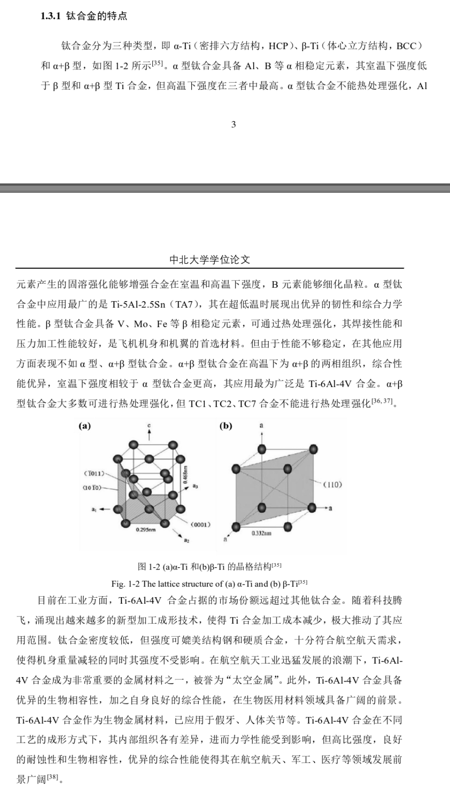
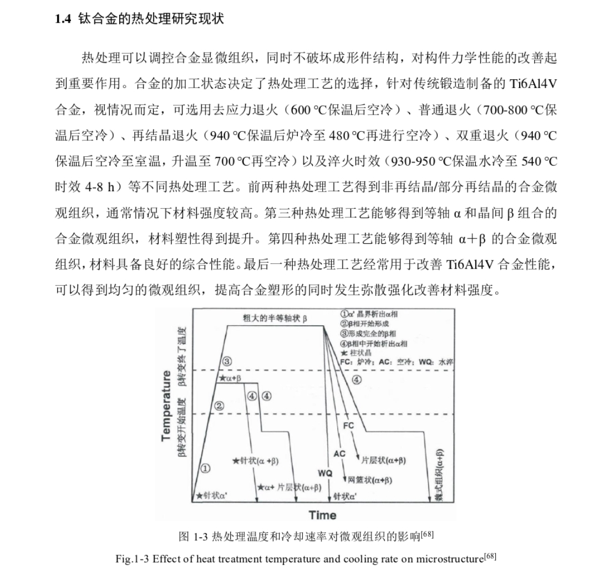

## 基本信息
|   题目   | **热处理温度及冷却速度对Ti6Al4V组织和力学性能的影响** |
|:--------:|:-----------------------------------------------------:|
| 题目类型 |                         其它                          |
| 题目来源 |                       教师自拟                        |
|          |                                                       |

### 任务书中提供的信息
> 通过本研究使学生掌握合运材料学、材料加工、热处理工艺设计等方面知识，了解金属材料热处理过程组织转变过程，熟悉材料组织和力学性能的测试方法;培养学生学会并能综合运材料学、材料加工等方面知识，以及结合实际材料独立完成课题的工作能力。通过本研究使学生掌握合金的热处理工艺设计，了解金属材料热处理过程组织转变过程，熟悉材料组织和力学性能的测试方法。对材料设计、材料制备及力学性能分析知识进行综合梳理和总结：培养文献检索、钛合金材料研究进展总结整理及合金材料力学性能测试能力；
> 
——题目的目的、意义

> 1）研究热处理温度、保温时间对合金相形成规律的影响； 2）使用万能力学试验机对试样进行室温准静态拉伸性能测试，获取试样拉伸应力应变曲线，分析合金力学性能； 3）采用扫描电镜对合金微观组织进行表征，结合拉伸实验测试结果，阐述合金力学性能与合金微观组织之间的关系。
> 
——内容简介

> 1. 对Ti6Al4V合金研究现状进行调研；
> 2. 设计合适的热处理工艺；
> 3. 制备试样，测试试样力学性能，表征材料微观组织；4）毕业设计论文一份。
> 4. 
——主要工作任务

### 本次任务
| 期限 | 周四前 |
| ---- | ------ |
| 内容     |查文献完成下面部分的内容       |

## 缓冲区
### 钛合金的特点
(1）钛合金的比强度高。钛合金的密度通常为4.51 g/cm²左右，抗拉强度可达到1200~1400MPa。相比于铝、镁等常用的轻金属合金材料，钛合金的比强度要高出0.3~0.7倍凹]。较高的比强度有助于在保证强度的前提下减轻重量，这是其用作结构材料最主要的优势。
(2）钛合金的耐蚀性极佳。钛对氧有着极高的化学亲和力，并且氧在钛中也有着较高的固溶度，钛合金暴露在空气中或水中，通常会在表面生成具有四方晶系金红石晶体结构的TiO2]。但钛合金表面的氧化层一般不会是单一的组成，氧化层与环境的界面多数情况下是TiO2，氧化层与钛合金基体的界面的成分通常为TiO，氧化层内部是成分的过渡区域[2]。这种稳定的氧化物保护膜使得钛合金在海水、次氯酸盐溶液、硫化物及有机酸等介质中极为稳定。
(3）钛合金的高温与低温性能优良。在较高的环境温度下，钢与铝合金的力学性能会产生下降，而钛合金在500这样的高温下依然保持着和室温下一样优秀的力学性能。因此钛合金可以应用于处于高温环境的航天发动机中。同时，
高温下钛与氧极易发生反应，温度超过600℃时，氧通过表面氧化层的扩散速度非常快，这会使得氧化层及下方的钛合金富氧区域发生脆化，所以钛合金的最高使用温度不易超过600℃[4]。
(4）钛合金的生物相容性较好。钛合金无毒，无磁性，并在生物系统中十分稳定，几乎不会被生物体内的血液、有机酶、自由基等液体所腐蚀，被称为“生物惰性金属”[2]。这保证了人体组织不会对钛合金产生过敏反应。钛合金的部分特性，如弹性模量、X射线吸收率等，与人骨相似，因而钛合金主要用作修复和替换人体硬组织，如股骨头、髋关节、假肢等。
> *固溶时效处理Ti6Al4V合金摩擦磨损性能研究_于志佳*

### 问题备忘
- 老师可以提供什么原料？
- 学校提供的热处理方法有哪些？可否进行固溶、时效处理？
- 渗碳、渗氮的方法可有？
- 力学性能仅仅拉伸性能不够吧，能否进一步增加硬度，疲劳强度，耐腐蚀性等参数的评定？
- 扫描电镜在学校有吗？是否需要预约？预约时间多久？
- 专业图表软件绘图的指导
## 最终整理
### 选题依据及意义
#### 钛合金的特点
> 

#### Ti6AI4V合金的研究进展
α+β型钛合金因可以调整合金元素组成而有着较大的性能调整范围，但针对每一种用途所需的性能就开发一种材料并不符合注重效率的、标准化的、批量化的工业生产要求，人们需要寻找性能优秀且适用性更加广泛的α+β型钛合金。
1954年,美国设计出了具有标志性意义的 α+β 型钛合金，即 Ti6AI4V 合金。如图所示，Ti6AI4V合金具有极佳的综合性能和良好生产性能，这使得它成为了至今用量最大，应用最广的通用型钛合金0。在 Ti6AI4V 合金长期的生产及实际应用过程中，国内外的研究人员对Ti6AI4V 合金的处理工艺、组织及性能等方面进行了较为深入细致的研究，积累了大量的相关经验。

#### 热处理选择

### 研究目标与主要任务

### 研究方法和手段
使用万能力学试验机对试样进行室温准静态拉伸性能测试，获取试样拉伸应力应变曲线，分析合金力学性能； 3）采用扫描电镜对合金微观组织进行表征，结合拉伸实验测试结果，阐述合金力学性能与合金微观组织之间的关系。
> 
——内容简介

### 主要参考文献

### 工作进度安排（时间、内容、步骤）
老师安排，不做仔细讨论