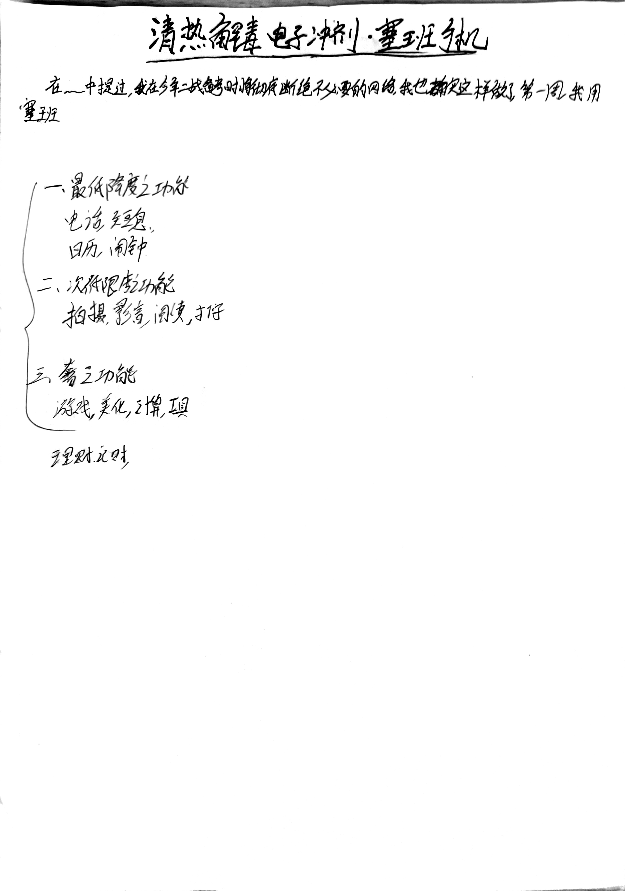

> 
当你在引用别人的时候，你在引用自己。

> 
——Sion


<!-- @import "[TOC]" {cmd="toc" depthFrom=1 depthTo=6 orderedList=false} -->
<!-- code_chunk_output -->

<!-- /code_chunk_output -->


-----

## 音量调节

听歌是手机的刚需，音量调节又是听歌体验的基本要求。可悲的是，这个破手机连接上蓝牙耳机后声音巨高，而且只有十个等级可以调节，最低的一级也震耳欲聋，听歌便在受罪。

一开始，我在 360 宝盒里寻到了一名为LCG Jukebox的听歌软件，该软件可以精细调节音量，分了 100 个等级来调节，可惜只能试用一个半小时，还有极为苛刻的检查机制，更改时间、卸载重装都不顶用。最后无可奈何把它删了。

周日下午，周围有个家伙摔笔、摔手机的姿势过于放纵嚣张，实在忍不了，抄起耳机就听起来。腾格尔一首《天堂》把我脑子听得嗡嗡响，听力怕是就要被损伤了。

便不得不去倒腾了一会儿，果然，发现了另一种调节音量的方法—〈均衡器〉。塞班系统自带的均衡器可以调节各种效果，简直如获至宝，咱家立马就调成了右图这样，声音终于降下来了！不用再买Mp3了 ^o^！

|  |  |
| -------------------------------------------------------------------------- | -------------------------------------------------------------------- |
|                                                                            |                                                                      |

## 音频可视化

天天动听的可视化效果贼好看，部分特效甚至可以媲美KDE的Panon 插件：

|  |  |  |
| ----------------------------------------------------------------------------- | ---------------------------------------------------------------------- | -------------------------------------------------------------------------------------- |
|                                                                               |                                                                        |                                                                                        |

## 收音机

起先耳机插上后一直不支持，所以也一直听不了收音机。周一晚上偶然试验了一下，终于明白怎样插耳机了：先看下常见的3.5mm 四段耳机的接口：

而在E72上插入耳机不能一下插到第四段，而需要先插3（麦克风），这时手机可以识别之，可以在左机发音；然后再插入到3.5的位置，此时可以正常使用；如果插到了4的位置，则声音会变小（伴奏与人声分裂得很明显）。

在南阳，调频收音机里在户外空旷地方可以收到大概15个台。其中交通广播、私家车广播占大多数，其余的就几个卖药的、说书的、听歌的，最正经的就是中国之声（FM 106.4 ）了。