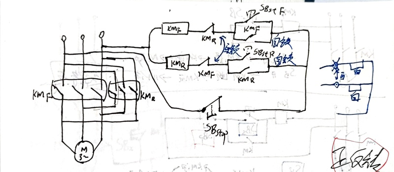

> *If you are working on something that you really care about, you don’t have to be pushed. The vision pulls you.* 

七道大题，一道设计题

# 直流稳压电源（两个填空）

整流--> 滤波 --> 稳压

## 单向半波整流

$$
U_o=0.45\ U_2 \\
I_o= \frac{U_o}{R_L}=I_D \\
U_{Rmax}=\sqrt{2}U_2
$$

## 桥式整流

桥式整流电路中每个二极管只在半个周期内导通，其值为平均电流的一半。
$$
U_o=0.9\ U_2 \\
I_o= \frac{U_o}{R_L}=2\cdot I_D \\
U_{Rmax}=\sqrt{2}U_2\\
\text{添加电容后：}U_0=1.2U_2
$$

# 集成运算放大器（两大题）

**加法**，**减法**，**比例**，积分，微分

# 基本放大电路(分压偏置放大电路)

Rb1 、Rb2分别为上、下偏置电阻， Vcc通过Rb1和Rb2分压后，为三极管VT提供基极偏置电压。

Re为发射极电阻，起稳定静态工作点作用。

Ce称为射极旁路电容，由于Ce容量较大，对交流信号来讲，相当于短路，从而减小了电阻Re对交流信号放大能力的影响。

例题：

# 电气自动控制（设计题）

从下面三个电路中选一个出

## 起停点动控制与起停长动控制

## 正反转

