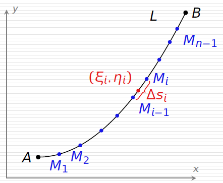
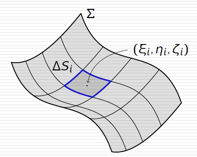

> 
生命的最大用处时将其用在更长久的地方上

> 
——威廉·詹姆斯

> 为了更好的阅读，请点击“阅读模式”按钮。

## 引言

先理一下积分区域与各个积分之间的关系：

| 积分区域 |  积分学  |
| :------: | :------: |
| 直线区间 |  定积分  |
| 平面区域 | 二重积分 |
| 空间区域 | 三重积分 |
| 曲线弧段 | 曲线积分 |
| 曲面区域 | 曲面积分 |

在不同区域内做的积分，各不相同却又相互联系。


- 曲线积分
  - 对弧长的曲线积分
  - 对坐标的曲线积分
  - 🔗两类曲线积分之间的联系
  - 格林公式
- 曲面积分
  - 对面积的曲面积分
  - 对坐标的曲面积分
  - 🔗两类曲面积分之间的联系
  - 高斯公式



## 曲线积分

用物理学来理解的话，就是求一个细长线的质量，如果密度为一的话，那就是线的长度了

### 对弧长的曲线积分

（第一类曲线积分）

条件是：L光滑，f(x,y)有界，点在线上。如图，定义曲线积分为：
$$
\int_{L} f(x, y) d s=\lim _{\lambda \rightarrow 0} \sum_{i=1}^{n} f\left(\xi_{i}, \eta_{i}\right) \Delta s_{i}
$$
L称为<u>积分弧段</u>，ds称为<u>弧长元素</u>，当曲线封闭时这样写：$\color{blue}\oint f(x,y)ds$

#### 性质

1. 线性和

$$
\int_{L}(\alpha f+\beta g) d s=\alpha \int_{L} f d s+\beta \int_{L} g d s
$$

2. 分段和

$$
\int_{L} f(x, y) d s=\int_{L_{1}} f(x, y) d s+\int_{L_{2}} f(x, y) d s
$$

3. 保号性

$$
\int_{L} f(x, y) d s \geq \int_{L} g(x, y) d s \qquad \{\color{blue}f(x,y)\ge g(x,y) \}
$$

4. 对称性

曲线关于y轴对称，函数关于x为<u>奇函数</u>，值**为零**，<u>偶函数</u>，值**倍之**。

关于x轴对称，…

#### 计算法

> **参数方程**：用一个独立变量的函数来表示xyz等变量，组成的方程称为参数方程。

##### 定义法

设平面曲线 $L$ 的参数方程为 $\left\{\begin{array}{l}x=\phi(t) \\ y=\psi(t)\end{array}\right.$, 其 中 $a \leqslant t \leqslant b$, 则弧长元素$d s=\sqrt{\phi^{\prime}(t)^{2}+\psi^{\prime}(t)^{2}} dt$，得到计算公式:
$$
\int_{L} f(x, y) d s=\int_{a}^{b} f(\phi(t), \psi(t)) \sqrt{\phi^{\prime}(t)^{2}+\psi^{\prime}(t)^{2}} d t
$$
对于三维情形$\left\{\begin{array}{l}x=\phi(t) \\ y=\psi(t) \quad(a \leq t \leq b) \\ z=\zeta(t)\end{array}\right.$ 则有：
$$
\int_L f(x,y,z)ds=\int_{a}^{b} f(\phi(t), \psi(t), \zeta(t)) \sqrt{\phi^{\prime}(t)^{2}+\psi^{\prime}(t)^{2}+\zeta^{\prime}(t)^{2}} d t
$$

##### 特殊情况：

1. 当曲线方程为 $y=\psi(x) \ (a\le x\le b)$时有:

$$
\int_{L} f(x, y) d s=\int_{a}^{b} f[x, \psi(x)] \sqrt{1+\psi^{\prime}(x)^{2}} d x
$$

1. 当曲线方程为 $x=\phi(y) \ (a\le y\le b)$时有:

$$
\int_{L} f(x, y) d s=\int_{a}^{b} f[\phi(y), y] \sqrt{\phi^{\prime}(y)^{2}+1} d y
$$

### 对坐标的曲线积分

（第二类曲线积分）

可以类比为力沿着曲线做功[^1]，条件就是<u>曲线光滑</u>，<u>有界</u>，<u>点在线上</u>，分别沿x轴与沿着y轴进行积分，可以得到两个公式：
$$
\int_{L} P(x, y) d x=\lim _{\lambda \rightarrow 0} \sum_{i=1}^{n} P\left(\xi_{i}, \eta_{i}\right) \Delta x_{i}\\

\int_{L} P(x, y) d y=\lim _{\lambda \rightarrow 0} \sum_{i=1}^{n} P\left(\xi_{i}, \eta_{i}\right) \Delta y_{i}
$$

#### 性质

1.  (线性和) 设 $\alpha$ 和 $\beta$ 为常数, 则

$$
\int_{L}\left(\alpha P_{1}+\beta P_{2}\right) d x=\alpha \int_{L} P_{1} d x+\beta \int_{L} P_{2} d x
$$

2. (分段和) 将有向曲线弧 $L$ 分成 $L_{1}$ 和 $L_{2}$, 则
$$
\int_{L} P(x, y) d x=\int_{L_{1}} P(x, y) d x+\int_{L_{2}} P(x, y) d x
$$

3. (方向性)设$L^{-1}$是$L$的反向曲线弧，则

$$
\int_{L^-}P(x,y)dx=-\int_{L}P(x,y)dx
$$

#### 计算法

跟第一类的相似，不同的是t有了方向(单调)性（$a\to b$），此时$\mathrm{d} x=\phi^{\prime}(t) \mathrm{d} t, \quad \mathrm{~d} y=\psi^{\prime}(t) \mathrm{d} t$。
$$
\begin{aligned}
&\int_{L} P(x, y) d x+Q(x, y) d y \\
&=\int_{a}^{b}\left[P(\phi(t), \psi(t)) \phi^{\prime}(t)+Q(\phi(t), \psi(t)) \psi^{\prime}(t)\right] d t
\end{aligned}
$$
特殊情况：当  $\color{red} y= \psi{x},(x:a \to b)$则
$$
\begin{aligned}
&\int_{L} P(x, y) d x +Q(x, y) d y \\
&=\int_{a}^{b}\left[ P({\color{red}x, \psi(x)})+Q({\color{red}x, \psi(x)}) \psi^{\prime}({\color{red}x})\right] d x
\end{aligned}
$$

### 🔗两类曲线积分之间的联系

设有向曲线弧 $L$ 的参数方程为$x=\phi(t), y=\psi(t), \quad t \text { 从 } a \text { 到 } b, a<b$，则有：
$$
\begin{aligned}
& \int_{L} P d x+Q d y=\int_{a}^{b}\left[P \phi^{\prime}(t)+Q \psi^{\prime}(t)\right] d t \\
=& \int_{a}^{b}\left[\frac{P \cdot \phi^{\prime}}{\sqrt{\phi^{\prime 2}+\psi^{\prime 2}}}+\frac{Q \psi^{\prime}}{\sqrt{\phi^{\prime 2}+\psi^{\prime 2}}}\right] \cdot \sqrt{\phi^{\prime 2}+\psi^{\prime 2}} d t \\
=& \int_{L}(P \cos \alpha+Q \cos \beta) d s
\end{aligned}
$$

### 格林公式

$$
\iint_{D}\left(\frac{\partial Q}{\partial x}-\frac{\partial P}{\partial y}\right) d x d y=\int_{L} P d x+Q d y
$$

即：在平面闭区域D上的**二重积分**可以通过沿闭区域D的**边界曲线L** 上的<u>曲线积分</u>来表达．利用这个公式也可以计算闭区域D的面积。

**定理：**设 $G$ 是单连通区域, 函数 $P(x, y), Q(x, y)$ 在 $G$ 内具有一阶连续偏导数, 则下述等价:

1. 在 $G$ 内的曲线积分 $\int_{L} P d x+Q d y$ 与路径无关。
2. 在 $G$ 内的闭曲线积分 $\oint_{C} P d x+Q d y$ 恒为零。
3. 在 $G$ 内 $\frac{\partial Q}{\partial x}=\frac{ \partial P}{\partial y}$ 恒成立。
4. 在 $G$ 内存在 $u(x, y)$, 使得 $d u=P d x+Q d y$。

## 曲面积分

  还用物理学来理解的话，就是求一个无限薄的板的质量，如果面密度为一的话，那就是板的面积了

### 对面积的曲面积分

定义 $f(x, y, z)$ 在 $\Sigma$ 上对面积的曲面积分
$$
\iint_{\Sigma} f(x, y, z) \mathrm{d} S=\lim _{\lambda \rightarrow 0} \sum_{i=1}^{n} f\left(\xi_{i}, \eta_{i}, \zeta_{i}\right) \Delta S_{i}
$$
其中 $\sum$ 称为<u>积分曲面</u>, $\mathrm{d} S$ 称为<u>面积元素</u>.

#### 性质

1. 线性和

$$
\iint_{\sum}(\alpha f+\beta g)\ d S=\alpha \iint_{\sum} f\ d S+\beta \iint_{\sum} g\  d S
$$

2. 分片和

$$
\iint_{\sum} f\ d S=\iint_{\sum_{1}} f\ d S+\iint_{\sum_{2}} f\ d S
$$

3. 保号性

$$
\iint_{\sum} f(x, y,z)\ d S \geq \iint_{\sum} g(x, y,z)\ d S \qquad \{\color{blue}f(x,y,z)\ge g(x,y,z) \}
$$

4. 对称性

曲面关于$xOy$面对称，函数关于z为<u>奇函数</u>，值**为零**，<u>偶函数</u>，值**倍之**。

关于x轴对称，…

#### 计算法

设曲面 $\Sigma$ 的方程为 $z=z(x, y)$, 它在 $x O y$ 面的投影 区域为 $D_{x y}$. 则对曲面的面积积分可以化为二重积分:
$$
\begin{aligned}
& \iint_{\Sigma} f(x, y, z) d S \\
=& \iint_{D_{x y}} f(x, y, z(x, y)) \sqrt{1+z_{x}^{2}(x, y)+z_{y}^{2}(x, y)} d x d y
\end{aligned}
$$

### 对坐标的曲面积分

$$
\iint_{\Sigma} P d y d z+\iint_{\Sigma} Q d z d x+\iint_{\Sigma} R d x d y
$$

### 🔗两类曲面积分之间的联系

$$
\begin{aligned}
&\iint_{\Sigma} P d y d z +Q d z d x+R d x d y \\
&=\iint_{\Sigma}(P \cos \alpha+Q \cos \beta+R \cos \gamma) d S
\end{aligned}
$$

### 高斯公式

设空间闭区域 $\Omega$ 是由分片光滑 的闭曲面 $\sum$ 所围成, 函数 $P(x, y, z), Q(x, y, z,$, 和 $R(x, y, z)$ 在 $\Omega$ 上具有一阶连续偏导数, 则有
$$
\begin{aligned}
\iiint_{\Omega}&\left(\frac{\partial P}{\partial x}+\frac{\partial Q}{\partial y}+\frac{\partial R}{\partial z}\right) d v \\
&=\iint_{\Sigma} P d y d z+Q d z d x+R d x d y \\
&=\iint_{\Sigma}(P \cos \alpha+Q \cos \beta+R \cos \gamma) d S
\end{aligned}
$$
其中有向曲面 $\Sigma$ 是 $\Omega$ 的整个边界曲面的外侧.

[^1]:设有向曲线弧 $L$ 的起点为 $A\left(x_{A}, y_{A}\right)$, 终点为 $B\left(x_{B}, y_{B}\right)$, 则 $\int_{L} 1 d x=x_{B}-x_{A}, \int_{L} 1 d y=y_{B}-y_{A}$.

