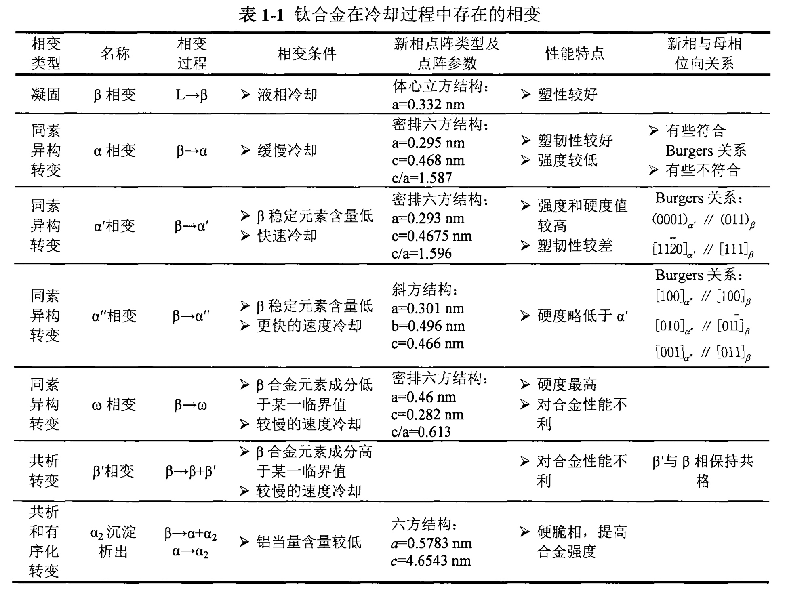

由于纯钛的塑性高，但强度很低，限制了其在工业生产中的应用。为了满足实际生产中高强度、耐腐蚀性等要求，可以向纯钛中添加一些合金元素形成钛合金。

## 合金元素
工业钛合金的主要合金元素为铝、钒、钼三种，此外还有Cr、Mn、Fe、Cu、Sn、Zr、W等元素组成，可以根据合金元素对钛多**晶**型转变温度的影响可将其分为三大类：$\alpha$稳定元素、$\beta$ 稳定元素、中性元素，形成的四种类型的相图示意图如下：

1. α稳定元素·图(a)：**提高β转变温度，扩大α相区**，主要包括合金元素铝、镓、锗、硼和杂质元素氧、氮、碳等。铝是工业中最常用的α稳定元素，通过形成置换固溶体产生固溶强化。因而加入适量的铝元素可以提高钛合金室温和高温强度以及热强性。
2. β稳定元素·图(b)、( c )：**降低β转变温度，在β相中无限固溶，扩大β相区，增大β相稳定性**的元素称为β稳定元素,它包括钼、钒、铌、钽、铁等。其中钼的强化作用最明显，可提高室温和高温强度，增加淬透性，并提高含铬和铁合金的热稳定性。铁是最强的β稳定元素之一，仅仅需要5%的占比就可以让β相保持到室温下。但含铁时熔炼时易产生偏析，因而应用较少。
3. 中性元素·图(d)：**对β转变温度的影响不大**的元素称为中性元素,主要有锆、铪和锡。锆和铪与钛的性质相似，原子尺寸也十分接近，能在相和β相中无限固溶。锆的室温强化作用弱，但高温强化作用强，通常用于热强钛合金。锡的室温强化更弱，会发生共析反应，但能提高热强性。

工业钛合金中的主要合金元素是铝，根据 Ti-Al二元系研制了一系列可焊的钛合金，除了个别的例外，实际上铝在其它所有钛合金中均存在。因此对钛合金来说 ，**Ti-Al 系的意义可以与铁基合金中的 Fe-C 系相提并论**。从重要性来看，另外个合金元素是钒和钼 。Ti-A I-V三元素是大多数高强钛合金的基础（ Ti-6Al-4V 合金是应用最广的通用合金）Ti-AI-Mo是热强钛合金的基础。

## 基本分类
钛有两种同素异构体。在882.5℃以下是密排六方结构(hcp)的α钛，882.5℃以上是体心立方结构(bcc)的β钛。常温条件下金属钛为密排六方晶体结构，其轴比（c/a=1.587）小于理想球形轴比1.633，由于其晶体结构的特殊性，赋予了金属钛良好的加工性能。两者的详细对比如下表：

|    项目    |   α-Ti   |    β-Ti     |
|:----------:|:--------:|:-----------:|
|  晶体结构  | 密排六方 |  体心立方   |
|   滑移系   |   四个   |   十二个    |
|  变形难易  |   困难   |    容易     |
|  稳定温度  | <882.5℃  | 882.5℃~熔点 |
| 氢的溶解度 |    低    |     高      |

我国按照材料退火组织组成相的比例分为将其分为三大类：$\alpha$型、 $\beta$ 型，$\alpha+\beta$型分别用TA、TB、TC表示，其中TC还可以进一步细分为近α型和亚稳定型β钛合金。

具体来讲，就是根据β相稳定元素系数$K_{\beta}$来划分，$K_{\beta}$是指合金中各β稳定元素与各自的临界浓度的比制之和，即：
$$
K_{\beta}=\frac{ C_{1} }{C_{k1}}+\frac{ C_{2} }{C_{k2}}+\frac{ C_{3} }{C_{k3}}+\cdots+\frac{ C_{n} }{C_{kn}}
$$
根据 $\beta$ 相稳定系数划分合金类型为:
* $\alpha$ 型合金 $K_\beta$ 为 $0 \sim 0.07$
* 近 $\alpha$ 型合金 $K_\beta$ 为 $0.07 \sim 0.25$
* $\alpha+\beta$ 型合金 $K_\beta$ 为 $0.25 \sim 1.0$
* 近 $\beta$ 型合金 $K_\beta$ 为 $1.0 \sim 2.8$
* $\beta$ 型 合金 $K_\beta$ 为 > 2.8 

| 元素  | Mo  |  V  | Cr  | Nb  | Ta  | Mn  | Fe  | Co  | Cu  | Ni  |  W  |
|:-----:|:---:|:---:|:---:|:---:|:---:|:---:|:---:|:---:|:---:|:---:|:---:|
| $C_k$ | 10  | 15  |  7  | 33  | 40  | 6.4 |  5  |  7  | 13  |  9  | 20  |

### α型
α型钛合金经退火处理，其组织常以**单相的α固溶体**或者以含微量金属化合物的α固溶体形式存在，主要合金元素为铝、锡、锆等α稳定元素，并少量含有钒、 钼、铌等中性元素，各个元素均可起到固溶强化的作用。

常用的α型钛合金包括TA1、TA2、TA7等。

α型钛合金的β相转变温度较高，因而具有良好的热强性、高温稳定性。焊接性性能好，并在高温环境下具有极好的组织稳定性和抗蠕变性能，在低温环境下也依然保持良好的延展性，因而适合制作各种飞行器形状复杂的外层板材。但它对热处理和组织类型不敏感，故不能采用热处理的方式强化其组织。
### β型
β型钛合金中主要有钒、钼、铌、钽等β相稳定元素，若在合金中加入少量的 铝、锆、锡，可提高β型钛合金的塑性并改善其热稳定性。

常见的β型钛合金有TB1~TB5、TB7、TB10等。

β型钛合金的显微组织 一般比α型、α+β型钛合金的显微组织更粗大。β型钛合金常表现出良好的冷成形、冷加工性能，较好的淬火态塑性以及可焊接性，但是亚稳态β型钛合金热稳定性 较差β型钛合金含有较高的β稳定元素，主要分为稳定β型钛合金和亚稳定β型钛合金。稳定β型钛合金在平衡状态下全部由稳定的β相，热处理后不易产生变化。

### α+β型钛合金 
α+β型钛合金经退火处理，所得到的室温组织为不同比例的α和β相。该类型的钛合金中除含有定量的铝元素外，还含有少量的其它元素。可采用适当的热处理方法对α+β型钛合金进行组织强化，α+β型钛合金的强度和淬透性随着β相稳定元素含量增加而提高，其锻造和轧制等加工成型性能优于α型、β型钛合金。

最常用的α+β型钛合金包括TC4、TC6、TC12等，其中TC4钛合金（等轴马氏体型两相合金）作为做早被应用的钛合金，该合金以其优越的性能占据了钛工业的大量市场，现在占到 Ti 合金总产量的 50%， 占到全部Ti 合金加工件的95％。

> α+β合金又被称为亚稳定β型钛合金，因为它在相变过程中时经过β单相区的固溶淬火后变为亚稳定的β相过饱和固溶体，**然后再经时效过程后由亚稳β相中析出大量弥散的次生α相**，故称其为亚稳定β型。这类合金可通过固溶时效而实现高强度的特征，实现了比稳定β型钛合金更为广泛的应用，虽然其拥有良好的室温强度和冷成型性能，但高温抗蠕变性能和低温塑性不如α型钛合金。 

## 显微组织
钛合金的性能是由显微组织的形态决定的, 甚至组织上的细微差异有时都会得到迥然不同的力学性能表现，显微组织形态则与元素含量、加工方式和热处理方式等环节息息相关。钛合金的基本组织有两种：

密排六方的低温 $\alpha$ 相和体心立方的高温 $\beta$ 相构成。 而且除了少数稳定 $\beta$ 型钛合金之外, 体心立方的高温 $\beta$ 相一般都无法保留到室温, 冷却过程中会发生 $\beta$ 相向 $\alpha$ 相的多晶转变, 以片状形态从原始 $\beta$ 晶界析出。片状组织由片状 $\alpha$ 与片状 $\alpha$ 之间的残余 $\beta$ 相构成, 由于其与母相之间存在着一定的结晶 学位向关系, 称为 $\beta$ 转变组织。片状组织在 $\alpha+\beta$ 两相区承受足够大的塑性变形 后再结晶球化得到等轴组织。因此, 按照晶内 $\alpha$ 相的形状变化, $\alpha+\beta$ 型钓合金 的显微组织大致分为 4 类：

1. 等轴组织：在 $\beta$ 转变温度以下 $30 \sim 100{ }^{\circ} \mathrm{C}$ 加热, 经过充分的塑性变形和再结晶退火形成。具有较好的塑性，延伸率和较高的断面收縮率，且抗缺口敏感性和热稳定性最好。综合性能好，使用广泛。
2. 网篮组织：在 $\beta$ 区加热或开始变形, 在 $\alpha+\beta$ 两相区的变形量不太大时形成。具有高的持久强度和蠕变强度，在热强性方面具有明显的优势，具有高的断裂韧性、低的疲劳裂纹扩展速率。缺点是塑性和热稳定性较低。
3. 双态组织：在 $\alpha+\beta$ 两相区的上部加热或者进行变形可以获得。双态组织兼顾了等轴组织和片状组织的优点, 等轴 $\alpha$ 含量在 $20 \%$ 左右的双态组织具有强度 - 塑性 - 韧性 - 热强性的最佳综合匹配。与片状组织相比, 双态组织具有更高的屈服强度、塑性、热稳定 性和疲劳强度; 与等轴组织相比, 双态组织具有较高的持久强度、蜻变强度和断 裂韧性, 以及较低的疲劳裂纹扩展速率 $\mathrm{d} a / \mathrm{d} N$ 。
4. 魏氏组织：在较高温度的 $\beta$ 区加热或变形量不够,时可以形成。魏氏组织具有最高的蠕变抗力、持久强度和断裂韧性, 但是其致命的弱点是塑性低, 尤其是断面收缩率远低于其他组织类型。类似于钢中的过热组织, 在实际生产过程中没有特殊的需求应尽量避免。

 **机械性能** | **抗拉强度 $\sigma$ MPa** | **延伸率 $\delta$/%** | **冲击韧性$\alpha_k/(kJ*m^{-2})$** | **断裂韧性$K_{IC}/(Mpa\cdot m^{0.5})$** 
:--------:|:---------------------:|:------------------:|:-----------------------------:|:----------------------------------:
 **片层组织** | 1020                  | 9.5                | 355.3                         | 102                                
 **网篮组织** | 1010                  | 13. 5              | 533                           | -                                  
 **双态组织** | 980                   | 13                 | 434.3                         | -                                  
 **等轴组织** | 961                   | 16.5               | 473.8                         | 58.9                               

## 钛合金的相变
钛合金中的相变主要包括：多晶转变、共析转变、有序化、亚稳相等稳转变、非等温转变等。众多研究者已将钛合金的相变类型绘制成了一个表格：

| 编号 |           相变            | 过程                                                                 |
|:----:|:-------------------------:|:-------------------------------------------------------------------- |
|  I   | 淬火过程中$\beta$相的分解 | (1)钛的马氏体：$\beta \to \alpha^{'} , \alpha^{"}$                   |
|      | 淬火过程中$\beta$相的分解 | (2)无热$\omega$相：$\beta \to \omega_{\text{无热}} +\beta$           |
|  II  | 等温转变中$\beta$相的分解 | (1) $\beta(\beta+\alpha)\to a^{"},a^{"}\text{富},a^{"}\text{贫}$ |
|      | 等温转变中$\beta$相的分解 | (2) $\beta^{'}\beta\text{富},\beta\text{贫}$                          |
| III     |  残余$\beta$相分解     |   (1)      相离析: $\beta_{\text{残}} \to \beta^{'}+\beta$                                                             |

由于β钛合金的用途更为广泛，本设计侧重于对β合金进行说明。众所周知，β钛合金按照亚稳定状态相组成可分为3类 ：稳定β型钛合金 、 亚稳定β型钛合金和近β型钛合金。其中亚稳态β合金的综合性能最好，其相变过程也最复杂。下面来介绍β相的四种重要相变：

### 亚稳定β相的分解
#条件 亚稳定β相的分解的分解过程如下：
- 当加热温度较低时，β相将分解为无数极小的溶质原子贫化区β'和与其相邻的溶质原子富集区β。
- 随着加热温度升高或加热时间延长，则根据β相化学成分不同而从溶质原子贫化区中析出w相或α”相。
- 最后在贫化区析出的α”和w相分解为平衡的α和β相。

#机理 出现这种逐步分解的原因就在于虽然成分范围宽广的钛合金，通过快速冷却β相可以保持在亚稳定状态，随后在高于室温的温度下逐渐分解，但是在温度不太高的情况下，由于密排六方点阵的α相在体心立方点阵的β相基体中生核比较困难，而一些中间分解产物比较容易生核，因此，亚稳定β相不能直接分解形成平衡的α相，而是经过一些中间分解过程，由生成的一些中间分解产物（或称过渡相）再转变为平衡的α相。至于形成哪一种过渡相，取决于加热温度和合金成分。最常见的过渡相是等温相和β’相。在500℃范围内加热时，亚稳定β相的分解过程为：

* β亚稳→β'+β→a"+β→a+β
* β亚稳→β'+β→ω+β→a+β

### 马氏体相变
#条件 钛合金自高温快速冷却时, 视合金成分不同, $\beta$ 相可转变为马氏体 ( $\alpha^{\prime}$ 或 $\left.\alpha^{\prime \prime}\right) 、 \omega$ 相或过冷 $\beta$ 相。在快速冷却过程中, 由于从 $\beta$ 相转变为 $\alpha$ 相的过程来不及进行, $\beta$ 相将转变为成分与母相相同、晶体结构不同的过饱和固溶体, 即马氏体。
#机理 我们知道马氏体转变是一种切变相变。在钛合金中发生马氏体转变时, $\beta$ 相中的原子作集体的有规律的近程迁移, 迁移距离较大时, 形成六方 $\alpha^{\prime}$ 相; 迁移距离较少时, 形成斜方 $\alpha^{\prime \prime}$ 。当 $\beta$ 相中的合金元素含量较少时, 原子位移较大, 点阵改组进行到底, 得到密排六方 $\boldsymbol{\alpha}^{\prime}$ 相; 当合金元素含量较大时, 点阵改组受到阻碍, 停留在某一中间阶段, 即形成斜方点阵 ( $\alpha^{\prime \prime}$ 相)。
#特性
 **特点** | **α'** | **α"** 
:---:|:---:|:---:
 **晶体结构** | 六方结构 | 斜方机构
 **强度**|高|低
 **塑性**|低|高
 **组织**|粗针状|细针状
### ω相变
#条件 合金成分在临界浓度$C_0$ 附近的合金从高温淬火后 ， 将在合金组织中形成一种ω相。ω相可以根据组织分为两类——无热ω相与等温ω相。

#特性 （1）**无热ω相**：当β合金元素的成分范围达到某一临界值时，合金在β相区淬火可以得到ω相。其特点是尺寸小，硬度大，脆性极大，会使材料的塑韧性急剧降低，当其含量达到80%时，合金就会失去宏观塑形。可以通过改变化学成分或者回火工艺予以控制。

（2）**等温ω相**：在淬火得到的亚稳定β相后，在随后的时效过程中，会出现$\omega \to \beta$转变，时效温度一般在100~500℃之间，相对于无热ω，β相分解为等温ω相的速度最快。其尺寸较小晶粒密度大，有方形和椭球形状两种形态，其含量越多，合金的硬度越高，塑韧性越差，当含量大约为50%时合金的综合性能较好。

### α相的形成
#条件 在相分离和ω相变不能出现的高温时效过程中，亚稳β相可以直接转变为α相，主要过程为:
1. 在位错及亚晶界上直接形成α相;
2. 经过过渡相形成a相
	1. β→β'(bcc，贫溶质)→1α和2α;
	2. β→ω(hcp，贫溶质）→lα和2α。
	#特性 1α相为片层状，2α为透镜状，但两者的晶体结构并无区别。
	在β相的时效转变中，有可能生成β'、ω、1α和2α相沉淀。β相对合金的强度无明显改善，相虽能强化合金，但会强烈降低合金的韧性。因此工业上的β合金都设计成使α相（1α和2α）作为基体中的硬化沉淀相，合金的强度则由时效形成的α相粒子尺寸、形状及体积分数控制。有实验数据表明，当合金中出现非共格的、有较大体积分数的、尺寸较大的2α型沉淀时，合金将有良好的综合性能。

### 小结

