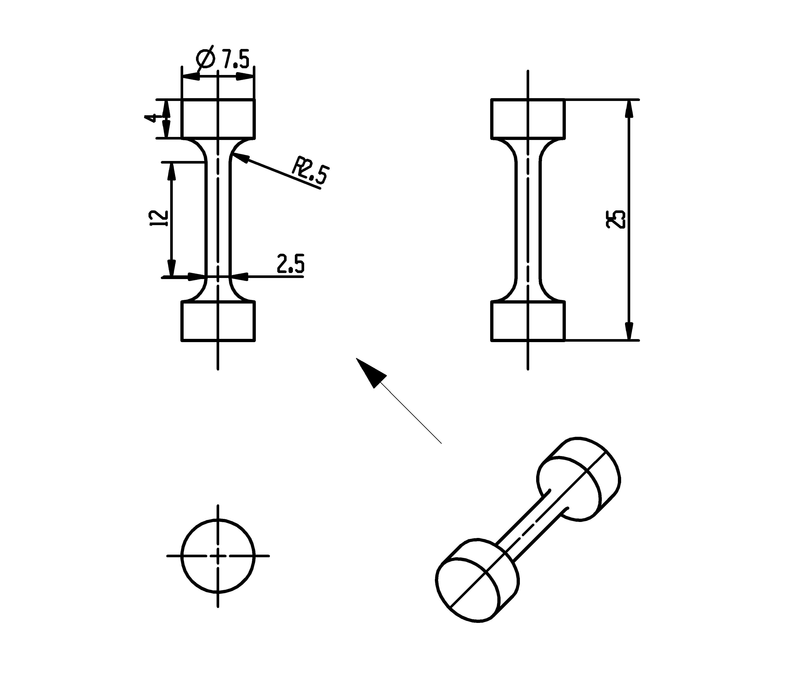

## TC4钛合金热处理工艺设计
### 工艺参数设计
1. 固溶温度【变量·5】

| 项目 | 固溶温度 |
|:----:|:--------:|
|  1   |   910    |
|  2   |   930    |
|  3   | **950**  |
|  4   |   970    |
|  5   |   990    |
2. 固溶时间【定量·1】
60min（1h）左右
3. 冷却方式【变量·4】

| 项目 | 冷却方式 |         备注          |
|:----:|:--------:|:---------------------:|
|  1   |   水淬   |  冷却至室温（约10s）  |
|  2   |   炉冷   | 冷却到室温（约40min） |
|  3   |  液氮冷  |          ——           |
|  4   |   油冷   |          ——           |

4. 时效温度【变量·5】

| 项目 | 固溶温度 |
|:----:|:--------:|
|  1   |   450    |
|  2   |   500    |
|  3   | **550**  |
|  4   |   600    |
|  5   |   650    |

5. 时效时间【定量·1】
300min（5h）左右

### 材料参数
1. 尺寸

2. 化学成分

| 元素 |    Al    |    V    |    O+2N    |     Fe     |     C      |     N      |
|:----:|:--------:|:-------:|:----------:|:----------:|:----------:|:----------:|
| 含量 |          |         |            |            |            |            |
| 标准 | 5.5~6.75 | 3.5~4.5 | $\le$ 0.25 | $\le$ 0.30 | $\le$ 0.08 | $\le$ 0.03 |
