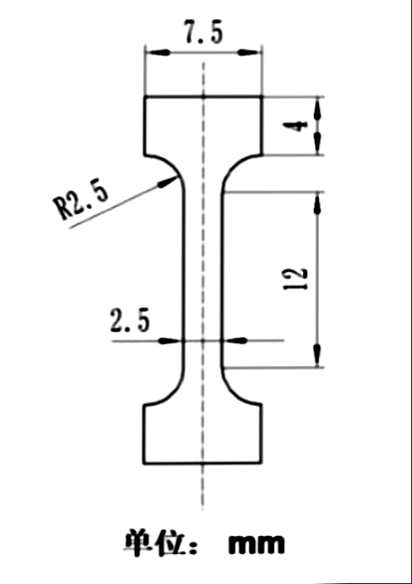
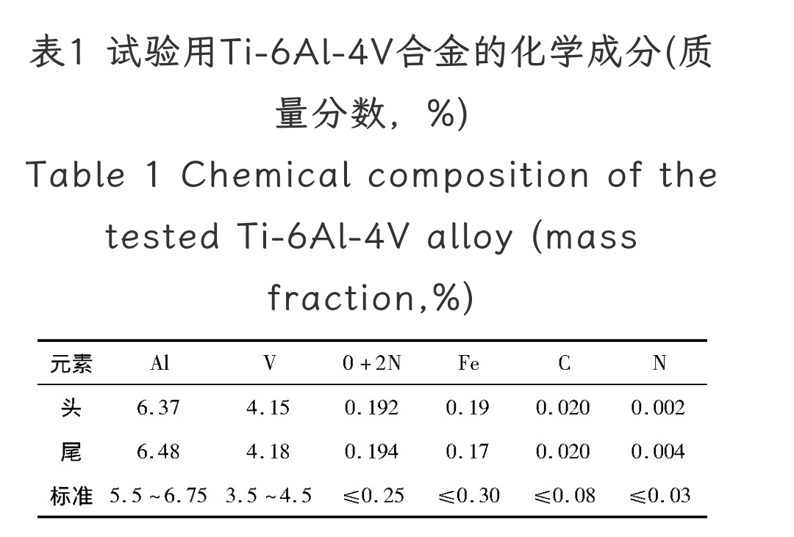

> 
当你在引用别人的时候，你在引用自己。

> 
——Sion

## 文章痕迹

<!-- timeline 2023-03-10-->
<!-- endtimeline -->


-----

## TC4钛合金热处理工艺设计
### 研究现状
### 选题来源
### 工艺参数
* 固溶一小时：940、950、960；水淬、油淬、液氮淬
* 时效三小时：300、250、200、

### 材料参数：

