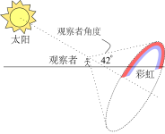
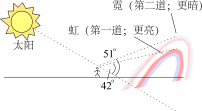
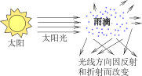
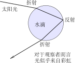
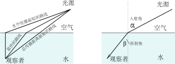
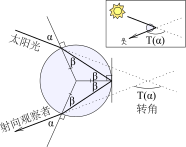

> 
这就像彩虹一样，若没有一个观察者在与含雨珠云层的反射光成23度角处，便没有彩虹。整个宇宙也是如此。我们的精神站在与宇宙成23度角处。在光线与视网膜接触时，便会产生若干新的事物，在岩石与心灵接触时也会产生若干空间。没有心灵，就没有固有的价值。

> 
——佐儿《蓝火星》

# 楔子

近来读了《明亮的泥土：颜料发明史》，对颜色越加敏感。要说自然界里最斑斓最和谐的造物，自然非彩虹🌈莫属。然而彩虹形成的原理，很多人却模棱两可。为了让更多人了解这个神奇的造化世界，本文将解释彩虹的光学原理！

# 彩虹的形成条件

我相信每一个上过学的人都模模糊糊地知道彩虹的原理：水滴在阳光的折射与反射中形成的光学现象。我也相信每一个细心观察的人都可以自造彩虹：**晴朗天气，灌口凉水，背对着太阳，抬口一喷，低头一瞧，便出了一道虹彩**。若是有条件的、有心的同学，还可以搞块三棱镜（镜子加水也可以模拟出来个），在太阳底下摆弄两番，便像牛顿一样把阳光“拆”成了七份。

有风雨的地方就一定有彩虹，但并不是人人都可以看到。一般而言，人们会在在雨过天晴的傍晚时分，在东边看到它的倩影。但是我这二十二年来，看到的彩虹，不过五六道而已。可见自然形成的彩虹，条件是很苛刻的，人们能观察到的情况更是少之又少。下面来分析一下为何彩虹那么稀有

根据这个世界的规律，彩虹形成的基本条件有二：

1. 空气里有大量的水滴💧
2. 环境中有足够的光照🔦

所以说，只要有水有光就一定有彩虹。然而能否被观察到，还需要另外一个极其关键的条件，这便是本文的目的所在—**彩虹的观测角度**。即**在满足彩虹形成条件的情况下，视线与光照平行，上仰42.5°便是彩虹的弧顶。** 当然，其它条件也会有影响，比如大气能见度、湿度，虹区水滴的大小、空气流速，等等，这些虽然不是决定性因素，但是会对彩虹的观测或持续时间产生一定影响，本人才疏学浅，所知有限，在此对其不做讨论。

# 自然条件下的彩虹观测

上部分说过了彩虹的形成条件，那么在满足条件的情形下我们怎样可以看到彩虹呢？

对于在自然条件下的彩虹，根据太阳的位置来简单划分两种情形：在日出日落时和一般情形下。

## 日出日落时

日出日落时的彩虹通常来讲是最大的。它对着太阳，以另一侧地平线上的点为中心，向外铺展，观察者的视线到彩虹顶部的仰角大约为42°。理想情况下，当太阳落到地平线之前的那一瞬间，彩虹是最大的，然而由于大气的折射与污染物的存在，会使光强减弱，看起来就不那么明显了。

## 一般情形下

一般情形下的彩虹很少被观察到，一方面是人们懒，另一方面是白天空气湿度低，雨滴蒸发快，而且白天的彩虹高度最低，除非跑到摩天大厦的楼顶，否则根本就看不到，如图所示：

## 霓与虹

当光照充分、水滴的浓度足够高的情形下，可以观察到清晰的霓—第二道彩虹，如图所示：

# 光学原理

下面让我们把目光聚焦在产生彩虹的雨云上。 来自太阳的光，遇到了水滴，然后发生了两种光学现象—折射与反射，下面我将详细进行讨论。

实际上，产生彩虹的复杂行为可以通过观察单个雨滴来解释。 这是一幅草图，展示了光穿过雨滴形成彩虹的路径。

为了充分理解这个过程，咱们先复习复习初中学的光学吧。

## 光的折射定律

光从光源到观测者的路径最快，通常是一条直线。但如果光穿过不同的介质(比如空气和水)，它会稍微改变方向，因为光速在不同的介质中是不同的。 例如，光速在水中比在空气中慢，这就导致了光路在射入点发生了弯折。

光的折射是速度与距离的博弈。首先，从光源到观测者的最短的路径是条直线，但在这条路线上，光在水中传播的距离比较长，因而不是最快的路线。其次，在水中传播最短的路线，总的传播距离又太长，因而也不是最快的[^:1]。 根据中庸之道以及矛盾的对立统一规律，在这两个路线之间的某条路径便是均衡了两者优缺点的最快传播路径。此路径即折射光路。

根据实验可以得到折射规律的定义式：
$$
\sin (\alpha)=k \sin(\beta)
$$
其中$α$和$β$分别为入射角和折射角，$k$为源介质中的速度与观察者介质中的速度之比。 值得注意的是，如果光源和观察者的位置相反(源在水中，观察者在空气中)，两者之间的最快路径是不变的。 所以入射角为β的光线从水中穿过时，折射角为α，此即所谓的**光路可逆原理**。

## 光的反射原理

简言之就是：**射入反光性材料表面的光，其入射角与反射角相等。**

----

有趣的是，折射和反射是一条定律的两种表现形式，这条定律被称为费马原理，它指出，到达你眼睛的光是沿着最快的路径传播的光。无论你在镜子里还是在水下看你的手，你看到的光线都是那些到达你手的最快路径的光线[^:2]。

# 转角

既然我们可以用数学方法解释光的某些行为，那么让我们重新审视一下雨滴模型。 为了简单起见，我们假设雨滴是完美球形，光线以α为入射角照射在水滴上发生折射，然后在水滴另一侧被反射，最后在离开水滴时再次发生折射。 光线与雨滴相遇的角度是多少?

设α为入射角，β为折射角。光路如图所示：当光线到达水滴较远的一侧时，它位于等腰三角形的底部，此三角形的两边都是水滴的半径。 光线从水滴的内壁反射回来后，又穿过水滴，形成另一个与之前完全相同的等腰三角形，离开水滴的光线的入射角是β，出射角为$\alpha$。

**我们假设T (α)是转角，也就是光线与雨滴相遇时的总转角，从直线顺时针方向测量。**

进入液滴的光被α - β旋转就像离开液滴的光一样。 反射导致180◦−2β。 我们可以把所有的角加起来
$$
T(a)=180
$$
所以光进入下降的角度α是由180°+ 2α−4β

# 光的强度

我们已经看到，如果光线以α角进入雨滴，那么(一些)光线会被转换成T角(α)。 但这并不能解释为什么你只看到沿着特定的42◦轴以上的太阳波段的旋转效果。

实际情况是，尽管光实际上通过不同的角度被转换，但从标记波段到达观察者的光比从其他地方到达观察者的光要多得多。

稍微计算一下——再加上一点微积分——就知道为什么了。 我们要计算转角T (α)相对于α的变化率。 换句话说，我们要算出dT / dα。 在我们完成之后，在我们算出α的导数dT (α) dα为零之后，我们会考虑所有这些演算与光线在42◦时的浓度有什么关系。

[^:1]:这让我想起了那句俗话：**宁走十里光，不走一里荒**。就是说赶路的时候，宁愿走十里的平展路，也不愿意走一里的荒路。现在可以反驳两句了：**先走三里荒，再走五里光。快过五里荒，强过十里光。**

[^:2]:Actually the behavior of light is more complicated than that. Light can travel along all possible paths from the source to the observer–but those rays travelling very close to the quickest path reinforce each other, while the others cancel each other out, so all the light appears to have taken this path. But that’s another story...( *Richard P. Feynman. QED : the strange the- ory of light and matter. Princeton University Press, Princeton, New Jersey, 1985.*)

