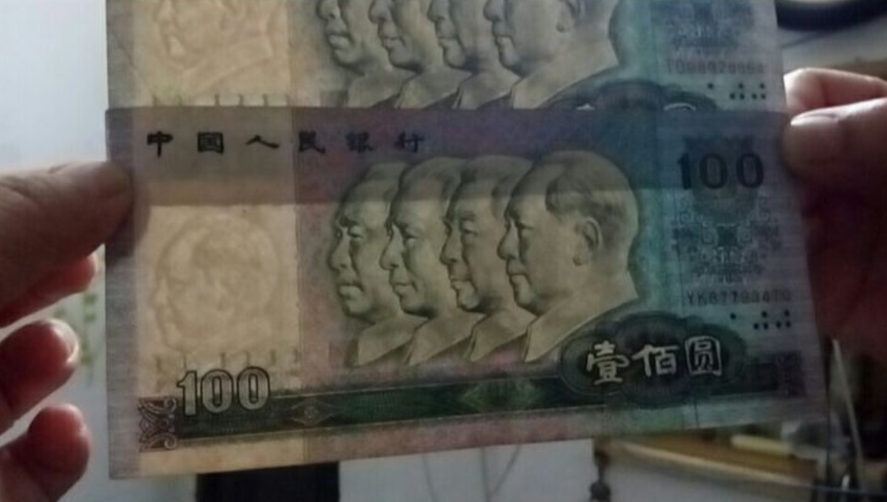

> 
自己的，不管怎样，就该是自己的。

> 
It's mine, whatever it changes to, it's still mine.

> 
——Sion

# 楔子

某日在复习《数值分析》，看累了，闲逛，发现一本书《彩色图像·数字盲水印技术》[^1]，很快就被神奇的盲水印吸引住了。刚巧复习过矩阵QR分解，里面的QR分解盲水印算法[^2]能读懂一点点。又过了将近一个月，这个种子逐渐萌发，这两天总想到盲水印的应用：NFT数字艺术加上盲水印，光明正大的不为人知的密文传送😏，隐蔽彩蛋🪅…

*但是过几个月要考研，本文就权且做一个念头的记录，等以后闲了再慢慢摸索。*



- Testa
  - test1
  - test2
- Testb
  - test1
  - test2  



# 介绍

什么是水印？

水印是一个既古老又现代的东西，最广为人知的就是隐形墨水了，而最为普遍的应用就是防伪，比如人民币中的防伪水印(只有把纸币对着亮处才可以看到隐蔽的图案)。

## 特性一

不啦不啦

## 特性二

不啦不啦

# 前置

概述：先提出问题，再引出例子或发现，然后做解释性的概要，再举出具体原始数据，并对数据进行解读，最后解读结构抽象化，呼应开始。

## 数学

布拉布拉

## 色彩空间

 操作二布拉布拉  

# 算法与实现

概述：先提出问题，再引出例子或发现，然后做解释性的概要，再举出具体原始数据，并对数据进行解读，最后解读结构抽象化，呼应开始。

## 项目地址

不理不理

## 总结二

不理不理

# 备注

### 折叠：



> 埃里克•阿约的U性曲线写作原则——4-3-2-1-3-4-5
>
> | 级别 |                            特征                             |
> | :--- | :---------------------------------------------------------: |
> | 5    |         抽象性，普遍性，通常以提出解决方案或者结论          |
> | 4    |          普遍性略低;通常以提出问题为目标;整合思想           |
> | 3    | 通常以将两个或以上的论据凑在一起,或者引出一个较为宽泛的案例 |
> | 2    |          描述;语言平实的或者解释性的概要;定场镜头           |
> | 1    |          具体;证据性;粗糙、未经加工的数据或者信息           |
>


<!-- tab 示例一 -->
不啦不啦
<!-- endtab -->

<!-- tab 示例二@fab fa-apple -->
不啦不啦
<!-- endtab -->

<!-- tab 示例三@fas fa-bomb -->
不啦不啦
<!-- endtab -->


哪个英文字母最酷？ 



[^1]: ISBN: 9787302421627, 苏庆堂,2015.12.02,清华大学出版社
[^2]: 原书第140页：基于QR分解的双彩色图像盲水印算法研究
