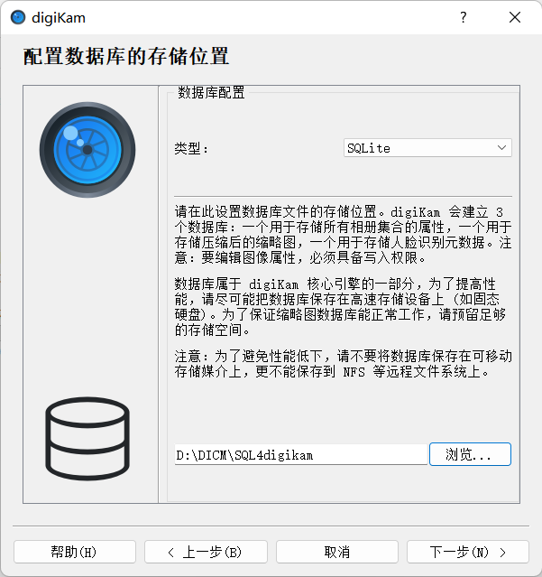
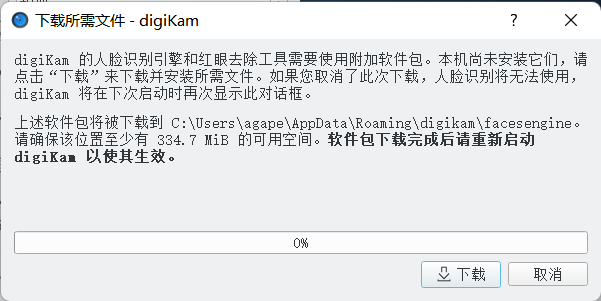
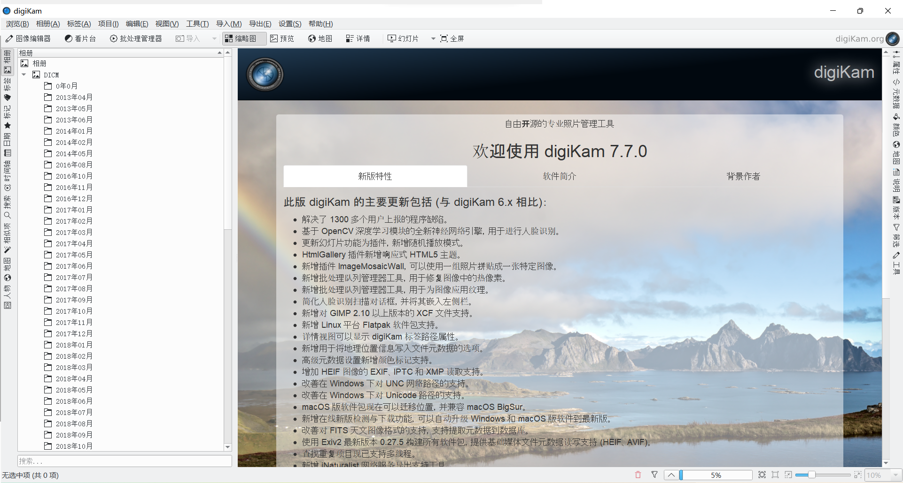

# 楔子

一开始是完全没有这个需求的，随手照，随手修改，随手发布。但随着照片越来越多，越来越乱，这看似无关紧要的照片整理也要被提上日程了。~~鲁迅~~曾说过：

> 世上原本没有摄影师，照的相多了，便成了摄影师。

# 简单整理

# DigiKam[7.7.0]

> 一款自由开源的专业图片管理程序

从下载开始就感觉很不错了，下载时会根据地理位置找到最近的镜像源，好贴心😻！安装过程有很详细的说明，

