随着纪录片「指环王·力量之戒」的播出，精灵三戒的神秘制造工艺逐渐公之于世，但真正的关键却讲的很是粗略。笔者本着刻苦钻研的精神，历尽千辛万苦，威逼利诱了**托尔金**的后人，终于破解了三戒的制造工艺。秉持开源精神，特此公开。

## 选材

一般认为，精灵三戒本身是由秘银、纯金、纯银三个元素的合金构成，并镶有宝石。可以给予持戒者强大的力量。

### 秘银

秘银是一种银白色的金属，质量轻、硬度高，具有极佳的延展性，被认为是“轻如羽毛，坚如龙鳞”。

> 其原型是钛、铝、陶瓷等元素的混合[^1]。钛的一些特性和秘银很类似，比如强度，明亮的银色光泽，抗腐蚀性，而且很轻。

秘银矿藏在被炎魔侵占之后，极为稀有难得，下图矿工中广为流传的秘银矿藏地壳分布图：

### 金与银

维林诺(Valinor)出产的纯度极高的纯金、纯银。纯度必须达到999999K。

### 宝石

1. 金刚石：拥有水的能量，可以制成“能雅·水之戒”
2. 蓝宝石：拥有气的能量，可以制成“维雅·气之戒”
3. 红宝石：拥有火的能量，可以制成“纳雅·火之戒”

## 金属学原理

由秘银(MithRil,简称Mr)、金(Au)、银(Ag)的性质可知：三者可在液态下无限互溶，在固态下则完全互不溶解，其中任两个组元具有共晶转变[^2]。这满足三相共晶合金的特征，根据学报提供的信息可知，该合金的相图模型如下：

研究表明，在420°时冷却的合金按照1:80:20的比例时，具有最佳的性能，下图为此温度下的三元相图的投影图。

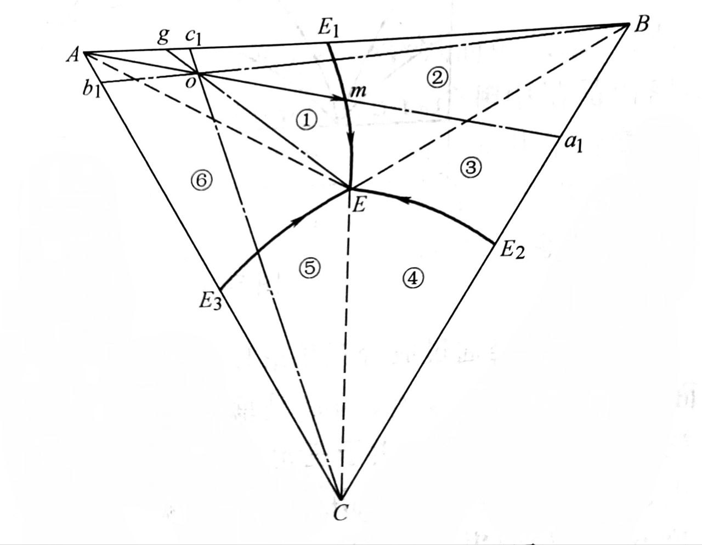

该合金在冷却至液相面时开始结晶，析出初晶A。随着温度的不断降低，A晶体不断增加，液相的数量不断减少。由于A晶体的成分固定不变，根据直线法则，液相的成分由$o$点沿$A_o$的延长线逐渐变化。当液相的成分变化到与$E_1 E$线相交的m点时，开始发生二元共晶转变：$L\to A+B$。随着温度的不断降低，两相共晶体（A+B）逐渐增多，同时液相的成分沿$E_1 E$二元共晶线变化。当液相的成分变化到$E$点时，发生三元共晶转变：$L\to A+B+C$，直到液体全部消失为止。之后温度继续降低，组织不再发生变化。故该合金在室温下的平衡组织是 初晶A+两相共晶体（A+B）+三相共晶体（A+B+C）。

下图为该合金室温下的组织示意图即$Mr-Au-Ag$三元合金的室温组织（初晶+两相共晶体+三相共晶体）。其中黑色$P$的为秘银初晶相，$\alpha$、$B$分别为秘银-金两相共晶体、三相共晶体。

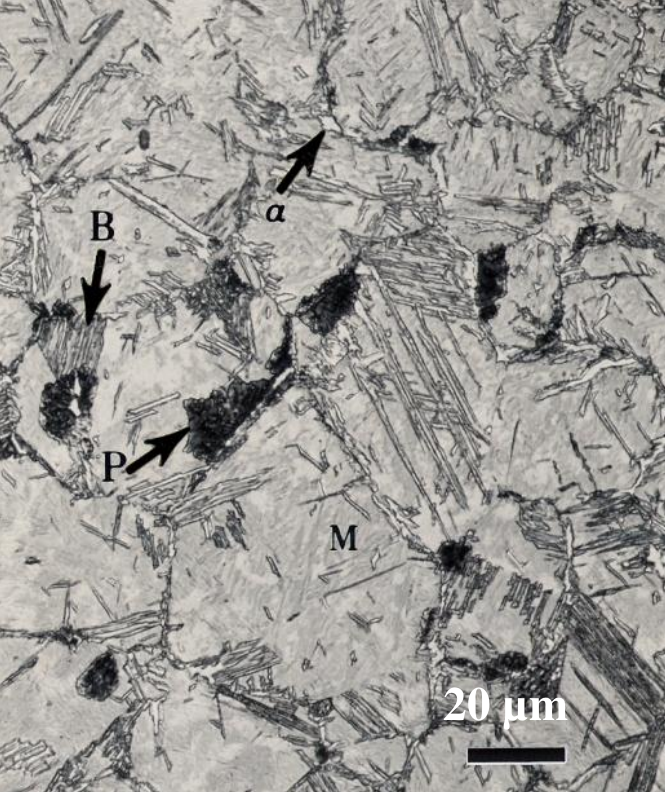

注：也有学者提出在550度下,20:60:20得到的合金性能更好，但是需要更到的秘银，其室温组织如下：

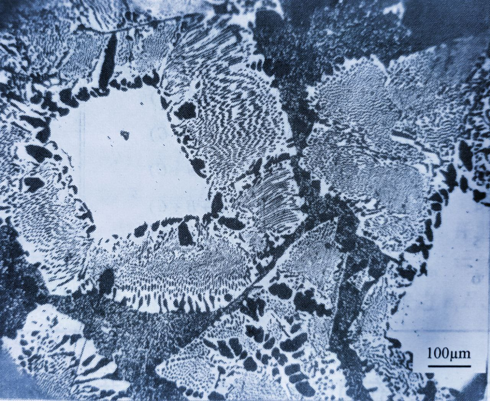

## 制造工艺流程

### 融化

在1800°的温度下，将1:20:80的秘银、纯金、纯银融合到一起。充分搅拌，使秘银可以与金属充分混合，以便于凝固时秘银的强化相可以均匀的分布在金银的a相之中。

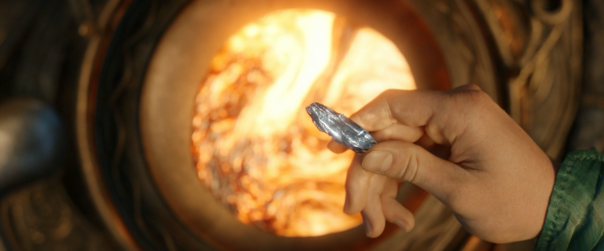

有学者对该液态合金进行了详细的研究，提出了三相合金液的黏度规律，笔者有幸参与其中，此模型被称为：C-S(Celebrimbor-Sion)模型，表达式为：
$$
\eta=(X_1\eta_1+X_2\eta_2+X_3\eta_3)(1-\pi\frac{H^m}{RT})
$$
其中$X_i,\eta_i$分别为纯溶剂和溶质的黏度及各自在溶液中的摩尔分数，$H^m$为混合热。

### 制锭

把液态金属浇铸成成合金锭，冷却速度不要太快，采用自然缓冷，

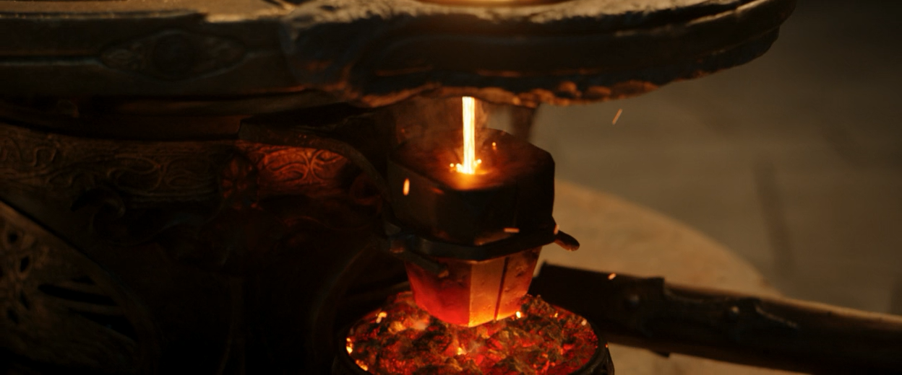

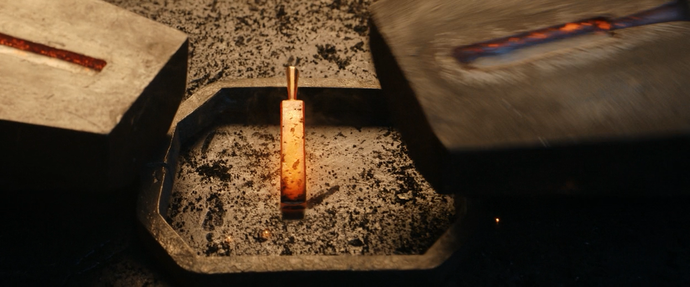

 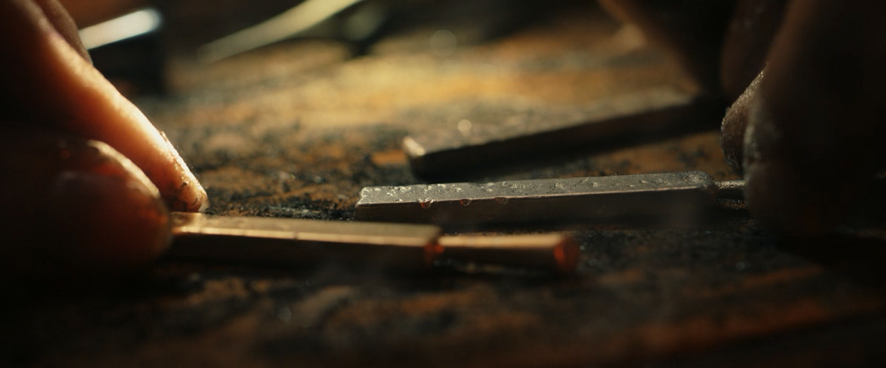

### 造型

再次通过热处理来增加强度耐磨性，然后塑性加工来做成戒指的外形。

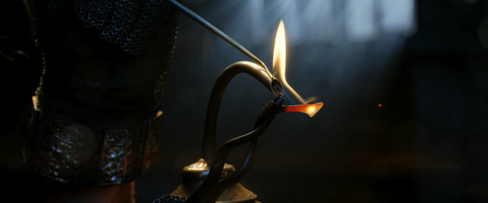

### 镶钻

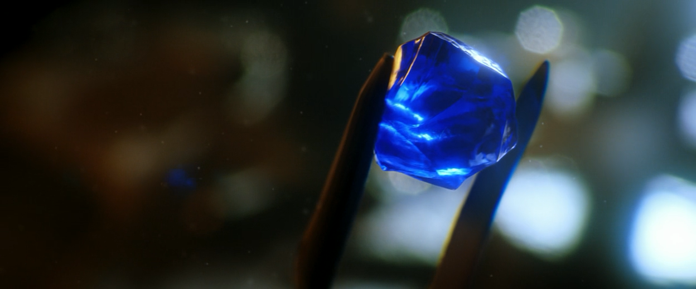

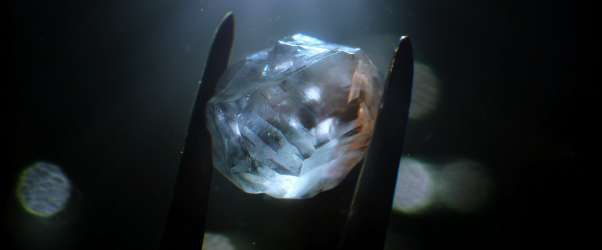

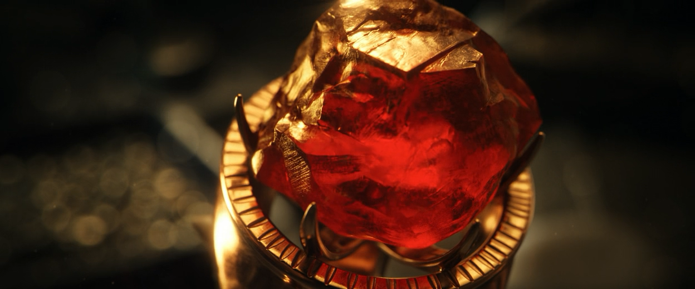

## 成品展示

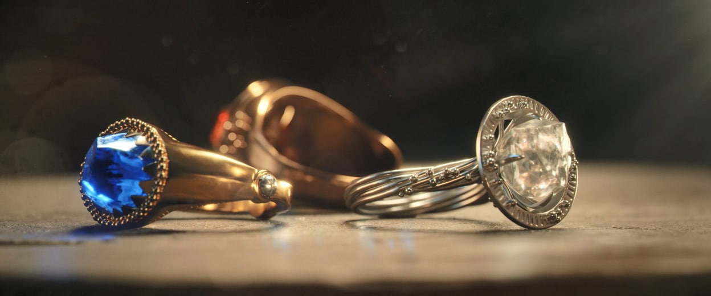

## 参考文献

[^1]:[秘银·魔戒中文维基](https://lotr.huijiwiki.com/wiki/%E7%A7%98%E9%93%B6)

[^2]:[凯勒布林博](https://lotr.huijiwiki.com/wiki/%E5%87%AF%E5%8B%92%E5%B8%83%E6%9E%97%E5%8D%9A),[安那塔](https://lotr.huijiwiki.com/wiki/安那塔).秘银与金银三相复合材料的性质研究[E].[埃瑞吉安珠宝协会研究学报](https://lotr.huijiwiki.com/wiki/埃瑞吉安),(SA)1500,53(8):2766-2770
