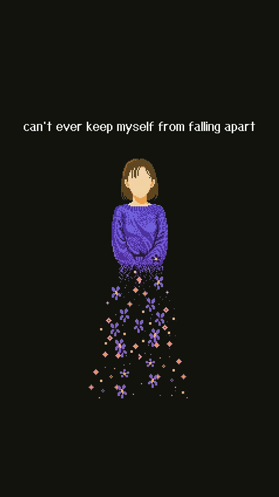

> 
暴虎冯河，死而无悔者，吾不与也。必也临事而惧，好谋而成者也。

> 
——论语·述而

最近总是轻飘飘的，像根豆芽菜，根上一点土也没有，不知是上天还是入地。啊，这熟悉的丧的感觉，又到了骂自己的时候了。

我从不是一个自信的人，我仰赖批评，仰赖尖酸刻薄的批评去变清醒。然而没人对我当头棒喝『秦时𨍏轹钻』，没人骂我，没人想打破“规则”去提醒我。我知道，没人比我更了解我，没人能比我更彻底地批评我，要批评，还得是自己来做。

## 我
> 所有的生灵都可以赤身裸体，所有的情绪都可以沸反盈天。－人间食粮

为什么文章里不能用“我”？

非说要用什么咱家、什么博主、什么所有者、什么通过调换语序来忽略“我”，

不！我今天偏偏要这很多很多很多“我”！

蠢吗？幼稚吗？stupid？是的，但我偏偏要用“我”！

我！

我！

我！

我讨厌喜欢，我讨厌被喜欢，我讨厌喜欢被喜欢

我讨厌审视，我讨厌被审视，我讨厌审视被审视

我讨厌定义，我讨厌被定义，我讨厌定义被定义

我讨厌注意，我讨厌被注意，我讨厌注意被注意

我讨厌预测，我讨厌被预测，我讨厌预测被预测

我讨厌表达，我讨厌被表达，我讨厌表达被表达，我厌恶被表达 表达被表达

我讨厌讨厌，我讨厌被讨厌，我讨厌讨厌被讨厌

所以

...

所以

我欢喜讨厌

我欢喜表达

我欢喜预测

我欢喜注意

我欢喜定义

我欢喜审视

我欢喜欢喜

## 迷匿畔
>  初秋雨夜，檐下见伊，心动而为伊作。

汝之倩影，匿兮吾畔。
目之有触，汝影将乱。
是不敢及，是不敢及。

汝之沁语，迷兮吾畔。
耳之有见，汝语未乱。
默之斯听，默之斯听。

汝之温香，漫兮吾畔。
鼻之有觉，汝香忽散。
是不敢闻，是不敢闻。

汝之浅意，谜兮吾畔。
心之有动，汝意徜徉。
默之斯想，默之斯想。

不知汝名，不知汝意。
汝近吾畔，如常如往。
斯冰融化，斯火融化。
吾欢喜之，不忍破之。
吾欢喜之，不忍离之。

!(../../../images/20230709/IMG_20230821_1259480-01.jpeg)

![(../../../images/20230709/IMG_20230821_0857443-01.jpeg)
> 晨如往，伊不见，神伤而作。

七夕之日，汝影不见。
汝之倩影，顿失吾畔。
寻之不得，心兮慌乱。
汝名不知，汝影不见。
斯恋未始，斯人不见。
虽知其终，痛亦难挡。
过兮以往，来者吉祥。

