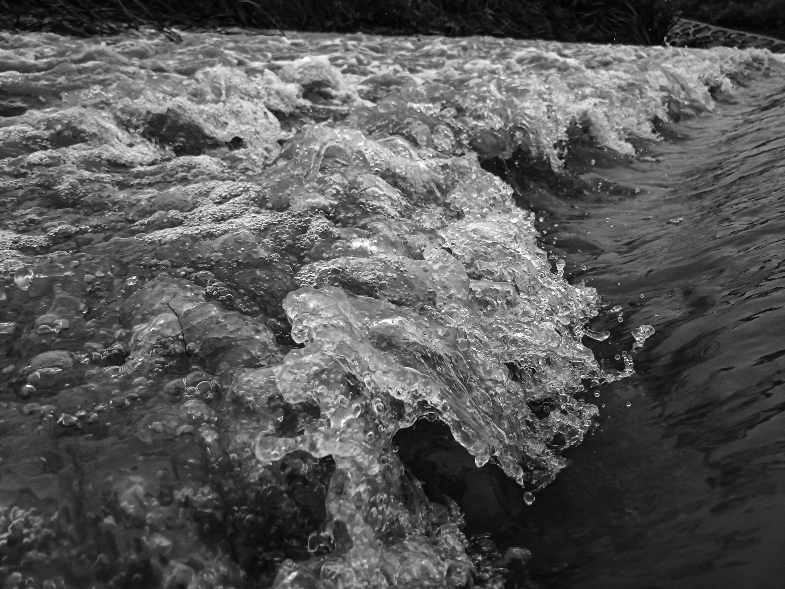
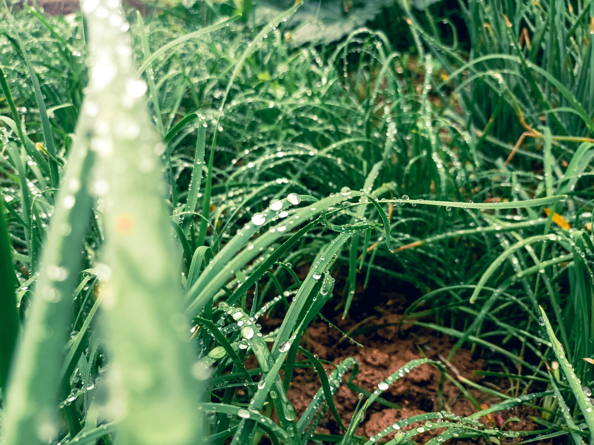


本文为此博客文学类内容采用文言文写作的初次尝试，如见文法有不得体处，万望有识者肆意批评！

>癸卯仲夏四月晦，昼小雨，是夜忽风雨潇潇，独行于河旁，近来之变故与未来之烦忧郁积于胸，欲借几点汁墨，遣无名之杂感，浇胸中之垒块，遂作此篇于手机上。

余以西元二千零二十三年六月，自迪化[^1]乘火车，经六千里，越戈壁荒滩、历河渭，经一昼夜乃至于宛。

出站台走，终脚踏实地，眼见定物[^2]。至南广场，乃寅时整，未见晓色。东方太白，华光熠熠，月失颜色。余一人携行李，踞于台阶以待天明。

去年举试[^3]皆失，然究其缘由，大抵三分在人，七分天意，不甘此结果，欲再试之，心中常无限豪情，来往冲撞，故肆业前未曾找寻半个工作。然此番归来，穷其究竟，仍一无所有，真无颜见乡中父老邻里，又觉无限感伤与怀疑。

忽拂面一阵晨风，竟有几分微热，如向晚的风一般，毫无凉意。乃觉知，习习晨风自浮热晚风来，熬煎过重重酷热，徐徐清之，方成清爽。又思晨风经日晒气蒸，徐徐动之，亦将化做晚风。二者阴阳浊清，互相转换，变换无穷。然人生之起伏何不如此也，上下五千年，寰宇八万里，未有进而不退者，吾何可悲也乎？

心始平静，作《晨归》以寄托之：

残月出新，  

晨风自晚。  

阶前待曦漏，

悉索虫声渐。


连日大雨，河水漫涨，极近而观，颇有恶浪之姿态，摄之

| | |
| --- | --- |

累月在西北，整日所见，皆白山黄土，险峰恶岭，黑羊瘦马，零星草木，不堪为夏日之景也。今日漫步于河畔，滂沱雨水中，举目皆绿，甚觉万物青葱可爱。水边花草，畦中果菜，路边银杏，皆可美，可悦，可喜也





---


一切文学艺术形式，包括文言文在内，都是「器」，作为载体，无所谓新旧之分，优劣之别。文学不同科学，艺术不同技术。科技也许需要不断创新，不断进步，而文艺形式，无论新与旧都有其存在价值，绝不能说西洋抽象画要胜过国画，东洋式现代书法要胜过传统书法，话剧歌剧要胜过京剧。

吴芳吉说：「文学只有真伪，没有新旧。」文学的生与死，并不在于使用什么语言文字，而在于它本身的内容与艺术是否有存在的价值，内容虚伪、艺术拙劣的当然是死文学，甚至称不上是文学。一旦文学沦为政治的附庸，成了帮闲文学、遵命文学，那就如粪上之英，朝生暮萎，真的是死文学了，这与是否文言无关。二千年来，死文学绝大多数早被历史淘汰，能流传下来并为人们所熟知的优秀的文言诗文，历久而长新，至今仍葆有活活泼泼的生命力。

---
在二十一世纪，学习和创作文言文有什么现实意义呢？除了教科书中所说的内容之外，还应有以下几点：

一、传承高贵，促进社会文明

文言文的世界，是一个以「君子」为人生理想的世界。儒学，可以说是君子养成之学。君子，高尚尊贵，才德出众。历代的读书人努力进修，以君子的标准严格要求自己，自省自觉，自尊自胜。中华是文明之邦，礼义廉耻，是古代贵族言行的准则，是孜孜以求的美德，是高贵的象征，是传统文化精神核心价值所在。君子立身处世之道，是「以天下为己任」的顶天立地的担当，故以「向上一路」指示人们，刚健弘毅，自强不息，仰山瞻日，努力去接近高贵与荣光。文言，一种高华典雅的语言形式，是传承高贵的纽带，它本身涵蓄着贵族文化礼仪的余韵流风，为社会各阶层提供用之不竭的精神力量，人们浸毓日久，气质变化，仪表举止自能温、良、恭、俭、让。有了高贵的精神和正常的伦理，人际关系和谐，社会健康稳定。

新文化运动，是一场浅俗化的运动。文化虚无主义者以过激的手段摧毁了贵族精神、精英文化，也就从根本上损害了福斯文化。向下看齐，而不是向上看齐，失去了向上的指引，福斯文化也就不可避免向下滑落，严重地妨碍社会精神文明的进步。如今，人们已痛切地认识到这场运动带来的恶果，不少有识之士奔走呼吁，要重建社会精神文明。只有形成健全的文化价值体系，纔能实现真正的长治久安。

二、提升审美层次，雅化白话

古人常谓文章以体制为先，辨体，更是衡文的首要之务。体有尊卑之分，雅俗之别。而文学语言与生活语言也有文野与精粗之别，只有加工、美化了的语言，纔可提升为文学语言。「文」与「言」分离是正常的、必要的，即使在今天，白话文也不等同白话，白话文还需继续雅化。也许未来的白话文中，会形成「雅文」与「俗文」两种文体，如同文言与白话那样。

近百年，社会制度的变革和科学的发展，加剧了语言的俗化过程。在网络时代，微博的流行，带来了新的契机，也有负面的影响。白话文的低俗化、痞子化已至极端。白话文要成为完美的文学语言，成为纯正的「雅文」，要在审美层面上提升，还得回过头来向文言文学习和借鉴。

白话文是文言文的后续与延伸。林纾云：「古文者，白话之根柢，无古文安有白话？」梁启超认为，要作好白话文，「文言的功夫应该很深」。朱光潜也说：「想作好白话文，必要读文言文。」白话文由于易学易写，也就容易粗制漤造，失去文言的滋润，白话更会变得粗糙干枯。好的白话文，须用加工、美化了的语言去制作。胡适所主张的「以平淡的谈话，包藏着深刻的意味」，正是文言所长。文言文惜字如金，简练如诗，是最精美的文字，也是最好的范本。文言文中不少词汇、典故，还可以继续进入白话，不断被吸收、融化。文言文遗留下来大量成语，已成了现代汉语中重要的组成部分，言简意赅，大大地丰富了白话文的表现力，提高了白话文的素质。这一笔丰厚的文化遗产，须好好继承，更不应随意糟蹋。白话文今后的趋势虽然难以预测，作为当代文明的重要载体，白话文有着无限广阔的发展空间，任重而道远。我们还是希望未来的民族语言，可以更文明些、高雅些。

三、学习文言创作，继往开来

近三十年，传统文化重新进入人们视野，大量古代文献整理出版，青年学子得以接触优秀的文史典籍。尽管是长期的隔阂，雾掩云遮，文言，依然是许多人心中的高洁的圣域，有志者还期盼着向上攀跻。如今，不少文学青年重新学习这种本已不太熟悉的文体，并试图创作文言文及诗词。当代人从小就生活在白话文无边的旷野中，文言，只是偶然入望的天际云山，在这种语境中成长的青年，要领悟文言独有的情调、语感，实在不易，学子们不妨多读一些文言典范之作，唤回历史文化的记忆，对传统文明产生认同感，并作一些写作练习，增强切身感受，丰富自己的语藏，掌握基本的写作技巧。

当代的文化人，尤其是讲授、研究古代文史的大学教师，也应尝试用文言写作。如果没有创作经验，缺乏感性认识，则如雾裏看花，不知个中情味，所谓研究，也只能是掠影浮光，难以探微索隐。不关注、不实践文言写作，对于研究者自身来说，无疑也是一大缺失，正如钱锺书那稍有点尖刻的比喻，应羞于自己的无能为力。诗词创作需要天赋，不是人人皆可以为之；而写出合格的文言文，只要多诵读，多涵泳，自然水到渠成，没有学不会的。

学习写作文言文，第一步骤就是仿作。对前代优秀文学借鉴、吸收。吴宓云：「文章成于摹仿，古今之大作者，其幼时率皆力效前人，节节规橅，初仅形似，继则神似，其后逐渐变化，始能自出心裁，未有不由摹仿而出者也。」摹仿，是学习最有效的手段，是所有文艺门类的初学者必经之途，未经这一步的，在行家眼中，只是徘徊于门外的「爱好者」而已。摹仿，宜取法乎上，先难后易。不要以为浅近的文言易学易写，便随意仿效，草草书成，一成习惯，则难以自拔，再也不能深入古人的堂奥了。一入手就要摹仿古代的佳篇，无论是左、马、班、扬，还是韩、柳、欧、苏，只要是第一流之作，都可以作为范本。以庄敬之心，逐字逐句体味古人的用心、作意，吟哦背诵，熟习后纔能领悟语感。句字的平仄交互，字眼的「响」、「哑」，也须注意。在这过程中，要尊重文言固有的程序规矩，不应逾越。慢慢掌握词汇、句式、章法，然后纔试行仿作。先精一家，再广为取法。吴芳吉谓「从事文学原不可以一家一书自足，其必取法百家」，实是个中人语。好的文艺作品，是由感情加上沉思而创作出来的。没有感情，则不足以动人，没有沉思，则未能深刻。文言文，由于它语言上的特性，成文较慢，则更宜于沉思。遣词造句，有如沙裏淘金，细细选择最宜于表达感情的词汇，力求优雅精微，曲深隽永。写作过程也是与古人对话的过程，努力去领略汉风、唐韵、宋意，感悟古人的文化品格与伦理精神。

文言文有多种体裁，各有其不同的语言形式、表现形式以及审美形式，学者须细细揣摩，掌握各体的特色。古时文体分类体例不甚画一，如〈明文海〉分体二十有八，每体之中，又各为子目。清〈古文辞类纂〉则分为十三大类。大抵最要者有论辨、传状、碑志、赠序、书牍、序跋、杂记、箴铭、庆吊等，各有功能。进入民国后，文言文使用范围显著缩小。到了当代，就只剩下序跋、书牍、杂记、碑传几类较为常见，其余的多已弃置不用了。文言文又有散文与骈文之别。骈文是一种很特异的文体，在乎散文与诗之间，字句整齐匀称，讲求声调韵律，多用四言六句，故又称「四六文」。文至骈体，可谓已臻形式美之极致。唐宋以还，有所谓散、骈之争，即古文与时文之争，势同水火，各不相让，虽然如此，却不似后世之文、白之争，拼到你死我活为止，不少古文家能作四六俪偶之文，骈文家亦能散体。骈体文与散体文，同途并驾，已历千年。当代颇有热心人鼓吹写赋与骈文，作品极多，佳者则罕见。「能观千赋，然后言赋」，今之赋家，谁能解此？


[^1]: 迪化：乌鲁木齐古称。
[^2]: 定物：自造词，表示不运动的物体。
[^3]: 举试：自造词，保研与考研的别称。