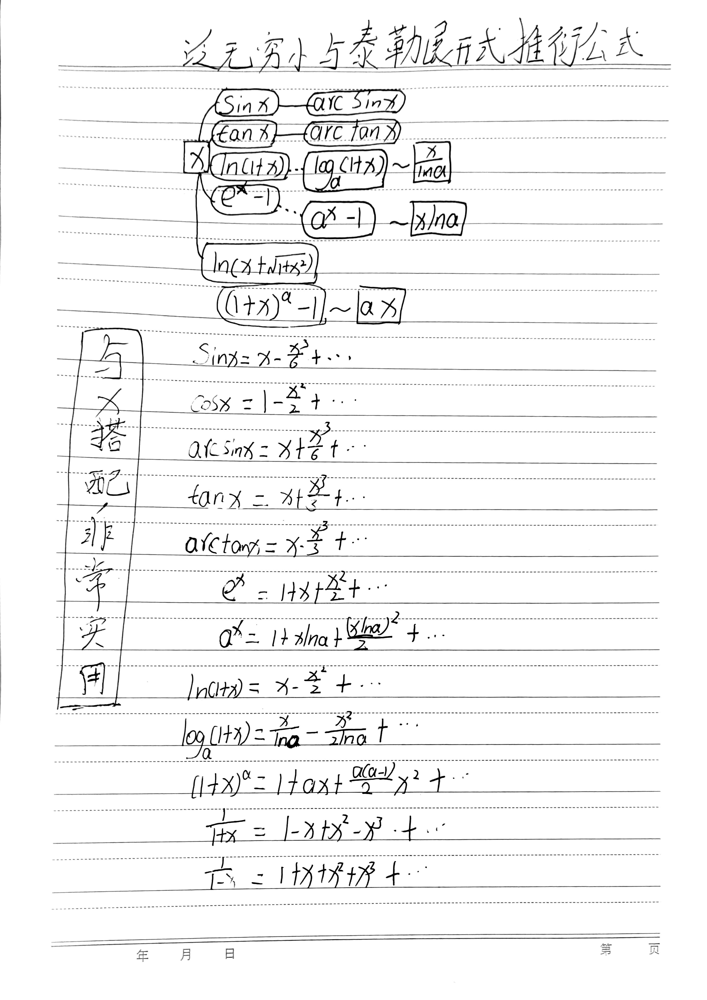
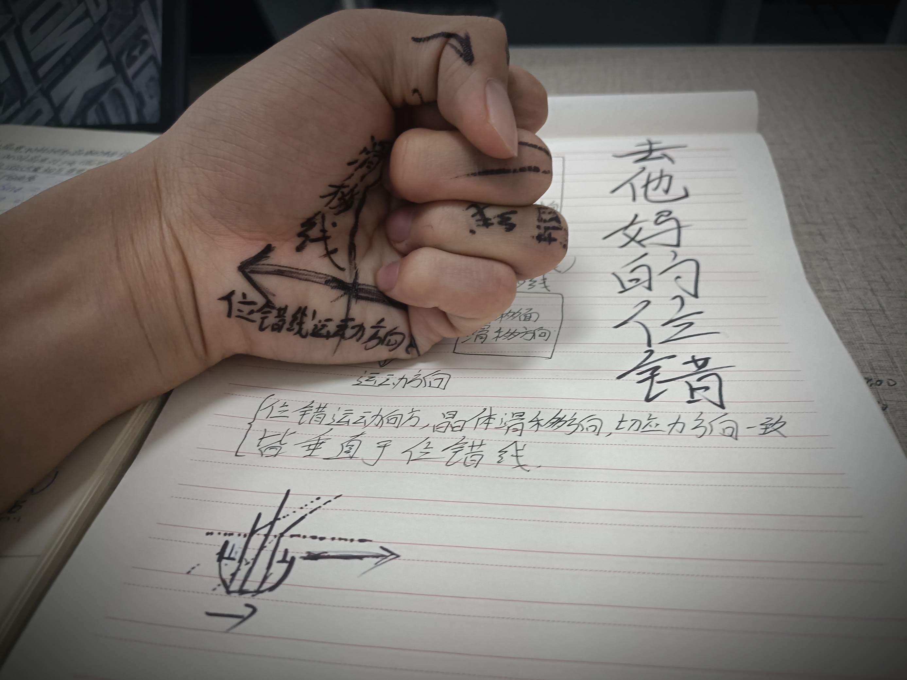
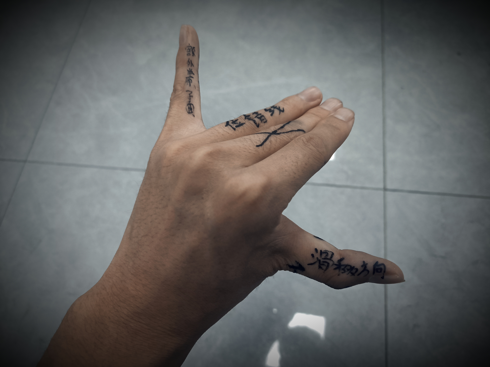
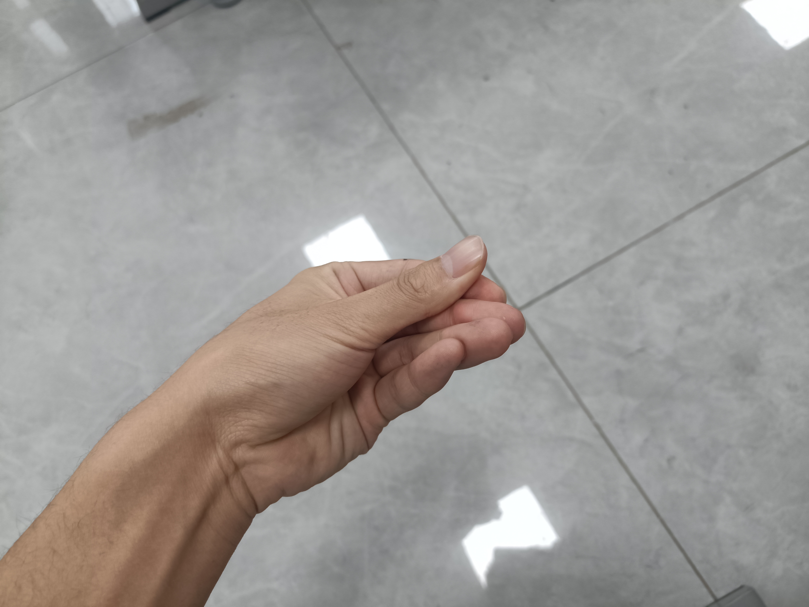
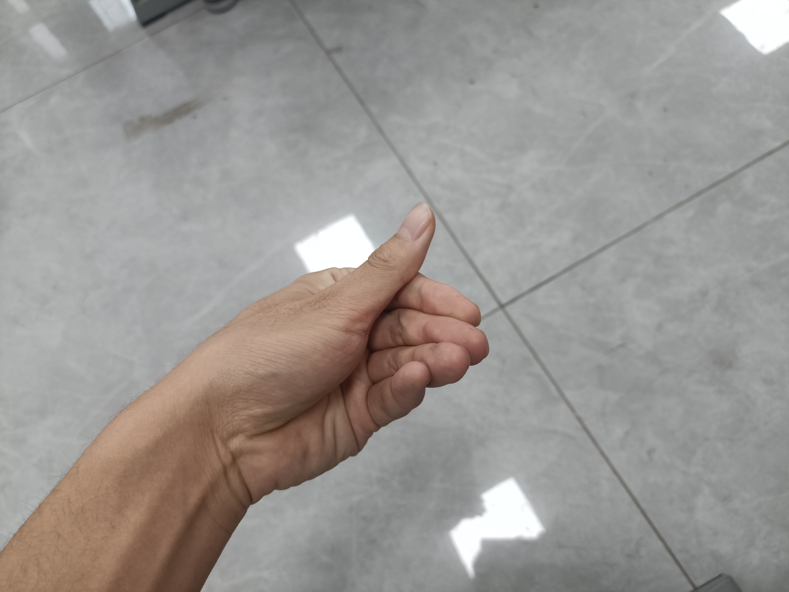
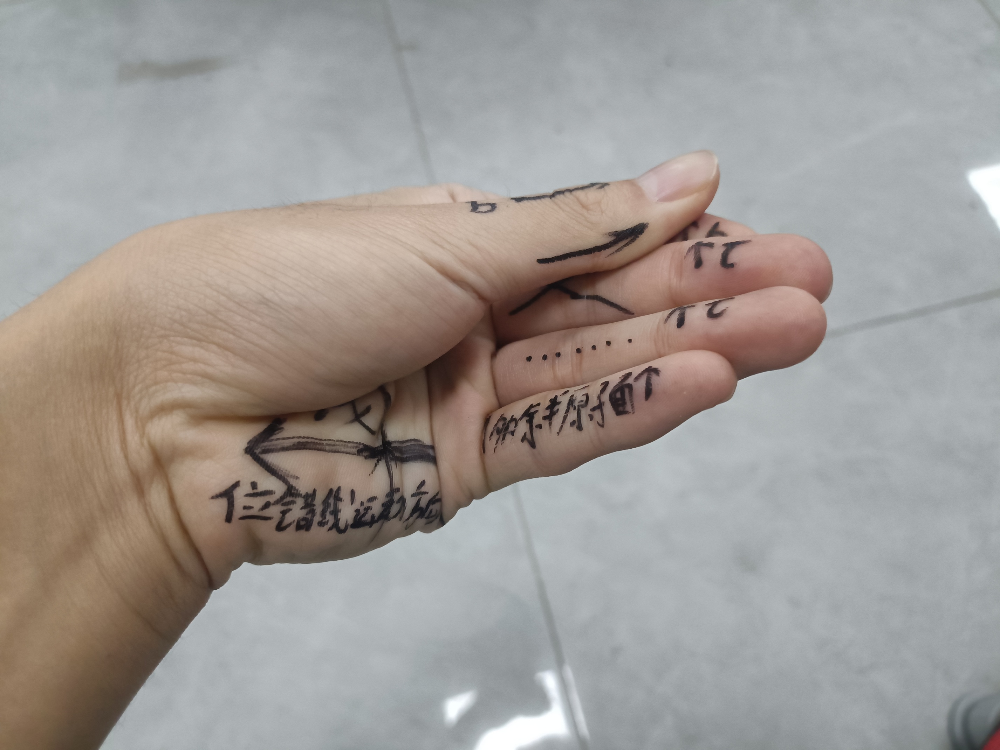

> 
Nothing can dim the light which shines from within.（世上没有任何东西可以遮住的内心深处发出的光芒） 

> 
——Maya Angelou

# 阅读
阿城·『洗澡』
> 草原大得孤独，白云美得忧愁，我不知道是不是碰到了最好的马，也许我还没有走遍草原。

## 数学必背公式

## 位错模型
滚蛋吧，模棱两可！

### 刃型位错

### 螺型位错
过程可以用『Money💰』的手势来理解：

代表的含义就是：

> 👆🏻螺型位错的位错线运动方向标在小拇指上才对
## Kindle待机监测
* 2022-12-10 12:49:27 日常使用接近四天 电量69%
> 电梯测试从上到下，从下到上那个用时比较短？
>- 从3楼上到4：17秒
## 困
冬冷夏热，春困秋乏，一年四季都在困😪😪😪😪😪。