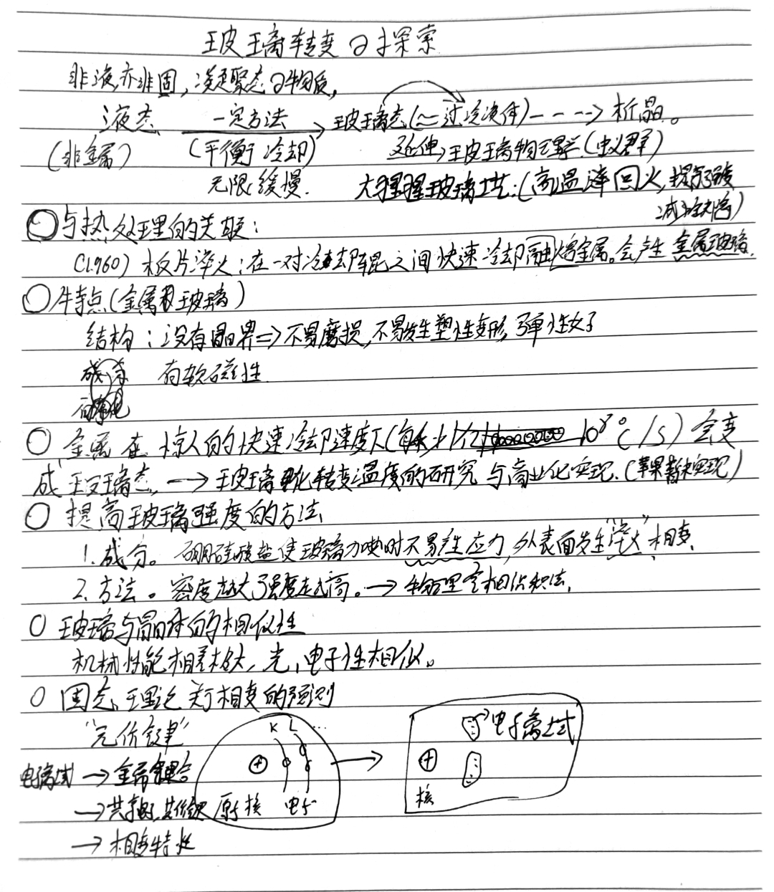

 ## Daily Quote

> The value of experience is not in seeing much, but in seeing wisely. (William Osler)
> 人生经历的价值并不在其多少，而在于是否睿智地去感悟。（威廉·奥斯勒）

 
今夜林中月下的青山，无可比拟！仿佛万一，只能说是似娟娟的美女，虽是照人的明艳，却不飞扬妖冶；是低眉垂袖，璎珞矜严。

流动的光辉之中，一切都失了正色：松林是一片浓黑的，天空是莹白的，无边的雪地，竟是浅蓝色的了。这三色衬成的宇宙，充满了凝静，超逸与庄严；中间流溢着满空幽哀的神意，一切言词文字都丧失了，几乎不容凝视，不容把握！
 
今夜的林中，决不宜于将军夜猎——那从骑杂沓，传叫风生，会踏毁了这平整匀纤的雪地；朵朵的火燎，生寒的铁甲，会缭乱了静冷的月光。
 
今夜的林中，也不宜于燃枝野餐——火光中的喧哗欢笑，杯盘狼藉，会惊起树上稳栖的禽鸟；踏月归去，数里相和的歌声，会叫破了这如怨如慕的诗的世界。
 
今夜的林中，也不宜于爱友话别，叮咛细语——凄意已足，语音已微；而那抑郁缠绵，作茧自缚的情绪，总是太“人间的”了，对不上这晶莹的雪月，空阔的山林。
 
今夜的林中，也不宜于高士徘徊，美人掩映——纵使林中月下，有佳句可寻，有佳音可赏，而光雾凄迷之中，只容意念回旋，不容人物点缀。
 
我倚枕百般回肠凝想，忽然一念回转，黯然神伤……
今夜的青山只宜于这些女孩了，这些病中倚枕看月的女孩子！
假如我能飞身月中下视，依山上下曲折的长廊，雪色侵围阑外，月光浸着雪净的衾绸，逼着玲珑的眉宇。这一带长廊之中：万籁俱绝，万缘俱断，有如水的客愁，有如丝的乡梦，有幽感，有彻悟，有祈祷，有忏悔，有万千种话……
 
山中的千百日，山光松影重叠到千百回，世事从头减去，感悟逐渐侵来，已滤就了水晶般清澈的襟怀。这时纵是顽石的钝根，也要思量万事，何况这些思深善怀的女子？
 
往者如观流水——月下的乡魂旅思，或在罗马故宫，颓垣废柱之旁；或在万里长城，缺堞断阶之上；或在约旦河边，或在麦加城里；或超渡莱茵河，或飞越洛矶山；有多少魂销目断，是耶非耶？只她知道！
 
来者如仰高山——久久的徘徊在困弱道途之上，也许明日，也许今年，就揭卸病的细网，轻轻的试叩死的铁门！天国泥犁，任她幻拟：是泛入七宝莲池？是参谒白玉帝座？是欢悦？是惊怯？有天上的重逢，有人间的留恋，有未成而可成的事功，有将实而仍虚的愿望；岂但为我？牵及众生，大哉生命！
 
这一切，融合着无限之生一刹那顷，此时此地的，宇宙中流动的光辉，是幽忧，是彻悟，都已宛宛氤氲，超凡入圣——



## 材料科学基础
我昨天真的脑袋被驴踢了，共价键具有饱和性和方向性。离子键健什么都没有。
### 磁性
居里温度是消磁的温度，那有没有一种热处理方法可以产生磁性？
似乎马氏体是有磁性的，因为铁素体的原因吗？
## 玻璃转变
