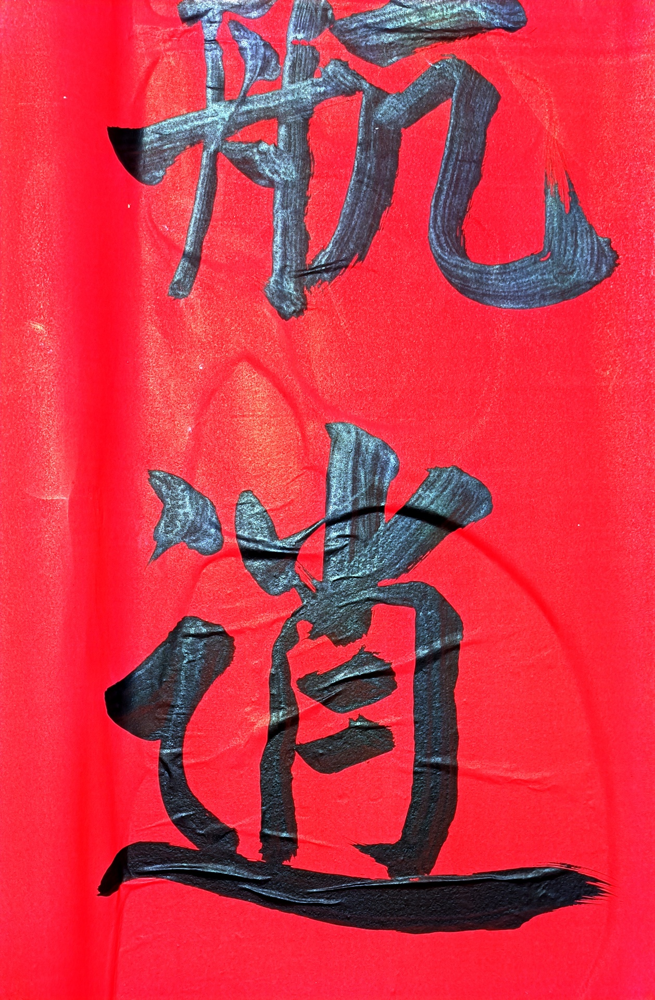

## SeedCollecter
- 14:34 根据横批来判断上下联的方向。 如果横批从左往右读，那么上联在左边，下联在右边。反之亦然

## 日常

### 书法
山上庙门口的对联写的挺不错，楷书但有些草。

这个佛字写的太棒了，我感觉这种折来折去的结构最适合练字。

### 土地爷庙
大年初一在东边的山上转悠，荒山野岭的居然发现了个土地庙。土地爷、土地奶，都慈眉善目的，很是可爱。

土地庙，又称福德庙、伯公庙，为民间供奉“土地神”的地方，多于民间自发建立的小型建筑，属于分布最广的祭祀的建筑，乡村各地均有分布。
土地庙因神格不高，且为基层信仰，多半造型简单，也有简单以水泥或砖块砌成小庙，也有土地庙因香火鼎盛，逐渐中大型化者（比如这次我发现的）。而农家若无土地公庙，常于树下或路旁，以两块石头为壁，一块为顶，将三块石头叠成“磊”状，则为土地公的象征，烧香礼拜。
在新时代，传统究竟为何物？现代人已经可以更加理性的思考了。对于传统的东西，不再是一味的拒绝否定，而是有选择的保留。保留那些有中国特色的、有民族特点的东西。这一点可以从近些天的烟花爆竹放开、国漫的传统文化内容中可见一斑。
土地爷庙就代表了广大农民的一种淳朴的愿望，一种对于美好生活的愿望的寄托。我认为并没有绝对的迷信，迷信本就是理性的一个极端：失去理性的信仰就是宗教，就是迷信，有理性的期盼与寄托，就是愿望，就是目标。老子不是神，安拉不是神，耶稣不是神，释迦牟尼不是神，三体人不是神。失去理性的人多了，他们便成了神。朴素的土地爷庙由于远离俗世，不与政治、权力、财富染指，本身就没有受到任何污染，只是一种朴素的希望的寄托，它并不能与所谓的冠冕堂皇的宗教迷信一概而论。现代人可以真正理性的对待这个小庙，我觉得就是一个新的进步。

### 岩石文
这幅照片是在荒坡上照的，上面坑坑洼洼的凹陷就是所谓的岩石文——号称比甲骨文更早的文字，以前只在门口小破上发现了几处，大年初一居然又在离家十来里的地方又发现了，真是神奇！专家快来啊！南阳岩画考古又一重大发现啊！



岁月的年轮上闪烁着今人与古人相视的光影，镌刻着今人与古人对话的印记，蕴含着今人与古人智慧的通灵。自2012年开始，一些考古专家陆续在南阳白河上游的鸭河工区附近发现了大量的岩画。2014年甚至举行了“中国南阳鸭河工区•世界岩画研讨会”。近年来又有大量的岩石文被发现，很多都是像我这次发现的【爻窝】（意思为圆形凹穴），具体含义似乎与天像有关，（参见知乎的一个解读:[南阳史前时期“岩画天文台”解密 - 知乎 (zhihu.com)](https://zhuanlan.zhihu.com/p/501864874)）。
这一个个坑，居然是几千年前人凿出来的，经历了多少年的战火，居然能保留下来，想想就觉得是一件多么奇妙的事啊。下一个阶段，咱家要试图解读这段神奇的符号，甚至来填补甲骨文与原始文字之间的空缺，引领中国文字起源的另一个大发现！

