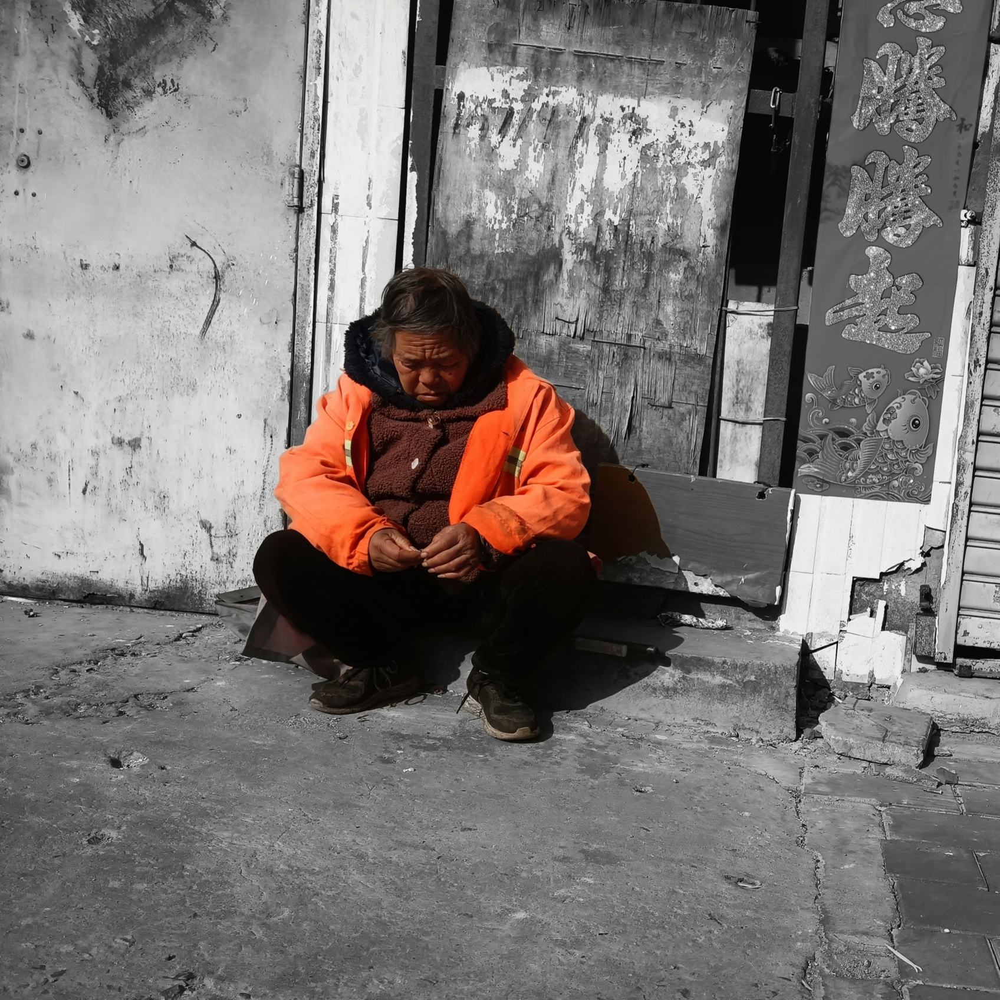
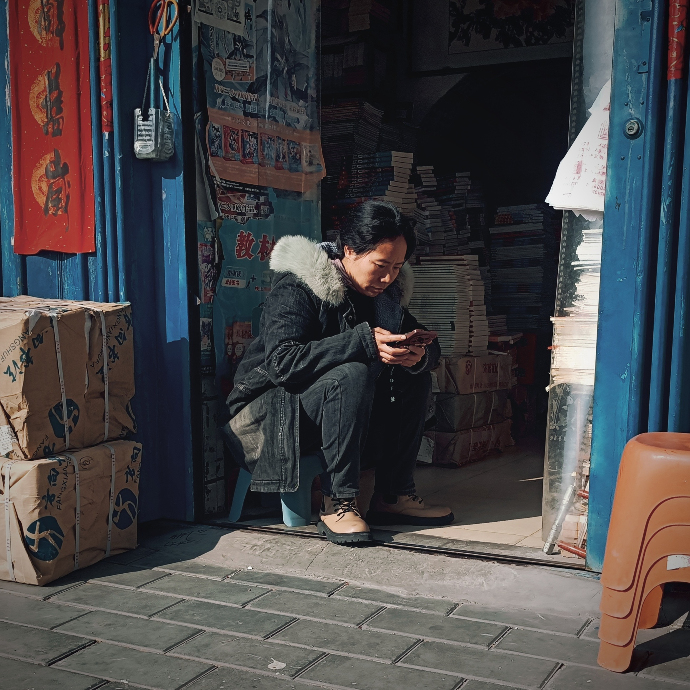
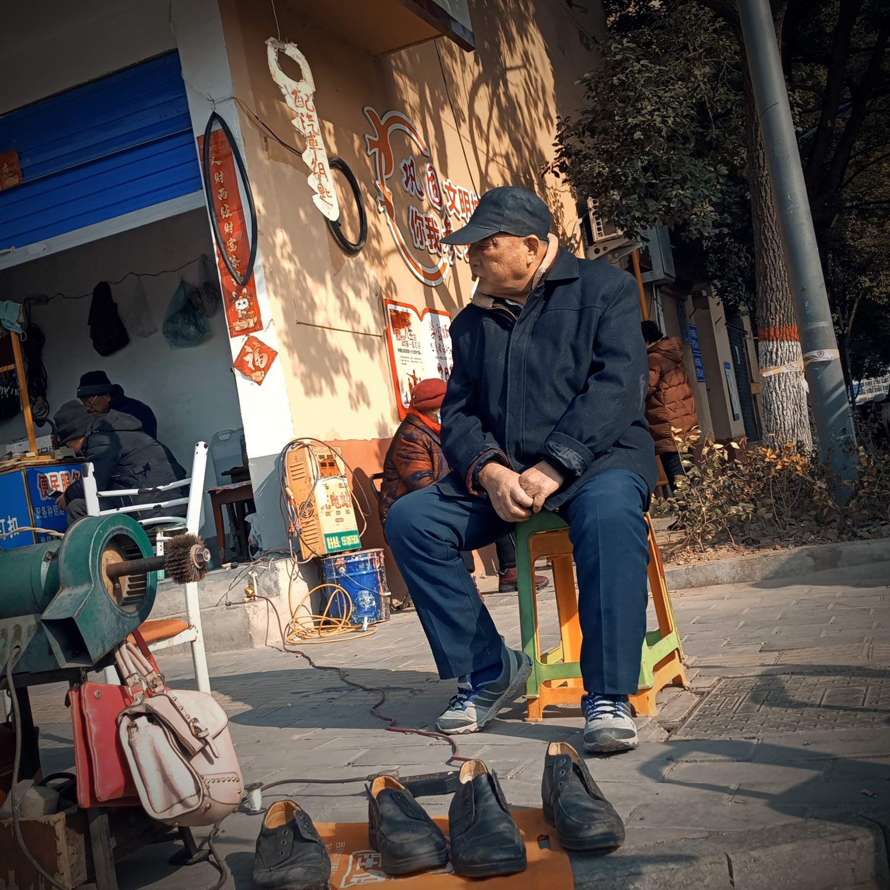

## SeedCollecter
- 09:33 公交车发车时间统计 07:40；09:45；13:55 返程时间统计 16:40 ^5ik24i
- 10:13 人是社会动物，获取认同是写在基因里的特性
- 17:34 找关系说正了就是充分利用人际关系网络，同样，它只是个工具，一昧地强调工具只会误入歧途。真正有价值的永远是自己的能力。

## 日常

上午等车，将近半个时辰才到，下次一定要在9:30左右再去，等煞我也。
中午同M君于Z君家吃饭，其娣餐作，有酥肉对虾🦐，花菜腊肠，于中加汤，甚饱。下午往奥斯卡观《流浪地球Ⅱ》票价一人五十，但未曾买过不觉贵。电影/场面宏大，然斜事繁琐，
于AⅠ之态度过于轻率，于意识电子化之思考较《上载新生》无甚深度，皆以社会现实之残酷为前提，宣扬末世之下人性之可悲，此论不为吾所认可也，无有死亡，生亦有何意义。
影片其余，以倒计时为节点，以大局思想、眼前利益为对比，以舍小为大，师徒情宜、子女情怀为核心来调动观众情绪(引核武那段有感觉)

## 摄影
这周的摄影故事，以三个盲拍的人物展开，并加上一点自己的主观臆断。
### 环卫大娘
一位体态臃肿的大娘坐在破旧门板前的台阶上，面露愁容，百无聊赖地抠着指甲，不时地抬头看看外来的行人。一旁对联上的『...腾腾起』与愁苦的神情形成巨大反差。

最愁不过夕阳红。人一旦步入老年，在家庭的很多事情上往往没有发言权。这个时候家里的种种变故都会引起他(她)的忧虑，事业、婚姻、升学、健康、面子、钱……但他却难以改变现状，也没有能力、精力去改变。后辈人早已成家立业，他的话语早已失去力量，面对现实的不美好，除了叹息也并没有其他方式可以排遣。时代的进步带来的落差，文化的变迁带来的疏离感，无处不在的混乱消息带来的焦虑感让他愁上加愁。
但是，她不能就此放弃，垮下，她要工作，她要劳动，她要用自己微薄的力量来减轻子女的负担，她要用自己的一点点努力来证明价值，她还没有老，她还能再扛几年……这就是平凡的中国人里亲情最真切、最无声、最伟大的展现。

### 书店老板娘
春节过后的街头，刚开张的门面下堆着一摞摞新进的书，一位书店老板娘换上旧衣服，坐在小马扎上，急匆匆地清点货物订单。

课外辅导机构的改革直接带动教辅资料市场的水涨船高，根据一份调查报告显示，2022年，中国各大书店销量最高的书籍中，教辅类书仍然独占鳌头。升学，是一个所有中国家庭都不得不去面对的一个挑战，教辅，是所有家庭里所能给孩子提供的最大的帮助。
做一个书店老板，处理往来的书籍、沟通客户、协商价格……每件事都忙得一天不得安宁。盯住app上的小红点，飞快地滑动，两只拇指雨点般得触动屏幕，一单又一单，一天又一天，在日日夜夜的忙碌中，生活越来越好，也越来越期待每一天晚上餐桌边的喧闹，夜里偶然间撒到屋里的月光。

### 修鞋大爷
熙熙攘攘的路口，人来人往，一位修鞋大爷形单影只地坐在路边，叼着根香烟，攥着手，玩世不恭地瞅着往来人群匆忙的脚步。

平淡是生活的最本质特征。不论曾经多么重要的事，在时间的车轮碾压过后，都如吃过糖🍬后喝一口凉开水般平淡，而这就是生活。他可能在年轻时候做过拉车汉，当过兵，做过生意，但都不如意，最终学了修鞋。年老时，凭着这身手艺，在闹市街头撑起了一片天地，从此，坦然的面对来来往往的人群、时代的巨变。
只有明白生活的真谛的人，在岁月的磨砺后，才会有这般淡然的神色。有些道理我们一听就懂，但是我们并不真正理解，正如马克思主义基本原理中所讲，认识的发展过程是**从认识到实践，再从实践到认识，循环往复，不断前进**。生活究竟是什么？需要自己去体会，时代究竟是什么？需要自己去经历，人生就那是什么？需要自己来一遍。从老人自信又淡然的神色中，我明白了生活。