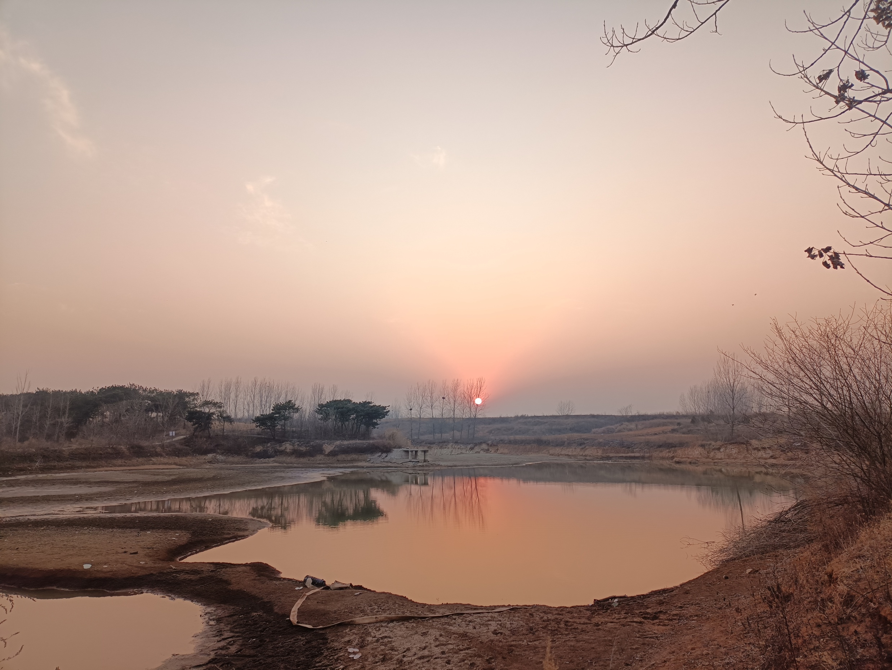
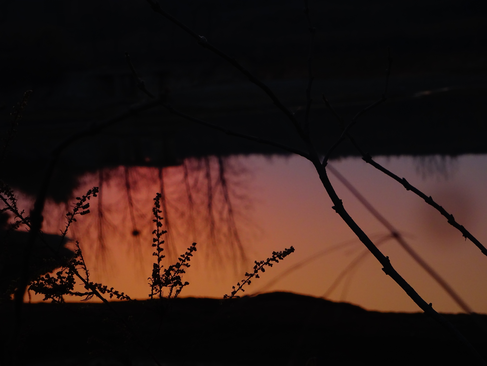
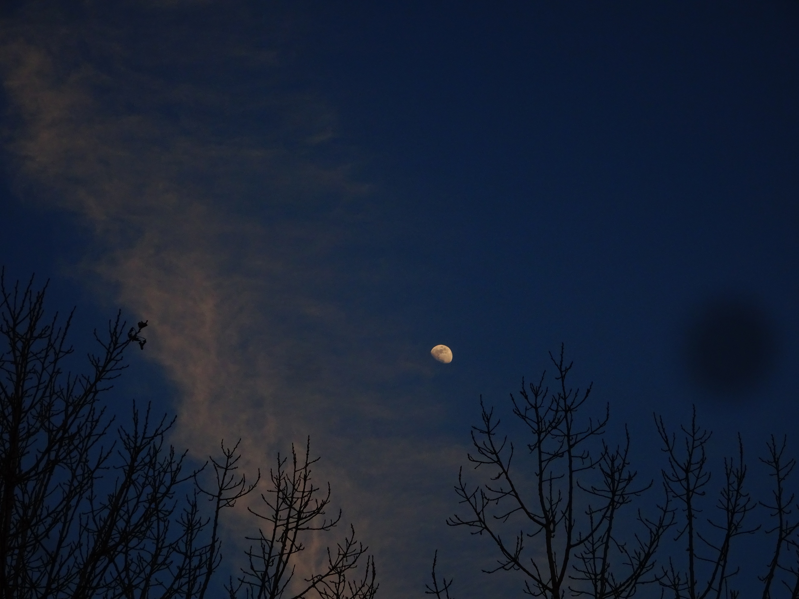
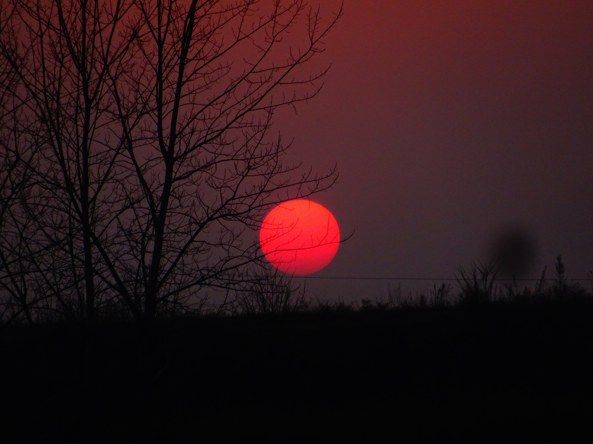
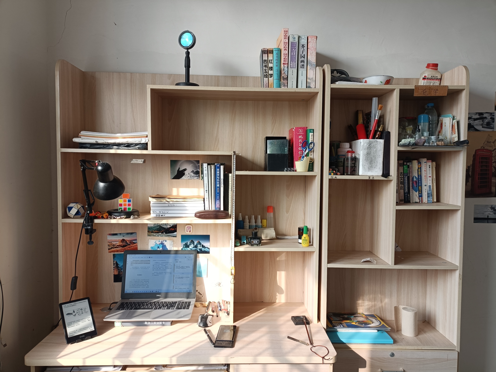

## SeedCollecter
- 12:51 种兰花

## 日常
今天是一月的最后一天，年过完了，又一个开始来了！
日落时分，去附近的一个小湖转了会，照了几张相片。

这里像是养鱼的，周围一圈用铁栅栏围着，进不去，看起来很荒芜。
日落时分，天上刚好有几道航迹云从月亮周围穿过。甚是好看。
相机上的污点没不掉，每次调焦放大到10x左右就会出来，真是烦人死了，上回自己想擦，结果发见镜头实在复杂，安回去的时候安不好，开不了机拆报废了，送去修，来来回回耽误了半年，现在就勉勉强强用着吧，看看有什么软件可以修复这种污点。

晚上收拾了房间，感觉不错。真跟书里讲的一般，收拾东西本身就是一种行禅。

