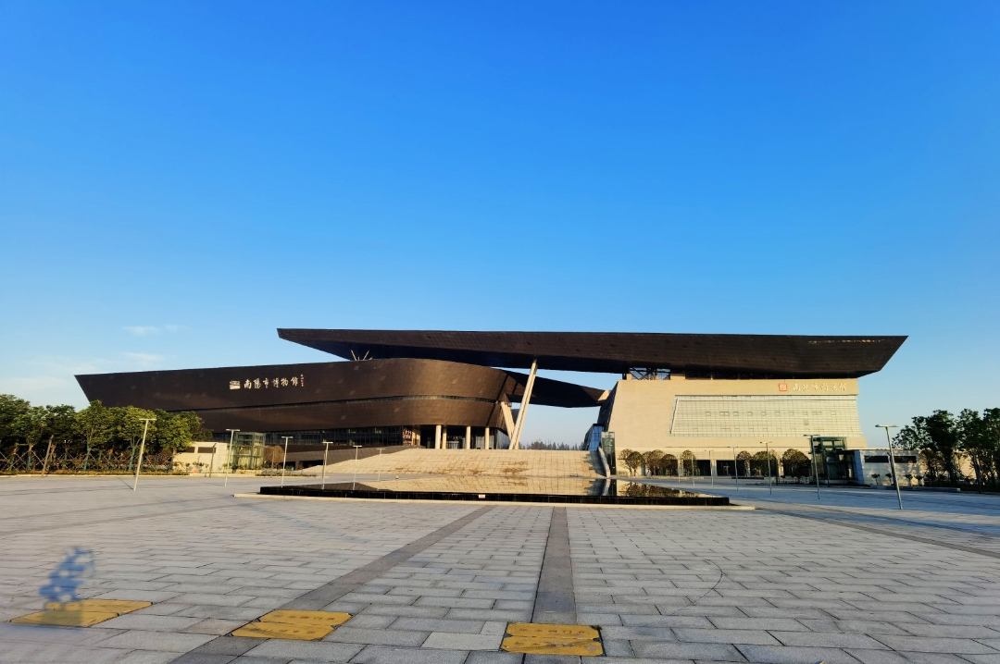
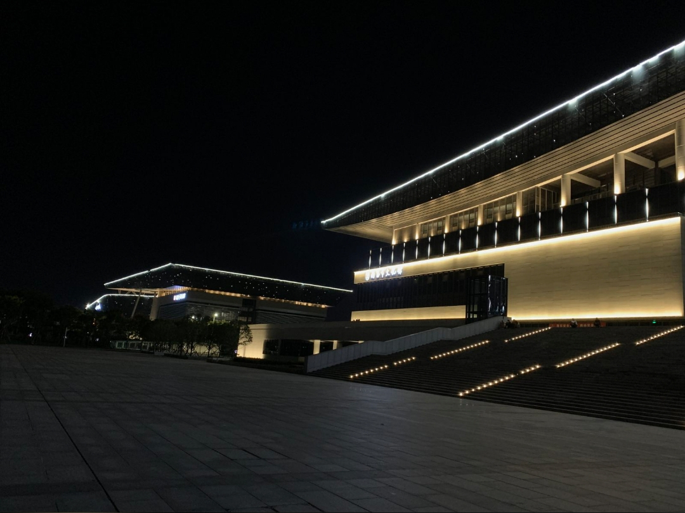
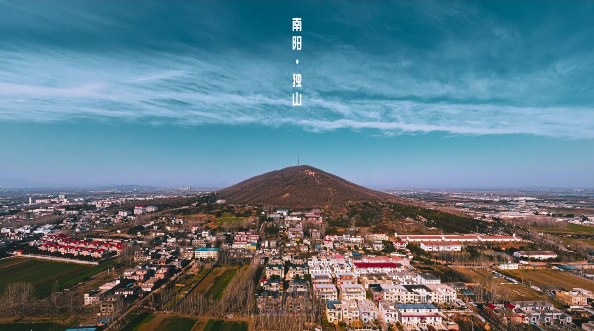
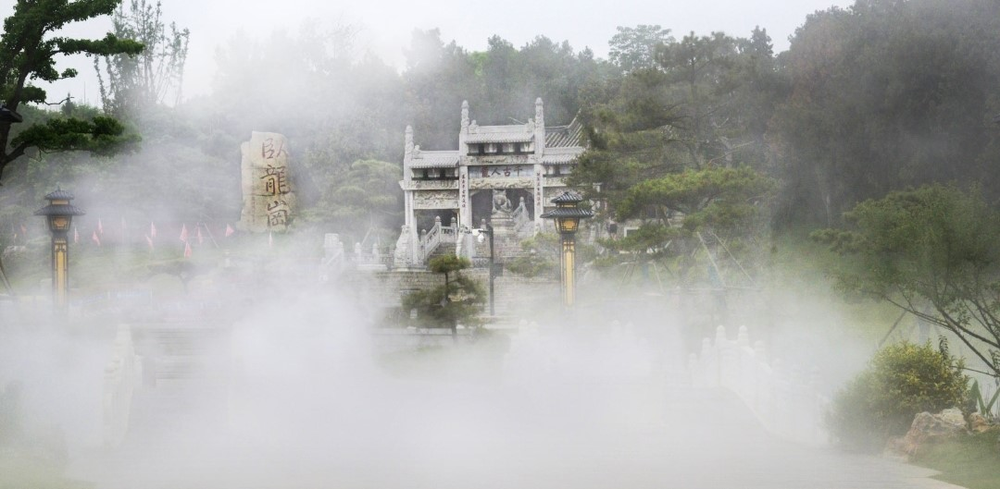

## SeedCollecter

## 日常
飞机票·南航学生特价票放票时间:**12:00**，火车票·放票时间:**17:00**。
今天一天不舒服，大概是昨晚着凉了，盖一双被子终究是不把握，脊背一着凉，感冒马上就到。早上胸闷，出去跑了一圈，呼吸变顺畅了，天冷，喝着凉气了，胃里又不得劲，中午晚上都没有胃口。又怀疑是前几天进程看电影没带口罩阳了，做了核酸也还是正常。
下午，母亲找来布洛芬，吃了一片，从一点半睡到了四点半，醒来后觉得很好，起来一转悠又不行了。
该死的身体，你怎么这样脆弱！
就不吃药，就硬扛，垃圾感冒，你这不争气的家伙，这都顶不住还怎么走南闯北！

## 寒假实践
以下六张照片皆来自『499+1 px china』的低热度照片，如有侵犯请联系删除，邮箱📭: report@si-on.top

### 三馆一院

#### 图书馆
安静的自习室里，规则排布的台灯，翻书的沙沙声，一片肃穆。

南阳市图书馆是河南省较早成立的地市级公共图书馆之一,是面向社会公众免费开放，提供图书、报刊借阅（含少儿借阅、电子阅览室）、参考咨询、公益讲座、专题展览、教育培训、视听服务等多功能的公益性文化服务机构,是全市公共文化服务体系建设的重要组成部分,发挥着保存人类文化遗产、开展社会教育、传递科学情报、开发智力资源和文化休闲娱乐等各种功能,是展示南阳地方特色人文资源、对外文化交流的重要窗口。
自习室是图书馆里最具魅力的一个地方，各个年龄的人们汇聚于此，有大人带着小孩写作业的、有学生们补习功课的、有上班族处理文件的，形形色色，都沉浸在这读书的庄严氛围中。

#### 博物馆
从外面看去，东边的博物馆与西边的图书馆连成一体，呈现出一种和谐之美。

高轩临碧渚，飞檐迥架空。南阳市博物馆位于光武大桥以东，鼎盛大道与白河大道交会处，为原文化部确立的重点文化基础设施工程、南阳厚重历史文化的精品文化工程“三馆一院”之一，是南阳市重要的文化建筑组群，也是白河国家湿地公园核心区中的现代化标志性文化设施。
南阳市博物馆为国家二级博物馆，前身为南阳历史博物馆，创建于1959年10月1日，馆址位于诸葛亮躬耕之地南阳卧龙岗内；1965年，南阳历史博物馆更名为“南阳市博物馆”；2021年1月1日，南阳市博物馆新馆建成启用对外开放，是豫西南最大的地方综合性博物馆、文化新地标，南阳的“城市文化会客厅”，也是展示南阳悠久历史和灿烂文化的重要窗口。

#### 大剧院
黑夜中，建筑上的灯光勾勒出三馆一院绚烂的色彩

南阳大剧院座落于美丽的白河之滨、光武大桥东侧，外观庄重大气、线条优美，是我市一个重要的文化地标，对于塑造城市人文精神、提升城市文化品位、打造中原文化高地具有重大意义。总建筑面积3.0406万平方米，由1000座席的大剧场、500座席的多功能小剧场、休闲娱乐厅、餐饮服务厅、行政管理、业务办公区域组成，可以满足各种形式的艺术演出。该馆引进先进的经营管理模式，充分发挥院线优势及全球采购优势，可让南阳市民足不出户、观看世界经典之作、享受文化盛宴，

### 南阳标志性景点
#### 独山

独山森林公园建于1959年，山林面积6063亩，是距南阳市最近的省级森林公园，国家矿山公园和旅游风景区山产中国四大名玉之独玉。独山树种丰富多样，还有许多珍稀的水生生物。登山远眺，美景尽收眼底，顿觉心旷神怡，是休闲娱乐的绝佳地方。
独山物产丰富，所产独玉为全国四大名玉之一。独山是独玉的根，是玉文化的发祥地，独玉储备量达20万吨以上。独山玉开采史已有近六千年的历史，黄山新石器遗址中发现有四件独玉品。据说和氏璧及用它雕出的秦国传国玉玺也出自独山玉。据《韩非子》记载，楚国人卞和在楚山中得一玉璞，先后献给楚厉王、武王，但都被认为以石充玉欺君而被砍掉左右足，楚文王继位后，“和氏抱壁而哭于楚山下，三日三夜，泪尽而继以血”。文王召见了卞和并令人理其璞，果然得到了极品宝玉，于是便命名这块玉为“和氏璧”。而这块玉也引发了完璧归赵等历史故事。不仅说明独玉宝贵，更表现了以卞和为代表得历代玉人勤劳智慧和宝贵的奉献精神。

#### 卧龙岗

南阳卧龙岗景区，位于中国历史文化名城河南省南阳市卧龙区卧龙岗上。卧龙岗南濒白水，北障紫峰，遥连嵩岳，山水相依，景留四时。
南阳卧龙岗，又称南阳武侯祠。始建于魏晋，盛于唐宋,距今有1800多年历史，是三国时期著名政治家、思想家、军事家诸葛亮躬耕隐居之地，汉昭烈帝刘备三顾茅庐发生地，同时也是明朝朝廷钦定的祭祀诸葛亮的地方。
刘禹锡有《陋室铭》曰:“南阳诸葛庐,西蜀子云亭。”李白《南都行》:“谁识卧龙客,长吟愁鬓斑。”可见唐代时期南阳卧龙岗已成为著名的人文景观和祭祀诸葛亮的地方。明世宗皇帝朱厚熜曾钦定南阳卧龙岗为诸葛亮躬耕地，被后人誉为“天下第一岗”，先后有众多国家领导人考察南阳卧龙岗。

#### 白河

白河，古称淯水，是南阳母亲河。发源于河南省白河镇攻离山，流经嵩县、南召县、方城县、宛城区、卧龙区、新野县，于翟湾入湖北襄阳县，于两河口与唐河交汇后始名唐白河，向南至张家湾注入汉水。全长566公里，流域面积24299平方公里，白河支流众多，主要有黄鸭河、留山河、鸭河、白条河、滦河，湍河、刁河等，其中以松河、潦河、湍河、刁河最大。次级支流除湍河的支流严陵河、西赵河较大外，其余均为短小河流。白河洪水发生较频繁，鸭河口水库建成后，洪水得到了控制。
