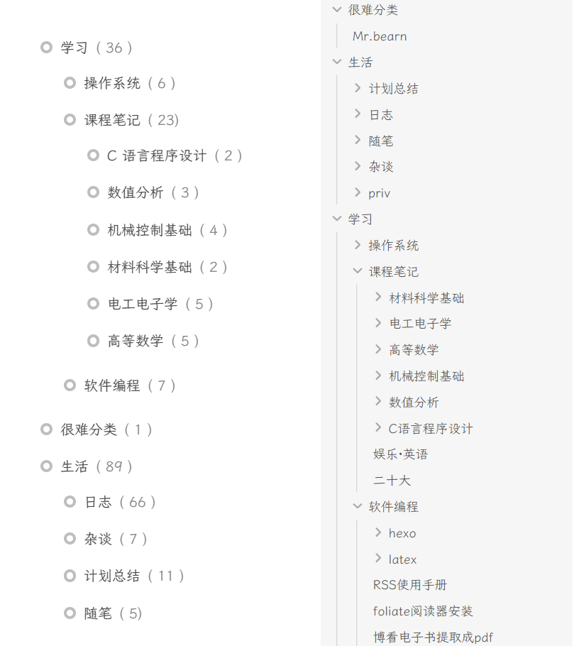

## SeedCollecter

## 日常
### 阅读
今天买的《摄影哲学的思考》到了，虽然二十多块薄薄的一本，但封面、包装都挺高级、精美，挺满意的。
希望读了这本书之后可以加深乃至重建我对摄影的理解。
> To shot, or not to shot, that is the question.

取快递的路上，一个人骑着自行车，迎着微冷的料峭春风，虽然开学在即，初试成绩公布在即，二战在即，但内心却极其平静，就算仔细想想现在的处境也不觉得有什么大不了，未来就在脚下，只用卖力地向前骑行就好了。
### hexo博客优化-分类自动化
其实很早以前我就知道这个插件了，但是一直没有用。是觉得我的文件夹与分类有一些区别，但现在我仔细观察才发现，这区别真的不太大啊！用了这个插件之后，可以直接批量修改**分类**，方便极了。

从今天开始，博文的分类将同文件夹名同步绑定！