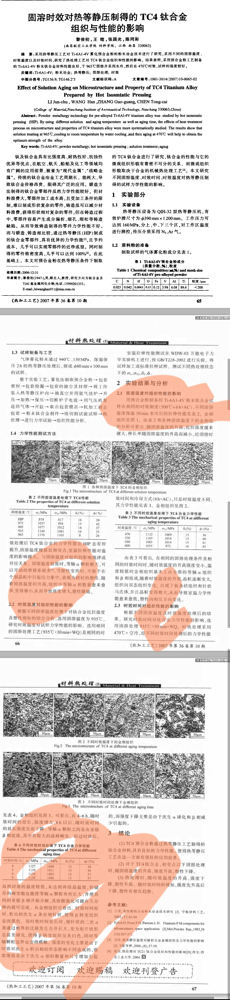

## SeedCollecter
- 21:39 不深入了解一件事，就没有理由评价它！


## 日常
### 阅读『置身事内』
今天读了此书，对国内经济的运行有了基本的了解，原来发展中的问题恁地多，改革是恁地不容易。
市场与政府，土地与人，规模与扩张，生产与消费，


### 线上虚拟实验


### kindle阅读流·摘录整理
通过Obsidian的插件kindle highlights来实现此阅读流，在此简单配置一下模板文件以使之更适应hexo博客的文章结构。

#### 文件名模板
```
{{shortTitle}}
```
短标题即可
 
#### 文件模板
``` yml
---
title: {{title}}
date: {{date:YYYY-MM-DD HH:mm:ss}}
---

## 阅读记录
* 作者：{{author}}
* 最后摘录于{{lastAnnotateDate}}
* 摘录数：{{highlightsCount}}
## 思考

## 摘录
{{highlights}}

```

#### 高亮模板
该插件对于中文的支持度不高，日期会出错，这里就简单用位置做标记算了：
```yaml
> <center> {{text}} </center>
> <p align="right">#{{location}} </p>


{{note}}

---

```

