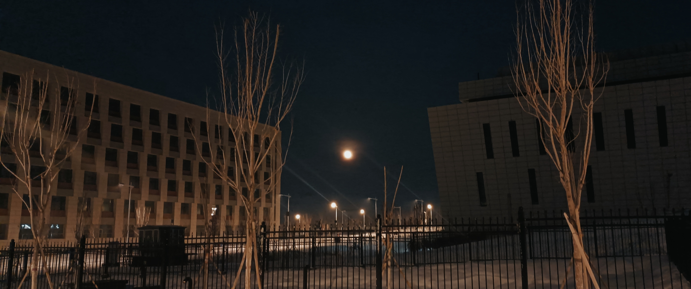
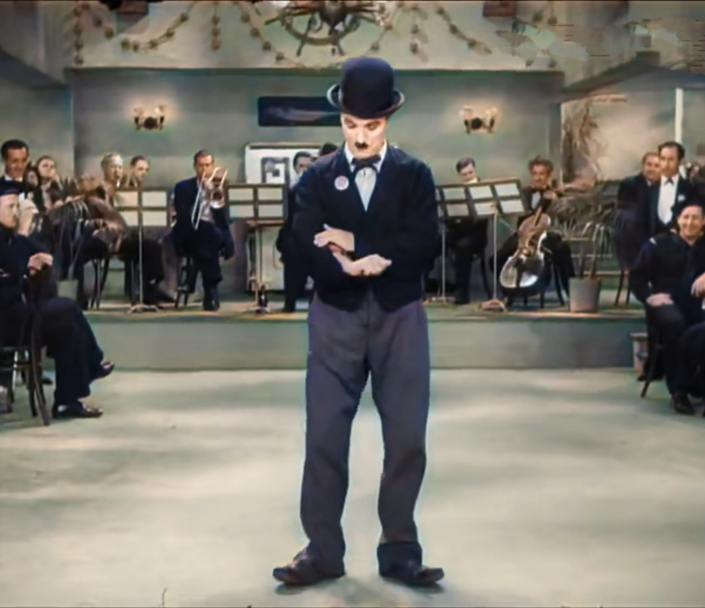
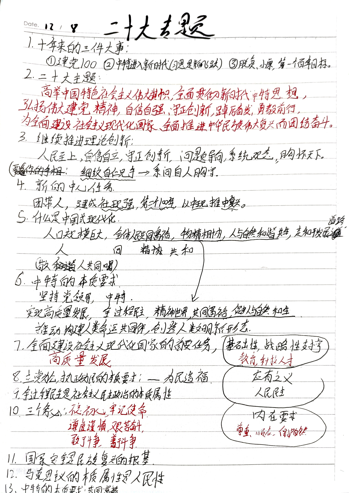
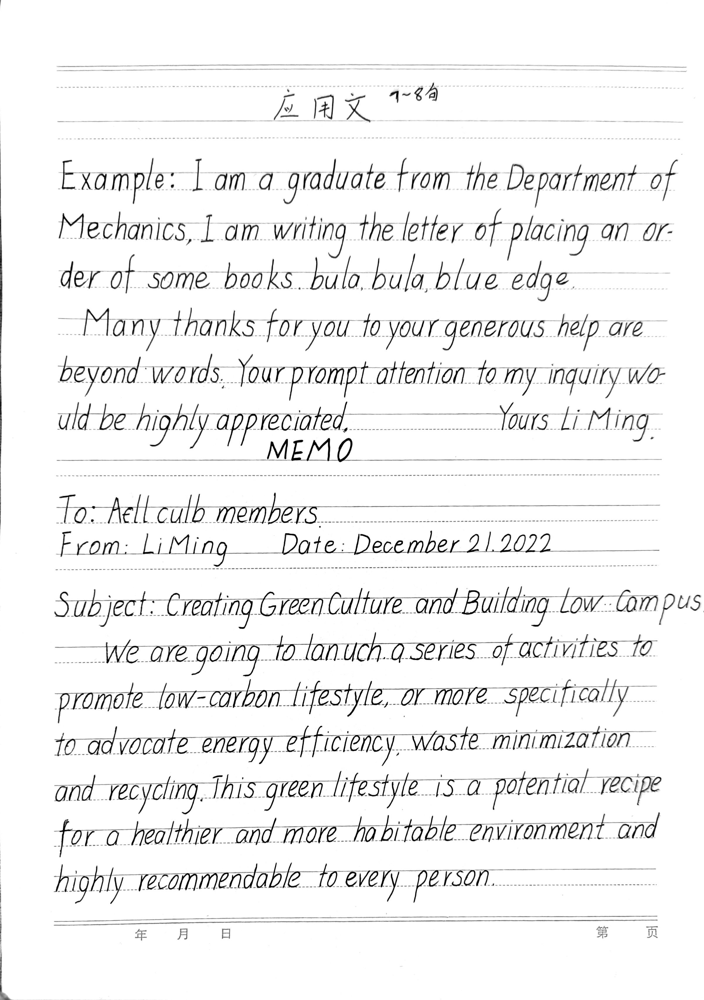

> 
溱与洧，方涣涣兮。士与女，方秉蕳兮

> 
——《郑风·溱洧》

## 怀旧
> 在十七世纪，怀旧被认为是一种可以医治的疾病，类似普通的感冒。瑞士医生都相信，鸦片、水蛭，外加到瑞士阿尔卑斯山的远足，就能对付怀旧的病症。在二十一世纪，本来该须臾过去的失调却变成了不可治愈的现代顽疾。二十世纪始于某种未来主义的空想，终于怀旧。对于未来的乐观主义的信仰被抛弃，就像过时的、1960年代的宇宙飞船一样。怀旧本身具有某种乌托邦的维度，只不过不再是指向未来。有时候，怀旧也不是指向过去，而是指向侧面。怀旧者感到被窒息在时间和空间的常规界限之中。
> ——『怀旧的未来』

与其说怀旧是一种社会现象，倒不如把它看做人类社会**发展规律**的一种表现——螺旋式上升。
封建时代的人怀念原始穴居人自由无为的生活，这从老子的《道德经》中的愚民、无为而治的落后思想中，以及希腊先贤的论说中都可略见一二。从某种意义上来说，旅游就是一种高级形式的怀旧，一种源自于基因深处的原始怀旧。
生活在科学、文明、理性、开放的当代社会的人，又会怀念封建时代的宗法礼制，渴望那种做事处处有"规矩"，没有过多欲望、压力与灰色地带的时代。于是乎，曾经饱受批评的东西又浮出水面，甚至大行其道。
为何曾经被否定的东西，现在却会被肯定呢？
那是因为时代在变化，现代人已经拜托了过去的种种局限性，可以用更为理性的态度去对待过去的东西，因而这并非社会风气的江河日下，而是一种理性的再认识。
这就是我所认为的怀旧的真正含义。
为了尊重议论文的文体，再举几个例子，罢了，还是列几个事物吧。
- 直排版、文言文。新文化运动后被舍弃，现在有复兴势头
- 儒学。几次被打倒，又一次次被人们所推崇
- 农历。有没落倾向（我真搞不懂，居然有那么多人不知道自己的农历生日）
- 八股文
- 传统书画
- 二十四节气
- 传统手艺
- ...

## 直排理工科文章的思路
**既然打不过，那就加入它。直排，进化吧**！
今天刷题时候想到了个新思路：横纵混排。就是标题、说明性的大段文字主采用直排，公式、代码块集中到一起采用横排。
对于西文，我觉得还是保持原有的阅读方式比较好。非必要不直排。如果是大块的西文，那就同公式的处理方法一致。
也可以借鉴『Notion』中【块】的思想，这样就可以让空间得到最有效的利用。

## 月球的运行规律
晚饭后瞎转悠，听到旁边有个女生同伙伴议论月亮，她觉得今天月亮太偏北了，偏的离谱，月亮东升西落，怎地这么偏，以至于她怀疑起自己的方向感。

听到后我也想了下，觉得应该跟太阳的黄道面与赤道面有个夹角一样，月亮的绕地轨道也与赤道面应该也有个夹角，并会随着时间进行周期性变化，如果猜测是对的话，那应该还有『月北至点』『月南至点』。
后来回教室后搜了下，发现规律远比我想的复杂，考虑到地轴夹角，月球的椭圆轨道，进动现象，潮汐作用，最后得出个准确结果当真不易。于是乎放弃，等我什么时候对天文燃起兴致再说吧，现在彻底理解也太浪费时间。
我只需要知道月亮是东升西落，每月初一跟太阳一块升起，十五日落时候月亮升起，月相规矩是『上上上西西、下下下东东』就足够了。
> 这句话的意思是：上弦月可以在农历月的上半月的上半夜看到，月面朝西，位于西半天空；下弦月可以在农历月的下半月的下半夜看到，月面朝东，位于东半天空。

## 二十大笔记
> 自编口诀
> 继续推进理论创新：『戏文自仁兄手』
> 
> 中国式现代化：『敬人共同喝🍺』

## ✍🏻手写印刷体
今天有所进步，但是练习太少，字间距，词间距还是没能控制住😑。

## Kindle待机监测
* 2022-12-08 10:17:15 每天日常使用约一个半小时左右 电量85%
pdf翻页太慢烦死人！😫😫😫😤😤😤😡😡😡🤬🤬🤬🤡🤡🤡😵😵😵😇😇😇
## 线性代数·图学II

## 关于贝斯卡合金热处理工艺的研究
>  当时看『曼达洛人』时胡扯的一篇文章，只写了个开头，有空了再把它扯到家。