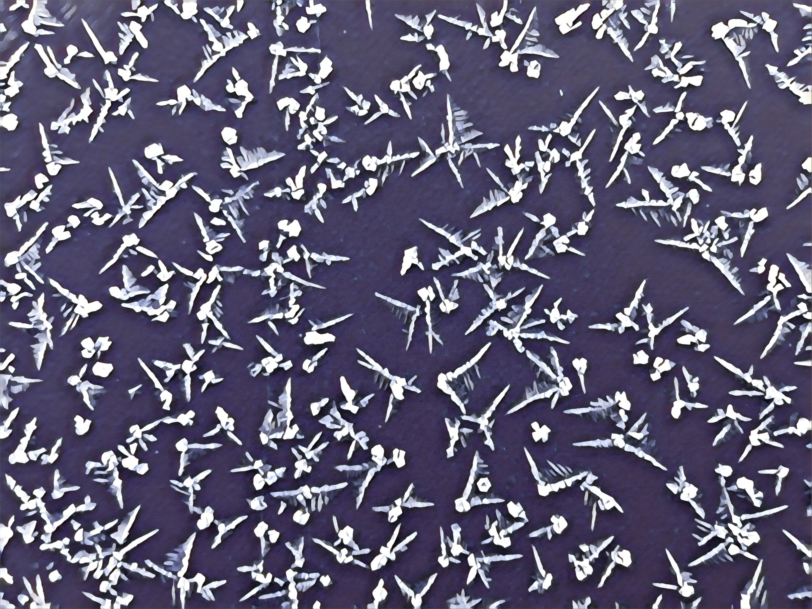
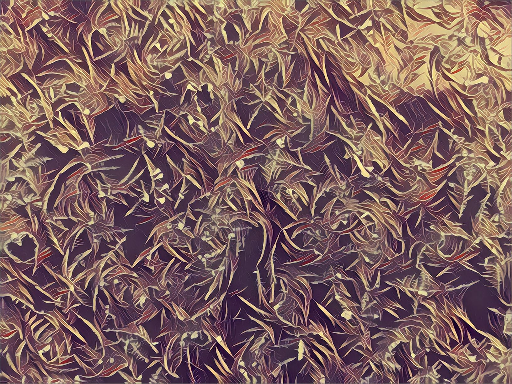
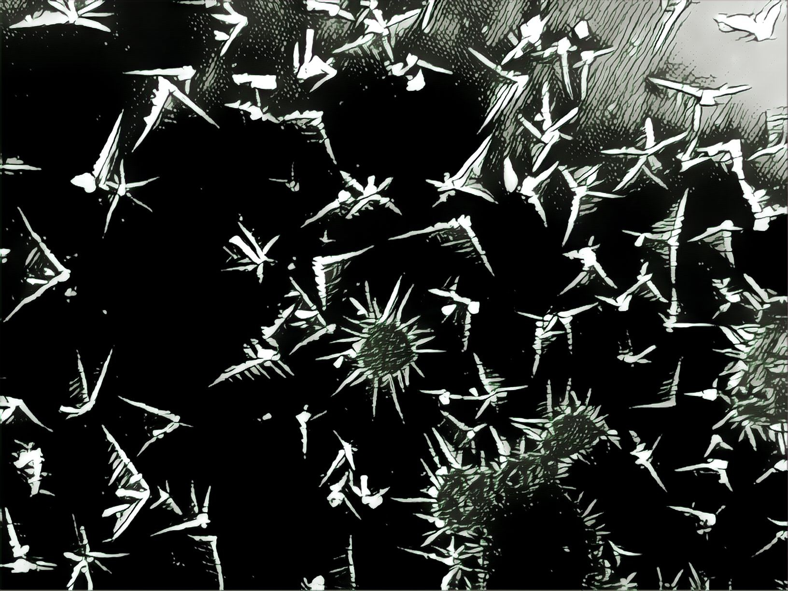

## 结晶美学
早饭后，往东门看日出，见铁门上冰华好看，随摄影之，美化之。

## 超现实主义
这个流派真不是一般的倔强，细致到令人发指。可以被称为 **人肉GPU**

## 夜行
一想想，将要有两个月看不到这冰天雪地还真有些不舍呢。

### 聚沙成塔计划内容调整
在路上走，突然想起来了之前的一个小玩意儿——Seed Collecter 种子收集者 与 Sower 播种者，以后把每天写的内容分成念头与日常吧。
- 关于谷歌的连通问题:几星期前就发现，当我在谷歌用商店下载一个软件的时候，先用了魔法让软件下载到百分之一，然后收了魔法，应用却还能继续下载，而且速度非常快，快到离谱那种快。今天问了Z君，他那里的网络却不能实现这种奇怪的操作。太奇怪了，真是太奇怪了，我真想不通，难道新疆还有谷歌的服务器吗？