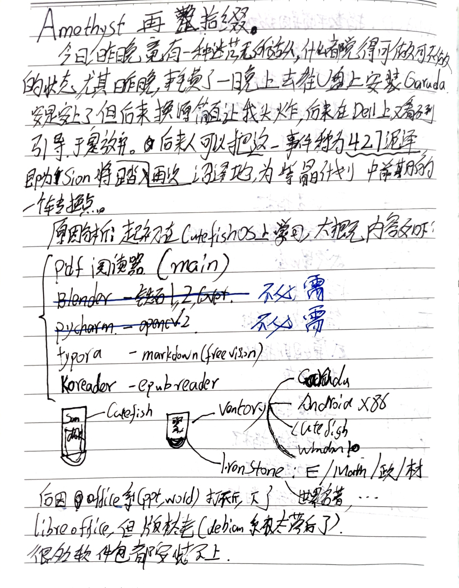

> 一着不慎，满盘皆输。
> 
——毛泽东《中国革命战争的战略问题》

## 文章痕迹

<!-- timeline 2022-12-25-->
~~考研与学习历程的总结~~
~~失利的反思~~
~~下一学习阶段的展望~~
<!-- endtimeline -->
<!-- timeline 2022-12-26 -->
~~『四矢计划』的总结与历程中的收获~~
~~年度读书总结~~
~~年度摄影总结~~
<!-- endtimeline -->
<!-- timeline 2022-12-27 -->
⚪ 写作总结
⚪ 明年的计划
<!-- endtimeline -->
<!-- timeline 2022-12-30 -->
把规划打印出来，bia在墙上！！！
<!-- endtimeline -->


## 读书总结
https://sionreading.notion.site/
* 对学习思考影响最大的书『[刻意练习：如何从新手到大师 (notion.site)](https://sionreading.notion.site/62dda2aa384a48dab8752b489f810e4c)』
* 最有启发性的书『[大人学选择 (notion.site)](https://sionreading.notion.site/55d354c9327041a2a4cc9be1cd9587c5)』

对于读书，似乎没有总结的必要，阅读带来启发，时间带来遗忘，最后沉淀的东西融入思想，然后在某年某月突然发觉现实规律与思想的契合，又一阵激动，仅此而已。
>如若所感兴的都是别人的感兴，所表达的都是他人的表达，一直待在被碾过的车辙里，存在还有什么意义！ ——（12-7日，桌右铭）

对于读书、阅读等知识的获取活动，我还是坚持**风与浪**的观点，这些活动作为【风】可以推动浪的生成，为之蓄力，但浪的前进还是要内部的相互作用，才能把动力不断传播开来。【浪】所代表的就是【风】作用下的独立思考与实践，若没有自己的思考，那么就像大风吹过铁塔，吹过时呼呼呜呜，吹过后依旧原样，一点都没有改变。
>风只是风，浪只是浪；
>风生浪起，浪去无风。

批判性思考的前提是接受并理解了观点。先信而后不信，不信而后又信，在反复理解中才能明晓真正道理。

## 摄影总结
有云彩或月亮的日出日落、不起眼的细节外加一些修图与激情，这就是今年摄影的全部内容。下面是今年照的一些还算拿的出来的照片：





## 试题总结
### 材料科学基础
自我评价：7/10
* **名词解释题难点**: 伪共晶与离异共晶，晶界与亚晶界，奥氏体起始晶粒度和实际晶粒度。
* **选择题**：**三元相图**一摸黑，多选题很是模糊，（才过来37分钟，其他的我竟然一点都想不起来了）
* **作图题**：很OK，就是画的慢点，有点丑。
* 螺型位错的特点，当时强调的是理解，没想到他考的概念，死命地挤出来了三条。
* 固溶体特点，结构特点，影响固溶度的因素。
* **可变粒子与不可变粒子的强化机理。**
* 扩散性相变与非扩散性相变
* 回复的定义与**冷变形金属的回复过程**。
* 回火的定义与**马氏体回火转变**。
* 影响奥氏体晶粒生长的因素与**影响珠光体转变动力学的因素**。
* 铁碳相图题：居然栽在这里了。三相恒温转变，碳对铁碳合金组织的影响，碳在铁碳合金中的存在形式；1.0%的过共析钢冷却过程分析；室温组织为80%的先共析铁素体的组织组成；最离谱的是第二问：这他妈也太宽泛了吧
* 最后一题：固态相变的动力与阻力，马氏体相变深冷的原因，**马氏体强化机理**

**考后体会**：字儿写的太慢，太丑，写了会儿手就酸了，腕力跟不上。思路不连续，不能洋洋洒洒地写出来，老是只想出来一半，还是缺乏专门的训练。
### 数学
自我评价：5/10
**过程**：做题少，手生，前两题就做了半天，后面几个题，个别靠数学敏感直觉去选了。有两道比较邪门，怎么算算不出来就放弃了。大题，多元函数的极值、不等式证明题没整出来，线性代数最后还是记不清楚『特征值到特征向量』的转换步骤。
**弱项**：**多元函数**，多元函数极值问题与不等式证明，二重积分计算。
**考后体会**：心态从有紧张到崩溃到释然，我这他妈那里叫考研，就他妈是个笑话，来丢人现眼来了。把能写的，能得到的结论都写上了，估分的话，底线三四十左右。
这次真是破破烂烂，实际上在考试之前就预料到这个结果，连一个彻底连续的做题复习计划都没有完成，连几本资料都没有（疫情与封控），又怎么能对做题有很好的把握呢？
### 政治
自我评价：6/10
* 选择题做着还可以，
* 近代史 团结 不会编
* 思修 爱国主义，培养，差点
* 形势与政策 背了，但不会答，不知道怎么用

**弱项**：形势与政策的分析，思修的复习过于太薄弱。
**考后体会**：缺少一个连续的备考过程，过于散养，过于逆流（厌恶一切网络名师），字写的太差，知识不会运用，这是练习太少的典型特点。
### 英语
**过程**：感觉时间太多了，开考前十分钟，撇了眼作文，然后在脑袋里构思作文，考后前20分钟写了大作文。后来开始按顺序做题，做到第二篇之后发现还有两个小时。
但就在这个时候第三篇突然读不懂了，第四篇一样。然后就开始犯困，换姿势，掐自己，都不济事，最终迷糊了40多分钟。
然后把翻译写完，小作文，排序题做完。最后还有30多分钟就完成剩下的两篇阅读。
总体感觉还是不行，小作文写的太low了，大作文也差不多，字还是一写快就丑，这半年练的字，似乎就没有一点作用。
最后坐的我屁股发痛，万念俱灰。
**弱项：** 作文构思、文章阅读、固化的思维方式
**考后体会**：明年要大量练习，仔细阅读，大量阅读。

## 生活总结
### 辛丑年计划
去年一月一日就未来的展望:
1. 考研成功
2. hexo 博客 经营更好（学会写好文章）
3. 各种兴趣稳步发展，不挣扎，不放弃。
现在看来除了第二个，剩下两个都失败了。
### 壬寅年历程


1-8 洗完澡后躺在床上，勾画后来一个月、十个月的计划。
2-16 初步谋划的『紫晶计划』
2-17 在回学校火车上，听闻母亲骑车路滑受伤，心里一团乱麻，甚是慌乱。
> 2-19～4-18 两个月以来，母亲慢慢恢复，但头痛还是没好。

2-26 正式规划未来九个月的计划，内容见于[铁石003](/2022/Jinstone004)
3-4 鬼使神差地在图书馆学起了阿拉伯语、韩语，遇到图书馆里H君与D君在复习。
3-11 玩起了盲水印、股票与WEB3
3-28 总结了专业课的知识框架
3-30～+2 又一次尝试多相睡眠来提高效率，两天后失败。
4-14 同Y君的交流中，完善了对极限求法的归纳
4-27『泥泽』 在折腾Linux上浪费了大量时间后(在U盘上折腾濒死期的CuteFish 与 Garuda) ，终于醒悟，不再玩了。

5-3 混乱到了极点之后就是平静。开始了『红狱计划』来限制不必要的杂念。
5-4 买了kindle; 5-9 收到设备
5-14 LUNA币炸了，明白了把鸡蛋分在两个篮子里的重要性。而后不久，放弃炒币。
5-18～5-28 进行了为期十天的素食计划
5-25～6-2 每天四小时，背完了六级单词
6-5 进行了严格的自我批评，开始了又一段的相对专注。
6-14 启动『荆棘鸟』计划，在痛苦与自我批评的激励下，进行学习与思考。
6-28～7-1 暑假前期的充电阶段，多了几本效率有关的书📖，尤其是时间管理、刻意练习的书，很是有用。
7-23 垃圾的线上实习结束，获得保研希望，开始进行面试的准备。
7-30 『大撼动』面试结束，大学以来第二次万念俱灰的心境，
8-1+30～在学校课程、考研复习，兴趣、游戏、网剧的混乱生活中挣扎着。
9-15～ 9-23 给N君不正当途径(通过围栏) 送电脑，由于学校防疫规定，被关进5号楼隔离七天了
9-26 开始隔离
11-14 部分解封
12-7 彻底解封，在宿舍隔离了71天，🐶🌞🏫
12-7～12-17 同L君在自习室复习
12-18-12-25 在宿舍二楼自习室学

只考虑生活状态的话，可以把今年简单地分成三个阶段：
1. 预备阶段（一月到三月）
1. 迷茫与前进交叉的探索期（四月到十月）
2. 堕落与死撑面子的沉落期（十月到十二月初）
3. 知返与奋力追赶的返照期（考研前十九天）

## 反思

> 为达目的，可以不择手段
>  
——马基雅维里

**目的可以反映手段的正当性**，也就是说 **目标的没有实现就反映了手段的不正当**。这个颇有政治色彩的观点，虽然说的过于绝对，但是很是真实。现实就是如此：**胜者为王，败者为寇**。虽然世界上很多东西难辨黑白是非，但是**结果的反映**却是人人心中一道专横的分界线。不论失败者有多少后来人看来起是多么高效、多么先进的方法，一旦失败成为了事实，那方法的传播就无从谈起，奋斗的艰辛也无人问津，而成功者的方法无论多么低效、多么愚蠢，都必定会大行其道，其历程的也会被大肆渲染。这就是为什么成败带来的影响往往会压制住理性的思考。

所谓**理性地分析**简单来讲就是能**正确**分析出来**对的与错的**，但是认识总是不完善的，受阅历影响很大，绝对理性无法实现(无数个理性人互不影响的分析的聚合才能达到绝对的理性分析)。实际上的分析最多只能得到近似理性的结果，但这对于个人来讲就足够了。
不能仅仅把失败简单地归结为外部因素与内部因素，而应该更多的去找一些细节，一些知识上的漏洞。
### 外部因素
> 他妈的J君，偏偏在关键时候过来这原本就我一人的自习室，凑到旁边，读书声音还恁球大，烦煞我也。
> 
——壬子月辛亥日政治考试前夜

1. 学校的干扰
	学校的任务与考试只是次要矛盾，而它们引起的心烦意乱才是主要矛盾。解决起来很简单，立马把学校的短期任务完成，然后投身于复习之中。
2. 环境的干扰
	我所认为的环境都存在两种基本的干扰——有形干扰与无形干扰。有形干扰就是**噪音、温度、灯光、座椅💺、音乐**等客观因素造成的干扰，它们不可避免也无需避免，以为它们产生的扰动其实并不大，并不起决定性作用。而无形干扰是指由**第三者在场与否、环境的寂静程度、环境的熟悉程度、网络与设备的可接触程度、任务截止时间、内心信念**等复杂的心理因素引起的扰动，它们很大程度上是心理的复杂活动，难以预测，难以控制，但我们可以稍稍摸索一下其中的规律。
	在这第二类扰动中，就我个人而言，在没有足够强大的动力条件下，**第三者在场与否**与**环境的熟悉程度**是对状态的影响是最为致命的。我认为达到最高状态的条件是：进入一个**有第三者在场的不熟悉的**环境，而达到最低状态的条件则与之相反：待在一个**没有第三者在场的熟悉的**环境。这学期的状态就是一个鲜明例子：在六七月份的实验室里、十月十一月的宿舍里，处在无人的环境下，效率逐渐低下，虽然多次尝试用模拟考试、倒计时、打卡、**招人注意式复习**来提高状态，但是动力很快被环境的第二类干扰吞没。而在转移到新的环境后，效率立马上升几个数量级。
3. 缺乏对[『状态的起伏规律(丙午日)』](/2022/sands015)的应用
	根据『脑海动静第一定律』——『**浊而静之，徐清；安以动之，徐生**』，当脑海处于活跃状态时候，它一定会慢慢安静下来；当脑海处于安静状态时，它一定会慢慢活跃起来。这个规律同样符合学习的效率规律，有日起伏、周起伏、月起伏等现象，准确把握住自己的状态规律，就能更加合理地在合理的时间来匹配任务的轻重缓急。这个规律是在『铀石计划003-8月21日』总结**从实验室到图书馆转换过程的效率变动规律**中首次发现的，然后在复习考试的最后五天才首次有意识地运用，**对状态的不清晰认识**是我没有处理好环境干扰的矛盾，一直自嗨、自甘堕落的重要原因。
	附：[负面状态的调整方法(癸卯日)](/2022/sands012)：**专注于一件事，随便什么都行，只要能投入、并进行下去，就可以让状态得到正向的改观。练字、画画、阅读、走路、跑步、听歌、听网课等都是辅助办法。**

### 内部因素
1. 经常放飞自我
	不论是博客写作、课程复习、阅读书籍还是照相、游戏、电影娱乐、系统美化，我每每会过于重视那些特别的无足轻重东西，并死命的往里面搞(比如：求积分的各种方法、Kindle的各种玩法、阅读方法、写作方法、播客里的有意思的想法、哪里看到的软件推荐、游戏技巧、电影的评价、各种亚文化的进程、工具的使用技巧、冬至的『九九消寒图』，[己亥日的Kindle画画](/2022/sands008))，这些也不是正正经经的搞，而是抱残守缺、不思进取的搞，所以最后**收获寥寥、时间少少、烦恼多多**。
	*经过我观察，J君什么事情都想比较少，比较粗浅。接触的东西少，干扰自然也就少，所以他复习的效率比较好(至少在表面上来看)，至少这一点是我应该学习的，*
2. 关于放弃的念头
	在最后复习的关键阶段，总是胡思乱想。虽然说放弃的念头只会在一两个瞬间作妖，只要简简单单地把它忽略掉就可以了，然后接着走，接着复习，但可怕的是：我往往会不断地**联想失败后的情形**，并为之**谋划之后的事**，这样非常严重影响了节奏，甚至于失眠（比如Day2冬至日前夜的失眠）。
4. 物质欲望from[『丁未日』](/2022/sands016)
	人总是想要各种东西来满足自己的占有欲、嫉妒感、卓越感，我也一样，虽然明明知道更高级的设备只会带来更高级的空虚，但是却总被欲望蒙住眼睛，虽然最后斟酌万分，也没有去买，但是却浪费了大量精力与时间。但人总是会遗忘，总在一个坑里栽倒一次又一次，所以这里，我就把彻底想通了的，以后绝对不会需要的东西列出来，以**避免又陷入历史的循环**：
	* 运动手表（鸡肋）
	* 平板电脑/手机（没有必要，只会带来更高级的空虚）
	* 智能笔（狗东西，不现实，归根到底还要ocr, 等切莫时候有个OCR可以训练自己的手写识别库了，那时候，，，，也就用不上你了）
	* 。。。
5. 缺乏调节状态的适合自己方法
	专注于一件事，随便什么都行，只要能投入、并进行下去，就可以让状态得到正向的改观。练字、画画、阅读、走路、跑步、听歌、听网课等都是辅助办法。
6. 其他不足
	经常用『似乎，应该，可能，好像，大概，估计，我不确定』等模棱两可的词让我变得优柔寡断、缺乏自信！应该多去与人争辩，在对话中进行语言习惯的纠正。

## 展望
明年，进入技术退流计划，最低限度接触网络。多买些纸质资料，多做题，对问题更深入理解，绝不依赖答案，培养做题自信。最终实现2023年底求学生涯的伟大复兴，『复战昭胜美 洋洋洒洒』！
### 学习规划 
复站有两点很关键，一是补缺漏、二是保持熟练度，所以Day364-Day354这一旬的主要目标是分析试题、保持住对试题、知识的熟练度，让考试带来的反馈尽可能多地发挥作用。

### 要注意的事情

1. 关于连续的重要性
	曾经读到句话『看似很多路可选，但真正所走的路，究竟还是过去的唯一投影。』我所期待的未来，归根到底还是过去的映射，是由万万千千个过去的【我】的行为、念头铺成的唯一的路。既然这路是唯一的，那么，不论这条路上有多大的变故，最终我还是会达到那个期待的未来。而这一切的前提都是——连续地走。
	『立志在坚不欲锐，成功在久不在速』，只要我可以长久地保持住**相对的不断趋于绝对的**理性，就能一直往前走，就能成为我，不论是当下的，还是理想的。
2. 关于实践的正确方法与练习的极端重要性
	这个复习流程上过于注意方法的**总结提炼**，却**缺乏实践**，没有把时间、精力充分用到考试的练习上。而所谓的经验，只要实践才能得到，道听途说毫无意义可言，要真正多去练习、实践，而不是搞一些花里胡哨的笔记，眼花缭乱的资料，花拳绣腿的方法。这是我浮躁的心应该真正面对的真实——**真正的目标导向**！
	
>作文是写出来的，不是练出来的！我一次次违背这个原则，要多去写，才能掌握，背他妈的模板，那玩意儿，不是树叶儿吗？怎么能当成枝干来用。
>Some students believe that the templates are dominant for high scores, they spend days and nights reading it, just stuff it to their head.>I acclaim that a old view -- exercise makes perfect, everybody knows that, but few do it, damm examination.
>
——壬子月甲辰日sands013

3. 负面想法的规避
	Let it come, Let it be, Let it go!不要过多的去注意负面想法与情绪，让它自然而然过去，时间会抹平一切。
4. 避免无所事事的局面
	做好长短期计划，时时反馈，时时更新。

### 洄流计划
绝对再不让傻B网络影响我，开始技术的倒退时代。逐步摆脱对电子产品、软件、操作系统的依赖，进入纯粹的或者功能型设备的场景。
用手机联系，电视看视频，相机照相，电纸书阅读，等等，把功能拆开以避免沉浸式心智沦丧。一些细节如下：
1. ~~诺基亚1112 『通讯』~~ **过于激进**
2. MP3 『每周听一个艺人』
3. ~~相机 『每天三张照片』~~**过于细节化**，应在景色的欣赏与照片的做作间权衡
4. ~~Kindle 『一周阅读一本书』~~ **过于细节化**，读书的目的是启发思考，量化没有意义
5. 周记 『每周日进行总结』
6. ~~纸笔 『每天至少写四页东西，一页日记，一页英语，两页专业或数学，达到一天一吸墨的量』~~**过于细节化**的任务必定成为压力与累赘
7. 网络 『坚持关门主义，只在周末发布周记时，学校有任务时，暂时接触』
8. 思考 『每天提出来或者解决一两个有价值的问题。』
9. 避免非必要接触的非必要使用，利用好小米系统的『专注模式』
