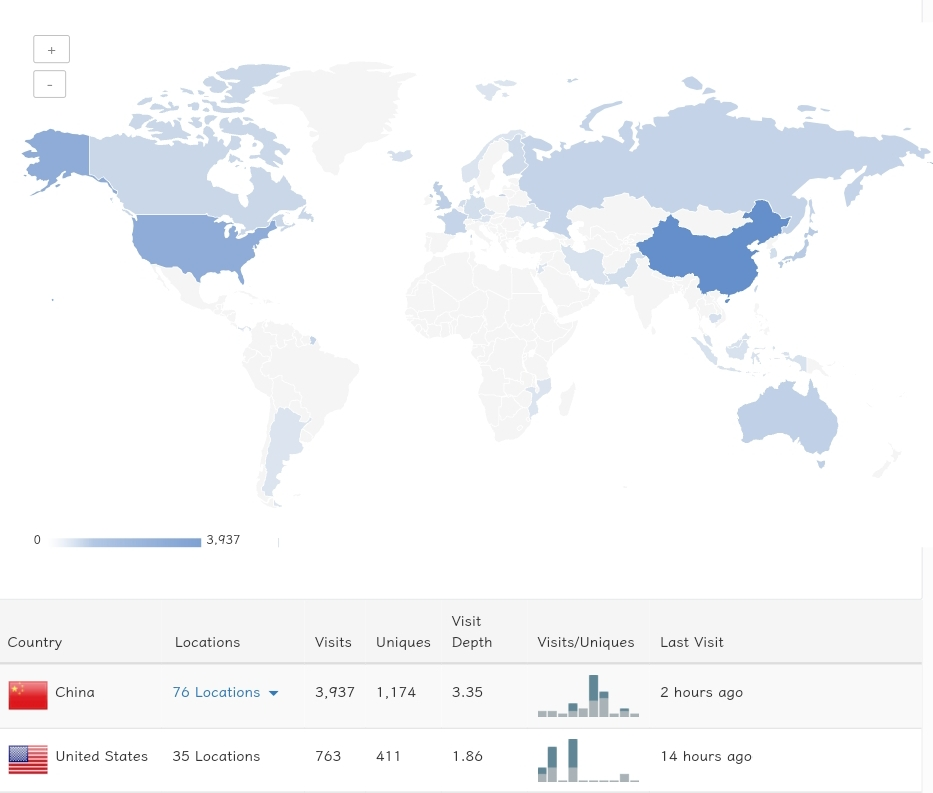
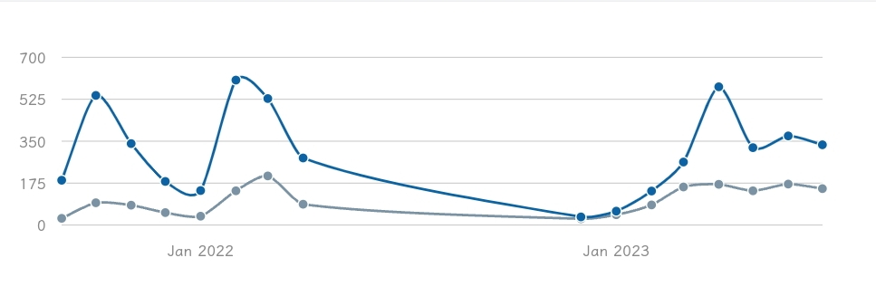


初次浏览本文，文中图表可能无法显示，此乃echarts.js未加载完成之故，稍等片刻，而后刷新即可看见。


> 
生活就像一道风景线，你生活在其中，但只能从远处的有利位置来描述它。

> 
——查尔斯•林德伯格

按照阁志里所写，本站『<u>以第一次代码提交的时间：`2021/8/25 15:10:05`</u>』为诞生时间。至于当时为何会记下这般精确苛刻的时间来，我现在已不大明白了。

难道说在8月25号之前，我便从来没有什么想写的，也未曾写过什么东西吗？而在8月25号15点10分05秒之后，我就猛的顿悟，开始真真切切、踏踏实实地开始写文章了吗？

这苛刻的时间，要是能硬生生的一个阶段与另一个阶段毫不拖泥带水，整整齐齐地崭断，那人们也就不用费神去思考了：时间一到8月25号，互联网上便有一个博客自动升级，所有者的理念也同步更新到新的层次了。

然而时间不能，记录不能，回顾不能，写作不能，学习不能，活着不能，死了也不能。

然而它又存在于时间里，在记录里，在回顾里，在写作里，在学习里，在生命里，在死亡里。

窗外的太阳跟千万年前一样升起落下，我枯坐在桌前。没什么可写，也没什么非要去回顾不可的东西，时间便凝固在苛刻的此时此刻。

不行，我得去做点什么。做什么都行，去带着耳机随意漫步吹口哨，去跟枫树上的雀儿对唱，去爬上道口的构树听风，去退了水位的河边捡石头，去混进行人中看行人走来走去，去假装看书来看看书人看书，做什么都行，只要能融化这苛刻的时间。

于是我当下笔，走出门，去带着耳机随意漫步吹口哨，去跟枫树上的雀儿对唱，去爬上道口的构树听风，去退了水位的河边捡石头，去混进行人中看行人走来走去，去假装看书来看看书人看书。

于是时间融化了，扩散了；

于是风起了，于是花开了；

于是月明了，于是心动了。

于是，我又能抄起键盘，写下一点点东西了。

## 统计
原本想把博客文章好好整理一番，形成一个数据统计的“流”，再利用Rmarkdown写个小模板，把所有东西一下子处理好。然而，当我已经把第二步到最后一步，乃至专门整一个rmarkdown的统计网站都准备好了的时候，却发现，我无法提取hexo文章的元数据[^1]，也就意味着第一步就抓瞎了。

没办法，今年[^2]就只能用` hexo-butterfly-charts`生成的图表来凑文章的统计。以下是建站两年来的统计分析(至于这两年网站的更新概况，看[阁志](/site)吧，我不想再搬来搬去了)
> 由于图表是动态的，可能三个月后，文中显示的便是三个月后的统计内容了。但此时为了阅读的互动性，先这样放着，文章发布一周后，咱家再把图表转为静态图片。
### 博客文章统计
两年来了写了不少文章，如果要让我自己推荐的话，博客里有这么几篇可以拿得出手：
1. [电子阅读新语](/2023/key4read)
2. [图片与文本的关系思考以及AIGC作品汇总](/2023/text&img&AI)
3. [密码设计手册](/2023/password-Design)
4. [剪影·朴素而绚烂的表达](/2023/shadow-in-light)
5. [影调分析-曼达洛人III](/2023/tone-mandoIII)
6. [RSS使用手册](/2022/rss)


{"monthLang": "cn", "dayLang": "cn", "title": "博客代码仓库提交--活动历", "weeks": "60", "width": "100%"}


本站的[源代码](http://github.com/aornus/source)托管于Github，上图是经营博客时，代码仓库里每次提交更改的统计日历。

虽然看起来很“过瘾”，然而并没有什么参考价值。几篇文章的撰写是一次提交，一个字的改动也是一次提交。本人平素比较粗心，但好些时候又爱着急，好些时候提交发文后，自己读了文章，结果发现有错字，赶忙回去修改，立时又提交上去，然而再读一遍后，竟又发现某个句子不通顺，某个图片没截好，又慌忙去更改下再提交...倒霉时，发文后一小时内甚至能“追提交”四五次之多。

图中显示可以看出今年二月份的最后一周提交频率贼高。2月21号当天竟提交了13次，我不知道当时在干嘛，可能是在魔改主题或者写论文的笔记[^3]吧，反正不会是在写正经东西，因为今年二月份我只写了3篇公开文章。但似乎就从那一周开始，写博客开始频繁了，之前都是星星点点的，而到了今年三月、四月、直到六月提交次数都大片大片的。六月份进入二战考研复习（耒耨期），更新频率转为周更，平时没有接触电脑，周天回去更新，这在图上也能看出来。

总的来说，这两年在博客上主要是写了一些文章(废话)，明白了表达可以促进思考，发文可以促进学习等等。还有就是...啊！算了，最讨厌总结了！那么多体会怎可能浓缩到一段文字里！总结是没有意义的，只是在不停打标签，在加深往事的刻板印象，在自我陶醉。
#### 文章发布时间统计图  
第一年的文章太旧了，都是些课程笔记之类的，这个图是从八月份开始统计的。可见去年十二月份发文最多，然而那是因为当时在执行【聚沙成塔·九九九】计划，妄想连续写999天日记，文章用干支纪日法来命名(你在推荐文章里看到的那些奇怪的东西便是聚沙成塔计划的余晖)，这计划持续了三个月，到寒假还是自动夭折了😂。

  

到了三月份开始到现在，一直稳定写作，在试图保持曲线不会下弯得那么厉害。

三月份算是博客写作的真正起步。其中一个重要的原因是，咱家碰巧赶上了[X-log](https://xlog.app/)前期发展的红利，开了个账号[空影(原名乌有斋)](https://rss3.si-on.top/)，写了几篇关于PS后期处理的学习笔记，结果什么关注啊、代币奖励啊、浏览量啊都噌噌噌的，当时获得感极大，甚至在Xlog里又发现了为碰巧遇见的校友。虽然现在我的兴趣已经不在摄影，把相机托付给妹妹玩了，但那一段时间对摄影探索还是留下来了一些东西：至少我对景物、人的观察能更入微了。照不照像之于我都无所谓了，不摄之摄，才是接下来要追求的东西。





#### 文章标签与分类统计图
自从读了叶圣陶老师所著的『作文论』，对于标签、分类的理解就变成了：
* 分类一要包举，二要对等，三要正确。包举是要所分各类能够包含该事物的全部份，没有遗漏；对等是要所分各类性质上彼此平等，决不能以此涵彼；正确是要所分各类有互排性，决不能彼此含混。
* 标签是分类的桥梁，用以连接不同分类。但“<u>数量不要过多，尽量不要超过文章数量的三分之一，这样才能充分体现标签的价值。</u>”

可惜的是，我不能总是把握住这个原则，总随意打标签、列分类、子分类、子子分类。分类还好，但标签就惨不忍睹了，现在标签与文章的比值未124/99=0.79：大概就是十篇文章有八个新标签，只有两个复用的。

补充一下，咱家并不反对写作时用一大堆标签，那样确实可以提高文章之间关联度等，但在我的博客里，就要追求这个小小的原则：即便是标签也要跟分类一样规范、包举、对等、正确！



  





另外咱家通过Obsidian进行写作管理，所以还可以一览博客所有文件的“关系图谱”，贼鸡儿壮观。播放图谱生成动画的时候，再放一首理查德施特劳斯的《扎拉图斯特拉如是说》🥁就更得劲了。






其实我是很反感审视、被审视的。这个统计图表是第一次用Gitee建站后弄的，当时的域名还是`aornus.gitee.io`，后来发现clustrmap的统计与域名无关，换了域名也能接着统计，于是就一直用了，期间在22年冬天，把统计关了，因为我讨厌被人家审视，也对那可怜的访问量自卑。后来今年三月份重新整博客，觉着总得要有个反馈吧，便重拾起来这个给访客统计:[Visitor Traffic for Aornus.gitee.io (clustrmaps.com)](https://clustrmaps.com/site/1bk51)。

这些数据没必要看，也没有参考价值，纯粹红压压地麻痹自我而已。就不信还有中东的华人来看这破站，估计那些国外ip大多都是翻墙访问的。






## 展望
博客的现状就是很理想的。发文会有人看，偶尔会有几个热心的访问者到评论区寒暄几句，一些好文章有时会被其他站点引用，遇到了一些朋友等等等等。现在的情况很是不错，预期幻想去博客的未来会怎样怎样好，要写多少多少文章，斩获多少多少访客等等，还不如去把旧文更新下。所以这第二部分虽然名叫展望，其实我并不想作什么展望。

那要做什么呢？我要做试验！

<u>更好的未来只能经过不断地试验</u>，试出来的东西才有意义，有价值，才真正是未来。从书里读到一个想法，立马动笔写下，累计念头，汇聚成文章，写文章，再反过来审视念头，继承、批判，最终让念头进化成思想。而思想一旦被延申，是难以回到过去的(塑性变形)，这便又成就新的我，也写就了新的文章，而对博客的念头(分类、标签、外观、功能等)，在一次次试验中，逐渐成了新的博客。所以，我要做更多更多的试验，探索更多更多的广度，更多更多的深度，发展随便什么兴趣，放弃随便什么兴趣。

最后重新提一下经营的最低限度要求：
* 每月三篇文章
* 严重且坚决地避免：<u>以主观之臆断哗众取宠！以背于事理的见解贻人以谬误！陷入模仿、虚伪、浮夸、玩戏的弊病而不自知！</u>

[^1]: 就是篇名、分类、标签、字数，发表日期等内容
[^2]: 明年学学python，可能会学会如何抓取、清洗把文章元数据，到那时候在重新搭建一个pages统计子域。
[^3]: 这些东西太杂，我没有公开。