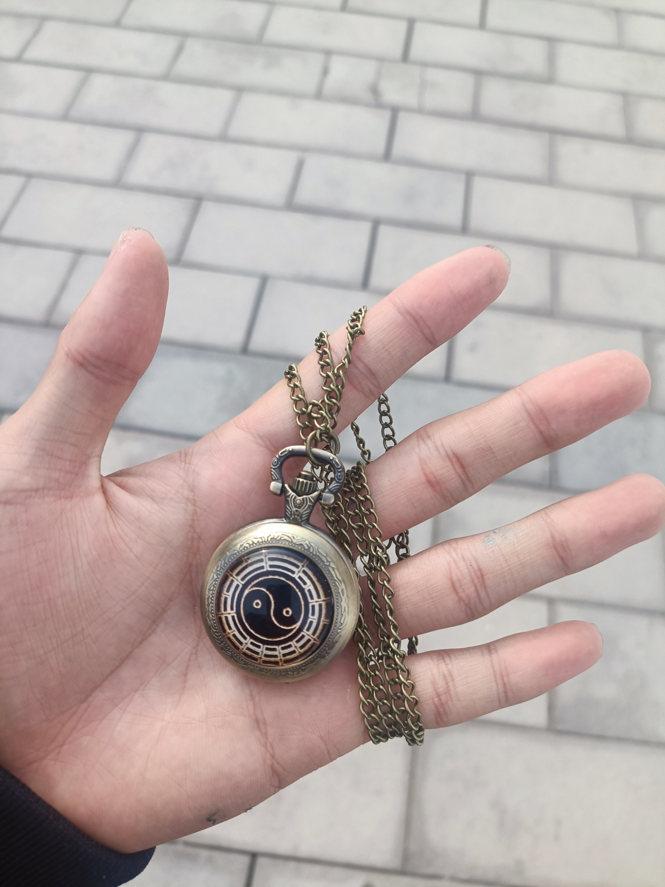

> 
知行合一只是一种幻想。

> 
——Sion

## 文章痕迹

<!-- timeline 2023-03-05-->
读社会心理学第八章有感触，遂想写此文，
本文为书中第六七八章的总结：社会影响，态度与劝导，态度与行为。
<!-- endtimeline -->


-----
>  很多年轻人对自己被强迫去教堂、寺庙或清真寺感到恼火，他们总是抱怨：“为什么我要去那？我一点都不相信这些东西。”但是，他们中的很多人却被告知：“你相不相信这些东西并不重要，重要的是你继续参与学习和祷告。”对此，一些年轻人会反抗到底，一旦他们的父母允许便立即抛开这些东西。但相当多的另一部分年轻人则会坚持下去，在继续参与这些活动之后，他们发现自己开始真诚地相信某些宗教信条了，而这些信条正是他们原先所抵触的。随着时间推移，纯粹的外显行为开始给真诚的内在信仰让路。

我起初抵触中国传统上的道教佛教，但是看了一些书后，观念就改变了许多，甚至于买了个八卦图的怀表。

