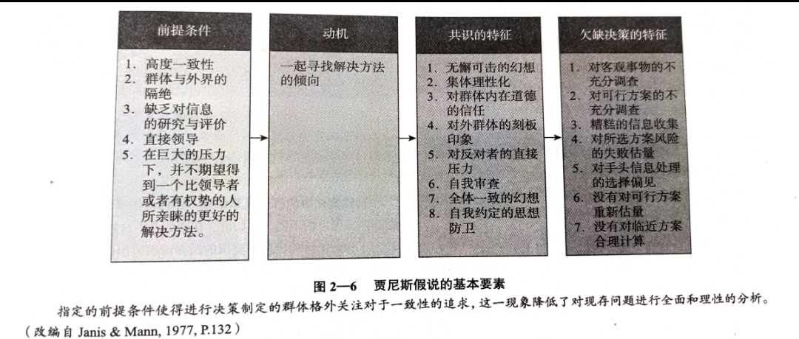

> 
Human beings are limited.(人，生而局限。)

> 
——秉蕳

## 文章痕迹

<!-- timeline 2023-02-18-->
图书馆偶遇此书，读之，爱不释手。
<!-- endtimeline -->
<!-- timeline 2023-02-19-->
采用notion做摘抄笔记。
> 说实话，我不知道怎么做才算是一个好的读书笔记，因为就内容而言，摘选自己认为有价值的才有意义，但就整体的理解而言，通篇思路的理清也很关键。令人Amazing的是，此书每章后面都有一个总结🎇，把各个小节的核心内容都概括了，所以也不用我仔细总结了！本文的内容由摘抄、总结、思考三部分组成，想要系统性了解内容的朋友们，可以看每章的小结来快速准确地把握，而对书中文字有兴趣的可以看我写的文段摘录。

<!-- endtimeline -->


-----

## 简介
书名:吉洛维奇社会心理学
作者: 吉洛维奇
出版商: 中国人民大学出版社
媒介: 📜纸媒
小评: 人生而局限！
开始日期: 2023/02/18
标签: 人性, 心理, 成长
状态: 在读(40%)
评分: 🌑🌘🌗🌖

## 第一章
导论部分，介绍了人类行为与社会群体的密切关系，大部分没有深入讲解，而是在后文阐述，所以没有太多有深度的内容。

### 小结
- 第一章小结
	1.社会心理学是关于个人在社会情境中的感情、思想和行为的科学研究。
	2.社会心理学强调情境对于行为的影响。人们往往低估情境对于其自身和他人行为所起的作用而高估个人性情对于导致行为的重要性。这两种倾向合在一起被称作基本归因错误。
	3.社会心理学也关注解释对于情境理解的作用。人们总以为自己对情境的理解是直接的，其中不存在任何中介性的思维过程。事实上，即便是对最简单对象的感知也牵涉到大量的推理以及使这种感知成为可能的认识过程。
	4.图式是人们用以理解社会情境和自然刺激的主要工具。它是一套关于反复出现的、高度类似的刺激和情境的知识储存。图式告诉我们如何解释情境，如何在其中行动。刻板印象是我们对于形形色色的人的图式——警察、拉美裔、雅皮士，等等。刻板印象能够引导解释和行为，但它们往往被误用，或其本身就与事实不符。它们有可能破坏互动或导致不公正的行为。
	5.人们对情境的解释往往在很大程度上都是自动化的、无意识的，因此，人们有时并不清楚他们何以达到一个特定的结论或是表现出一个特定的行为。
	6.进化论视角聚焦于那些普遍性的、与社会生活密切相关的习惯和思维方式。它让我们想到，这些习惯有可能先天性地存在于我们的基因当中。有部分进化论者提出，两性差别可从不同的亲本投资中得到解释。他们还讨论了一些更侧重于认知方面的普遍性特征，比如语言。人们如何习得语言、又以何种速度发展语言能力，这些在所有文化中都是相似的。同样的还有心灵理论，显而易见，所有文化中的正常人都会在生命早期形成心灵理论。
	7.不同文化中存在范围极广的行为和意义的差异，有时这些差异是非常强烈的。其中的一个重要差异是社会关系方面的互赖（即社会成员与他人之间具有多种高度固定的关系）或独立（即社会成员与他人之间的关系类型较少，也较为松散）程度。这些差异影响着自我观念、对自然和人际关系的理解，甚至基本的感觉和认知过程。
	8.社会心理学家的研究目的是对和社会世界中的种种行为有关的假设进行考察。相关性研究和实验研究的重要区别在于：通过前者仅可以发现变量间是否存在关联；通过后者则有可能确定自变量对因变量的影响。

## 第二章
### 社会助长

他人的存在，仅仅是存在，在解决简单或是易学的工作时是趋向于促进个体表现的，而在解决难题或是新奇的工作时是趋向于抑制个体表现的。

促进执行简单任务、抑制执行复杂任务这一基本模式足够可靠，能保证以此提出的一些实践建议。对学生而言可能最适当的就是对如何学习提出明确的建议。当学习材料比较复杂、陌生，必须全神贯注时，要独自一个人学习，最好不要有其他人在场而导致激动和分心。小组学习方式可能对复习或者把大量的学习资料分割总结有帮助，当一些成员拥有其他人没有的信息或方法时小组学习方式的价值无法衡量，但是吸收整合新观念这种困难的工作还是应该独自一人来完成。当学习材料被吸收后，就立刻安排学生在一起进行考试。

### 群体迷思

群体迷思（groupthink）: 在迫在眉睫的事情上，群体迫于公众舆论的压力必须达成某种共识，从而忽略了对于关键性问题的审查，采取了一种错误的思维。

某种程度上说，制定政策的群体只从已经存在的观点里寻找支持，而不是苛刻的仔细鉴别审查这些线索。

强力型的领袖和寻找共识的冲动会导致自我审查（self-censorship)，即对信息提供和观点表达做出自我限制。

### 扎伊翁茨的理论

第一，仅仅是他人的存在，就会使个体具有更高的唤起水平。（一般来说，同一物种中其他成员的存在，都会使个体趋向于具有更高的唤起水平，而我们现在主要研究的是人类。）他人是动态的、不可预见的刺激物，有可能在任何时候做任何事情。因此，在他人存在的情况下，我们需要足够的警觉和清醒的意识，以便能够及时地应对旁人有可能做的事。

第二，刺激会使得一个人更加“坚定”，即他会更加倾向于做那些他本来就可能做的事。在扎伊翁茨使用的语言刺激使得一个人做出了支配性反应（dominant response）。我们这样思考一下：在任何情况下，你可以做出很多种反应，这些反应可以根据事情发生的可能性排列成一个层级。在这个情况下你最可能做的位于这个层级的顶端，我们称之为“支配性反应”。例如，假设你正在打字，你想打这个字母“d”。你会用最正确的输入法，即用左手的中指敲击一下键盘。然而，根据经验，我们有的时候也是会犯错的，而且错误并不是随机产生的。如果你没有按下正确的键，你很可能会按成旁边的“s”或是下面的“c”。所有可能的反应都可以根据可能性排列成一个层级。扎伊翁茨指出，当受到刺激的时候，人们往往都倾向于做出位于层级顶端的反应。

扎伊翁茨理论的第三个组成部分将支配性反应趋势的增加，与对简单工作的促进和对复杂工作的抑制连接了起来。对于简单和易学的工作而言，支配性反应是正确的反应，这就意味着这个工作是简单和易学的。你的反应本身就是一个正确的反应。因此，他人的存在，促进了你的支配性反应，促进了正确的反应从而也就改善了你的表现。
### 💡 阻止群体迷思的方法

团队可以通过确保自身不被来自外界的因素割裂而避免贾尼斯所说的狭隘的视角和错误的共识（大家都相信的错误观点)。

那些在讨论一开始就持无私态度的个人可以提供一个新鲜的观点，这就好比把突破性进展方案加在任何鲁莽的行动上，而这类行动所产生的动力可能大到无法阻挡。

最后，通过在小组里任命一个专门当“恶人”的家伙—拥有敏锐的直觉，专门尖酸刻薄地挖出大家公认方案中的每一个弱点,就可以提供一道类似阻碍鲁莽行动和平庸计划的保险。正如科学家们学会通过发觉自己理论的缺陷和指明其他平行理论怎样解释一模一样的数据来评估自己的理论，政策制定者也应当明智地引入有利于识别每个计划的“阿基里斯的脚后跟”（Achilles'heel）的类似机制。（练门）

### 趋同

尽管讨论事关公共政策时，其内容方面的争议五花八门，但最有可能聚集起来讨论它们的一群人却有着大致相同的观点、想法，和大致相同的偏好。因此，这将会是一个趋同性的团体，而且他们将会在很多事情上倾向于同一方向。集体极端化的现象因此会发挥实际作用。当趋同性集体走到一起时，他们讨论后的态度很可能比其中的组员的态度有更强的倾向性。

### 信息选择的害处

如果对信息输入的限制只是加强了人们的初始观念，这本身新将成为一个问题。然而，关于群体极端化的著作使得这一问题更加严重了。想法接近的人之间的群体讨论并不是仅仅加强了原先的观点；它使得原先的观点更加极端化了。因此，当代的交流技术，例如因特网，将会酝酿这种极端主义。当今存在的各种仇恨团体，他们也将因特网作为交流工具并广泛使用。尽管这些团体显然不是由因特网本身造就的，可是，这种交流模式，以及它所煽动的群体极端化的趋势，将很有可能助长这些仇恨团体的极端主义观点。

>这种观点同样适用于听歌喜好，政治观点，个人品味等诸多方面的培养。

### 小结
- 第二章小结
    
    1.人类和其他灵长类动物（除了猩猩）一样，都是群居动物，相互影响，必须与其他同类一起生活。
    
    2.其他人的存在有时对人们的行为起促进作用，有时起抑制作用，但都是可以预知的。对社会助长这一领域的研究表明他人的存在起激励作用，这种激励增加了人们原本预计表现的趋势。对于简单的工作，人们的预先反应是正确的，增加的趋势就促进了表现。相反，对于陌生和复杂的工作，人们并没有做出正确的预先反应，所以激励加强了错误的反应，抑制了表现。
    
    3.一些绝妙的实验表明，他人仅仅在场就会导致社会助长作用，虽然其他因素，包括评价忧虑，可以加强这种作用。此外，分心一冲突理论通过指出意识到他人的存在导致个体分心，从而在对他人的关注和手头工作产生了一种冲突，来解释社会助长。
    
    4.社会懈怠是这样一种趋势，即个体的功能不能被监视的时候，人们对群体的工作付出的努力会减少。
    
    5.大批群众有时会有转变为无纪律的暴民的趋势。这一现象会发生是因为，在大群体中的匿名性和责任的分散性，会导致精神上的去个性化：一个人较少地去考虑将来、正常的社会行为制约以及行动的后果。
    
    6.“迷失在人群中”的去个性化的状态与人们具有相当个体区分性的通常感觉相比，其差别是很显著的。自我意识理论包括：对自我的关注将会导致个人主义，深思熟虑和对自身言行的关注遵照其内在的道德标准。
    
    7.大多数人都高估了自己的状态和与他人相比的独特性，这一现象被称为聚光灯效应。
    
    8.群体迷思，是指有凝聚力的群体成员，通过追求更具有感染力的结果而不是对所有的信息进行严谨分析后，做出具有高度一致性的决策的一种趋势。群体迷思导致了许多错误决定造成了政治灾难。
    
    9.群体决策的制定受到以下因素的影响：群体一致性、领导者的方向性、导致自我审查的群体内部压力、人们在其他成员所达成的明显一致结论的情况下避免表达自己的情感或者采取保守态度，从而忽略并拒绝了其他可能的观点。
    
    10.与其他成员交换观点会导致更加极端的决策，而且也会使人们的态度更加极端化。当群体相对于个人做出更加冒险的决策时，风险转移就发生了。
    
    11.群体决策会带来群体极端化，由此初始的风险倾向在经过讨论后会具有更高的风险性，而初始的保守倾向在经过讨论后会变得更加保守。
    
    12.群体极端化是通过说服性争论产生的，在整个争论中更广泛的信息和论点对于全体成员都是可以合理使用的。群体极端化也是通过社会比较产生的，在没有客观评价标准的情况下，人们将自己的观点和论题与其他人相比较。
    
    13.来自于认为风险有很大价值的文化中的人，相对于那些来自认为风险没什么价值的文化中的人，在群体讨论后往往会做出风险性更大的决定。
    
    14.极端化是同一性群体的一个显著特征，在当今社会中这将带来特殊的问题，人们都倾向于阅读和收看那些符合他们先前观点的报纸和新闻节目。这种极端化会通过因特网的交流进一步加强，人们更容易找到那些与自己想法相近的人，他们仅仅与有共同观点的人交换信息。
    

---

## 第三章

当你对某事的机理了解得越多，你的兴趣并不会减少。例如，如果你知道彩虹产生于空气中小水滴对光线的折射的科学事实，彩虹的美并不会因此打折扣；如果你知道所有的生物都是被进化规律塑造出来的，现实的奇妙也同样不会减少。如果说有什么区别，那就是深层次的认知来源于更丰富的而不是逐渐减少的体验。

接近成就友谊有三个主要原因。正如我们看到的，第一个原因可接触性，即简单的交往；第二个原因是我们倾向于善待那些有可能同自己频繁交往的人；第三个原因是因为与某些人相处久了会带给我们的自在的感觉。

预期互动产生的效果（如果人们预料到要和某人互动，那么人们会提前给予那个人一个好的预期。仅仅是这一点就可以增添我们对那个人的喜爱之情。

扎伊翁茨主张：“只要一个刺激物在我们眼前一再出现，则足以强化我们对它的态度。（Zajonc，1968，p.93）通俗一点讲，你看到某物的次数越多，你就越有可能喜欢上它。你对越喜欢的事物就越喜欢，对越是无法忍受的事物就越是进一步无法忍受。

假如一首歌在电台里每个频道相继播放，你会对它产生越来越强的厌恶感一开始确实如此！但当它逐渐落伍，而你又为了回忆“美好时光”而再听这首歌，这种心态又怎么解释？可能的解释是：如果不是当初你一而再、再而三地听过这首歌，它就不会在后来激起你那么强的喜爱和怀旧之情（记住，我们讨论的这些歌曲是差劲的）。

在给定环境下，如果人们频繁地暴露在各种事物面前，他们在一定程度上会喜欢上这些事物。

我们喜欢它们是因为它们属于我们。（Hoorens，Nuttin，Herman，&Pavakanun,1990; Nuttin,1987)。

酬赏理论提供了一个基础：为了博得他人的欢心，你会做些什么？（从我们已经讨论过的因素来看，明智之举包括：弄到一间临近郦箱的公寓套房，遵从大多数人的看法，以及定期洗头。酬赏理论还远不止这些。如果你希望人们能够喜欢你，就得对他们付出，让身边的人感觉到快乐。

我们倾向于认为自己的信念和人生观是优越的。我们认为它们是来自对相关信息仔细观察得到的合理的立场。简单地说，我们的绝大多数信念、价值观、品味和习惯是“正确的”。在特定的领域里，我们还会认为自己的大多数性格特点是恰如其分的。尽管我们会承认自己有些缺点，然而我们会努力在那些我们认为是最重要的品质上成为最优秀的。这种导向导致的逻辑结果是：我们会认为那些和自己有着相似之处的人有着正确的品质，就像我们自己一样。

### 小结
- 第三章小结
    
    1.我们究竟会被谁吸引？决定性因素之一是亲近，或者说单纯的和有吸引力的潜在目标的接近。在很大程度上，人们了解，进而喜欢并与之坠入爱河的人是那些住所附近、工作场所以及娱乐场所经常接触到的那些人。
    
    2.亲近作用如此强大，原因有三个：（a）纯粹的可接触性：要想了解进而喜欢他人，一个人必须首先和他们接触；（b）对交往的预期：如果一个人预期自己将来会再次和某人打交道，他通常会把自己最好的一面展示出来；（c)纯粹曝光效应：只要让一个人或一样东西频繁地出现在面前，就会让我们对之产生更多的喜好，就算是在不好的环境下也是如此。
    
    3.第二个吸引力的主要来源是相似性。和那些随机组对的男性和女性相比，夫妻之间存在着更多的相似性。对想象中的陌生人这个例子进行的研究得出一致的结论：人们对与自己更相似的人更加关爱。当然也有少量证据支持“相克相生”。
    
    4.在相似性产生吸引力这个方面，有以下四个原因：（a）有相似性的他人认同我们的信念和价值观；（b）相似性有利于帮助交往顺利进行；（c）我们认为与自己相似的人会喜欢我们（这是回报性的)；（d）相似性的他人拥有我们喜欢的特点。
    
    5.容貌吸引力是产生吸引力的另一个主要源泉。拥有容貌吸引力的人更容易受到异性的欢迎。有吸引力的人在工作方面容易得到更高的评价。在工作场所，有容貌吸引力的人能挣更多的钱。即使他们犯了罪，受到的处罚也会比一般人更轻。简单的说，他们可以从晕轮效应中受益，即他们被认为可以拥有超越容貌吸引力的很多其他正面的特性。
    
    6.甚至在婴儿和幼儿时期，吸引力就开始发挥作用了：有吸引力的婴儿可以得到母亲更多的关爱，而且有吸引力的孩子会被老师认为更加聪明。人们会认为有吸引力的孩子违规的后果会轻一些。更进一步的是，就连三个月大的宝宝会也会多看一会儿有吸引力的脸。
    
    7.性别差异是影响吸引力作用的一个重要因素：容貌吸引力对女性的影响远远大于男性。如果没有吸引力，在职女性要比在职男性受到更糟的待遇。
    
    8.容貌吸引力有这样的影响力是因为以下原因：（a）它具有直接性——和其他优点和缺点相比，你可以更快地发现它；（b）一位有吸引力的朋友或伴侣可以提高你的声望；（c）生物因素也起了作用：我们会对某些方面的容貌吸引力更感兴趣。
    
    9.进化论心理学家提出观点：我们的生物学提示了一些长相方面的吸引作用，它们展示了某些繁殖适应性——就是说如果和拥有这样长相的人配对并生孩子，我们延续自身基因的可能性有多大。这包括那些反映身体活力、生殖能力和可能的生育成功机率的外表特征。
    
    10.进化论心理学家也声称：在吸引力的重要性和决定性方面，男性和女性存在着以生理学为基础的差异。
    
    11.在那些雌性动物对幼崽投入较多的物种里，雄性们会为了接近稀有的异性伴侣而展开激烈的相互竞争（同性相争）。雄性们也会为了吸引雌性的注意力而竞争（异性相吸）,正因为如此，雄性的外表通常比雌性更加华丽高调。
    
    12，根据进化论心理学家的说法，在人类当中，由于女性和男性在对下一代哺育方面的角色不同，使得女性对于性伴侣数量的要求低于男性。这也导致男性更加关注拥有那些展示强生育能力的特征的女性——比如说，光滑的皮肤和比臀围略细的腰围。女性们被那些可能给自己和孩子提供更多物质基础的男性吸引——即强壮、勤奋、有社会地位的男性。
    
    13.尽管对动物界和人类世界的种种现象进行的研究支持着进化论心理学家的猜想，但是在人类问题上的绝大多数发现可以不用进化论就能解释清楚。在解释人类的吸引力方面，来自进化论学说的最强有力的证据就是：女性们在生理期的排卵阶段，即她们最有可能受孕的时间段里，更加青睐于那些有吸引力（至少在对称性方面）和有男子气概的男性。
    
    14.酬赏理论可以用来解释我们之所以喜欢一个人的大部分原因——我们倾向于喜欢那些可以给我们带来最大回报的人（广义的回报）。
    
    15.了解吸引力的另一种方式是通过社会交换的视角。这种理论认为：人们会追求那些收益最大化的、获得超过付出的人际关系。
    

<aside>
💡 昔孟母，择邻处。子不学，断机杼。

</aside>

<aside>
💡 日久生情

</aside>

## 第四章

### 💡 关系是人类的基本需求

归属的需要应当是可满足的。因此，在特殊关系中，它应该去激发想法和行为，如同口渴和饥饿一样激发人的意念和行动，直到这种需要被满足。就拿一种对我们大家来说都很重要的关系——友谊来说吧，在西欧文化中，大学生倾向于把亲密的、有意义的互动范围限制在平均六个朋友左右（Wheeler &Nezlek，1977）。看起来我们用有限的亲密朋友数量来满足我们日常的、稳定的，以及有意义的友谊的需要，一旦这种需要得到满足，我们就不在其他互动中寻找它。但是假如我们归属的需要不能在现有的关系中被满足，个体就会在别的关系中寻求满足。

当某人让我们想起另外一个重要人物时，一个特定的关系性自我就浮现了，也就是关联性的感觉、信仰以及自我评估，然后通常在无意识中塑造了我们和这个新个体的互动。

“关系的自我扩展解释”（self-expansion account of relationship )。这一理论认为，人们建立并维持亲密关系，是为了扩展自我，因为在关系中我们可以将对方的智慧、视角、经验和个性转化为我们自我概念的一部分（Aron，Aron, & Allen，1989；Aron &Aron，1997）。我们进入关系当中，就会有效地形成更完整的自我。)这个理论暗含一点，就是在形成关系的过程中，我们的自我和我们对亲密伙伴的呈现应当合二为一（Aron& Fraley,1999）。

如果让人回忆一个故事，大量知识，或者一系列讯息，关系伙伴就比两个随意组合的人能记住更多的信息。这是因为关系伙伴知道他们的伙伴关注什么，这样就能分配不同的注意力给信息的不同方面，关系伙伴能够把信息归类分组进行记忆，所以相比那些不得不记住所有信息的随意组合的人的记忆效果更好。

“人们倾向于将一个新的关系对象，如配偶、孩子、老板，或者医生，同化到自己的现有模型中，如父母，或干脆就是他们自己。即使一再有证据表明这个模型不合适，人们也乐此不疲。”—约翰·鲍尔比（John Bowlby)

- 小结
    
    1、归属的需要是一种生物本能，它为进化带来的好处以及在不同关系中的普遍存在这两点可以证明；而负面后果是如果没有社会关系可依靠，就会像野孩子一样呈现出种种能力缺失。
    
    2.关系塑造自我感知和记忆、解释社会事件的方式。人们都具有和他人的关系所带来的特定关系自我，或者看法、感觉和期待。当其中一个被某个特定的人激起，这个人就会被当作相关的关系自我。
    
    3.约翰·鲍尔比提出的依恋理论认为，在人的早期，孩子会依靠父母获得一种安全感。在这种关系的形成过程中，些孩子比另一些孩子幸运。具有安全型依恋风格的人希望和别人亲近，因此他们在面临压力时更希望和他人靠近。具有逃避型依恋风格的人在和别人的关系中感到不安，会和他人保持距离。具有焦虑型依恋风格的人在和他人的关系中同样缺乏安全感，但他们面对不安的办法是强迫性地寻求亲近，以及困扰于和他人关系的好坏。
    
    4.研究者发现依恋风格在人的一生中相当稳定。安全型、逃避型和焦虑型的人的生活完全不同，具有不同的关系满意度水平（安全型依恋风格的人对关系满意度最高，关系最不容易破裂），并且遭受不同的困难（焦虑型依恋风格的人特别容易出现心理问题）。
    
    5.费斯克的关系模型理论认为有四种不同的关系类型：（a）共有共享关系，像家庭一样的关系类型，群体中的成员按照他们的需要索取，并根据他们的能力付出；（b）权威等级关系，像一个首领统治的现代企业、部落群体一样，权力从顶层向下流动，资源按照领导的意志来分配；（c）平等匹配关系，基于互惠和一致性原则，友谊是这种关系的典型例子；（d）市场定价关系，基于投入产出均衡的判断，这种关系类似于企业，个人着重于确保他们在关系中的付出对应于所得。这些关系在所有社会中都存在，但不同的文化在不同的领域会应用不同类型的关系形式。
    
    6.克拉克和米尔斯对长期性的共有关系和短期性的、基于平等考虑的交换关系进行了比较研究。
    
    7.权力基于地位、权威和支配关系。按照权力的滥权/克制理论，膨胀的权力让人采用过分简单的方式看待事物，并且在社会中无所顾忌地行动。
    
    8.最神奇和吸引人的关系就是亲密关系。它是我们生活中的重要组成部分，并且对我们的生活满意度和身体健康极其重要。
    
    9.离婚和婚姻不满常常是由于和一个年轻的、喜欢批评的、防御性的、抵制的，轻蔑的人结婚所造成的。
    
    10幸福的婚姻受承诺影响，它表现为在关系中的回报、可替代的对象、以及对关系的投资。幸福的夫妻会对伴侣有更多的正面错觉，还喜欢一起参与新奇有趣的活动。