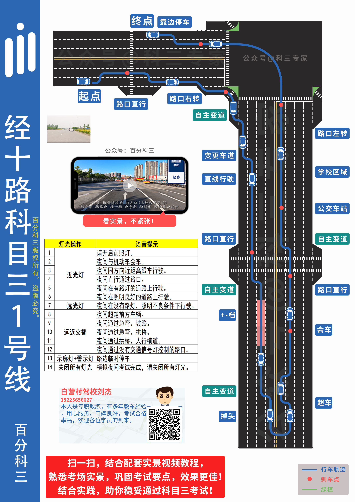
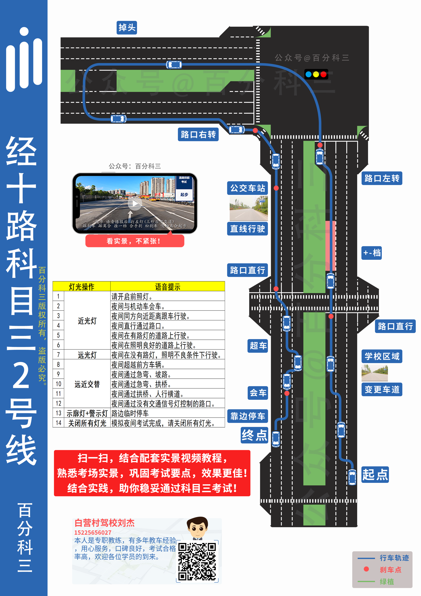
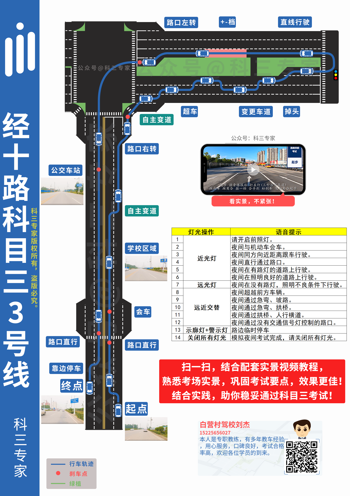

> 
谨小慎微，临危不乱，行稳致远。

> 
——秉蕳

## 文章痕迹

<!-- timeline 2023-01-02～01-03-->
-   记录与修改 (Noted from training)
<!-- endtimeline -->
<!-- timeline 2023-01-05 04:44-->
-   添加卫星图
-   添加各条线路 (Helped by Skirt the Long)
-   详细注意事项 (Record from instructor the Hotel)
<!-- endtimeline -->
<!-- timeline 2023-01-05 11:44-->
-   润色文章
-   放弃文章所有版权 (本文内容使用 WTFPL 许可证书，请任意放心使用，署名与否你随意)
<!-- endtimeline -->


-----

## Q&A
1. 科目三是否有总时间限制？
	总时间无限制，但距离有限制，可以在考点附近无限的慢，一场考试平均下来大概15分钟。
2. 百米加减档是否有距离限制？
	百米加减档无硬性距离限制，亦无硬性位置限制。在没有出错情况下，按训练时的顺序去做，一旦忘记，要慢行回忆路线，并在合适位置做一次。
	(注意: 三号线可在左转经过公交站后，终点前进行一次加减档补救。一二号线距离太短，容易过项目或者发生危险，难以补救。）
2. 夜间行车看不见路怎么办？
	打转向，挂一档，观察后方来车道，松手刹，十秒内启动上道。摆正后加速换二挡，然后可以开近光灯辅助照明。
3. 加减档怎么操作？
	**2-3-4-3-2**，三挡升四档不需要停顿，升四档后停五秒，脚必须离开离合，加速到30迈以上。百米加减档都无🈚提示。三挡降低到二挡在**25迈**左右或者**慢抬离合**发动机不会发出大噪音，达到平稳减速，以防止抖车扣分。
	
	注:档位位置: 左：上一下二；中：上三下四
4. 起步后，全程保持在档位3吗？
	**起步一档，然后立马加速换二挡，一档不能走超过50米。之后一直保持2档，15～25码左右**。(夜晚5:40后看不清路，要在换二挡进入车道后开近光灯）
5. 会车就拐一下？！
	对，先向右看，再刹一下车，再微右拐，微回正。
6. 超车完成右转向灯？
	对
哪边转，哪边打转向灯，看哪边后视镜，**打完转向灯要给后车五秒的反应时间。**
## 注意与技巧
- 开始考试的注意事项:先进去认证身份，然后进车检查离合油门，熄火状态，关闭灯光，置空挡，听到『开始考试』然后绕车环视，听到指令后启动发动机，开始夜间灯光模拟，模拟语音落再恢复动作。最后打转向灯，挂一档，观察左侧来车，松手刹，十秒内启动车辆，然后立马加速换二挡。
- 听清指令再操作，考试员的操作会改变考点的顺序，尤其是二号线。
- 模拟灯光，先关双闪再关总开关。
- 模拟灯光，字眼里含有『通过』『超越』的皆为远近光闪三次。(除了夜间直行通过路口是近光灯)
- 右脚控制**油门与刹车**，切忌不能空挡滑行。
- 油门，离合，不能同时踩。换挡左脚踩离合。
- 自由变道没有提示，需要自己注意，一号线4+1个，二号线0+1个，三号线2+0个。
- 超车的基本要领，一是超车路线，要从前车的左侧超越；二是转向灯的使用，超车前要开启左转向灯，超越前车后要开启右转向灯，方向盘15°，车头进1/3即可回方向。过两条白线(大约六米后)后再转。
- 停车时注意⚠️先踩离合，换一档。
- 看到黑点就注意刹车。
- 直线行驶，不能踩离合、不能僵死的直，动态微调，看清前面方向，方向盘开回小幅度转动，转—回—转—回。
- 会车 提前往偏道路左侧一点行驶，给会车时的右转以更大的扭转余地。
- 路口左转 左打半圈即可。
- **路口右转 转向灯一定会掉，必须及时扳上去。右转出去后，就一号线进港湾，其余都进最右侧车道。**
- 学校区域、公交车站、人行道路口、直行路口、拐弯都需要【拖拉式】刹车，即先加速一点点，到点附近轻而长时间踩刹车，要确保不能把车噎死。
- 停车不能超过120米，停车时直接离开油门换刹车，再半踩离合，缓慢行驶，对准后停住车，最后离车准备需要注意:【置空挡，拉手刹，转向灯归位，熄火】安全带放好，注意安全，开车门迅速关闭后到右方考试员处等口令。
- 直行路口软变道(即路口内无线时变道)不需要打转向灯。
- 路口卡死，拐过去弯，车走正后再加速换挡。不能在斑马线内停车(拐弯前找准时机)，在黑点处停车起步后不用踩刹车！
- 变道时方向盘15°即可，
- 二三号线超车时注意安全。
## 各条线项目路线及注意
### 路线卫星图

### 一号线

1. 起步后第一个直行路口刹车点极其容易挂：两个黑点之间刹车或者过第一个点刹车一直拖拉到第二个黑点。
2. 直行路口软变道或者过路口自由变道到最右侧车道，以便于之后的右转。
3. 右转后进入港湾。
4. 公交车站 两个黑点之间刹车点
5. 直行路口 箭头尾部踩刹车
6. 直行路口后准备变道做加减档，不变道则需要在加减档后两次(间隔时间超过5秒，否则会被视为连续变道扣100分) 向左⬅️自由变道
8. 自由变道汇总：
	右转弯前向右软变道；
	右转弯后从港湾向左⬅️自由变道；
	直行路口后向左⬅️自由变道；
	百米加减档后向左⬅️自由变道以转弯；
	回来的直行路口后向左⬅️自由变道以左转弯；
	【记法】 右转一个，加减档一个，直行一边一个
### 二号线

1. 二号线项目顺序不固定，注意听指令，语音落再进行操作
2. 起步，变道，学校区域，路口直行后记得准备加减档
3. 左转后进入最左侧车道，以便于拐弯
4. 左转弯，箭头尾部黑点之前**刹车点**
5. 拐弯进最右侧车道，以便于右转
6. 右转后进入右侧第一车道，不能进入港湾！！！
7. 公交站（三个黑点），第二个点开始**刹车**，溜到第三个点
8. 直行道后软变道到左二车道进入，以便于最后的停车
9. 直行车道，第二个箭头**刹车点**
10. 学校区域，中间绿化带空缺处**刹车点**
### 三号线
> 这条线是我第一次练习科目三走的路，也是壬戌日晨得到深刻生活经验的那条路。

1. 起点在一个工地门口，车多，需要极为小心。早上练车可以看见东边日出，甚是惬意。
2. 直行路口过黑点踩刹车
3. 过去路口车辆往左偏，以便于会车
4. 过了学校区域注意向右➡️自由变道到最右侧以便于右转弯
5. 右转后不进港湾，一但进了需要两次向左⬅️自由变道，以确保后面拐弯之前进入最左侧车道
6. 拐弯的十字路口有红绿灯🚥，注意与前车拉开距离
7. 拐弯后进入最左侧车道，拉直车准备直线行驶
8. 直线行驶注意微调方向，找一个参照点开回微调
9. 直线后进行加减档，没有提示！！
10. 左转后进入最里侧车道准备以便于停车
11. 公交站牌在两个黑点之间刹车
### 灰色地带
在考场中，教练开车『照顾』考试中的学员，这种行为黑话谓之【碾车】。
碾车根据教练个人特点会有许多不同行为，我所见到的有：
1. 教练车在前方假装练车，做示范来提醒后方考试车中的学员
	这种行为是典型的照顾，要注意别分太多心看前车的动作，只要确保与前车在一个车道。刹车点、项目点处如有模糊，可多注意前车。但是前车亦可能是学员在驾驶，教练在旁夺取了控制权，有可能意外停车，也要注意保持一定距离。
2. 教练车在考试车前方缓慢行驶
	这种行为目的是提醒后车压低车速，找到好时机再过项目。教练车在前方开路，给考试车创造最佳路况，比如让加减档时道路上处于无车或少车状态。遇到此类情形尽量压低车速，必要时多停车等候。
3. 教练车在后方跟车行驶
	这是教练在保障后方的安全，也兼有检验学员技能的目的。这种情形下在教练眼皮子底下挂掉，会被教练狂喷好久(虽然他不知道你的名字)。开车时忽略后方车辆特征即可，把所有后方车辆当做训练车看待。

 ## 最后的思考

> **目的可以反映手段的正当性**，也就是说 **目标的没有实现就反映了手段的不正当**。这个颇有政治色彩的观点，虽然说的过于绝对，但是很是真实。现实就是如此：**胜者为王，败者为寇**。虽然世界上很多东西难辨黑白是非，但是**结果的反映**却是人人心中一道专横的分界线。不论失败者有多少后来人看来起是多么高效、多么先进的方法，一旦失败成为了事实，那方法的传播就无从谈起，奋斗的艰辛也无人问津，而成功者的方法无论多么低效、多么愚蠢，都必定会大行其道，其历程的也会被大肆渲染。这就是为什么成败带来的影响往往会压制住理性的思考。  
> 
> 
> [—— 壬寅年总结](https://blog.si-on.top/2022/2022summary)

由偶然因素导致的结果居然可以影响过程的正确性，这不是一件非常奇怪的事情吗？不过还好，这次经历的结果并没有辜负过程。  
早晨三点半起床，四点十分排队，七点十分签到，八点半进入大厅，中午十二点五十录入身份信息，二点五十开始考试（一号线）。  
此次考试除了起步时差点忘了踩离合，与直线稍微右偏外无有其他大的错误，本人以宛南经十路科目三路考满分的结果来证明这个笔记的正确性，希望可以给更多人帮助。

---

注：本文写于壬寅年小寒 (2023-1-5)，科目三的路线、刹车点以后可能会有所变更，希望有人日后看到此篇文章可以在此基础上修改完善，帮助自己或者更多人通过宛南经十路的科目三考试。