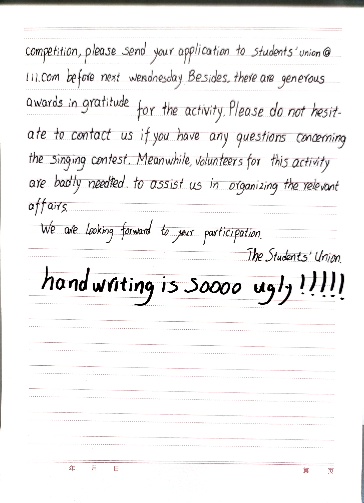

> <center>溱与洧，方涣涣兮。士与女，方秉蕳兮</center>
> <p align="right">——《郑风·溱洧》</p>
## 取名
下午回忆了一下曾经取的id，想再取一个古里古气的名字。
1. 霄～神往 / 碧～心驰
	出自『晴空一鹤排云上，便引诗情到碧霄』『心驰神往』
2. 月～长忆
3. 霞～隐没
	出自《奥义书》『显现与隐没都是从自我涌现出来的』
4. 应律
	出自《九歌·东君》『应律兮合节，灵之来兮敝日』
5. 秉/勖/隼/迹/涤
	- 夜皎，钟鸣，撰辔，东行。
	- 载驰，零露，临渊，瞻顾。
	- 风吟，且舞，扑尘，复路。
	- 流波，纷扬，偃仰，涤荡。
	- 阙月，曷期？宵征，允臧。
6. Sion
	出自自己起的谐音英文名『Sion Tian』

『秉』这个名字感觉用着挺舒服，要不"梦回2019"算了👀。不行不行，《线性代数·图学》第一部分整完了再去扒拉扒拉『墨子』『庄子』，『诗经』似乎扒拉好多次了，这回换一个理性点的书"窃字偷词"。

### 偷句中...
> 吾处身也，若厥株拘；吾执臂也，若槁木之枝；虽天地之大，万物之多，而唯**蜩翼**之知。吾不反不侧，不以万物易蜩之翼，何为而不得！”

> 善游者数能，忘水也。若乃夫没人之未尝见舟而便操之也，彼视渊若陵，视舟之覆犹其车却也。覆却万方陈乎前而不得入其舍，恶往而不暇！以**瓦注**者巧，以**鉤注**者惮，以黄金注者湣。其巧一也，而有所矜，则重外也。凡外重者内拙。

> 与齐俱入，与汩偕出，从水之道而不为私焉。此吾所以蹈之也。

> 秉心宣犹，考慎其相。《桑柔》

> 溱与洧，方涣涣兮。士与女，方**秉蕳**兮。

还是诗经里头的词比较适合当id，就这个吧——『秉蕳』：拿着香草的意思。不过这个名字与网站名——Foundation不搭啊，干脆全推翻重弄吧，反正当初也没有仔细起过名字。
互联网博客，是个虚无的东西，摸不着，咬不到，纯粹是子虚乌有的东西。那么，就叫“子虚阁”吧，“乌有室”、“捕风楼”、“捉影斋”也听着都还行。不过这些名字总感觉“文邹邹”的，跟个北山的隐士一般不食人间烟火，还是选个别的罢。
查了一番古代建筑名，发现**栈**这个词挺有意思。《说文》：『栈，棚也』，它表示储存货物或供旅客住宿的房屋；用木料或其他材料架设的通道；另外它还是现代计算机名词——Stack，表示数据临时储存的地方。
这也衍生出了另外一个新词——技术栈：指某项工作或某个职位需要掌握的一系列技能组合的统称，一般来说是指将N种技术互相组合在一起(N>1)，作为一个有机的整体来实现某种目的或功能。也可以指掌握这些技术以及配合使用的经验。这个意思好像跟博客不太契合，那咱随便曲解一下：博客栈，是指将许多工作、学习、生活的经验进行记录、总结、思考并堆栈到一起的，以高质量的不断增删的文章为特色的，不以营利为目的私人性质的网站。好了，这样一来，“栈”，就可以应用到博客名字上了。
那么本博客就正式改名为——“子虚栈”。
含意为：虚拟的，堆栈学习生活经验的云端棚子。

## Kindle待机监测
* 2022-12-06 19:08:17 开机 电量99%

## 网站变灰
昨天魔改的导致博客的菜单溢出，今天这个方法看起来没有异常了：在自定义的css里面html属性里添加上这两条就可以了，
```css
html {
  ...
  filter:progid:DXImageTransform.Microsoft.BasicImage(grayscale=1);
  -webkit-filter: grayscale(100%);
  ...
}
```
> 咱家用的`Butterfly`主题，懒得自定义css了，直接在`themes\butterfly\source\css\_third-party\normalize.min.css`里头的html下面添加了这两条属性。

## 线性代数·图学 I 


## 翻译与练字
明天要好好练练衡水体！！！

## 形核计算题
