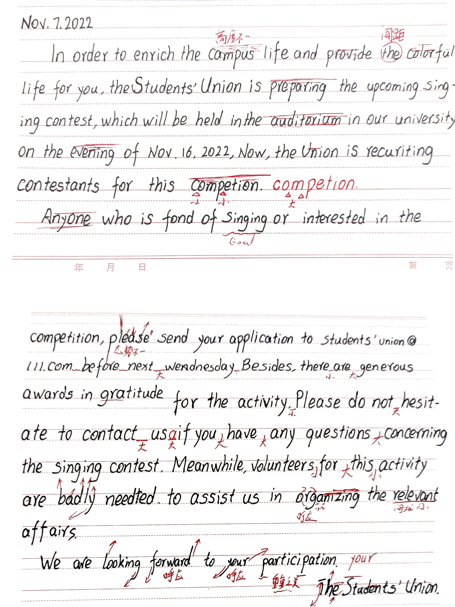
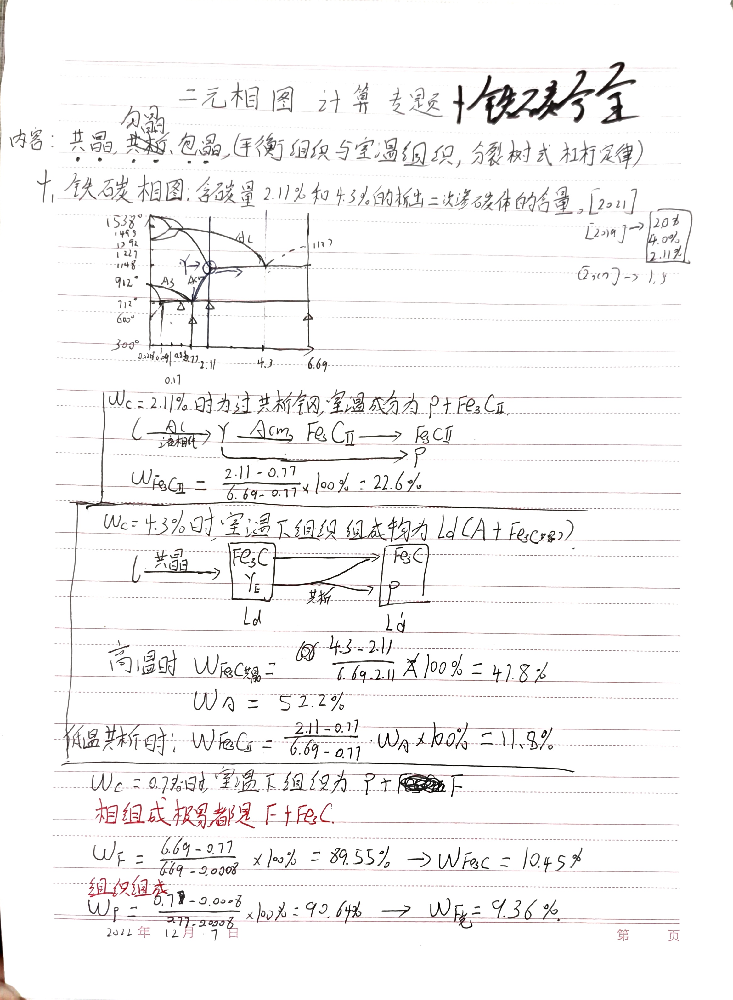

> 
虚室生白，吉祥止止

> 
——《庄子·人间世》

## 干支纪月法
干支纪年法本身配合了二十四节气，一月是固定是寅月，按地支排到丑月。一个节气十五天，每两个节气一个月。比如昨天冬月十三是亥月，今天冬月十四『大雪』就变子月了（居然还是在上午十一点多分的）
## 农历有多🐮🍺
正如『马克思主义基本原理』中所说的，**认识的过程是一个波浪式前进，螺旋式上升的过程**。历法的发展或者说人们对于天体运行规律的认识亦是如此。从古代人们通过对天文现象的观察来制定简单的太阳历，月亮历，木星历，到后人们对旧有历法精确度的不断修正完善，历法变得越来越精准。而到了现代，随着引力定律的发现，望远镜，卫星等天文观测手段的升级，历法的精确度已经有了标准的参考。如若现在再颁布一个历法，那么它无疑是绝对准确的。
但由于人类总擅长坚守固有之物，先入为主的事物在社会总具有得天独厚的优势。比如qwert键盘、英文的全球化推广、美国的命名、Linux发行版的出现以及不断迭代等，他们本身并不是完美的事物，甚至是一个巧合。但是我们就可以彻底否定这些东西吗？当然不能，他们的存在恰恰反映了人类文明的发展痕迹，提醒着我们时代本身的局限性，这样才让我们不断地向绝对真理进发。
而在这时代风云中一直发展的，臻于完美的历法是什么呢？很多人理所当然的认为是现行的西元**格里高历**，因为它三千三百年才有一天的误差。的确，它是极为精准的，否则也不可能实现全球范围内的普及应用。人们总谈历法的误差，但是有没有一种不存在误差的，可以动态调整的历法呢？当然有了，这其中之一就是我们的国粹——农历。
根据天象来进行动态调整，从而得到绝对的准确。这样的历法有很多。比如新疆伊斯兰教的回历，作为典型的阴历，它是根据月亮升起的时间来动态调整的，理论上强并没有误差。但是它并不置润，与现行的公历相差太远，没有太多的实用价值。而农历就不一样了，它一方面根据太阳角度进行动态调整来与阳历的两至两分日达到绝对的吻合（在干支纪年法中体现） ，另一方面通过朔望日来与阴历的月圆月缺相适应（在农历的十九年七润中体现） ，充分体现了中华文化『和』的思想，既实用又精确，也不像纯阴历那样与社会脱节，实在是我华夏之瑰宝！
## 冬至十天阳历年是怎麽回事？
这是农历神奇的体现。小时候每到过年前后爷爷计算日子，总免不了与公历进行对比，但老一辈庄稼人对节气的关心程度远大于公历，甚至农历。每到这个时候，爷爷便说一句『老俗话说：*冬至十天阳历年*，意思是冬至后的第十天是阳历（公历），这个永远不会错。』然后不相信的我跑回家拿起手机查了查，居然神奇的对上了。但当时并没有仔细深究其中的道理，直到今天我才明白了，那原来是两千年前一个人的错误，原本春分那天应该是公历的一月一日来着。

> 公元前46年，儒略·凯撒为了结束混乱局面颁布了著名的儒略历，将冬至之后10日定为岁首，每年12个月，大小月相间，单数月为大月，双数月为小月，大月31天，小月30天，（但平年的2月只有29天），全年共365天，从此开始，坐标原点1月1日就从原来的春分那天变成了冬至后的第10天。为什么是这一天呢，据说这是罗马执政官上任的日子，这样，儒略历的一年就与执政官的一年任期同步了。但新的历法需要与旧的历法相衔接，旧历法中的一年并非在这一天终结，于是，为了弥补空隙，在旧历法的最后一年，除了355天和一个23天的附加月外，又插进了两个月，其中一个月为33天，另一个月为34天。这样，这一年就有355＋23＋33＋34＝445天。这就是古罗马历史上所称的「乱年」。 从儒略历实施开始，罗马的历法终于走上正轨。后来的格里历也是延续这个历法，只是改进了精度，并一直延续至今，而1月1日一直未变，那就是冬至后的第10天。

## 其他念头
动态地改进事物，比如键盘，让它随着词频自动更改键位来适应使用者的习惯。
## 议论|不断进化
事物都是不断变化的，僵尸老化之物只能被淘汰。即便是远大的理想信念，如果死死守住不变，那它最终也会变成一个顽固的落后的东西。遥想中国近代新文化运动时期，一群怎样固守国粹的"国粹家"们，经过长时间的论战，最终也还是接受了新思想。不断融合，不断进化，不断淘汰，这才是正确的发展规律。

## 手写印刷体
练习

练习之后对昨天字体的分析：

问题是高度不一，字母、词间距没有把握好。

## 相图计算
太老套了，太俗气了，太简单了
