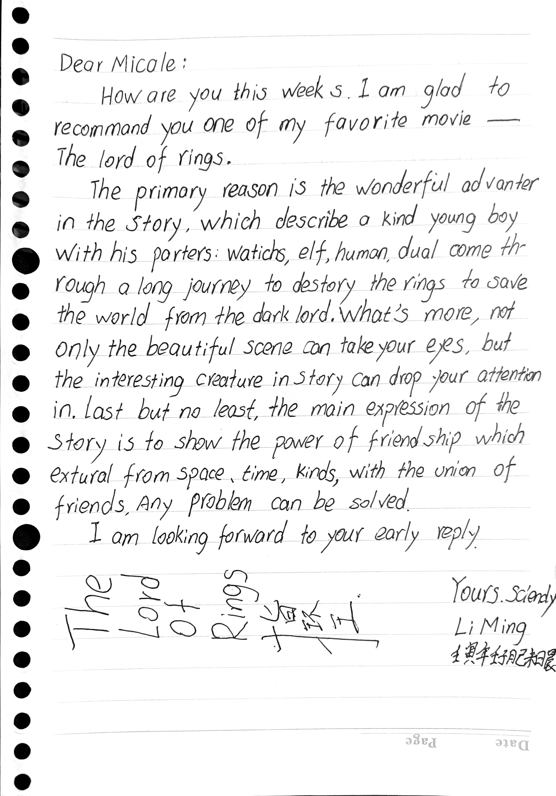
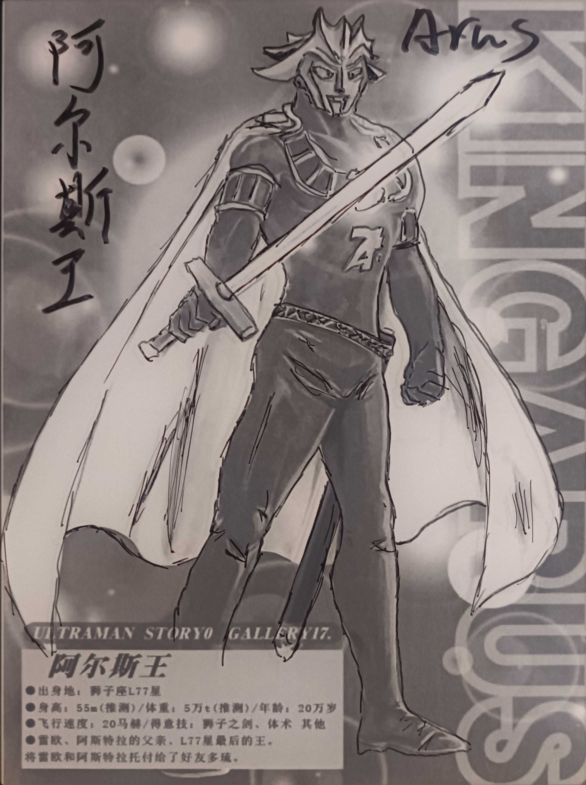
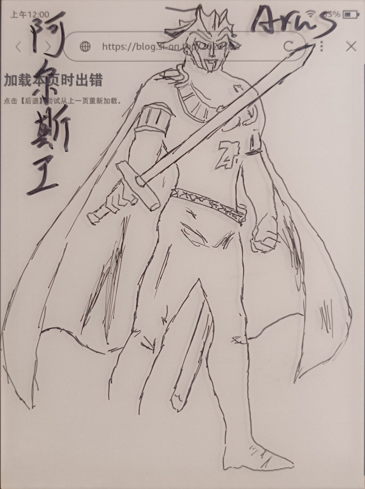

> 
有弗思，思之弗得，弗措也`

> 
——《中庸》

## 晨起写作文

## 自由

今天没带手机，感觉很好。

## 念头
建立空想社会主义组织，开放社会主义言论自由，放开审查制度，敏感词汇。

## 阅读
今天读『书屋』杂志，发现这篇王泛森写的『思考与读书』真是不错。
开头引子中的【杜威的思维术】是直接吸引我的原因，因为咱家见过这个例子，就在[博客写作方法论](/2022/blogwriteguide)这篇里头叶圣陶老先生用过。
这篇文章述说了“思考”的九个境界，关于读书的论述也非常精彩，有空把这篇文章好好整理一下。
## Kindle画画

