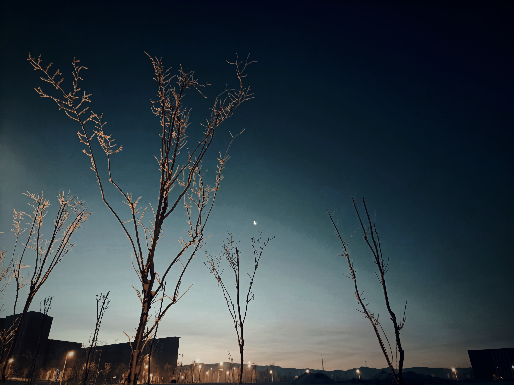
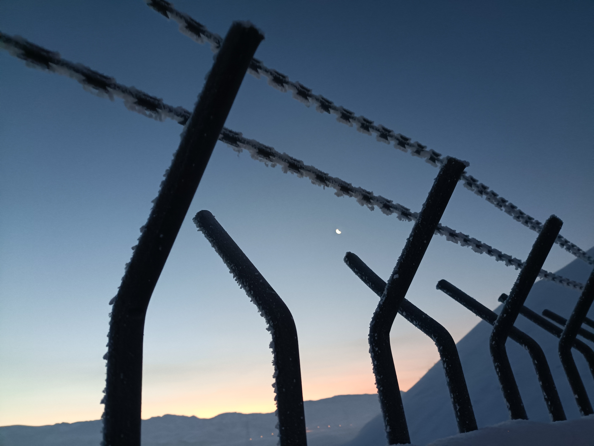
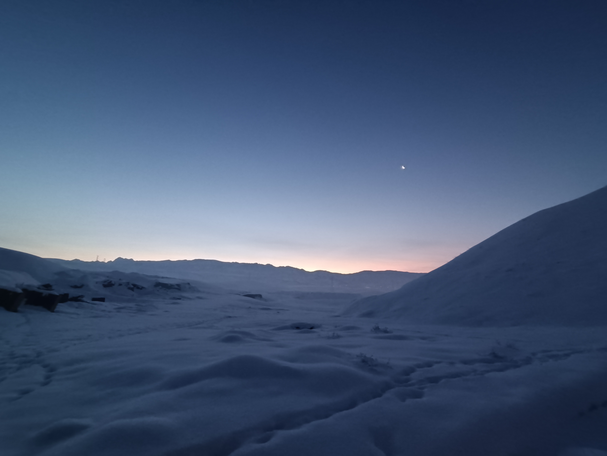

## 即兴
卯时一刻，读书毕，将欲锻炼而后往餐饭，然操场积雪坎坷难行，遂绕远大路以为慢跑也。
寒风袭面，呼气凝冰。猛抬头，见天空黛蓝，东晓微亮，雾凇白木，娥媚高悬，月色可爱。

顿觉心旷神怡，此日，此时，此年月，此人生，纵有坎坷，唏嘘之事，然亦有可待之希望，可盼之美好也。神思跃动，深悔往日愤世嫉俗，玩世不恭之态，既有可追捉之明月，又何须与那灰色、黑色纠缠不清。

又见曙光稍明，心中忽忆起海子诗『你所说的曙光，究竟是什么意思？』，之前一直末曾明晓此中之理，此刻顿悟——曙光即为此刻之曙光也，目见而心觉知，心跃动，心释然。可外征于形而内会于心，却不可表以言语文字也。

## 问题
为何日出前后，雾气会变大？
气态铁碳，凝华制造工艺的可行性

### 雾凇
雾凇形成的形核理论解释
初步判断是非均匀形核，

## 月相
【壬寅年冬月】 月亮方位角规律
初三 南偏极[^tip]
初九 东西平
十八 北偏极
廿五 东西平

正如太阳的方位角夏天偏北，冬天偏南是由于黄赤交角的原因，月亮的运行同样有如此规律。
由于黄白交角的运动，变化周期约为173 天六个月左右，每个月方位角都有变化，比如今年四月份与十月份刚好在初一【东西平】这两个月之间就相差了六个月。另外极与偏的间隔是月亮绕地球周期的一半（废话）。

[^tip]:自拟名词，用来表示白道方位角的极限状态。【南/北偏极】：白道最偏向南/北（东南/北升，西南/北落）；【东西平】: 白道正好穿过东西（东升，西落）。
## 共格
> 老兄，我们为何在此处相遇？因为咱们的兴趣是共格的。

【原始定义】若两相晶体结构相同、点阵常数相同，或者两相晶体结构和点阵常数虽有差异，但存在一组特定的晶体学平面可使两项原子之间完全匹配。此时界面上原子所占位置恰好是两相点阵的共有位置，界面上原子为两相所共有，这种界面被称为共格界面。
延伸意思为：两个不同事物之间存在一定交集。

## 误区避免
这辈子不会需要的东西：
1. 运动手表（鸡肋）
2. 短视频（谁再装一次bilibili就他妈是是💀🐶）
3. 平板电脑/手机（没有必要）
4. 智能笔（狗东西，不现实，归根到底还要ocr, 等切莫时候有个OCR可以训练自己的手写识别库了，那时候，，，，也就用不上你了）
	不过让人感到奇怪的是，输入法里面的手写识别精度贼高，但是OCR里头的却普遍很垃圾，可能是因为输入法还里记录了墨迹的顺序吧。那个时代还没有到来，还是专心手写，**语音识别–再修改**吧
