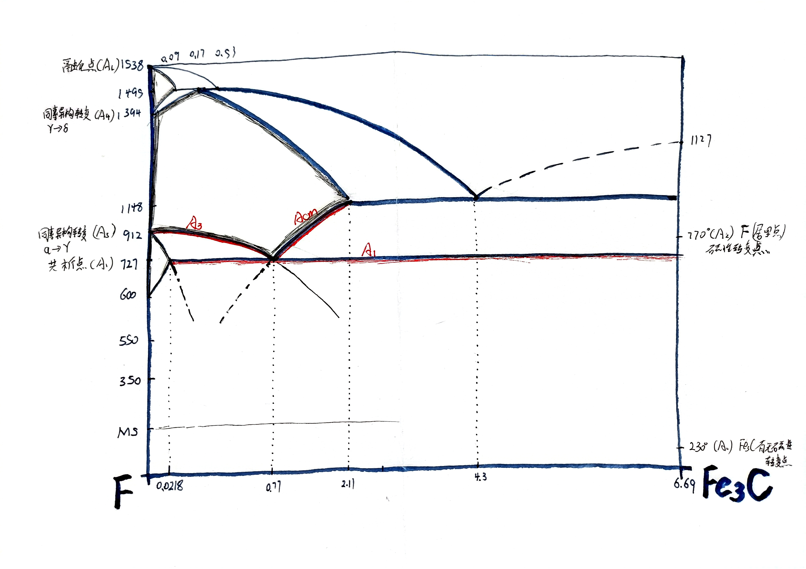

> 自从读了鲁迅先生的『论他妈的』，我就明白，这个词，以后注定要在我博客里出现很多很多很多次。
> 这个词虽然听起来不雅，但情绪表达地很恰当，很强烈，很有野性，很有中国特色。
> 去他妈的用语规范，我就他妈的喜欢用**他妈的**这个词。

## 固态相变
徐洲、赵连城的这本『金属固态相变原理』写的真是细致。其中固态相变原理与分类写的贼好，还用到偏微分来划分了【一级二级相变】，二级相变就包含了【磁性转变】【超导体转变】。
磁性转变真有意思。高中时候一次无聊时候，把小磁球用蜡烛一加热，然后居然消磁了，再加热也没有回复，就觉得无法理解。现在清楚多了，是发生了二级相变，化学势、体积、甚至相变潜热都不变（不需要过冷），变化的是比热$C_p$与膨胀系数$\lambda$，但是其中的详细机理，这本书上还没有介绍，初步估计是晶体中原子的位向由于热运动而发生随机偏转，进而失去了磁性。
书里把【铁碳相图】用到了极致，不论是【奥氏体转变】【珠光体转变】【马氏体转变】【贝氏体转变】，还是【伪共析体(也就是亚/过共析钢的珠光体转变)的形成】都采用了相图来解释，而这其中把曲线延长的方法最是巧妙，相图真他妈有意思。然后我也就又完善了一下**私人用铁碳相图**的0.3[^2]版本:

[^2]:0.1版本是在工训六楼楼梯间的墙上画的，0.2是在学【金属学与热处理】时整理的笔记上，因为太丑了，所以准备重画。
### 提升
他妈的，现在我要是回到7-31大撼动事件的前夜，绝对能通过哈工大的面试，一回想起那时候的情形，就深感羞愧，虽然本身就没有报太大希望，一开始就准备考研，但是就是控制不住抱了一丢丢希望，结果竟然蒙上了几个月的灰色。
但现在，咱家有信心了，该会的都会了，也终于能摆托那次撼动的阴影了。
**吾已非昔日吴下阿蒙也！什么金属的四大强化方法，早已了然于胸矣！**
看来我那时的基础真是薄弱的不得了，考研就是一个成长与再学习的过程，感谢这次经历，也感谢那次大撼动，让我清晰地看清楚了自己究竟是个啥🐶东西。

## 核聚变思考
听了硅谷101昨天的播客，可控核聚变的时代应该在有生之年可以看到吧。
> 到时候资源极为廉价，没事就直接拿汞加一个中子做核聚变fusion，炼金子。
> ——Fan博士

## 自我陶醉
hexo跟obsidian结合真的好，怎就没人发现呢？如果不考虑发布时间的话，可以日更文章，甚至时更文章，分更文章。当然最好的还是**念更**文章[^3]，念更也是博客这一时期计划——【聚沙成塔】的核心所在，以念头为单位记录，再以文章为单位整理。
这样一来，更新博客文章就成了走路吃饭写字一样的日常活动，不过需要在空闲时候汇集整理想法，即『沙』，再形成文章，正式发布，也就是『塔』。

[^3]:有念头就写，即刻更新，留存住思想火花。这一定程度上可以说是我高中时候『Wasted Book』——随念笔记本的电子化表达。
## 假期计划
延迟满足，延迟欲望，生活过得才有劲。
- [ ] 买两只弯头钢笔，加一瓶红墨水。
- [ ] 将往日日记电子化，将博客时间向前扩充十年
- [ ] 充分利用好，循环习惯『loop habit』这个开源软件。
## Kindle问题
2022-12-21 21:42:46 正在阅读一个PDF文件，突然重启。重启后阅读PDF文档时，跳页后失去『返回页面』提示框，epub等文档没有影响，其他一切功能正常。
版本5.15.1 
## 亢奋
今日莫名亢奋，大概是对未来抱有希望吧。曾经读到句话『看似很多路可选，但真正所走的路，究竟还是过去的唯一投影。』我所期待的未来，归根到底还是过去的映射，是由万万千千个过去的【我】的行为、念头铺成的唯一的路。
既然这路是唯一的，那么，不论这条路上有多大的变故，最终我还是会达到那个期待的未来。
只要我可以长久地保持住**相对的不断趋于绝对的**理性，就能一直往前走，就能成为我，不论是当下的，还是理想的。
今日，以一句《论治体札子》的话结束今天——『立志在坚不欲锐，成功在久不在速』当然，这绝不是我可以肆意拖延，随意失败的托辞。

> 晚上学累了，出去跑步，听着『骄傲的少年』，真他妈好有感觉。