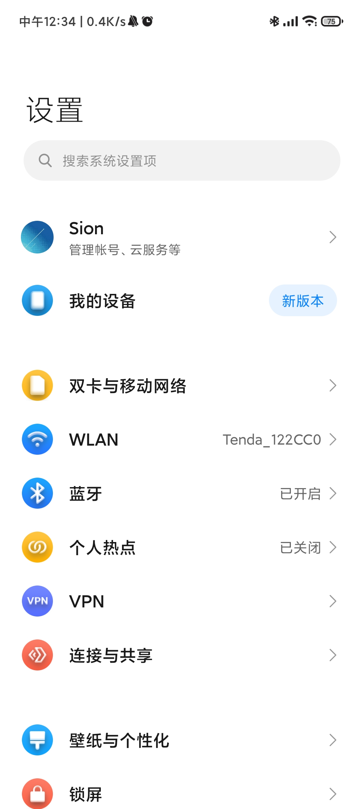
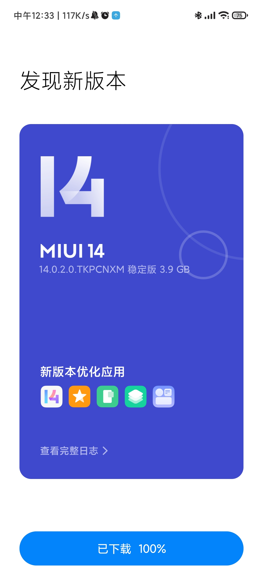

## SeedCollecter


## 日常
### MIUI14


更新完之后还是有挺大区别的，最大不同就是桌面变好玩了🤣，安卓13的特性并没有在17上充分显现出来。
刚巧今天新发现了一个Fdroid客户端--Neo Store，Material you design3看起来舒服极了。然后又找到了几款遵循相似设计原则的软件:
看漫画的katatsu，听歌的metro。
更新完之后最让我烦人的就是我一安装应用，它就一直让我验证！验证！验证！图案验证！密码验证！验证你大爷啊！


### obsidian使用-标签篇
 tags cloud
```tagcloud
```
```linkcloud 
```
```wordcloud 
```
