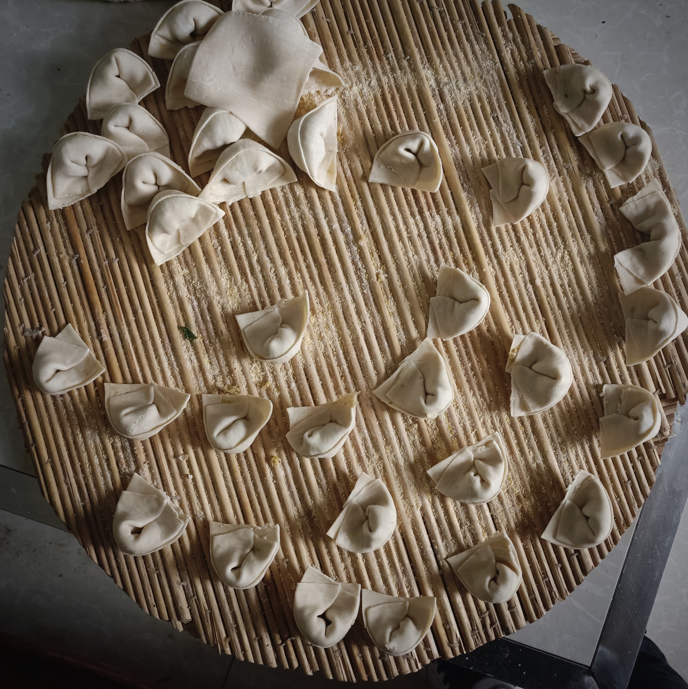

## SeedCollecter

## 日常
- 去
	- 时间 1:14发车 11:40出发 1:00前到家，路上人少，心里畏惧😱，要找个人一块儿。开会油钱预计36.76元。
- 不去
	1. 下午🌇前送去，油钱不变，要等待六七个小时的车。
	2. 12:00预定出租车，费用50，安全放心😌。
### 效率饺🥟
这是一种独创的，打破了有几千年传统的手工包饺子法的高效率——包饺子法，美名曰『效率饺』
方法的核心就是拆分。经过我仔细观察，可以把包饺子的步骤拆分成三大步:
1. 摊皮，放馅
2. 卷馅，捏紧
3. 对折，码垛
传统的包法，是一步一步做，每次包成一个步骤都要换手(与包饺子最终目的无关的无用动作)，尤其是放馅这步，不仅要找到勺子🥄的合适“握角”，还要定位馅的位置，控制量的大小等，每包一个就重新执行一次，这些更换时的多余动作就是影响效率的一个重要因素。受运行管理中流水线式方法的启示，可以把包饺子的几大步拆解开，每个步骤大批量完成，减少无用功，这样就可以大大提高速度。

#### 实践

经过与母亲的一番较量，这样包速度感觉确实快了点，没有准确的计算，仅仅是主观上快了。此方法是否真能大幅度提升效率？如果可以的话，那么效率🥟与逐单🥟的平衡数量是多少？还有诸多问题有待进一步实验验证。在没有充足的数据支持面前，我不建议在全河南省范围内大面积推广这类包饺子方法。

### 小羊🐏羊
