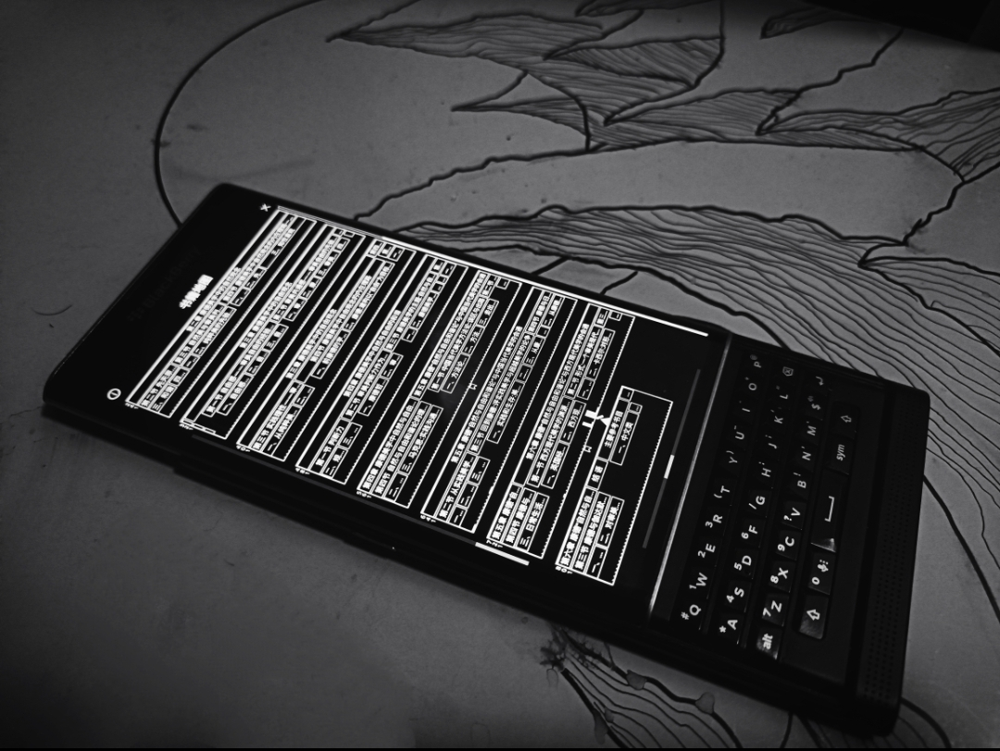

> 
读书的意义大概就是：用生活所感去读书，用读书所得去生活吧。 

> 
——杨绛



本文是一篇超长文。前半部分重点剖析了当下的互联网，提出了优质信息的最佳获取来源；后半部分是与阅读相关的经验分享。湿货较多，请择机阅读🚀。



<!-- timeline 2023-03-03-->
读《朱子读书法》有感，形成了一些文字。
<!-- endtimeline -->
<!-- timeline 2023-04-23-->
在世界读书日想起了此篇旧文，准备写成一篇关于图书获取、阅读工具、阅读方法的整个阅读流的综合性文章。
<!-- endtimeline -->
<!-- timeline 2023-04-27-->
* 完善了对于kindle阅读器的部分。
* 增加了黑莓键盘与KOreader的联动。
* 添加了竖排版书籍的经验分享
<!-- endtimeline -->
<!-- timeline 2023-06-02~06-06-->
* 添加了对于互联网的剖析与批判
* 添加杂志的示例
* 文章结构大调整，“工具部分”单独划分出来
完成了主体内容，最终发布。
<!-- endtimeline -->
<!-- timeline 2023-06-08-->
* 添加了笔者近年来的阅读统计数据
* 添加了鲁迅的几句名言
<!-- endtimeline -->














<!-- @import "[TOC]" {cmd="toc" depthFrom=1 depthTo=6 orderedList=false} -->
<!-- code_chunk_output -->

- [源头](#源头)
  - [信息时代的狰狞面目](#信息时代的狰狞面目)
    - [包裹着噪音的围墙](#包裹着噪音的围墙)
    - [看不见的剥削正奴役着所有人](#看不见的剥削正奴役着所有人)
  - [信息源](#信息源)
    - [输入影响输出](#输入影响输出)
    - [优质信息在哪里？](#优质信息在哪里)
- [阅读方法](#阅读方法)
  - [循序渐进](#循序渐进)
  - [熟读精思](#熟读精思)
  - [虚心涵泳](#虚心涵泳)
  - [切己体察](#切己体察)
  - [紧着用力](#紧着用力)
  - [居敬持志](#居敬持志)
  - [回顾与统计](#回顾与统计)
- [输出](#输出)
- [(杂谈)电子工具论](#杂谈电子工具论)
  - [电子书管理](#电子书管理)
  - [实体设备与阅读软件](#实体设备与阅读软件)
    - [Kindle阅读与批注管理](#kindle阅读与批注管理)
    - [黑莓Priv的丝滑阅读](#黑莓priv的丝滑阅读)
  - [(闲话)竖排版书籍的转化](#闲话竖排版书籍的转化)
    - [关于竖排的其他玩意儿](#关于竖排的其他玩意儿)

<!-- /code_chunk_output -->


-----
## 源头
在当下，你可以从什么渠道获取信息呢？

互联网！互联网！互联网！

肯定有很多人会毫不犹豫地这样回答，但这其实是所有信息获取方式中最低效的一种方法，因为这是资本主导的**主流互联网**[^2]的本质所决定的。
### 信息时代的狰狞面目
>...如汽车一般爬满了拥挤的世界，它们轰然作响，沉重的轮胎摩擦着地面，驶过山山水水，把喧哗带到了世界的每个犄角旮旯。

#### 包裹着噪音的围墙
虽然当下世界上的大多数国家都接入了互联网，但这并不代表着网民都可以轻轻松松获得到想要的信息，很多时候我们都在噪音的围城里转圈圈。

噪音来自焦虑。在信息社会化的当下，网民对于信息时效性的迫切需要同当下不充分、不完善的信息分发制度造成了信息传播噪音化的趋势日益严重。信息不会爆炸，爆炸的是现代人浮躁的心。先是巨量的信息把网民被塑造成了想要时时刻刻获取最新内容的信息饥渴者，而媒体为了能在事件发生的最早时间发布资讯来满足饥渴者的需要以赚取~~流量~~钱。然而，事件、资讯一旦发布，基本上就归属到公共领域了，这就意味着任何人都可以进行二次创作、分发。于是便导致了不同媒体的激烈竞争，他们互相Copy，快速造文，在各个平台广为撒网，<u>试图挤占每个平台里的每处空白</u>。信息因而变得**重复**而且**低质**，纵使有优质内容，也很容易被淹没在这无穷无尽的噪音中。

围墙林立的信息世界。在当下庞杂的网络中，小到账号、平台之间，大到互联网巨头、国家之间，以账号体系所建立的围墙到处都是。虽然中心化的网络让信息的获取变得困难，然而，我们并不必像某些如宗教一般信仰着开源精神的老极客一样，看到时代的发展与期望不相符合就歇斯底里地呐喊抱怨。<u>围墙是资本逐利的必然结果</u>，就跟歌手想要出名、科学家想要在研究领域展露头角一样，当平台开始发展，就必定需要留存住一批稳定的支持者/观众/用户，围墙只是留存的一种手段，吸引力的本质依旧来源于平台本身。当歌手爆出绯闻、科学家出现学术造假，平台口碑变差，即便他们在之前建立了多好的口碑，有着怎样强的吸引力，也拦不住支持者/观众/用户逃离围墙。

<u>围墙并非绝对的阻碍，围墙的多少一定程度上也反映着互联网经济发展的健康程度</u>。试想一个场景，你早上醒来，打开笔记本电脑，发现电脑操作系统竟然可以同手机、电视产生非常丝滑的联动，于是你用电视遥控器操作手机看电视，用电脑给手机里的联系人打电话、用笔记本键盘在电视上写代码；接着你点开了文本编辑器、又打开音乐播放器放了首带感的歌，开始写博客，又打开浏览器搜索资料，点击了几个链接之后，你惊喜地发现：所有的软件、网站都可以用一个账户来登录！信息在各个平台之间完美地同步！你感叹道，这才是我想要的互联网啊！然而，这种情形的出现，并非是那乌托邦般的梦幻Web3，而是另一个极端——一个超级无敌国际大托拉斯资本彻底垄断了所有的互联网企业。彼时，你的数据将不需要转移，甚至没必要保密，因为世界上所有的服务器都属于一个组织。Web2的极端与web3想要构建的世界如此相似，这不得不令人毛骨悚然。但还好这并不会发生，反垄断法在世界各国的广泛实行，很大程度上可以避免这样极端的情形出现，让大企业形成分庭抗礼的形势，小角色也有了破圈的机会，不会一下子被吞并。这些大大小小的资本构成了互联网经济体，他们互相竞争，不断地加固、扩大着自己的围城，有的广阔而低矮，有的狭小而高耸，整个经济体一片繁荣。

穿插信息围城之间。<u>围城不是平面，我们可以把它想象成一个复杂高维空间，每个产业、每个时间、每个地域、每个人都拥有一个自己的维度，不同维度之间有着复杂的虫洞连接，构成一个个小空间，小空间之外又有大空间，大空间之间又存在着极其复杂的交集</u>。网民在这围城之中，如一条鱼，在来回穿梭。试想在当下，有几个人能被围墙围住呢？当你畅游于信息之林，穿插于围墙内外，自身有充分的选择自由，怎么能说被围住了呢。你说它的app很美、用户很友好，要转移；你说这个OS开源自由，要转移；你说心累了，要转移。但是，为何要独独使用那一个软件、那一个平台呢，去陷入资本搭建的围城之中呢？**在围墙之间穿插，才是最畅快最自由的网上冲浪**。
> 我学gimp，也学photoshop.
> 我学inkscape，也学illustrator.
> 我学blender，也不排斥maya,cad.
> 为什么我打开一扇窗，要关闭另一扇？
> 
——@键盘雀跃

<!-- 
而所谓的去中心化依旧遥遥无期，那牛气哄哄的星际互联文件系统——ipfs，在我看来就如同一个巨型的资源种子。信息是分布式储存了，但怎样去找到呢，无法检索的信息跟不存在没有什么两样。而且怎会一直有人用爱发电，把自己的电脑24h开着去充当服务节点？到头来还不是要资本介入，当Cloudflare接入ipfs的一刻，去中心化已经被污染，另一个围墙正开始在悄悄建立。

在写这段话的时候，我试图去查阅《世界互联网发展报告2022》来解读当下互联网现状。但是找了将近半个小时，不论在ChatGPT的帮助下、还是通过知网、维普等专业学术网站进行搜索，都无果而终[^1]。 -->

#### 看不见的剥削正奴役着所有人
不仅仅是为了留存用户，围墙还在吸血，吸围墙之内所有人的血。

数字劳动研究者Tiziana指出：网络用户组成了一类被资本剥削的无偿劳工——“**网奴**”,用户在将网络视为娱乐和社交的游乐场时,还扮演着另一种角色,其数字劳动(浏览网页、聊天、评论、网站设计、软件设计等行为)实际上属于“无酬劳动”，而这种无酬劳动是一种被当成生产性活动的**知识性消费行为**，助力资本积累和增殖的过程,但同时又被**无偿占有**。

在社交媒体时代,受众商品的建构方式发生了巨大的变化，平台媒体连内容都不需要自己来生产，免费的“饵”是由“鱼”自己制作的，它们充分利用源源不断的UGC(用户生成内容)，将自己的角色从生产者转化为连接者，将一部分用户生产的内容作为吸引另一部分用户的筹码。如脸书、推特、微信、微博、B站等以用户生产内容作为主要内容的新媒体平台，通过各种方式来奴役用户，海量的劳动被收割，为平台创造了巨量的财富。而到了未来，一但AIGC(人工智能生成内容)可以彻底取代了UGC之时，亦即使用AI创造剩余的价值比用户创造等量价值的成本更低时，这些鱼儿的劳动将不再有意义，彻底为技术所击溃，沦落为平台中最底层的角色。
>当鱼儿感到不满，它们游到水面，闹哄哄地准备跃过围墙。
>资本家来了，他手一挥，池中落下两片白色的药片，迅速溶解到了水中。
>鱼儿们于是安静下来[^3]，安心地游荡在围墙之中。

---
由此可见，互联网上的大部分文章资讯是<u>不停修缮围墙的剥削者、心浮气躁的逐利者、愚蠢的被剥削者</u>所创造的，这些“饵”(文章)的根本目的是为了吸引更多的鱼儿带来更多的“流量”，其质量便可想而知了：内容相似、文法雷同、思想浅薄。所以说，在所有信息获取方式中，通过互联网/新媒体来作为输入来源是最低效的一种方法。

### 信息源

半亩方塘一鉴开

天光云影共徘徊

问渠哪得清如许

为有源头活水来


#### 输入影响输出
> 歌声的好坏决定了一只雄鸟的价值，它的歌声会泄露它一生的经历。
> 
—《鸟类的天赋》

对于信息来源的作用，我们不妨先看看两位前辈的看法：
* Ma DaWei博主提到：<u>“信息源会影响你的行动决策。一个低效低质量的信息渠道可能会让你做出很多错误的决策，以至于会让你形成错误的认知”</u>
* 木子前辈非常认同初中老师的一句话：“<u>读什么样的书，决定了你成为什么样的人。”</u>

**输入会影响输出**最为直接的佐证便是当下互联网上博客文章的质量。当资本驱动的新媒体正如瘟疫一般影响着整个世界，许多原本与资本毫不相关的博客网站都感染上了新媒体文风，变得与后者越来越相似，这真是一件很可悲的事。然而最可悲的，还是写作者对于文字的运用——许多博文简直到了不能看的地步。文字不是一种天分，需要锻炼，需要优质的来源来发挥作用。一百年前，叶圣陶先生写了一本小书《[文心](https://book.douban.com/subject/3284547/reviews?sort=hotest)》[^5]，讲的是抗日战争初期一群中学生的写作之旅，然而当时中学生思想的深度、行动的决绝、对于文字的用心程度足以让一百年后的高中生、大学生都自愧不如。他们是如何训练文字呢？他们分析鲁迅的白话文《秋夜》、细读姚鼐的文言文《登泰山记》、赏析沙陀费耶夫的诗歌，他们找出杂志上的语病、批判政府公文里的不当措辞，联系生活“触发”出语句...虽然信息并非精挑细选，但是都经过了深度的分析理解。只要肯用心，处处可为师，处处皆学问。新媒体不该作为学习的对象，恰恰相反，它应当作为一个反面素材，每个人都应当带着批判的态度去读，而不是不置一词地沉默或者盲从。

#### 优质信息在哪里？
想要获取优质信息源，就不得不谈及信息的来源——写作。一篇值得去读的文章应该有什么特点？我认为应该有如下几点：
* 好的标题：好的标题才能让人有开始去读的动机；
* 详实的内容：丰富真实的内容乃是写作者学习积累的结果；
* 合适的文章框架：观点的表达需要依托得当的布局；
* 有深度的思考：好质量是一切的力量源泉；
* 中心明确：观点鲜明，线索明确才能表达好观点；
* 内容修改：好的文章需要多次修改、反馈、自我审查、外界审查；

那么，满足这些特点的文章在哪里呢？你可以先试着在新媒体平台上搜索，不难发现，这类文章其实很少、很难找。根据臭名昭著的“二八定律”，新媒体平台上可能只有20%的优质内容，剩下的都是垃圾。我不排斥互联网上的文章，有些时候确实是很有用，然而就因为一点点好处就把其作为信息的主要来源，实在得不偿失，肤浅的阅读会让你的思考能力逐渐降低。

根据内容的不同来源、不同形式，结合笔者大学四年来的阅读体会，我认为当下获取优质信息的方式，按照从优到劣可以这样排序：
1. 迭代了三四个版本的图书：图书，作为最正统的出版物，其创作流程完全符合优质信息创作的特点，毫不夸张地说，如果一本书能迭代到第三版，那么它一定是本非常优质的书。书的内容经过反馈修改已经逐渐完善充实，并得到了大多数读者的认同，读此书，绝有益！
	> 现代中国人读纸质书，其实根本不用花钱。为了促进文化强国发展，咱国家各个地区的公共图书馆想尽方法去推广，让你免费看书！以咱家去过的南阳市图书馆为例：普通人无需证明便可以随意进出，借书时只需要掏100块作为**押金**办张读者证🪪就可以了，读者证不想用的时候可以选择退卡，押金也会返还，图书馆里还有免费的杂志、配备电源的自习室、阅览室，夏天还有不间断的空调。（写到这里，我已经等不及了🐳，过两天回去后就立马去图书馆附近租个房子，备考二战，美好的生活！我来了！嗷嗷嗷~）
2. 书目/丛书：书目也叫书单，现在已经很普遍了，在此不再讨论。丛书则是书单中的书单，出版社往往会把一类相关的书做成丛书出版，对于想要系统性地了解某方面知识的读者，丛书是一条更踏实的路。比如<u>科学史译丛、材料科学丛书、天际线丛书、方尖碑丛书、牛津通识读本、大家小书</u>等都是广受好评的优质丛书。
3. 创刊超过十年的杂志：杂志，按照周期分为月、半月、旬、周刊，相较于图书，创作周期更短，但时效性更强，内容的深度中等，但广度极宽。创刊十年不倒，足以证明它已经融入到了时代，是日常阅读、深度思考、打破信息茧房的不二之选。在此推荐几本杂志：
	1. 《书屋》【文学评论；创刊于1995年；月刊】：内容比较杂，“**灯下随笔**”与“**史海钩沉**”还不错。
	2. 《美文》【文学评论；创刊于1992年；半月刊】：上半月刊适合大人看，每期的“**特别推荐”、“专栏**”都是极好的文章，值得深读，其它内容则可当作电子榨菜干饭时读读。（5月上半月刊中，邹振东写的那篇“弱传播—舆论的时间”对于中国的舆论分析得不能再透彻了，爱死了😻）
	3. 《新民周刊》【时政；创刊于1999年；周刊】：每周更新，内容很广，时政分析很有深度。另外一本《中国新闻周刊》与之类似，二者选其一即可。
	4. 《第一财经》【商业经济；创刊于2008年；月刊】：对于当下国内经济、产业、时政的分析非常透彻，可以看作中国版的“经济学人”，某些分析需要一定的知识储备才能读懂（比如，读完《置身事外》再看此杂志就很容易理解杂志中对于国内经济发展的分析了，感谢@一身都是月的推荐）
	5. 《科学大观园》【知识科普；创刊于1981年；月刊】：科普类杂志每月选择一个议题进行分析，类似的还有《世界科学》，二者选一即可
		>PS：科普类信息，咱家还推荐：**果壳**(*科学松鼠会*被封禁后的第一替代品，标题党众多)、**回形针PaperClip📎**(往期视频依旧很值得去看)、薛定饿了么(幽默的科普)
	6. 《英语世界》【英语学习；创刊于1981年；月刊】：双语文章，每期选题优质(4月的专题——“姑息关怀”很有启发性)，内容有深度，其中“谭译录”、“应试点睛”对于英语学习者很有用。
		>PS：关于学习英语，我再推荐一个CNR的一个播客《美文阅读more to  read》，2020年开始，每两天更新，双语音频，每期内容由“daily quote”、“Poems of the day”、“Beauty of words”组成，并附有节目文稿(文稿起初不能订阅，于是咱家在RSShub上发了个议题，有热心的开发者帮忙，现在可以用RSS订阅了，另外关于RSS的使用，可以阅读上面的~~推荐~~垃圾文章)
	7. *The Economist*【英语/时政；周刊】：与国内意识形态有分歧，不可多言，读读扩展思维
  
  为了让本文在内容上更简洁，请点击[这里](/2022/bookan-pdf-create-Script)进行阅读，密码是`tools&fools`
  
4. 多媒体：**纪录片>电影>剧集>音乐>~~短视频~~**，多媒体虽说不在阅读的范畴内，但我以为阅读的本质就是获得启发，多媒体也可以达到同样的效果，可以看作另一种形式的阅读。
5. 互联网新媒体文章：重复一遍：除非查阅时效性较强、内容比较偏、难登大雅之堂的信息，咱家是最不推荐使用这种方式的。
## 阅读方法

**阅读**做为人类的基本行为之一，可以抽象成三个步骤是——**输入，处理，输出。** 

* 输入：信息的来源。可以是书籍、电子书、播客、视频、盲文书等人体通过视觉、听觉、触觉接收到的信息。
* 处理：信息的处理。就阅读而言，这一阶段就是阅读、思考、批注等。
* 输出：处理的结果。简而言之就是知识的获得，可以留存于内心，也可以体现在笔记、批注等实体介质上。
* 噪音：这是所有阶段都不可避免的额外内容。比如一本书可以作为阅读的输入，那么书籍里面的广告、水印；阅读时工具的故障、环境的干扰；写笔记时，笔记本的选择，错别字的修改等一切不利于阅读流程的因素都是噪音。每个人对噪音的忍耐都有一个阈值，超过这个阈值，那么这就是一次糟糕的阅读体验。

> 根据控制论，此系统可以看作一个开环控制系统，当且仅当系统的各个部分性能稳定且外界干扰较小，才能保持一定的精度。比开环更高阶的是闭环系统，其核心是输出反作用于输入，这也是**构建与打破信息茧房的核心方法**。

关于阅读的方法，《朱子读书法》所讲的六个点讲的很精辟：<u>“熟读精思”、“循序渐进”、“虚心涵泳”、“切己体察”、“紧着用力”、“居敬持志”</u>。
### 循序渐进
>以一书言之，则其篇章文向、首尾次第，亦各有序而不可乱也。量力所至，约其程课而谨守之。字求其训，句索其旨，未得乎前则不敢求乎后，未通乎此则不敢志乎彼。如是循序而渐进焉，则志定理明，而无疏易凌躐之患矣。是不惟读书之法，实乃操心之要。

按照一定的顺序来阅读书籍，不能过于急躁，也不能盲目跳跃。我们可以根据书中的章节、内容、难度等因素来制定一个合理的阅读计划。这样做有助于我们系统地学习知识，从而更好地理解书中的内容。同时，循序渐进也可以帮助我们建立起一个持续不断的阅读习惯，从而更好地提高自己的阅读能力。

### 熟读精思
> 学者望道未见，固必即书以穷理。苟有见焉，亦当博考诸书，有所证验，而后实有所裨助而后安。不然则其德孤，而与枯槁寂灭日者无以异矣。潜心大业何有哉？

读书要重复的读，让心灵与作者相通。重复阅读一本书，深入思考书中的每一个细节。关注书中的重要概念和主题，并理解它们之间的联系。不断地阅读，直到我们完全掌握了书中的内容，并且深入思考其中的道理。这种方法可以帮助我们更好地理解书中的思想，更好地吸收书中的知识。当我们把一本书读得越来越深入，我们就会发现，书中的道理会越来越深刻，书中的内容会越来越有意义。

### 虚心涵泳
> 先使一说自为一说，而随其意之所之，以验其通塞,则其尤无义理者，不待观于他说而先自屈矣。

在阅读的过程中，我们要保持一种虚心的态度，不断地吸取新的思想和观点，切不可以**先入为主**。我们不应该对书中的观点持有过于固执的态度，而应该始终保持一种开放的心态，虚心听取不同的声音。这种方法可以帮助我们更好地批判性思考，并且从不同的角度来看待事物。

### 切己体察
阅读不仅是为了获取知识，更是为了成长和进步。我们在阅读的过程中，要时刻反思自己，思考如何将书中的知识应用到自己的生活和工作中去。我们要把自己的情况和书中的内容进行对照，找到自己的不足和需要改进的地方。只有这样，我们才能真正把书中的知识转化为自己的能力和经验。
阅读好书不仅仅为了获取知识，更应该反思自己如何将书中的知识应用于生活和工作中，找到自己的不足和需要改进的地方，转化成自己的能力和经验。

### 紧着用力
> 无论谁，在那生涯中，总有一个将书籍拚命乱读的时期。-鲁迅

阅读不是一件轻松的事情，需要付出大量的时间和精力。我们要紧着用力，全神贯注地阅读，不被外界干扰。同时，我们还要注意用心理学中的“主动重复”原则，即对于重要的内容，要多读几遍，加深印象，提高理解。只有这样，我们才能真正掌握书中的精华，从而更好地应用到实际生活中去。

我们可以制定一个阅读计划，通过记录的方法来进行促进与激励。在此分享一下咱家从木子前辈那里模仿的notion[阅读之旅](https://sionreading.notion.site/)，我已经记录了一年有余了，感觉良好，而且在回顾的时候很有成就感：

### 居敬持志
居敬是说在阅读的过程中，我们要保持一种敬畏和虔诚的态度，尊重书中的思想和作者的劳动成果。读书时态度端正，举止端庄，~~要充满仪式感☕~~。持志，就是要有坚定的志向并持之以恒，这与上一点有些相似。

### 回顾与统计
阅读后进行统计是很有必要的，咱家最近整理了从高二到大学毕业这些年读的书，在这里分享下一些有用的数据：

---
这些只是我读完《朱子读书法》后的肤浅理解，并不能代表朱老爷子的深邃思想，想要深入了解这几种方法的，建议去读读原文。
## 输出
没有输出的输入是没有任何意义的。

阅读最低级的输出是写作，诸如读书笔记[^6]、体会、影评等，写作会整理思绪，加深理解，也会“触发”到其他的地方，获得更多收获。

阅读的中级输出是教，也就是说把阅读带给自己的体会分享给其他人，以至影响其他人的行为或者得到其他人认同，教的过程可以在同他人输出的过程中发现自己思考的漏洞，让思想更完备。这也是费曼学习法的精髓——以教促学。

阅读的终极输出是生活，也就是文首杨绛先生/女士的那句名言中后一句的意思。当达到这一步的时候，说明你阅读得到的信息已经被自己接受、深入大脑，并通过具体的实践让它成为了自己的一部分。此时，你已经成为了一个新的你，完成了一个质变。现在再去重新开始阅读，就会站到另一个高度，对于适合自己的图书来源、阅读方法都有了全新的看法，稍一回头就能会真真切切地体会到自己的进步与成长。

自此，阅读的全部流程已经成环，阅读的终极目的已经达到，可以准备烧书，进行否定之否定，进行思想上的涅槃重生了。
> 纳桑奈尔，你应该焚烧心里所有的书籍。
> 
> 我崇敬我焚烧的一切。
> ...
> 我们什么时候才能烧掉所有的书籍啊！
> 
—《人间食粮》

## (杂谈)电子工具论
> 
仆自喻为昏镜,喻书为磨镜药。当用此药揩磨尘垢,使通明莹彻而后已。若积药镜上而不施揩磨之功,反为镜累。

> 
——潘氏《磨镜帖》

以前曾执迷于各种工具🛠️，在多篇文章中都写过相关的内容，但零零散散，不成系统，今天借世界读书日这个契机，特将其系统化总结。

### 电子书管理
> 在初学者，乱读之癖虽然颇有害，但既经修得一定的专门的人，则关于那问题的乱读，未必定是应加非议的事。因为他的思想，是有了系统的，所以即使漫读着怎样的书，那断片底知识，便自然编入他的思想底系统里，归属于有秩序的系体中。因为这样的人，是随地摄取着可以增加他的知识的材料的。    —鲁迅

得益于国内大环境中淡薄的版权意识，免费/付费的无版权电子书在互联网上广为流传，几乎唾手可得。所以咱家在此并不谈如何获取电子书，谈一下如何更好的管理电子书。

**管理的核心在于如何构建一个透亮的信息茧房**。跟短视频的推荐算法一样，我们先收集，然后取舍；接着再收集、再取舍，不断重复，就可以构建出一个信息茧房。请不要被固有观念所束缚，信息茧房其实是你立足于信息海洋的第一块礁石，通过它，你就可以抵御许多无关信息的干扰，专注于一个方面，深耕这一片天地，在深度上不断挖掘。同时为了避免信息茧房的局限，我们需要一些“随机播放”：去书摊上、图书馆里、论坛上挖掘一些书，而且这些书要尽量与自己茧房里的信息有足够大的区别，这样才能让茧房透出一片光，看到更远处的海天一色。这样一来，深度越来越深、广度越来越广，信息茧房逐渐变得又大又透亮，直到某一天，你完全察觉不到它的存在，那时你便能从心所欲阅读而不会纠结于选择之中了。
> 我以天地为栋宇，屋室为裤衣。
> 
—(魏晋)刘伶

具体到软件，我只推荐Calibre，该软件的功能异乎寻常地强大。

然而，当我在搜索资料时，看到了书伴关于Calibre阅读工具的教程文章：[Kindle 实用工具 – 书伴 (bookfere.com)](https://bookfere.com/tools)后，觉着自己的经验委实少得可怜，为了不遗人以谬误，在此就借鉴搬运下吧。

书伴中关于Calibre有如下教程，虽说是针对Kindle的，但大多数技巧是通用的：
- [Calibre使用教程之转换电子书格式](https://bookfere.com/post/10.html)
- [Calibre使用教程之邮件一键推送电子书](https://bookfere.com/post/11.html)
- [Calibre使用教程之为电子书添加或修改封面](https://bookfere.com/post/12.html)
- [Calibre 使用教程之本地无线传输电子书](https://bookfere.com/post/157.html)
- [Calibre 使用教程之电子书繁体字转简体字](https://bookfere.com/post/162.html)
- [把 TXT 文档转换成带目录的 mobi 格式电子书](https://bookfere.com/post/82.html)
- [Calibre 使用教程之优化电子书的排版](https://bookfere.com/post/260.html)
- [将 azw3 格式转换为 mobi 格式并保持原有排版格式](https://bookfere.com/post/102.html)
- [Calibre 使用教程之抓取 RSS 制成电子书](https://bookfere.com/post/256.html)
- [Calibre 使用教程之抓取网站页面制成电子书](https://bookfere.com/post/562.html)
- [Calibre 使用教程之把合集电子书拆分成单本](https://bookfere.com/post/603.html)
- [Calibre 使用教程之批量获取电子书元数据](https://bookfere.com/post/550.html)
- [Calibre 使用教程之为 Kindle 电子书添加页码](https://bookfere.com/post/650.html)
- [Calibre 常用命令行工具详解之 ebook-meta](https://bookfere.com/post/605.html)
- [Calibre 常用命令行工具详解之 ebook-convert](https://bookfere.com/post/642.html)
- [Calibre 常用命令行工具详解之 calibre-smtp](https://bookfere.com/post/646.html)
- [如何用 Calibre 和 Count Pages 插件统计电子书的字数和页数](https://bookfere.com/post/1007.html)
- [Calibre快速上手指南英文版（mobi格式）](http://pan.baidu.com/s/1mg3bUgo)

### 实体设备与阅读软件
初二以来接触互联网到现在大四，我也用过不少设备，体验过不少系统，下面我按时间顺序，对这些系统及上面的阅读器进行排列：
* ~~Nokia E72  (塞班·S60 V3 FP2)~~
  1. **iBook阅读星**
  2. 百阅
* DELL Inspiron 5570 （视窗·Win10、Win10 LSTC、Win11 21H2 、**Win11 22H2**）
  1. [**Clean Reader（干净阅读）**](https://github.com/Clean-Reader)
  2. [**Freda**](https://www.microsoft.com/store/productId/9WZDNCRFJ43B) 
  3. [Neat Reader](https://www.neat-reader.cn/)
  4. **[koodo Reader](https://koodo.960960.xyz/)**
  5. [Calibre](https://calibre-ebook.com/)
  6. [Kindle PC](https://www.amazon.cn/gp/digital/fiona/kcp-landing-page)
* DELL Inspiron 5570 （Linux·Debian系/Ubuntu/Deepin15/**Deepin23**、Arch系/**Manjaro**/Garuda）
  1. [**Foliate**](https://johnfactotum.github.io/foliate/)
  2. [KOReader](http://koreader.rocks/)
  3. [Calibre](https://calibre-ebook.com/)
* BlackBerry Priv （**安卓·6**）
* Redmi Note 10 Pro（安卓·11/MIUI12 ~ **12/MIUI13**）
  1. [**Moon+ Reader（静读天下）**](http://www.moondownload.com/chinese.html)
  2. [Book Reader](https://f-droid.org/zh_Hans/packages/com.github.axet.bookreader/)
  3. [Librera Reader](https://f-droid.org/zh_Hans/packages/com.foobnix.pro.pdf.reader/)
  4. [KOReader](http://koreader.rocks/)
  5. [掌阅 iReader](http://www.zhangyue.com/products/iReader)
* Kindle Paper White 5（Kindle 5.13.2 ~ **5.15.1**）
  * Kindle原生
  * [KOReader](http://koreader.rocks/)

各个阅读器的特性都不太一样，感兴趣的可以自行点击链接搜索它们的特性，在此不做赘述，但他们都有一个共同点—**不完美**。比如Calibre虽然支持全平台（除了安卓）、全部的电子书格式，但其UI实在太丑了，只适用于作为书籍的整理工具；又如 Foliate、Koreader虽然美观但是仅仅支持Linux平台；Windows平台上的稍微好用点的就要付费（如Neat Reader），免费的操作又太奇怪（koodo Reader两边的侧栏跳来窜去，烦死人）；还有的有奇怪的bug（**Freda** 复制中文，文字之间都有一个空格🤦）。他们支持的格式也大同小异，在此不多做评价。在我看来，一个好的阅读器，其界面与操作方式是重中之重，其次是功能。若不分平台，非让我给阅读器做一个排名的话，那应该是下面这个样子
$$
Foliate >\text{Kindle原生阅读器} > \text{静读天下} >KOReader > \text{iBook阅读星}
$$
我之所以把Foliate 放在第一位，是有很多原因的。 首先，它支持的格式非常多，基本上可以见到的电子书格式都支持，界面优美，操作人性化。其次，它有一个非常吸引人的功能：笔记的导出与备份，单单这一个功能就足以秒杀所有阅读器。关于它的一些详细特性可以参考[官网](https://johnfactotum.github.io/foliate/)或者Linux中国的这篇[文章](https://linux.cn/article-12462-1.html)。但是由于它并不支持Windows平台，所以很多人对它并不了解。我也查看了该软件在GitHub仓库里面的Issue，开发者并没有打算支持Windows平台，好像是因为它的一个核心架构工具不支持Windows，如果想要做的话，需要对整个软件重新编程十分麻烦。
#### Kindle阅读与批注管理
>咱家从去年购得Kindle Paper White 5后，主要的阅读就在这阅读器上了。这玩意儿确实护眼，而且功能很专一：只能读书，产生的干扰很少。

虽然去年kindle退出中国；
虽然Kindle是一个闭塞的封闭系统；
虽然Kindle的许多现代化功能缺失，部分细节上为人诟病

但它依旧是最值得使用的阅读器。kindle在世界市场上待的太久，甚至已经成了一种情怀。围绕Kindle衍生出的产品，不论是[商业化的书摘管理软件](http://klib.me/cn/)，还是网友分享的数不清的奇技淫巧、[爱好者自费搭建的推送工具](http://wheremylife.cn/)等等，简直数不胜数。每次大的更新，网络上关于kindle越狱讨论永远那般火热，在GitHub上也可以找多许许多多与kindle相关的仓库。而许多国产的阅读器，虽然有着花哨的功能，适合国人“体质”的设计，但终究也还是资本在加固围墙，一旦陷入，便难以抽身。如果你想要在阅读器这个围墙之间穿插，体验开源与闭源、商业与自由，使用kindle是最佳的选择。

通过kindle阅读器内置的批注系统，可以很容易地进行批注：

批注文件会保存在`Kindle:\documents\My Clippings.txt`的文件中，后期可以通过Obsidian的kindle插件进行管理（类似的工具多如牛毛，不做推荐，这个插件虽然不甚完美，但比较适合我的阅读流）：

#### 黑莓Priv的丝滑阅读
KOreader 一个同样优秀的开源阅读器，其操作习惯与Kindle一样，有各种各样的复杂功能。搭配在过气的黑莓Priv上，这格调简直完美:

最妙的是，此阅读器在安卓端仍然保留了键盘的控制，通过配置手势、快捷键可以让黑莓priv的触控键盘实现许多简洁的操作，比如按键加书签、滑键盘翻页、双击键盘边缘快捷跳转界面等。因为比较小众，没有细写的必要。
> 如果有用黑莓Priv的朋友看到此文，我还要推荐几个跟它完美联动的软件：Termux（手机玩Linux不再是梦）、OneNote（翻页过于丝滑）、[Super Productivity](https://f-droid.org/zh_Hans/packages/com.superproductivity.superproductivity/)（快捷键使用很完美）、[亦形输入法](https://www.coolapk.com/apk/cn.xyiili.yime)(键盘爱好者、输入法爱好者的必备玩具)
> 

### (闲话)竖排版书籍的转化
这两年喜欢上了竖排版，竖排版的书读起来有股书卷气，居敬持志的心态一下子就来了。
这里推荐Kindle死忠粉建立的一个网站：[天火藏書排版系統](https://ebook.cdict.info/)。在网站上上传文件可以在线转换成竖排，并输出各种格式，是竖排版爱好者的不二之选。

#### 关于竖排的其他玩意儿
一个名为*Fluent Reader*的RSS阅读器内置了竖排（软件中称为“纵书”），看起来非常不错。

一个竖排爱好者建的网站：[哂蟹齋](https://vert.neocities.org/)，里面有关于竖排版各种样式的[网页实现](https://vert.neocities.org/type/smr)，其中对于图片排版的解决方法非常NICE。

[^1]: 我严重怀疑，那两份报告只发行了他妈的纸质版。
[^2]: 在此并不包括那些**用爱发电且不与任何平台有利益关系**的部分极客网民。
[^3]: 不好意思，这会儿反乌托邦情绪有点严重。
[^4]: 根据[知识共享署名-非商业性使用-禁止演绎4.0国际许可协议](http://creativecommons.org/licenses/by-nc-nd/4.0/)引用此文部分内容
[^5]: 当时百度文心一言才出来，在图书馆里转悠，看到书名，看了两眼，感触颇多，然后一发不可收拾，花了一整天读完了[这本书](https://www.notion.so/sionreading/f3feb0fe420941c4a2344a9808bc1598)。
[^6]: 我死也不会再写读书笔记了，简直烦人透顶了🤬。