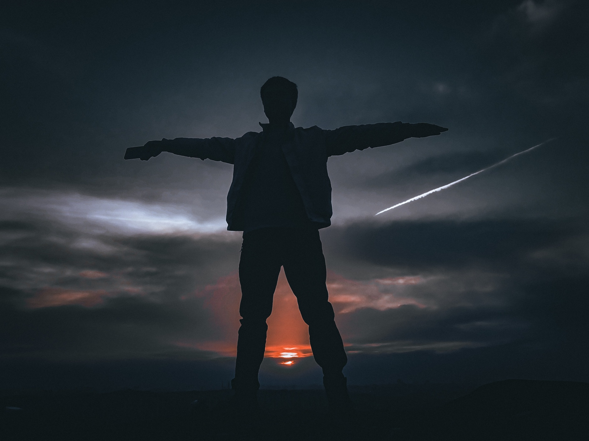

## 剪影之我见
剪影，作为一种独特的摄影风格，<u>通过将主体轮廓剪影化</u>，利用画面的线条和颜色，来营造出独特的视觉效果和艺术氛围，一直受到很多摄影爱好者、设计师的青睐。比如Kindle的Logo：

剪影风格照片的特点有三[^1]：
1. 【**易于营造场景**】用大面积留白来衬托主体，只要角度找得好，简单构图就能营造出唯美深邃的意境。
2. 【**平民化**】此类图对于设备的要求极低。从直方图中就可以看出：此类照片中明部、暗部都可以起墙，也就是照片中<u>明暗部的细节都可以缺失</u>；对于景深的要求几乎没有，只要能够聚焦到主体即可，这对于没有专业设备的摄影爱好者来说，是一个非常不错的选择。
3. 【**后期简单**】由于图片中元素比较少，后期处理时，不论是调色、裁切还是合成、修复都异常的简单。

由于对于技术的要求不高，剪影一直是我最喜欢的风格。三年前一个初春的早晨，骑车到东边的小山上看日出，那时的心情已经忘记了，大概也是寂寞中的躁动吧。下山的时候，不经意间回头，看到已经升起的泛黄的太阳，已经随着我的下行，降到山顶一片枯黄、新生的野花草上，晨光熹微，万物生长。这一场景便是咱家上传到500px上的第一张[图](https://500px.com.cn/community/photo-details/091f2d317c1b4c4abc908160192b6fb8)，很有意义。

巧的是，在三年后咱家上传的第365张图片，也是张剪影图，也是在山顶，也是差不多的心情，按快门时也是一样激动：

看来剪影图真与咱家有不解之缘，近来练习过程中也照了不少剪影图，下面就从练习中选取些差不多的照片，来谈谈剪影图制作。
## 拍摄の时机
任何完美图片的拍摄时机都需要——**天时、地利与人和**。剪影的拍摄亦是如此，三者搭配才能出来造出来好作品：
* 【**🌄天时**】剪影一般在日出、日落时逆光拍摄。当光线斜照，主体的轮廓才能与背景光线形成**反差**，出现剪影的效果。
* 【🗻**地利**】采用平视/**仰视**角拍摄，并与主体要保持一定距离是典型的拍摄场景，最简单的例子就是在坡下往坡顶看。
* 【💃**人和**】因为天时（看日出日落时人的心情都不会太差）、地利（拍摄时要与主体保持一定的距离，会让自己很少关注琐碎的细节，心理作为观察者的身份得到强化[^2]）的关系，拍摄时候的心情一般也不会太差，自然会心里提高对作品的认可度。

下面有两张拍摄的场景示例。
比如：上上周，外出游玩，日落时给W君照的剪影：日落+仰视角+欢快

去年冬天的一个日出，给舍妹照的剪影：日出+仰视+高兴

一次成功的的摄影体验，不仅可以带来美的表现，更可以带来心中的愉悦，这也是咱家喜欢摄影的一个原因。
## 合理の构图
> 
知其白，守其黑，为天下式。

> 
——老子

老子“知白守黑”的思想在剪影图构图中得到了充分的体现。这句话的意思是虽然已经知晓所有的事理（知白），但却能保持朴素的表达（守黑）。剪影图拍摄的时候，首先需要保证主体完全暴露在光线之下，场景可以一览无遗，然后要根据“守黑”的思想，摒弃所有无用的元素，用最朴素的表达来展现主体。

比如这张在去年夏天某个凉爽的午后，外出转悠，对西边远处山林的所摄，在后期裁切去了上面的太阳后，图像便显得“很有感觉”：

以及这张山坡上的一排绿化林带，也剔除了无用的元素来“守黑”：

最近一次成功的构图，是昨天（5/12）下午的一些自拍

一个负面的例子如下：上个月下完雨后，在水坑里拍摄的校园日落。“守黑”不足，元素太多，图片就显得比较凌乱。后期便用了花哨的调色，试图来让颜色遮盖构图的不足，不过似乎矫枉过正了😓。

## 唯美の色调
> 
和其光，同其尘；挫其锐，解其纷，是谓玄同。

> 
——老子

剪影图大多数实在“黄金时间[^3]”拍摄的，以暖色调为主，用大面积的黑与暖搭配是很不错的。调色时要注意图像色调的均匀——**和光同尘**，让高光不太亮，暗色不太深，整体均匀，保持”中庸“。比如下面的避雷带[^4]、塔吊的调色，咱家就去除了高光部分，降低了对比度：

但有时候，为了更好的突出主体，可以去降低画面周围的亮度，用暗衬托明，再让明衬托主体的剪影。**双重对比**更能增加表现力，咱家最近的调色便是用了这样的手法：

也有些其他场景，比如云中鸟、雾天的建筑，用亮来突出暗便是个很自然的处理方法：

水面的对晚霞的反光也可以组成不错的色调

当然，不能调色过度，否则很容易让颜色变得太杂乱：

[^1]: 从别的角度来看，这些优点也是缺点：细节缺失、过于简单等，所以应该辩证地看待它，根据不同场景来抉择，**回避其短，取其长而善加利用之**。
[^2]: 我理解的这种**观察者**心态，就是所谓的神性差不多。
[^3]: [什么是摄影拍摄时，经常说的“黄金时刻”和“蓝调时刻”？ - 知乎 (zhihu.com)](https://zhuanlan.zhihu.com/p/408368110)
[^4]: [避雷带 - 搜狗百科 (sogou.com)](https://baike.sogou.com/v26225219.htm)